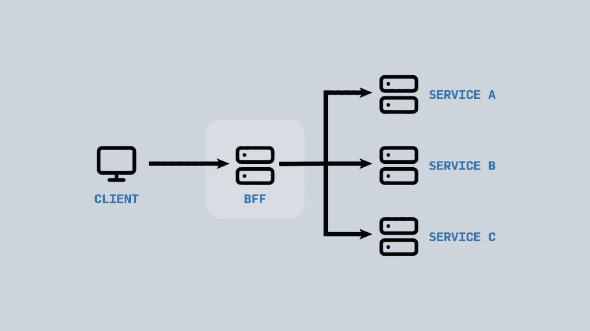

# 2021 年及以后的前端预测

> 原文：<https://itnext.io/front-end-predictions-for-2021-and-beyond-51ac7625c45?source=collection_archive---------5----------------------->

如果 2020 年证明了什么，那就是预测未来是傻瓜的游戏。话虽如此，以下是我对未来 12 个月前端开发走向的预测🙄

# React 框架终于成熟了

在 MVC 中， [React](https://reactjs.org/) 经常被称为“V ”,它既受益于也遭受了缺乏自以为是的框架的痛苦。几年过去了，我们还没有看到这个行业融合在一个堆栈、架构或工具链上。虽然这种灵活性无疑有助于它的流行，但 2021 年可能是我们最终看到这种框架成熟的一年。

在过去的一年里， [Vercel](https://vercel.com/) 继续主导 React 领域，发展他们的框架， [Next.js](https://nextjs.org/) 和他们以自己的名字命名的服务产品——同时推出了[电子商务入门套件](https://nextjs.org/commerce)，一个[分析工具](https://nextjs.org/analytics)，并举办他们迄今为止最大的(虚拟)会议。虽然 Next 已经出现了很长时间，但它已经从最初的错误中走了很长一段路。内置电池的方法并不适合所有人，但过去一年的增加最终导致了一个既稳定又出奇成熟的 [v10 版本](https://nextjs.org/blog/next-10)(终于实现了子路径路由🙏).

今年，一个新的闭源 React 框架 [Remix](https://remix.run/) 悄无声息的“支持者预览版”的发布更是雪上加霜。Remix 由社区中的两个最大的名字，React Router fame 的 Jackson 和 Florence 创建，它采取了一种不同于 Next 的方法——在商业模式(收取适度的年度许可费)和哲学(Remix 是一种产品，而不是一个平台)。Remix 没有倾向于静态页面生成，而是承诺利用更传统的技术，如积极的 HTTP 缓存，并重新关注网络基础。

现在还为时尚早——Remix 要到明年才会正式推出——我们不太可能达到像 Ember 这样的一体化工具所享有的凝聚力。然而，看到这个长期停滞不前的领域有所发展令人耳目一新。

# 我们对容器查询有所了解

对容器查询的需求已经达到了狂热的程度。随着谷歌最终宣布他们的[原型](https://groups.google.com/a/chromium.org/g/blink-dev/c/u1AKdrXhPGI/m/wrJb-unhAgAJ?pli=1)的意图，2021 年可能是我们第一次看到他们的一年。

与此同时，越来越多的采用[固有的网页设计](https://www.browserlondon.com/blog/2019/08/19/should-we-still-be-selling-responsive-web-design/)结合诸如 CSS 的`min/max/clamp`和 JavasScript 的`ResiveObserver`等 API 提供了更好的“伪装”方法。这类实现越来越多(甚至可能很危险？)细说过去几个月，很难想象这种趋势会在明年停止。

我希望我们将会看到更多实现容器优先设计的聪明方法，比如 Mathias 的 [Raven](https://css-tricks.com/the-raven-technique-one-step-closer-to-container-queries/) 和 Heydon 的 [Watched Box](https://github.com/Heydon/watched-box) 。

# WASM 爆炸

web assembly(WASM)的采用一直很缓慢，这在很大程度上是因为它的定位是专业工具(“如果你需要，你会知道的”)。然而，在 2021 年，我们可能会看到这种心态的转变。

随着前端开发人员[的角色逐渐向](https://css-tricks.com/ooooops-i-guess-were-full-stack-developers-now/)全栈领域发展，我们开始看到越来越多的工程师开始接受低级系统语言，如 [Rust](https://www.rust-lang.org/) ，尽管 Mozilla 裁员后最初存在不确定性，但这种语言目前正受到前所未有的关注[。](https://twitter.com/nadavrot/status/1319003839018614784)

因此，我们看到基于 WASM 的解决方案，如 [Yew](https://github.com/yewstack/yew) 和 [Seed.rs](https://seed-rs.org/) 进入前端框架大战。受益于 Rust 提供的性能和安全性，2021 年很可能是我们开始看到 WASM 生产大规模繁荣的一年。

我们距离这些将聚光灯从大玩家身上移开还有很长的路要走，但我相信采用率将在 2021 年达到峰值。

# 巨石柱卷土重来

该行业对分布式服务和仔细划分的责任的热爱仍在继续，已经超越了后端([微服务](https://www.browserlondon.com/blog/2019/07/01/do-you-need-microservices/))，并在 2019 年随着(同样受到诽谤和喜爱的)微前端的引入达到了不幸的顶峰。UNIX 哲学的体系结构方法仍在继续发展——至少在技术报告和媒体文章领域是如此。

在过去的几年中，微服务的广泛使用使得像前端的后端的 T2(BFF)这样的模式成为必要，这种模式在每个客户端和为其服务的 API 之间引入了一个中介。

鉴于当前对 [JAMStack](https://www.browserlondon.com/blog/2020/04/20/issues-with-jamstack-you-might-need-backend/) 的兴趣，这一点在 2021 年尤为重要，在最复杂的情况下，[受到其服务](https://www.browserlondon.com/blog/2020/04/20/issues-with-jamstack-you-might-need-backend/)[依赖](https://www.browserlondon.com/blog/2020/09/02/dependency-hell-how-to-avoid-it/)的重压。有趣的是,“如何联合我的 API”的答案是:构建一个。

我们肯定会在 2021 年看到 BFF 技术的采用增加，但是——如果运气好的话，我们也可能会看到逐渐回归整体——或者至少以更大的'[宏观服务](https://twitter.com/GergelyOrosz/status/1247132806041546754)或妥协(如[城堡](https://m.signalvnoise.com/the-majestic-monolith-can-become-the-citadel/))的形式缓慢撤退。

毫无疑问，Basecamp 的 DHH，这个“雄伟”巨石的最直言不讳的支持者(他最近推出了另一个令人自豪的传统网络应用，[嘿](https://hey.com/))将会带头冲锋陷阵。

# 概括起来

有趣的是，前端最大的发展不太可能是传统的*前端*问题。回到我们的 [2019](https://www.browserlondon.com/blog/2019/01/02/front-end-2019-predictions/) 预测，我们注意到前端开发人员的角色越来越向‘全栈’转移，这已经被证实是真的。甚至我们的框架和工具的发展也表明了这一点，越来越关注数据获取、并发性、安全性和可伸缩性。

这是一个自然的交汇点，工程师们面临着越来越多的“后端”问题，而工具和服务变得越来越复杂，足以降低进入门槛。这是一场完美的风暴，我预计它将持续到 2021 年。

## 关于浏览器

我们为更好、更高效的工作场所创建企业网络应用。我们已经帮助壳牌、英国航空公司和英国政府等客户提高效率，简化业务。访问我们在[浏览器伦敦](http://www.browserlondon.com/)。

*原载于 2021 年 1 月 4 日 https://www.browserlondon.com**[*。*](https://www.browserlondon.com/blog/2021/01/04/front-end-predictions-2021/)*