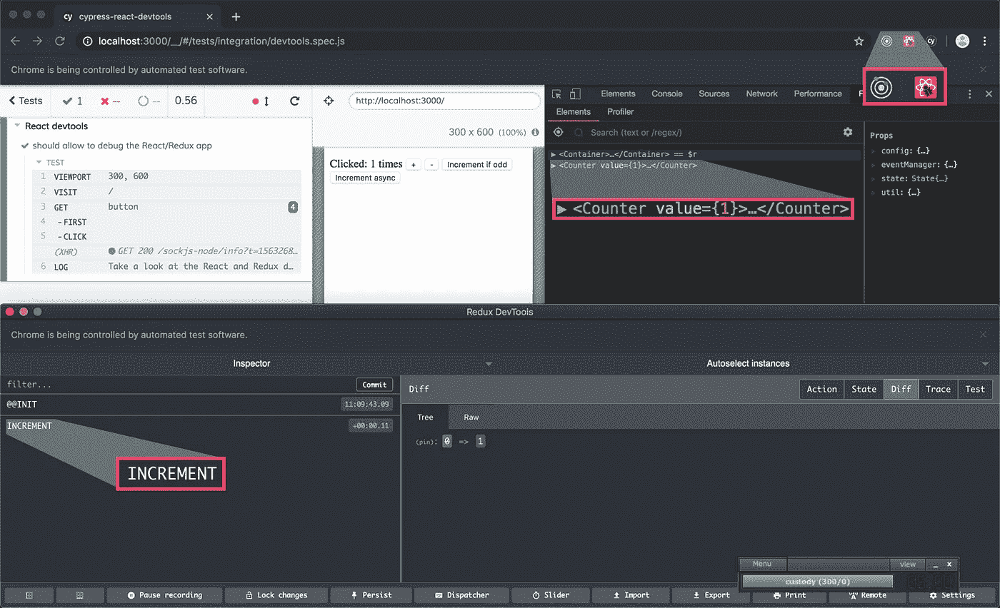
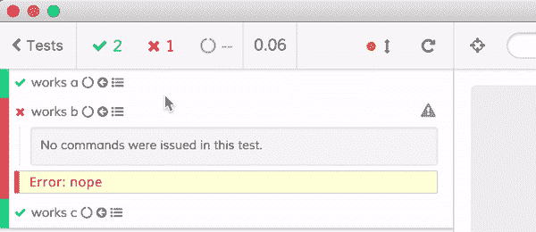

# 前端生产力提升:Cypress 作为您的主要开发浏览器

> 原文：<https://itnext.io/front-end-productivity-boost-cypress-as-your-main-development-browser-f08721123498?source=collection_archive---------4----------------------->

生产力、生产力和生产力:您应该如何利用像 Cypress 这样的测试工具作为您的主要开发浏览器。在此处或在 [dev.to](https://dev.to/noriste/front-end-productivity-boost-cypress-as-your-main-development-browser-5cdk) 上阅读。

[比尔·杰伦](https://unsplash.com/@billjelen?utm_source=unsplash&utm_medium=referral&utm_content=creditCopyText)在 [Unsplash](https://unsplash.com) 上的照片

我正在 GitHub 上做一个大的 [UI 测试最佳实践](https://github.com/NoriSte/ui-testing-best-practices?source=post_page---------------------------)项目，我分享这个帖子来传播它并有直接的反馈。

你手动测试你的前端吗？如果你用一些 E2E 测试来测试它，你会在最后一步写测试吗？什么事？这篇文章送给你！🙌
你是 TDD 开发者吗？不要读它，你失去了你的时间😉

Cypress 因其 E2E 测试效力而闻名。很明显，它有一些限制，但是它显然是为了将 E2E 测试带到另一个水平而创建的。在这篇文章中，我想分享你如何使用 **Cypress 作为你的主要开发浏览器**，而不仅仅是一个测试工具。

开发人员已经习惯了尽可能地利用他们的测试工具。如果你没有应用严格的 TDD 方法，不要担心，这篇文章**仅仅是关于生产力的**。如果您因为“没有时间”而没有测试您的前端应用程序，我希望您能改变主意！

让我们分析一下，作为前端开发人员，我们在开发 evergreen *身份验证表单*时通常是如何工作的，例如:

*   我们对用户名输入字段进行编码
*   我们通过浏览器手动尝试
*   我们最终会修复它
*   然后，我们对密码输入字段进行编码
*   我们通过浏览器手动尝试
*   然后，我们添加提交按钮
*   我们编写了 AJAX 请求管理代码

请注意，在这一点上，我们可能已经向输入字段添加了一些默认值，以避免每次按 CTRL+S 时手动填充它们……总之:

*   我们通过浏览器尝试整个表单，检查 AJAX 调用是否已经完成，以及它是否向服务器发送了正确的有效负载
*   因为我们需要检查错误路径是否被正确管理，所以我们强制请求生成函数返回一个包含错误的静态响应(可能我们正在 StackOverflow 上搜索如何用 Axios 模拟错误的网络响应…)
*   我们检查应用程序在错误情况下的行为是否符合预期
*   我们降低了网速，以检查 AJAX 延迟如何影响用户体验
*   最后，我们重新检查一切，以确保最近的更改没有破坏已经测试过的流程

为了这篇文章，我**缩短了步骤**,因为对于上面的每个步骤，你可能需要 5 到 20 个修改+表格填充等等。我们中最聪明的人使用一些 Chrome DevTools 片段来加速这个过程，在源代码中添加一些脚本，以便在所需的点直接呈现 UI(如果视图的代码与应用程序的其余部分很好地解耦)。我们中的一些人添加了许多条件，以防止一些更改即使在网站上线时也有效…在代码库中添加了许多垃圾代码…

*如果你已经写好了* ***跳过下一章*** *！*

# 测试工具的力量

如果你不是测试人员，并且上面的描述符合你的工作方式…我有好消息告诉你:一个专门制作的测试工具，比如 [Cypress](https://www.cypress.io) (或者 [TestCafé](https://devexpress.github.io/testcafe/) ，但是请不要考虑通用的浏览器自动化工具，比如 Selenium 或者 Puppeteer)简化了每一个工作步骤！而不会弄脏您的源代码！因为

*   您不需要硬编码输入字段默认值，自动化浏览器会以极快的速度与页面进行交互。看看一些地雷的测试就明白我说的*燃烧*是什么意思了

自动化浏览器的速度

*   您不需要模拟奇怪的网络行为，因为 Cypress 允许您从浏览器的角度模拟它们，而不是从代码的角度。您的前端应用程序执行一个标准的 AJAX 调用，忽略 Cypress 正在响应您指定的内容(您可以指定响应、网络状态、网络延迟等。)
*   Cypress 控制一个 Chrome 浏览器，你可以利用你已经习惯的开发工具
*   Cypress 创建了一个专门的持久化的 Chrome 用户，所以你可以安装你最喜欢的 Chrome 扩展(比如 React 和 Redux DevTools)

使用 Cypress 的 React 和 Redux 开发工具(来自[Cypress-React-DevTools](https://github.com/NoriSte/cypress-react-devtools)repo)

*   您可以添加许多断言来获得即时的绿色/红色反馈。断言是一种基于英语的安全措施，例如:“*我希望表单将用户名和密码作为 AJAX 请求*的有效载荷传递
*   您不需要手动地来回测试最新实现的流和以前的流:一旦您用 Cypress 测试复制了一个流，它就在这里了。如果您更改代码时意外中断了之前的流程，Cypress 会警告您！
*   如果你听说 E2E 测试很慢，读一下什么是 UI 集成测试

# 你已经 E2E 测试你的前端了吗？

荣誉👍只有一个问题:你是否只在确信一切正常时才编写测试？这才是重点！当你写一个测试时，你用你的测试工具来重复你手工做的事情！完全相同的动作:

*   填写表格
*   点击按钮
*   断言某些元素存在或可见
*   检查 [AJAX 请求负载](https://github.com/NoriSte/ui-testing-best-practices/blob/master/sections/server-communication-testing/test-request-and-response-payload.md)

你为什么这么做？因为当你手动测试时，你有更多的自由！因为您可以选择想要测试的流，因为您可以利用浏览器扩展和 React/Vue.js 等。DevTools，因为你可以访问 Chrome DevTools 等。

# 我如何利用 Cypress 作为我的主要开发浏览器

看看我为[工作软件会议](https://www.agilemovement.it/workingsoftware/)准备的[库](https://github.com/NoriSte/working-software-mastering-ui-testing)。第四次提交(在所有前端相关提交之前)如下:

由外向内验收 E2E 测试

此外，在编写前端“应用程序”(这是一个演示，一个单一组件的应用程序)时，我从未与前端进行过手动交互。我只在开发完成后才手动测试它。怎么会？

*   首先:打开 Cypress 并把它放在你的第二台显示器上
*   用 Cypress 打开你的 Chrome，检查你需要的开发工具是否已经安装
*   为 Cypress 安装 [skip-and-only-ui](https://github.com/bahmutov/cypress-skip-and-only-ui) 插件，它帮助你运行一个单独的测试，跳过一些测试，等等。直接从 Cypress UI

运行中的 [cypress-skip-and-only](https://github.com/bahmutov/cypress-skip-and-only-ui) 插件

*   为 Cypress 安装[观察并重新加载](https://github.com/bahmutov/cypress-watch-and-reload)插件，你可以配置它在源文件的每个 CTRL+S 上重新启动 Cypress 测试
*   编写 Cypress 测试中的第一个交互:说到身份验证表单，用户名输入填充。如果你真的能写出完整的测试，再次表扬你！
*   开始写你前端的源代码。观察和重新加载插件重新运行 Cypress 测试，而不需要您离开代码编辑器

请，停在最后一点:你按 CTRL+S 和 Cypress，没有任何手动交互！而且比你还快还快！想想它为你避免了多少工作量！让我们继续:

*   一旦一切正常，就在 Cypress 测试中编写下一个交互，并编写您的应用程序以使测试正常工作
*   一旦你需要检查一个不同的流(AJAX 500 响应，401 响应，403 响应，无网络等。)，复制测试并利用 Cypress APIs 来模拟它(就像 *cy.route*
*   重复这个流程，直到你完成

干得好的😊请分享您的反馈，以帮助其他开发人员实现生产力的转变💪

# 总结

利用 Cypress(和上面引用的插件)作为您的主要开发浏览器的优势是:

*   您将缓慢的手动测试减少到最低限度，节省了大量时间
*   最后，你的应用程序会被自动测试，并且这些测试会永远保留
*   在您对流程进行编码之后，您完全避免了编写测试的“烦人”过程
*   避免在源代码中添加临时状态和假返回

更多相关文章:
- [组件 vs (UI)集成 vs E2E 测试](https://medium.com/@NoriSte/component-vs-ui-integration-vs-e2e-tests-f02b575339dc)-
-[等待，不要让你的 E2E 测试沉睡](https://medium.com/@NoriSte/await-do-not-sleep-your-e2e-tests-df67e051b409)

你好👋我是 Stefano Magni，我是一名热情的 JavaScript 开发人员和 T2 赛普拉斯大使。
我喜欢创造高质量的产品，测试和自动化一切，学习和分享我的知识，帮助别人，在会议上发言和面对新的挑战。
我在意大利比特币初创公司 [Conio](https://conio.com/it/?source=post_page---------------------------) 工作。
你可以在 [Twitter](https://twitter.com/NoriSte?source=post_page---------------------------) 、 [GitHub](https://github.com/NoriSte?source=post_page---------------------------) 、 [LinkedIn](https://www.linkedin.com/in/noriste/?source=post_page---------------------------) 上找到我。你可以找到我最近所有的文章/演讲等等。这里。