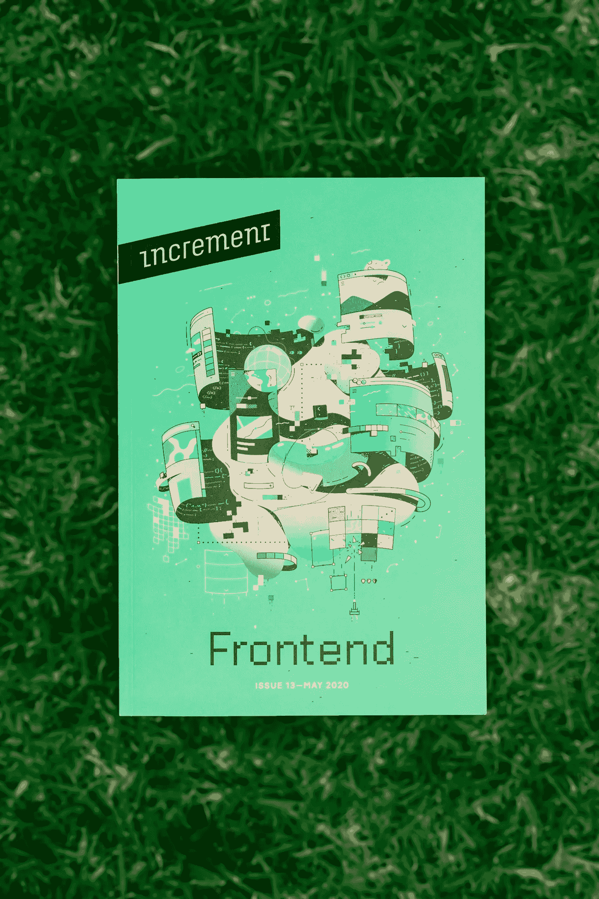

# 前端系统设计—从零开始开发网飞

> 原文：<https://itnext.io/front-end-system-design-develop-netflix-from-scratch-2bb65cb8be52?source=collection_archive---------2----------------------->

我正在准备一个前端系统设计的问题，找不到太多的材料。面试官可能会要求你从头开始写网飞。有几点:

如果你觉得它们有用，请跟我来。

## 处理需求:

一个大的项目还必须有一个业务需求和用户故事的广泛文档。第一件事是理解我们为什么做这个项目和阶段。

假设产品经理和产品设计师只把它分成 2 个阶段，但是考虑到工程方面的努力，我们可能认为 10 个阶段更好。因此，在考虑代码之前，请就阶段进行多次讨论，或者删除那些不能证明其具有高用户价值的 UI 设计。我们想把用户价值低的 UI 设计推给 Backlog。这意味着我们只有在有多余时间的时候才会做。

阶段是至关重要的，因为它们允许我们快速地向客户交付软件解决方案。如果我们一次完成全部工作，可能需要 1-2 年的时间。迭代交付可能允许我们在 1-2 个月内交付第一阶段。

## 时间估计:

与团队合作，识别每个页面的智能组件和非智能组件，然后首先评估所有非智能组件。这将让我们更清楚地了解智能组件需要有多复杂。每个组件都应属于贵公司的 JIRA 机票或同等机票。

## 屏幕兼容性:

网飞涵盖了许多设备。假设我们只考虑网络浏览器。我们仍然需要确保应用程序能够正确显示。我们需要用桌面优先或移动优先的方法来处理 UX/用户界面。

移动优先:它允许开发者考虑页面上的基本内容，因为移动屏幕没有太多空间。然而，移动优先可能会降低产品交付速度，因为大多数复杂的网络应用程序都是在桌面上运行的。比如我不在手机屏幕上写这种媒介。

桌面优先:许多 web 应用程序从桌面优先开始，因为大多数用户在桌面屏幕上使用复杂的 web 应用程序。此外，还有更多空间来添加花哨的设计。但是，我们可能会显示比我们需要的更多的信息。

这个类别可能会进入产品设计师的领域，但我仍然认为它们是直觉的权衡。我仍然会谈论他们。

## 工程中的屏幕/浏览器兼容性:

使用 UI 框架，比如 Bootstrap。它有一个可定制的设计系统，我们可以在其中定义断点。Bootstrap 中的网格系统也很有帮助。

使用 Polyfill 实现跨浏览器兼容性。IE 在 2022 年被弃用。现在应该好办多了。使用 https://caniuse.com/的[来检查 API 在不同浏览器中的可用性。](https://caniuse.com/)

## 高级代码设计(角度)第 1 部分:

不同状态管理工具之间的权衡:

1.  GRX:要记录的文件太多，很难理解。如果只有一个微小的共享国家，这可能是过度杀戮。
2.  *URL 中的查询参数*:浏览器历史处理状态的生命周期。易于共享和保存选定的过滤器。例如，在 Gmail 收件箱中搜索文本也会改变 URL 中的查询参数。
3.  *本地存储*:它会一直保存在浏览器上，直到用户删除它。
4.  *会话存储*:它根据浏览器标签持续存在。
5.  *组件库*:本地状态管理解决方案。如果一个组件没有共享状态，在服务、NGRX 和组件级变量中，我更喜欢[组件存储](https://v10.ngrx.io/guide/component-store)而不是 BehaviorSubject。它自然可以很好地与 Observables 和异步管道一起工作。
6.  服务 : [组件存储](https://v10.ngrx.io/guide/component-store)中的行为主体做同样的事情。我不推荐它。

## 高级代码设计(角度)第 2 部分:

1.  使用 onPush 策略
2.  我们需要微前端吗？
3.  具有角度反应形式、引导和材料组件 CDK 的设计库
4.  智能/非智能组件设计模式
5.  独立组件
6.  数据可视化库，如 d3.js 或 chart.js

## 可访问性:

从一开始就将 linter 添加到项目中。有许多可访问性规则，linter 是免费审计我们代码的最佳方式。在 Angular 中， **@angular-eslint** 有可及性规则。阅读更多:[具有可访问性规则](https://www.bitovi.com/blog/angular-a11y-eslint-rules)

## 良好做法:

1.  再次加入棉绒。Angular 有一个[单边回购](https://github.com/angular-eslint/angular-eslint)，里面有所有的 Angular 棉绒。这一节介绍特定于框架的知识。我没有时间详细说明，因为这对于系统设计问题来说太具体了。
2.  避免使用小型第三方库。个体作者不会花费数年时间来维护开源项目。没有人会修复漏洞或升级框架的版本。

## 性能:

较小的 Javascript 大小改善了 CPU 成本、内存使用和下载时间。

1.  不要使用大型第三方库。例如，考虑 DateJs over MomentJs。Eslint 允许我们添加阻止某些进口的规则。
2.  在页面上使用部分加载。
3.  惰性加载模块。
4.  通过仅装载折叠上方的内容来增加着陆时间。
5.  用 [Google web Vitals](https://web.dev/vitals/) 分析 Web 性能:1。最有内容的绘画 2。第一输入延迟 3。累积布局移位
6.  特定于框架的技术:onPush in Angular。
7.  避免长任务(> 15 毫秒)，这样主线程就不会被阻塞。
8.  避免大的包(> 50KB)。将其拆分，以便利用 Chrome 的并行性。
9.  避免大型内嵌脚本。Chrome 优化不了。
10.  将供应商捆绑包与主捆绑包分开。它允许浏览器缓存更多的代码。
11.  如果登录页面是一个静态页面，就不需要加载大量的供应商。我们可以为其他复杂的页面预取大的包。

## 测试:

1.  使用 Cypress 进行端到端测试。费时，却给了我们最大的自信。
2.  单元测试复杂函数。服务、减速器、效果等方面的测试功能。
3.  集成测试:用 Angular 测试 DOM 元素。例如，当 Web API 挂起时，它是否显示加载状态？
4.  由于 CPU 不同，请使用不同的移动设备、台式机和笔记本电脑设备进行测试。
5.  用不同的网速测试。我们可以在 DevTool 上节流网速。

然而，企业有时动作很快。该产品可能会删除我们两个月前写的内容。在测试上花费太多时间(如 1-2 周)可能会浪费精力并伤害客户。请在这一点上灵活一些。如果这个项目是一个设计库，测试驱动的方法将会起作用。它通常有版本控制，变更需要多方批准。

同样，使用[白盒](https://www.guru99.com/white-box-testing.html)和[黑盒](https://www.guru99.com/black-box-testing.html)测试来进行所有测试:

## 安全性:

那是我最弱的部分。至少提一些标准做法。

1.  避免使用许多第三方库，因为它们可能有安全漏洞。还记得我实习的时候经理给我看了一个比特币挖矿的过程，是在吞噬我们服务器上的 CPU。[这是 Drupal](https://www.hackread.com/critical-vulnerability-in-drupal-cms-used-for-cryptomining/) 的安全漏洞。因此，坚持大家伙，如角，角材料，鞋带等。
2.  避免使用 innerHtml 属性呈现 HTML。它让我们接触到了 XSS。