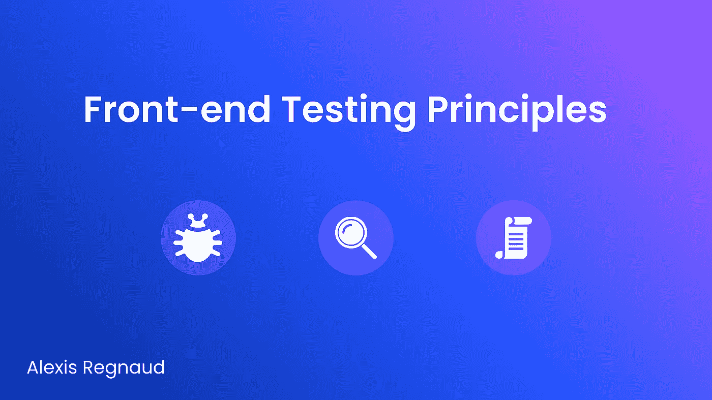
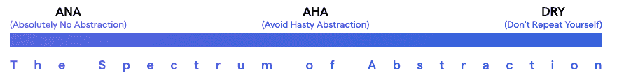

# 前端测试原则

> 原文：<https://itnext.io/front-end-testing-principles-c4a3b51aa7e5?source=collection_archive---------0----------------------->

编写前端测试可能非常困难。你有那么多事情要考虑，要做出选择，要走的路。在这篇文章中，我们将研究 5 个原则来编写更好的测试，并给你充分的信心来将新特性推向生产。

开始之前，有必要提一下这篇文章:

*   特别关注**前端测试**(即 React 应用程序及其与组件的交互)。
*   高度基于 React 社区([https://kentcdodds.com/](https://kentcdodds.com/))内著名开发人员[肯特·c·多兹](https://medium.com/u/db72389e89d8?source=post_page-----5fddfd463feb-----------------------------------)所写的内容。

# 一)导言

在上一篇文章中，我们回答了“我们为什么要编写测试”这个问题以及定义了一个测试策略:“测试奖杯”。

 [## 前端测试策略

### 定义测试的公共层及其权衡，以便提出有效的策略。

itnext.io](/front-end-testing-strategy-5fddfd463feb) 

现在是时候来看看与这一理念完全匹配的 5 条原则了。

# 二)原则

## 1.用你的用户使用软件的方式来测试你的软件

我们希望编写可维护的测试，让您对您的组件为您的用户工作充满信心。
对于前端，我们的测试只需要关注两个目标:

*   在浏览器中与组件交互的最终用户。
*   在代码中呈现和使用你的组件的**开发者**。

只要你的测试服务于这两者，那么它们就有存在的理由。

但是我们经常引入第三个用户，即**测试用户。**这个用户通常测试我们的消费者和我们的企业都不关心的东西(例如:测试实现细节)。
但是，通过这种方式进行测试，你只是为一个用户获得了信心，他:

*   不像**最终用户**那样支付账单。
*   不像**开发者用户**那样影响系统的其余部分。

此外，您现在必须记住第三个用户，并确保考虑到影响测试用户的更改。

**资源:** [肯特·c·多兹——避开测试用户](https://kentcdodds.com/blog/avoid-the-test-user)

## 2.避免测试实现细节

**测试用户**倾向于测试所谓的“实现细节”。

和实施细节会导致:

*   假阴性:当我们重构应用程序代码时可能会出错。
*   误报:当我们破坏应用程序代码时，可能不会失败。

这就是为什么在大多数情况下**我们想要避免它们**，这将使我们的测试:

*   更接近我们的用户(最终用户和开发者)如何使用我们的组件。这让我们相信我们的应用程序正在按预期工作。
*   更有弹性。你的组件的重构不会破坏我们的测试，因此不会拖我们团队和我们的后腿。

你的测试应该更加关注你的用户能够遇到的真实用例。

> **如何确定一个实施细节？** —如果我们的测试做了我们代码的消费者没有做的事情，那么它就是在测试实现细节。(通过示例公开私有函数)。
> —如果一个内部重构(对实现而不是功能的改变)破坏了你的测试，那么它是在测试实现细节
> 
> **“实现细节”示例:** —组件内部状态
> —组件内部方法
> —组件生命周期方法
> —子组件

需要注意的是，仍然有一些情况需要测试实现细节。例如，在 React 中，我们可以考虑一个带有大量内部逻辑的自定义钩子，它可以在整个应用程序中共享。

但是那些应该是稀有的和精选的。

**资源:** [肯特·c·多兹—避免实现细节](https://kentcdodds.com/blog/testing-implementation-details)

## 3.编写更少、更长的测试

许多人阅读一个组件的需求列表，并将它们转化为单独的测试用例。也许你读过所谓的“每个测试最佳实践只有一个断言”但是这个规则最初被创建是因为测试框架没有给你提供你需要的上下文信息来确定是什么导致了你的测试失败。

现在，由于我们惊人的工具，识别哪个断言导致了失败变得很简单。如果你想让事情更清楚，你可以在断言上面添加一个代码注释来解释你所做的断言的重要性。

不要担心考试时间长。当你考虑你的两个用户并避免测试用户时，那么你的测试通常会涉及多个动作和断言，这是一件好事。不要武断地将你的断言分成单独的测试块，没有好的理由这样做。

> **如何确定自己的测试？** 为一个手动测试人员设想一个测试用例工作流，并尝试让你的每个测试用例都包含该工作流的所有部分。

资源: [肯特·c·多兹——编写更少更长的测试](https://kentcdodds.com/blog/write-fewer-longer-tests)

## 3.在编写测试时，要考虑到易于理解和可维护性

AHA 编程原则代表“避免草率的抽象”。它说当你开始写抽象的时候，你不应该教条，而是在感觉正确的时候写抽象，并且不要害怕重复代码，直到你到达那里。

> 在抽象的光谱中间找到一个最佳点是开发可维护代码的关键。

那个原则完全可以应用于编写可维护的测试。作为一个提醒，您编写一个测试，以确信您今天在生产中推出的代码不会在以后发生变化的情况下崩溃。但是测试也应该是你或者任何其他开发人员的助手，他们将来可能会回到测试中来，很容易理解被测试组件的目的(就功能和关键特性而言)。通过这种方式，您希望**让您的测试易于理解并且具有高度可维护性**。

**资源:** [肯特·c·多兹——啊哈测试](https://kentcdodds.com/blog/aha-testing)

## 4.孤立地编写测试

隔离测试意味着运行一个测试的副作用不应该影响其他测试的结果。我们应该能够以任何顺序独立地执行它们，而不会改变所获得的结果。

一般来说，测试隔离是测试的一个重要原则，因为当它没有得到很好的尊重时，它是不可靠的测试(每次运行测试都不能产生相同的结果)的最主要原因之一。

> 由于测试应该是独立的，并且它们的执行顺序无关紧要，Jest 可以并行运行它们，这大大减少了总的执行时间。

孤立地编写我们的测试将指导我们以更好的方式编写测试，以提高它们的可靠性，简化代码，并增加信心。

**资源:** [肯特·c·多兹—测试隔离](https://kentcdodds.com/blog/test-isolation-with-react)

## 5.小心嘲笑

模拟被认为是一种权宜之计，它允许我们测试某些很难或者懒得测试的东西(例如:测试信用卡服务，我们不想玩产品的数据和服务，所以不想玩真钱)。

请记住，当我们嘲笑某事时，我们是在做交易。我们通常用信心换取实用性。即使我们有信心我们的代码能与我们的假版本的服务一起工作，我们也不能 100%有信心我们的代码能在生产中与真实版本一起工作。

肯定有一些模拟的地方(特别是，当我们谈论不同级别的测试时)，但是我们需要意识到我们做出了权衡。

**资源:** [肯特·c·多兹——测试嘲讽](https://kentcdodds.com/blog/the-merits-of-mocking)

# 三)结论

正如我所说的，前端测试具有挑战性。为了编写相关的测试，你必须把自己从开发者的思维模式中分离出来，试着像一个真正的用户那样思考，把 UI 作为一个整体来考虑。因为其他开发人员会跟着你添加他们自己的代码和测试，所以你也需要非常注意可维护性和可理解性。

请记住，编写测试的主要目的是增加您对应用程序的信心。您希望确保实现的功能今天能按预期工作，并且将来不会中断。为了编写测试而编写测试(或者匹配任意的最小代码覆盖率)是没有价值的，并且经常导致时间和金钱的浪费。
我希望这些原则能在你的旅途中有所帮助。

感谢您的阅读。