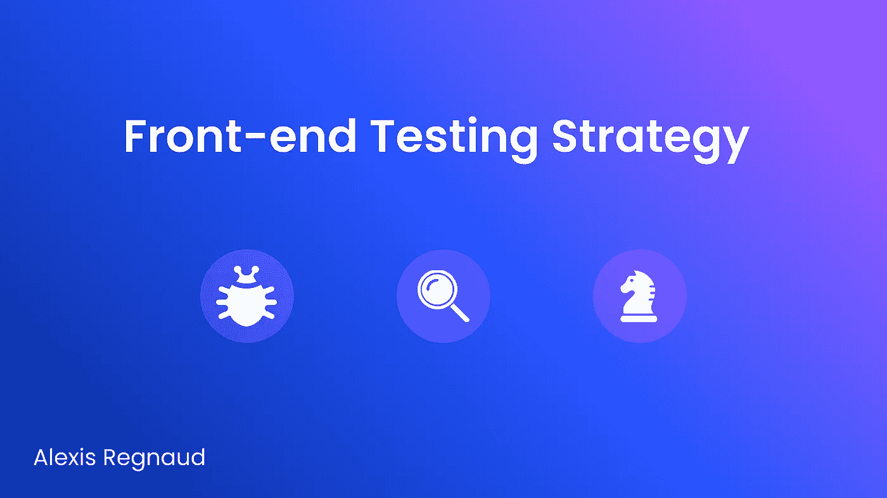
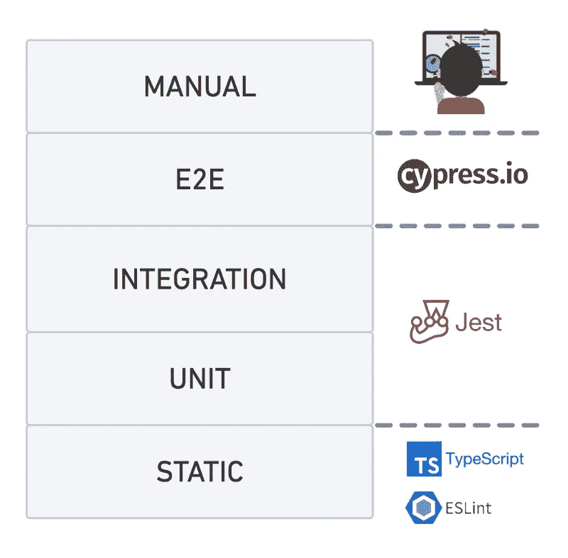
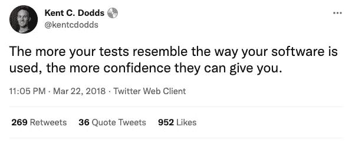
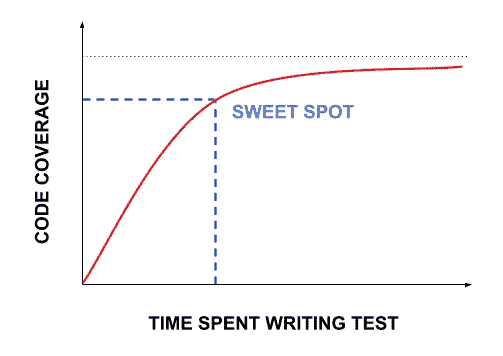
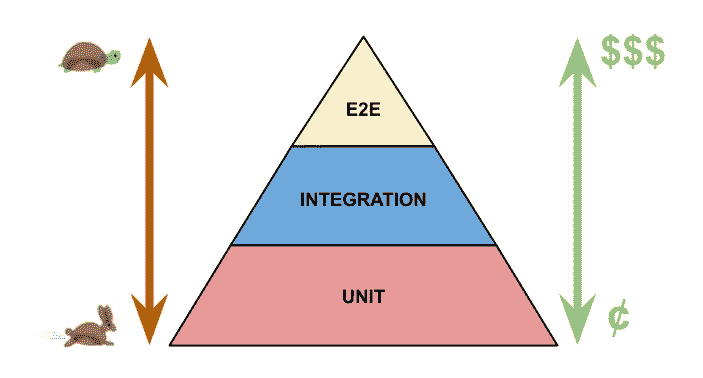
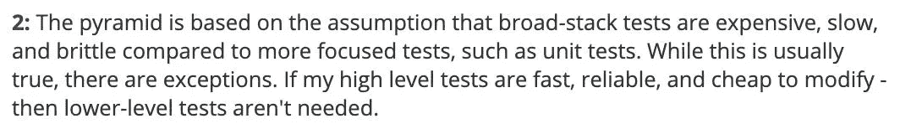
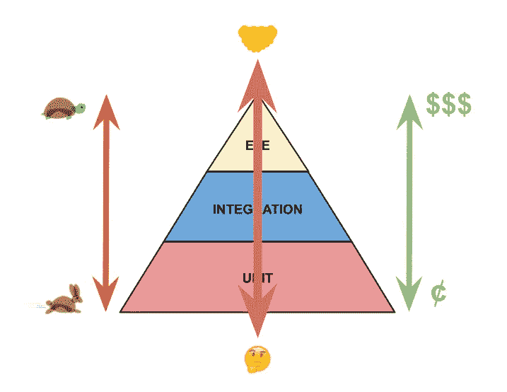
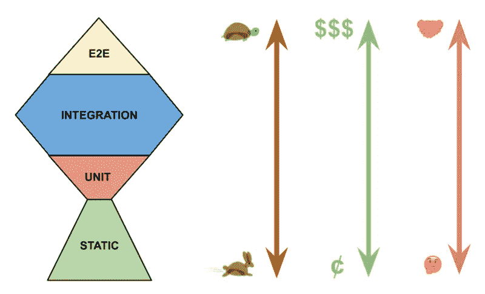
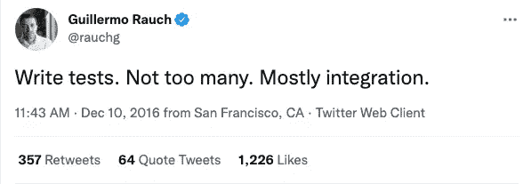

# 前端测试策略

> 原文：<https://itnext.io/front-end-testing-strategy-5fddfd463feb?source=collection_archive---------0----------------------->

定义测试的不同层次，并概述当前情况以提出有效的策略。

在开始之前，重要的是要提到这篇文章是:

*   特别关注**前端测试**(即 React 应用及其与组件的交互)。
*   高度基于由 React 社区中著名开发人员 [Kent C. Dodds](https://medium.com/u/db72389e89d8?source=post_page-----5fddfd463feb--------------------------------) 定义的测试原则。他发布了多个开源库(【https://testing-library.com/】[)以及许多定性课程和文章(](https://testing-library.com/))。

# 一)导言

# 1.我们为什么要写测试？

测试可以帮助加速你的工作流程和提高你的代码质量，但是写测试最大和最重要的原因是**信心**。您希望确信您正在编写的代码不会破坏应用程序，同时也是面向未来的。因此，无论你做什么，你都要确保你编写的测试类型给你带来尽可能多的信心，并且你需要意识到你在测试时所做的权衡。

## 资源:

*   [Kent c . Dodds——自信地发布代码](https://kentcdodds.com/blog/confidently-shipping-code)
*   [Kent c . Dodds——如何知道要测试什么？](https://kentcdodds.com/blog/how-to-know-what-to-test)

# 2.测试类型

> 你可以把油漆倒在墙上，最终你可能会得到大部分的墙壁，但是除非你用刷子刷到墙上，否则你永远也不会得到角落。🖌️

这个比喻完全适用于测试，因为它基本上是说，选择正确的测试策略与你选择画笔来粉刷墙壁是同一类型的选择。对于不同的用例，有不同类型的测试(A/B 测试、性能测试、冒烟测试、回归测试等等)，每一种都有自己的权衡。

手工测试是一层。当我们谈论自动化测试时，以下是最常见的:单元、集成和端到端(E2E)。
最后，在 JavaScript 中，因为默认情况下是不绑定的(不像其他语言，比如 Java)，所以通常会包含一个静态类型工具(Typescript、Flow、ESLint 等等)。

## 静态试验

静态测试是在不需要执行代码的情况下执行的。这些助手设置起来简单快捷，允许您在开发应用程序时不断捕捉打字错误和类型错误。

`TypeScript`(打字编程语言)和`ESLint` (Linters)是执行这类测试的常用工具。

## 单元测试

单元测试验证你的软件的小的、孤立的部分(或原子)按预期工作。他们通常测试没有依赖关系(合作者)的单元，或者那些为测试而被模仿的单元。

`Jest`是执行这类测试的常用工具。

## 整合测试

集成测试验证几个单元(功能、组件、类……)和谐地一起工作。他们从整体上测试自己的行为，尽量少嘲笑。集成测试涵盖一个与其他系统隔离的系统(例如:前端)。

`Jest`是执行该类测试的常用工具。

> “什么是单位的概念？VS“什么是集成？“这取决于你看代码的角度。
> 
> 如果我们以一个应用程序为例，使用属于组件库的下拉菜单:
> -从组件库的角度；内部下拉菜单的功能是一个单元。下拉菜单是一个整体。
> -从应用的角度来看；下拉菜单成为一个单元。页面的形式是一个集成。

## E2E 试验

E2E 测试(有时称为“功能测试”)涵盖了所有的系统(前端、后端等等)。他们将浏览器自动化，并尝试围绕应用程序重现典型的用户流程(加载应用程序、浏览登录流程、与页面交互等)。E2E 帮助你覆盖大量的软件测试。

`Cypress`是执行这类测试的常用工具。

## 手动测试

手动测试建议不使用任何自动化工具来执行测试。一个人将试图准确地再现最终用户将要做的事情:

1.  坐在电脑前
2.  在浏览器上打开应用程序
3.  浏览登录信息
4.  点击周围

他们的目标是捕捉开发人员没有预料到的或者自动化工具没有检测到的错误。

## 资源:

*   [Kent c . Dodds——我们能从车轮测试中学到什么](https://youtu.be/Da9wfQ0frGA)
*   [肯特·c·多兹——测试奖杯和测试分类](https://kentcdodds.com/blog/the-testing-trophy-and-testing-classifications)
*   [Kent C. Dodds —前端应用的静态、单元、集成和 E2E 测试](https://kentcdodds.com/blog/static-vs-unit-vs-integration-vs-e2e-tests)

# 3.什么测试最有信心？

通过测试，您可以确保您的软件在发布给用户时能够按预期工作。要做到这一点，最好的方法是在编写测试时考虑到最终用户对你的软件的看法。

遵循简单的原则，**手动测试**看起来是最好的选择，因为它最接近终端用户与应用程序的交互方式。然而，这并不是测试软件的可扩展解决方案。

但是对于您在软件中所做的任何更改，您都希望确保在部署到生产环境之前不会出现任何问题。如果你进行手工测试，那将花费很长时间。此外，手工测试很容易受到人为错误的影响。

这就是为什么我们更喜欢**自动化测试**的原因，因为它们更快，更可伸缩，并且没有人为错误(如果它们写得好的话)。

## 资源:

*   [测试库—指导原则](https://testing-library.com/docs/guiding-principles/)

# II)让我们来谈谈权衡

# 1.代码覆盖率

强制应用程序 100%的代码覆盖率不是一个好主意。当覆盖率超过某个数字(比如说 70%)时，你的测试回报就会减少。当你一直努力达到 100%时，你会发现自己花时间去测试那些实际上不需要测试的东西:

*   **完全没有逻辑的东西:**所以任何 bug 都可能被 ESLint 和 Typescript 捕获。
*   **实现细节:**测试实现细节并不能让你对你的应用程序的工作有很大的信心，并且在重构时会降低你的速度(当你重构代码时，你应该很少需要改变测试，因为行为保持不变)。
    它可能导致:
    -假阴性:当你重构应用程序代码时可能会出错。
    -误报:当您破坏应用程序代码时，可能不会失败。

> **如何确定实施细节？如果你的测试做了你的代码的消费者没有做的事情，那么它是在测试实现细节。(通过示例公开私有函数)。**

## Commons 对代码覆盖率的误解

代码覆盖率告诉你的是:

*   这一行代码是在这些测试运行时运行的。

哪些代码覆盖率没有告诉您:

*   这部分代码将根据业务需求工作。
*   这部分代码与应用程序中的所有其他部分代码配合得很好。
*   这部分代码比其他部分更需要测试。

## 代码覆盖率< Use Case Coverage

You should concern less about the code you are testing and more about the use cases that code supports because :

*   Code changes more often than use cases do
*   The code can be “working” when the use case is broken

## Resources:

*   [Kent c . Dodds——常见测试错误](https://kentcdodds.com/blog/common-testing-mistakes#mistake-number-2-100-codecoverage)
*   [Aaron abra mov——用软件设计原则建立测试模式](https://youtu.be/_pnW-JjmyXE)
*   [肯特·c·多兹——测试实施细节](https://kentcdodds.com/blog/testing-implementation-details)
*   [肯特·c·多兹——避开测试用户](https://kentcdodds.com/blog/avoid-the-test-user)
*   Kent c . Dodds——如何知道要测试什么？

# 2.怎么知道考什么？

因为你不可能测试所有的东西，所以你必须决定你要把精力集中在哪里。

## 测试金字塔

你可能已经知道了测试金字塔，这是一种谈论测试不同层次的流行方式。以下是马丁·福勒博客[和谷歌测试博客](https://martinfowler.com/bliki/TestPyramid.html)的组合:

金字塔上这些测试形式的大小与测试应用程序时你应该给予它们的关注程度有关。

两个箭头都表示你在金字塔中移动时的权衡。随着你在金字塔上的移动，测试的编写/运行变得更慢，运行/维护变得更昂贵(就时间和资源而言)。当你往上走的时候，你的测试往往会变得更加挑剔，并且会有更多的失败点。

仅遵循这两个方面，这意味着您应该在单元测试上花费更多的时间，因为它们既便宜又快速。

但是这里有几个问题:

1 —该金字塔创建于 2012 年，基于这一假设(来自 Martin Fowler 博客的底部注释) :

现在不那么真实了。测试工具与以前相比要好得多(在性能方面更好，而且能够告诉测试的哪个部分导致了失败以及描述问题)。

2 —金字塔是在前端测试生态系统没有现在这么强大的时候创建的。十年前，我们的工具还不能很好地再现前端最终用户。
大多数测试、工具和金字塔都集中在后端。原因是与测试前端相比，后端“更容易”测试。他们构建直接与其他软件对话的软件(可以被认为是他们的用户)。所以对他们来说，编写看起来像他们想要测试的代码的测试是很自然的。对于前端，用户可能是最终用户，他们有手指、手，会四处点击，在键盘上键入一些东西，可能会使用一些屏幕阅读器，等等。重现它们的行为要复杂得多。幸运的是，最近几年很多事情都发生了变化，我们现在有了更好的工具(例如:`Testing Library`)能够像用户一样测试我们的软件。

3-金字塔不涉及静态测试。因为它是为使用静态类型语言的开发人员定义的(例如:`Java`，`C`)。但是对于 JavaScript，你必须添加外部工具(`Typescript`、`Eslint`)来获得这样的反馈，所以在你的现实中，这是测试的一层。

4 —这个金字塔中遗漏了一个方面:随着你在金字塔中向上移动，每种测试形式的置信系数都会增加。

置信系数意味着，你在测试金字塔上爬得越高，你就离你的测试越近，就像你的软件被使用的方式一样。所以你从中获得的自信也会增加。

> 例如，如果您有一个 checkout 特性，以与真实用户交互的相同方式测试整个过程，允许您覆盖并确保使用的所有子元素一起工作。

因此，尽管 E2E 测试可能比单元测试更慢、更昂贵，但它们会让您更加确信您的应用程序正在按预期运行。
相反，单元测试更快更便宜，但是通过测试你会发现自己:

*   孤立地测试各个部分(这不能让你相信它们能一起正常工作)
*   测试实现细节
*   嘲笑很多

有很多因素会让你偏离“用与用户交互完全相同的方式测试应用程序”的原则，从而丧失信心。

## 测试奖杯

有了测试奖杯，我们保持相同的测试堆栈: **E2E** 、**集成**和**单元**；但是你改变了不同形状之间的比例。我们还添加了静态层来表示 JavaScript 的真实情况。

E2E 测试是自动测试的一种，它给你的软件工作正常的信心。也许将来我们的 E2E 工具会变得更好，以至于你会 100%地关注它，但是今天它们的编写和运行仍然很昂贵。因此，您将只关注一些高层次的关键测试，这些测试可能需要多个系统(前端、后端等)的交互，并代表生产数据。在 E2E，你通常会选择快乐的道路，尤其是避免过度测试。

**集成测试**是奖杯最宽的一层，因为这是你应该集中大部分精力的地方。它们在编写和运行测试的信心和速度/费用之间取得了很好的平衡。他们测试了一些快乐的路径和不快乐的路径。通过测试你的软件的几个部分如预期的那样很好地一起工作，你将能够以最终用户与它交互的同样方式覆盖许多用例；您会发现，您通常不需要费心孤立地测试每一个较小的部分。

**单元测试**是奖杯的最小部分。这一切都是为了把你的精力集中在测试小的边缘情况，或者典型的有很多复杂逻辑的纯函数上。这里您没有测试业务案例(最终用户将拥有的案例)。您的单元的用户通常是从开发人员的角度调用您的功能的其他开发人员。

静态 **测试**应该应用在应用程序的任何地方，因为它们甚至不需要运行你的应用程序就能给你很多信息。

> 每个形状之间的比率并不是 100%准确的，大多数时候你希望有更多的 E2E 而不是单元测试。

## 资源:

*   [肯特·c·多兹——如何知道要测试什么？](https://youtu.be/ahrvE062Kv4)
*   [Kent c . Dodds——为什么你应该双倍下注集成测试？](https://www.software-engineering-unlocked.com/double-down-integration-tests-kent-dodds/)

# 三)结论

Guillermo Rauch(Vercel 的首席执行官和创始人)的这条推文是对测试哲学的完美总结:

*   编写测试:它们给你信心，让你相信你的软件能按预期工作
*   **不要太多:**不要强制要求 100%的代码覆盖率。您应该少考虑正在测试的代码，多考虑代码支持的用例。
*   **主要是集成:**它们是编写和运行测试的信心和速度/费用之间的最佳平衡。

值得一提的是，手工测试在未来几十年内肯定还会在测试策略中占有一席之地。总会有一些开发人员没有预料到和测试到的用例，一个真正的人眼可以在这方面有所帮助。但是当你编写自动化测试时，信心会增加，你对手工测试的需求会减少。手动测试有很多好处，但是也有很多问题，比如需要大量的时间和资源。

这又是一个权衡取舍的问题，什么对最终用户至关重要，所以你要把精力放在哪里。您希望确信当您部署您的更改时，您的代码满足了业务需求，并且您为您的用户提供了极好的体验。您应该混合使用不同的测试策略来实现这个目标。

感谢您的阅读。

## 资源:

*   [肯特·c·多兹——写测试。不太多。主要是整合。](https://kentcdodds.com/blog/write-tests)
*   [肯特·c·多兹——自信的反应](https://youtu.be/eg_TFYF_cKM)
*   [adriàFontcuberta——实用的前端测试人员](https://youtu.be/pfJdNiDOJ-A)

# 进一步阅读

 [## 前端测试原则

### 编写更好的测试的 5 个原则，让你有充分的信心将新特性投入生产。正在写入前端…

itnext.io](/front-end-testing-principles-c4a3b51aa7e5)