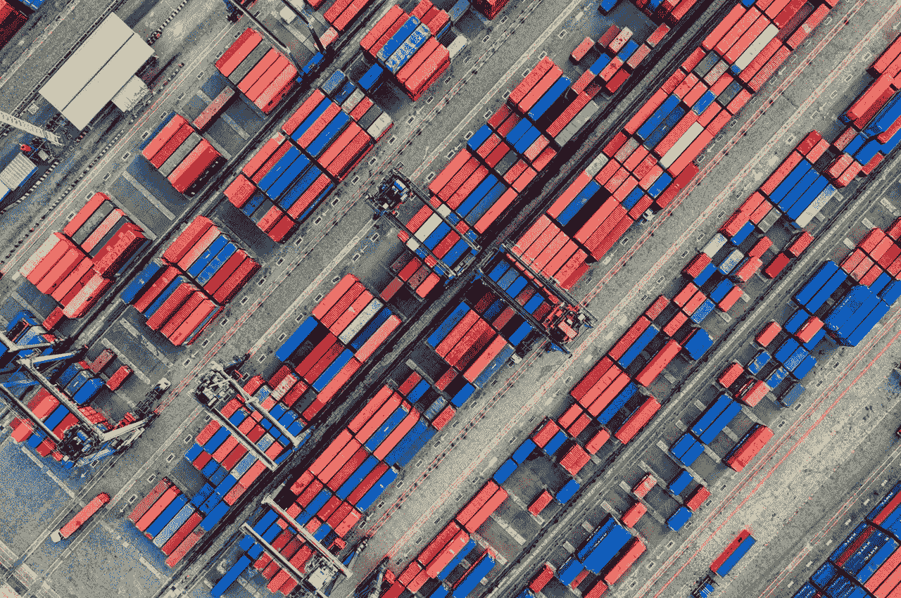

# 使用 NextJS 的前端 dockerized 构建工件

> 原文：<https://itnext.io/frontend-dockerized-build-artifacts-with-nextjs-9463f3da3362?source=collection_archive---------4----------------------->



来自 [Pexels](https://www.pexels.com/photo/aerial-photography-of-container-van-lot-3063470/?utm_content=attributionCopyText&utm_medium=referral&utm_source=pexels) 的[汤姆·菲斯克](https://www.pexels.com/@tomfisk?utm_content=attributionCopyText&utm_medium=referral&utm_source=pexels)的照片

部署前端应用程序时，有几种方法可供选择。不错，只是不同的用例。您可以将其 docker 化(这是用您的应用程序资产和运行时制作一个 docker 容器)并将其部署到任何支持它的基础架构(Kubernetes 等)，或者您可以走一条更简单(且目前更受欢迎)的路线，创建您的应用程序的静态版本，并通过 CDN(内容交付网络)提供它，这带来了所有好处(没有服务器，内容更接近用户，因此体验更快，等等)。

现在，您可能希望拥有运行时环境，大多数情况下至少有三个:开发、试运行和生产。这将影响您的构建和部署管道。假设您的最新应用程序版本在试运行环境中运行良好(经过测试),并决定将最新版本部署到生产环境中。根据构建方式的不同，您可能会在生产中得到一个不完整的应用程序版本，仅仅是因为存在不正确管理的不完整的依赖关系。因此，您的构建管道执行了生产分支(或标签)的另一个构建，现在我们向我们的用户发送了损坏的代码。不太好。

将我们的申请归档确实有所帮助。我们可以为每次提交创建一个 docker 映像，不受环境限制，标记并存储在我们的注册表中。我们可以放心地在任何环境中推广或运行这个 docker 映像。既然我们在帖子的标题上有 NextJS，那么让我们看看如何对一个 NextJS 应用程序进行 dockerize。

描述的 Dockerfile 文件有两个阶段。首先，将安装所有依赖项(包括开发依赖项)并进行生产构建，同时删除非生产依赖项。第二阶段将复制相关文件，包括构建和生产依赖项。给我们一个更精简的形象，然后我们可以运行:

```
$ docker run -d -p 3000:3000 fe-app-image
```

由于我们希望在运行时环境中运行相同的映像，我们还可以:

```
# Development
$ docker run -d -p 3000:3000 \
-e API=[https://dev-api.myapp.com](https://staging-api.myapp.com) \
fe-app-image# Staging
$ docker run -d -p 3000:3000 \
-e API=[https://staging-api.myapp.com](https://staging-api.myapp.com) \
fe-app-image# Production
$ docker run -d -p 3000:3000 \
-e API=[https://api.myapp.com](https://staging-api.myapp.com) \
fe-app-image
```

或者甚至用于本地开发或测试

```
# Local dev
$ docker run -d -p 3000:3000 \
-e API=[http://1](https://staging-api.myapp.com)92.168.1.87:5000 \
fe-app-image
```

Docker 图像很整洁。现在。对于我们的运行时环境，我们仍然依赖服务器来部署我们的应用程序，以便我们的用户可以访问它。我们描述的另一种选择是静态部署。这就是，构建你的应用程序，这样输出的只是一堆 HTML、JS 和 CSS 文件，我们可以将它们放在一个文件夹中，并通过 CDN 提供服务。这种方法的主要问题是缺乏运行时间。换句话说，我们不能让静态构建环境不可知。注入环境属性就成了我们需要解决的一个问题，通过配置端点(在应用加载前获取)，环境嗅探(检查应用运行的域并从中推断出 env 变量)，注入 HTTP 头(还不确定)。都需要额外的工作。(如果您解决了这个问题，请给出您的解决方案)。

我们通常在静态部署中看到的是:每次我们想要部署到一个特定的环境中，我们都必须运行带有运行时变量的构建过程，这样构建就已经将它们融入其中了。这种方法是可行的，如果你正在进行静态部署的话，这可能就是你现在正在使用的方法。但是，仍然存在上述问题。如果一些依赖项在构建时发生了变化或者没有得到很好的管理，我们不能保证我们的构建会以同样的方式工作。

我们如何避免这个问题，同时仍然进行静态部署。(不用维护服务器确实很吸引人)好吧，一种方法是仍然为你的应用程序创建一个 docker 镜像(使用上面描述的 Dockerfile)。因此，构建时间与部署时间是分开的。

在部署时，我们可以提取任何映像(轻松回滚 FTW)并通过更改入口点来运行它，因此我们将导出它的静态资产，而不是运行应用程序。(多亏了`next export`命令，这在 NextJS 上是可行的)

```
# Deploying to production
$ docker run \
-e API=[https://api.myapp.com](https://staging-api.myapp.com) \
-v ~/cd-folder/out:/app/out \ 
--entrypoint "node_modules/.bin/next" \
fe-app-image export# Copy static assets from ~/cd-folder/out to your production CDN
```

## 为什么？

*   构建和部署是分开的。依赖性问题不再是一个问题。
*   部署可选性:我们现在可以选择如何部署我们的应用程序。使用 docker 的 Kubernetes 或使用 CDN 的 static deploy
*   轻松回滚。我们可以在 docker 注册表上构建、标记和存储我们所有的构建。然后，我们可以直接从注册表中选择要部署的版本。
*   更轻松的本地开发体验。任何开发团队成员，前端或不是可以运行任何版本的前端本地。
*   SSR 可选性。静态部署不完全支持 SSR，只支持页面的特殊渲染。但是，您可以通过将您的应用程序再次部署为 docker 容器来支持它。
*   更容易的本地自动化测试。运行你的 docker 容器指向一个江湖服务器[http://www.mbtest.org/](http://www.mbtest.org/)

黑客快乐！