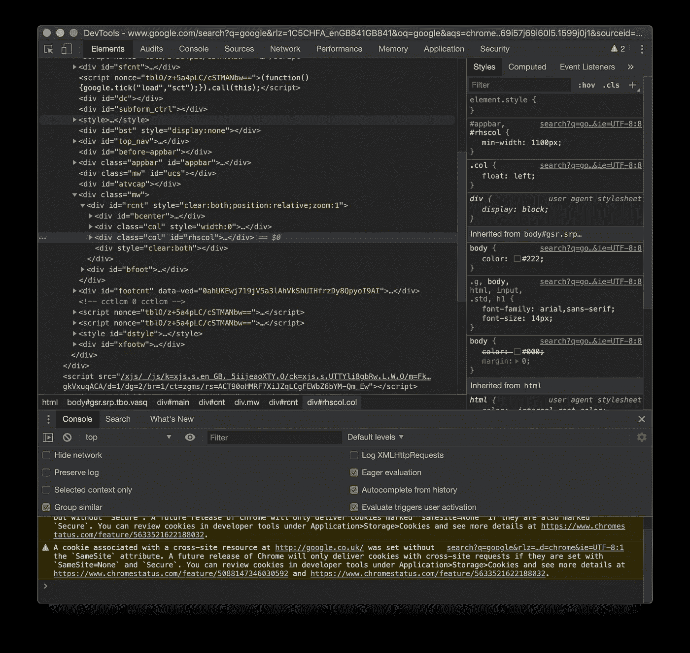
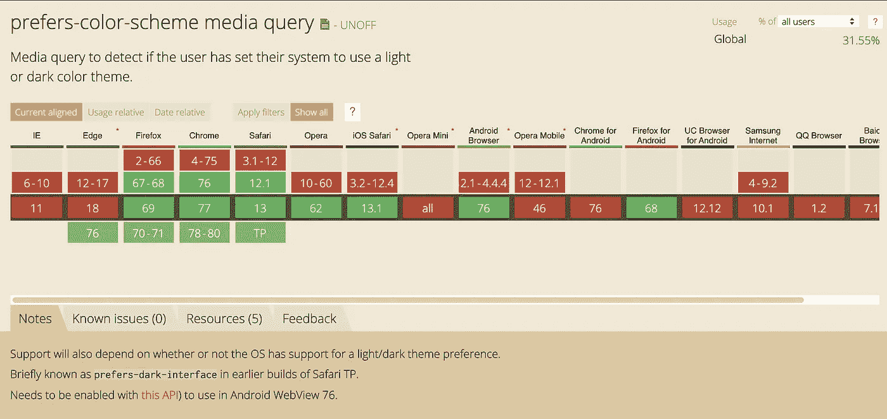

# 前端聚焦:黑暗模式🕷

> 原文：<https://itnext.io/frontend-focus-dark-mode-on-the-web-fdcc76cfb9a7?source=collection_archive---------3----------------------->

## 不给糖就捣蛋？当我们为万圣节潜入前端地狱👻


当我们开始步入 2020 年时，前端开发人员在 Web 应用程序的精彩马戏平衡表演中还有另一个盘子，我们不仅要应对:

*   面向移动设备、平板电脑和台式机的响应式建筑
    (面向任何人)
*   多种浏览器(传统和其他)
*   无障碍问题
*   渐进式网络应用。
*   搜索引擎优化
*   [页面速度的优化](https://medium.com/@tristolliday/tutorial-speed-up-css-load-on-umbraco-8-fc71533d3d00)等等等等

我们现在有黑暗模式进入主流的喜悦。黑暗模式会是压倒骆驼的最后一根稻草吗？

让我倒回去。我喜欢黑暗模式，我喜欢黑暗。我每天盯着屏幕超过 8 个小时，所以让屏幕尽可能接近“关闭”是我的特权。我的开发人员会愉快地生活在一个寒冷黑暗的洞穴里，只有背光键盘的微光陪伴我。但是在 web 开发周期的某一点上，一天中没有足够的时间来考虑所有上述内容，加上黑暗模式，以及所有 emTech 的到来。

## 黑暗模式是否让用户体验更好？

虽然黑暗模式可以让一些人更容易阅读屏幕，但用户体验需要的不仅仅是反转颜色来改善体验。

以 Chrome 开发工具为例。许多标签，按钮和复选框，但交换颜色和…



黑暗模式让开发工具看起来更容易一些，但是管理工具太多了

…塔达！一个简洁易用的界面。不，可悲的是黑暗模式是一个很好的选择，它不会创造或破坏体验。

我跑题了，回到手头的任务:黑暗模式。

我必须说，我的反对意见有点为时过早，开发人员长期以来不得不为一个单一的网络应用程序创建多个主题，这不是什么新鲜事，必要性是发明之母，在床上阅读手机万岁，没有眩目的白光会让你睡不着几个小时。

## **代码位**

那么黑暗模式在网络上有多受支持呢？它肯定在 MacOS、iOS、Android 和 Windows 10 上获得了主流关注。粗略地看一下[caniuse.com](https://caniuse.com/#search=prefers-color-scheme)几乎所有的查询都会说，是的！你可以用它…只是不在 IE 或者 Edge，标准。



快速检查一下[caniuse.com](https://caniuse.com/#search=prefers-color-scheme)(2019 年 10 月的快照)显示它几乎准备好了

## 那么，我如何‘实现黑暗模式’？

很简单，通过媒体查询:

```
@media (prefers-color-scheme: dark) { // dark stuff lies here
}
```

在`no-preference`、`light`和`dark`以及 vwah-la 之间选择用户偏好的黑暗和明亮模式。还有更多像`prefers-contrast`这样的聚焦于无障碍的模式，旨在使观看更加愉快，但这[仍在草案中](https://drafts.csswg.org/mediaqueries-5/#prefers-contrast)。

这很好，只是要确保我们所有的颜色远离我们的尺码代码。话说回来，我们已经这样做了，对吗？提示对你曾经写过的所有东西进行一次巨大的重构。

由于黑暗模式仅由最新的浏览器支持，并且您打算使用它，您可以将它与[自定义属性](https://caniuse.com/#search=Custom%20Properties)配对，它具有或多或少相同的支持，并且可以帮助您将黑暗模式就绪的 CSS 压缩到 CSS 变量中。

如果你的网站已经处于黑暗模式风格，你可以默认为黑暗模式，并为那些主动选择光明模式的用户改变一些东西。

```
body {   
  background-color: black;   
  color: white; 
} 
@media screen and (prefers-color-scheme: light) {  
 body {     
   background-color: white;     
   color: black;   } 
}
```

## 我能用 Javascript 破解吗？

是的，虽然它基本上是在听 DOMs CSS 媒体，但是看看 [Jonas Duri 的](https://medium.com/@jonas_duri?source=post_page-----66cedd3d7845----------------------)伟大的实现:

他写的关于他如何做的文章[可供所有人阅读](https://medium.com/@jonas_duri/enable-dark-mode-with-css-variables-and-javascript-today-66cedd3d7845)，包括一个关于如何实现 CSS 变量的很棒的教程。

## 你准备好进入黑暗模式了吗？

如果你想坚持微软，和他们永远落后的浏览器，承担服务人员和你的清单之间的另一项工作(黑暗模式具体清单有人吗？)，为什么不尝试一下黑暗模式，把它添加到你的技能中，或者至少开始清理你的 CSS 为它做好准备。

**喜欢你读的东西？给它一些爱👏👏👏**