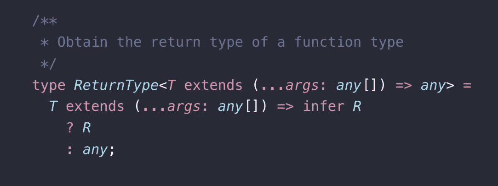
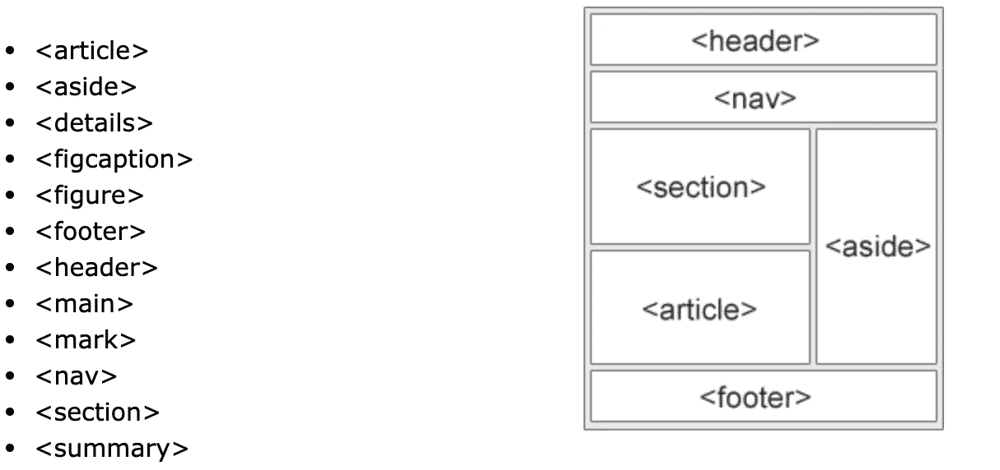
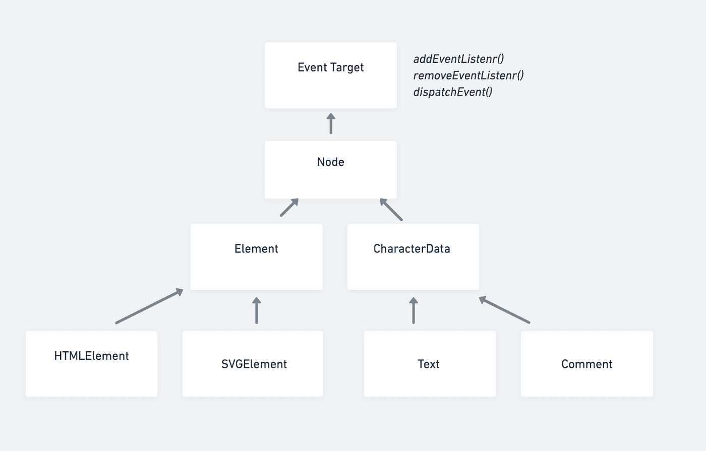
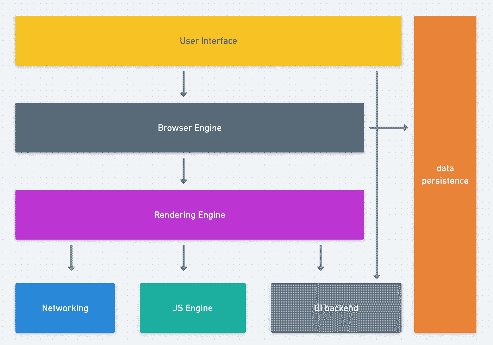
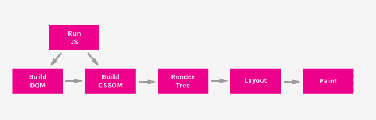
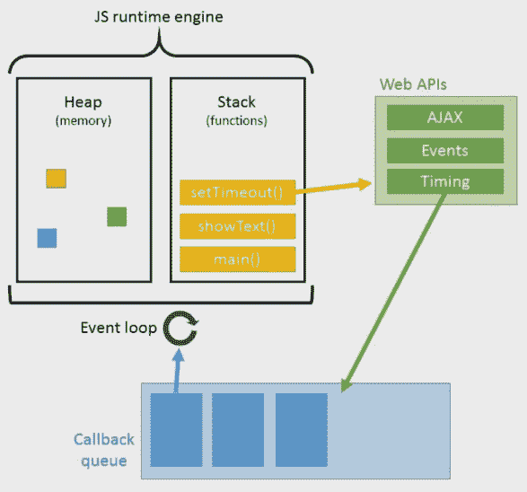

# 后端开发人员的前端

> 原文：<https://itnext.io/frontend-for-backend-developers-6433adb5a10d?source=collection_archive---------1----------------------->

这是一个充满希望的标题——但我有一种感觉，如果你遵循我很快就会尝试绘制的道路——FFB 2019，你不会失望。

有一个问题我不止一次被有经验的 0 UI 取向的后端开发者(指核心后端，不是“全栈”开发者)问过——我应该如何开始学习前端？(该不该上课程，该不该买线上课程，具体是哪些课程？)所以在这篇文章中，我会努力让你的**学习过程比我 5 年前的**更短，更专注，那时我从后端转移到前端(顺便说一句，再也没有回来)，我会使用后端类比和技术术语——所以这篇文章是为**有经验的开发人员准备的。**

试图学习“前端”是势不可挡的，你需要从 **HTML** 到 **CSS** 到 **Javascript** 到**现代框架**、**构建工具**、**不同的范例**等等，等等(从 2016 年的这篇文章中可以感觉到[，似乎有很多东西要学——确实有，但你最好](https://hackernoon.com/how-it-feels-to-learn-javascript-in-2016-d3a717dd577f)

**让我们开始构建[(当然是固执己见的)](https://github.com/kamranahmedse/developer-roadmap)前端路径:**

****起点:****

**0. [**mdn**](https://developer.mozilla.org/en-US/) 是我最好的朋友！它包含了所有支持或不支持的网络相关术语/API。**

1.  ****学 JS** ，有很多不错的资源，但我觉得以下是必须的:看 3.5 小时免费的 [**JavaScript:了解诡异的部分**](https://www.youtube.com/watch?v=Bv_5Zv5c-Ts) 或者购买 [udemy 课程](https://www.udemy.com/understand-javascript/)。(顺便说一句，我是从一本名为《Javascript the good parts》的好书开始的，但那是在 2014 年)**

**** **Typescript 对后端开发人员来说很棒**(一般来说，对 IMO 来说也是如此)，它是 Javascript 的超集，它带来了接口和使用类型、泛型等功能，ts 被转换成 Javascript(由 TS 编译器编译),然后被发送到浏览器，在学习了 Javascript 的核心概念之后——阅读 TS 代码对您来说更有意义/更快，对您来说更熟悉。总的来说，我建议选择 Typescript——只是不要滥用和过度抽象你的应用程序中的东西，这可能会增加阅读代码的复杂性(正如我希望你做的那样，更喜欢组合而不是继承),我希望我没有冒犯你，但一些后端开发人员往往在没有必要的时候进行过度工程化——这通常来自于强大的 OOP 经典设计模式知识和对 Javascript 的对象功能、模式(如闭包和元编程能力)的不熟悉。**

**2. [**HTML**](https://developer.mozilla.org/en-US/docs/Learn/HTML/Introduction_to_HTML) 基本上是一个浏览器的配置文件，它包含了我们想要在[视窗](https://www.w3schools.com/css/css_rwd_viewport.asp)上看到的内容，它实际上是[语义](https://www.w3schools.com/html/html5_semantic_elements.asp)，你指定你想要在你的页面上看到哪些元素，最终，它们将成为你的 JS 代码将与之交互的实体(我们将到达那里)。**

****

**3.不要害怕 [**CSS**](https://developer.mozilla.org/en-US/docs/Learn/CSS) 它基本上是一组应用于 html 元素的规则，也有获取它们的逻辑模式。从基本且重要的[箱型](https://developer.mozilla.org/en-US/docs/Learn/CSS/Introduction_to_CSS/Box_model)开始。**

**此时——**动手**，参加一个快速课程(有很多)来构建一个简单的静态站点，这里有 [udacity](https://www.udacity.com/course/front-end-web-developer-nanodegree--nd001) 前端课程，它是免费的，看起来不错，你不会在几分钟内成为 HTML/css 专家，所以请专注于**编排**:你可能认为将 CSS 分离到一个单独的文件中是一个最佳实践，对于 HTML 和 js 也是如此，你应该明白在哪里“注册”你的 CSS 文件和 js 我们有时添加到脚本标签中的“异步”或“延迟”属性是什么？当你为后端开发时，总是问自己这些问题。**

**4.理解 **web 实体抽象**和 html 元素组成，我的意思是，最终，DOM 是一棵树，它由节点组成，一个节点可以表示一个 html 元素，如按钮，一个 svg 元素，如形状，一个文本节点或评论，一个 HTML 元素，如按钮，从 html element 扩展，所以它包括所有的[**全局属性**](https://developer.mozilla.org/en-US/docs/Web/HTML/Global_attributes) ， 由于所有元素都实现 EventTarget，因此所有元素都可以有一个事件侦听器并触发[事件](https://developer.mozilla.org/en-US/docs/Web/Events)(下面是 javascript，了解一点关于事件冒泡的知识，以及为什么有时我们需要防止默认事件或停止冒泡)。**

**每一个“本地”元素都有特定的**风格**(有时可以使用 css 定制)和**功能**(例如发出我们可以注册的特定事件)以及与可访问性相关的属性...**

****

**5.进入 **k** [**现在是浏览器**](https://www.html5rocks.com/en/tutorials/internals/howbrowserswork/)**——这是我们的生态系统，理解它的组件和功能很重要，这样才能真正理解我们的代码从捆绑文件到交互应用的整个流程。****

********

****6.了解 [**关键渲染路径**](https://developers.google.com/web/fundamentals/performance/critical-rendering-path/) ，简而言之，浏览器将 HTML 解析为 DOM 树结构，将 CSS 解析为 CSSOM 树，并将两者合并为渲染树，浏览器渲染器引擎将布局/流动所有元素，并将绘制每个像素，并将它们组合在它们应该在的位置。****

********

****7.Javascript 运行时和事件循环无疑是最有趣的话题之一。你一定要看:[https://www.youtube.com/watch?v=cCOL7MC4Pl0](https://www.youtube.com/watch?v=cCOL7MC4Pl0)****

********

****8.查看丰富且不断发展的 [**web API**](https://developer.mozilla.org/en-US/docs/Web/API) 。阅读关于窗口对象和文档对象的内容。****

******节点和 NPM******

****当你用 Java 开发时，你需要安装 SDK 和 JRE 等等，你可以用 gradle/maven 来管理依赖关系。****

****如果你想建立一个静态站点，并为第三方使用一个 [CDN](https://www.cloudflare.com/learning/cdn/what-is-a-cdn/) ，而不是在本地将它们包含在你的站点项目中，你不需要一个包管理器工具，但大多数情况下不是这样。****

****我们使用的开发工具需要能够在本地运行，因为我们的工具库是用 javascript (node.js)编写的，你需要安装 node.js 和 NPM(节点包管理器)——为了对你的节点版本进行本地控制(不要全局安装),我推荐使用 [nvm](https://github.com/nvm-sh/nvm)****

******框架/SPA 和 web 组件“运动”******

****如果你正在阅读这篇文章，你可能需要一个交互式的可维护的健壮 UI 来服务你的服务器(lol ),你的前端同事可能正在使用 Angular 或 React 或 Vue(或 Svelete？没有吗？)并且你希望能够说他们的语言，有很多关于这个话题的帖子——比如这个。****

****简而言之，就像 Spring 或 Guice 为您提供了快速设置/开发结构化和有序项目所需的工具一样，前端框架(或 React 中的 lib)——您仍然需要围绕它添加模块..)指导你同样，你在你的 web 服务器上使用 DI 和 singleton 服务或者工厂类？你可以在前端这样做，你以 MVC 方式开发一个 web 服务器——我们在 2014 年用 Angular.js 开发过，但现在大多数框架都应用了 MVVM——在前端也有很多顺序和工程原则，我们开发了小的有希望可发布的组件，并且有很多关于这个主题的好帖子。****

****更新 DOM——框架的挑战是什么？他们是如何在引擎盖下工作的？这些是你应该问自己的问题，一般来说，React 使用虚拟 DOM，在 Angular 中每个组件都有自己的状态，所以有一个变化检测器树结构，观看 Vue.js 的创造者尤雨溪的视频[谈到框架中的反应性。](https://www.youtube.com/watch?v=r4pNEdIt_l4)****

****状态管理——我们如何在应用程序中管理状态？在这个领域也有很多帖子(通过服务层或大量使用 redux 模式，顺便说一句，似乎很快就会有更多的前端开发人员采用 DDD 并实现 cqrs，寻找 nativeweb，非常有趣的想法……)。****

****[**“Web 组件**](https://developers.google.com/web/fundamentals/web-components/customelements) 运动”:在前端，你可能会注意到，每隔几年就会有一个新的框架出现，以更好的方式解决相同的问题——但是升级或转移到新的框架是痛苦的，我们在 Angular.js 中编写了许多 UI 组件，例如，我们现在会用它们做什么？完全重写来反应？—所以亲爱的后端人员知道,“市场”或“社区”很清楚这个问题，并且有一种方法可以解决它——开始使用 web 组件，基本上就是 web API 给我们提供了添加自定义 html 元素的工具，像 Angular 和 Vue 这样的框架很好地支持集成它们，就像其他 angular/vue 组件一样。****

****还有，你可能听说过微前端这个术语，我就不去解释了，你可以在这里读到它[，玩](https://micro-frontends.org/) [frontyjs](https://github.com/frontyjs/fronty) 。****

******工装******

****在我们的现代 JS 代码被发送到浏览器之前，我们需要运行一些与构建相关的任务，比如:将其捆绑到一个或几个 javascript 文件中，缩小/美化我们的源代码，如果需要的话添加 [sourcemaps](https://survivejs.com/webpack/building/source-maps/) 。阅读一些关于 [webpack](https://webpack.js.org/) 的内容。****

****这些工具也在开发过程中为我们服务，例如，“热模块替换”是一种 webpack 技术，用于用我们刚刚编写的新代码替换旧代码，而无需在开发过程中完全刷新页面。****

****这些工具在开发期间或者作为构建过程的一部分运行测试时也为我们服务。结账[小袋鼠](https://wallabyjs.com/)。****

****像 [eslint](https://eslint.org/) 这样的代码转换器，像[beautiful](https://github.com/prettier/prettier)这样的代码格式化器。****

******干净的代码/标准/风格指南/范例******

****我们前端往往会抛出很多术语——[、](https://medium.com/javascript-scene/the-rise-and-fall-and-rise-of-functional-programming-composable-software-c2d91b424c8c)、[、](https://gist.github.com/staltz/868e7e9bc2a7b8c1f754)阅读前端上下文中的那些原则，并尝试找出它们在使用 DOM 或大型单页应用程序时的目标。(JS 确实是可变的，但是当采用函数方式时，我们的目标是以不可变的方法、纯函数、更高阶的可管道化的酷技术来开发)。****

****浏览 JS 和 CSS 风格的指南，比如 [airbnb](https://github.com/airbnb/javascript) 或[谷歌](https://google.github.io/styleguide/jsguide.html)。****

****对于 javascript 开发人员来说，甚至有一个很好的[“干净代码”](https://github.com/ryanmcdermott/clean-code-javascript#solid)版本。****

****底线是，在了解平台如何工作之前，不要急于学习一个框架。****

****献给我在后台的所有朋友和我出色的班长丽娜·布鲁特·❤****

****干杯，勒荣。****