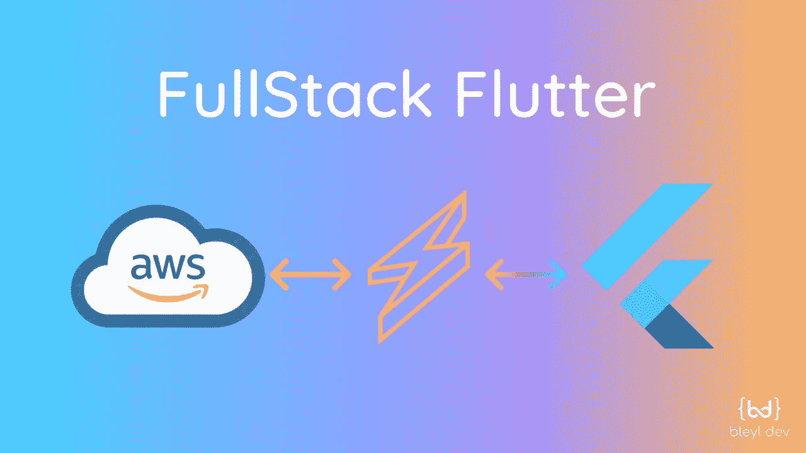
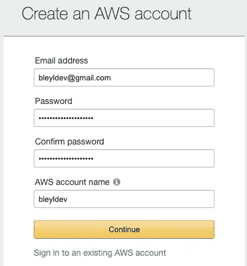
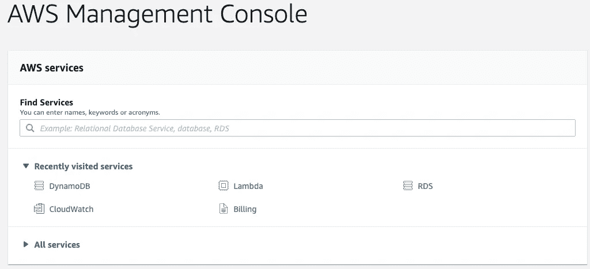
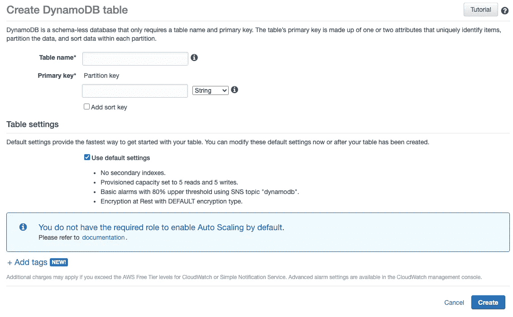
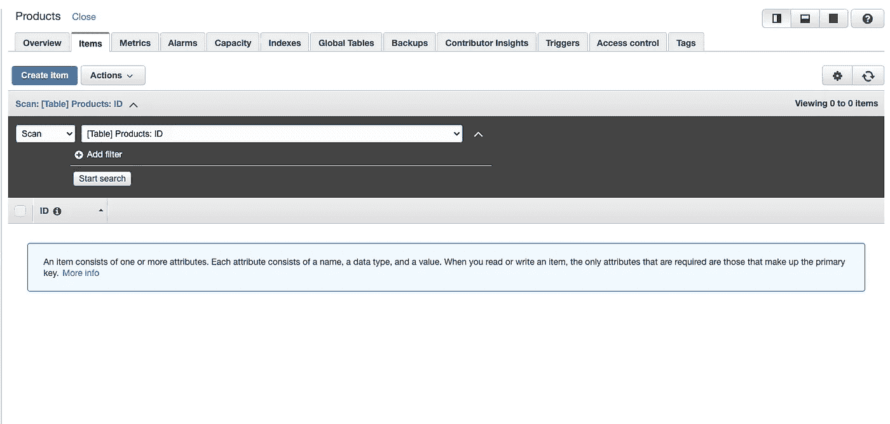
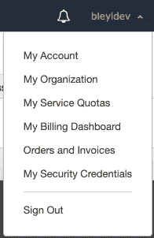
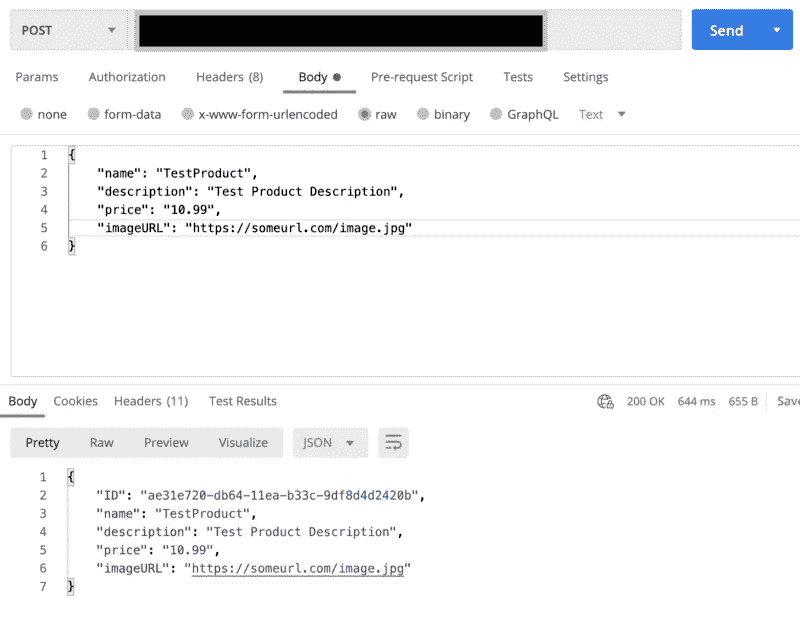
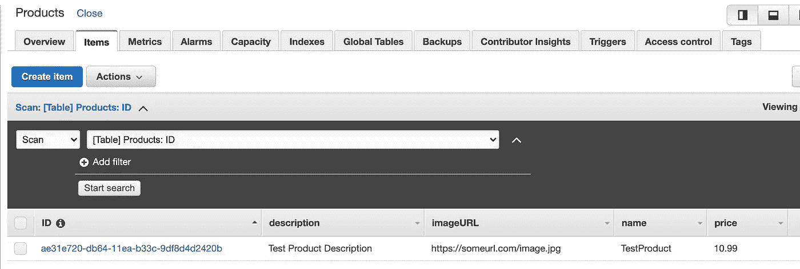
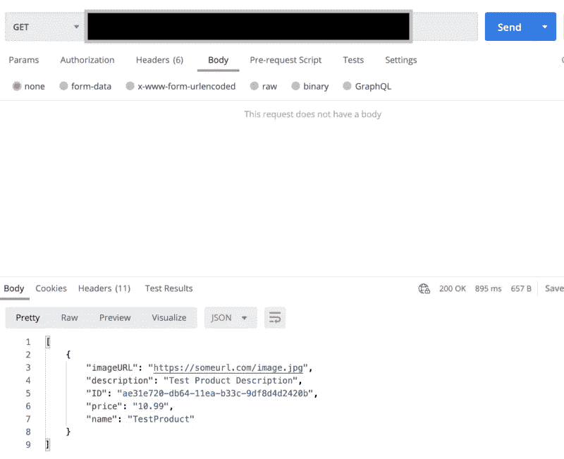
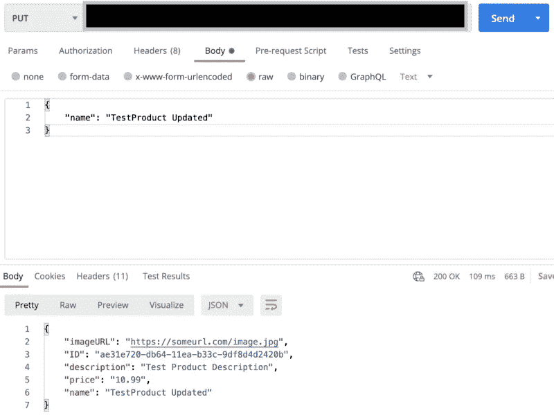

# 全栈抖动:用 AWS 和无服务器为你的应用创建后端

> 原文：<https://itnext.io/full-stack-flutter-creating-a-backend-for-your-app-with-aws-serverless-6ee11ae7bd89?source=collection_archive---------0----------------------->



AWS ->无服务器-> Flutter

作为一种如此受新开发人员欢迎的语言，许多使用 Flutter 的人甚至不知道如何或从哪里开始为他们的应用程序设置后端。有一些可用的解决方案，比如 Firebase，大多数 Flutter 开发人员都使用它，但是，我们将讨论一个更广泛使用的后端，AWS。更具体地说，我们将介绍如何通过 AWS(称为 DynamoDb)建立 NoSQL 数据库，使用 API Gateway & Serverless with Node 创建 API(您也可以使用 python)，以及在 Flutter 应用程序中处理 API 调用，以便对新创建的数据库执行 CRUD 操作。

希望到本文结束时，您将能够快速构建自己的数据库、连接到该数据库的 API 以及将这些 API 集成到您的应用程序中，这样您就可以在 Flutter 中为未来或当前的项目快速构建一个后端。通过 AWS 连接到 SQL 数据库可以遵循相同的过程，只需改变我们的 API 方法调用 DB 的方式。我将尝试从语言和数据库的角度介绍不同的选项，尽我所能地使用它们，并向您展示如何找到必要的资源来扩展本教程之外的功能。

**AWS 账户设置:**

如果您还没有帐户，[导航到 AWS](https://aws.amazon.com/) 并点击“创建帐户”。



按照要求填写所需信息。您需要输入付款信息。尽管如果您遵循本教程，您不会被收取任何费用，但是根据您想要存储的数据量以及您读取/写入 AWS 的频率，您将开始相应地产生费用。对于 AWS 的定价信息，你可以使用[这个定价计算器](https://calculator.aws/#/addService)来看看你最终会支付多少。

一旦您设置了您的帐户并登录，您应该会被重定向到一个仪表板屏幕，如下所示。



**数据库设置:**

首先，我们将通过 DynamoDB 建立一个 NoSQL 数据库。在“查找服务”搜索栏中输入“DynamoDB”。一旦你到达那里，点击“创建表格”。您应该会看到类似如下的屏幕:



对于我的表的名称，我将称之为“Products ”,并有一个名为“ID”的主键。点击“创建”。

恭喜你！您已经完成了数据库的设置！让我们简要回顾一下 DynamoDB 的布局，以及完成设置到底需要什么。



“项目”页面将是您最重要的选项卡。这将包含数据库的所有内容。如果您想手动添加数据，可以单击“创建项目”。但是，我们将为这个数据库设置 CRUD 操作，所以现在没有必要。

“概述”选项卡包含所有相关的数据库信息，其中最重要的是您的“ARN”标识符。我们将需要使用这个 API 来连接到我们的数据库。

**配置您的电脑:**

如果你还没有安装它，请确保将 AWS Cli 安装到你的计算机上:[https://docs . AWS . Amazon . com/Cli/latest/user guide/install-Cli v2 . html](https://docs.aws.amazon.com/cli/latest/userguide/install-cliv2.html)。

我们将需要配置我们的机器，以指向我们的新 AWS 帐户。为此，首先，转到您的 AWS 控制台。点击您的用户名->我的安全凭证。



接下来，您想要创建一个安全密钥并下载它。我们将使用该文件通过终端/命令提示符登录。标题为 rootkey.csv 的 excel 文件应该有两个值:AWSAccessKeyId 和 AWSSecretKey。

打开终端/命令提示符，输入命令

```
aws configure
```

输入在 rootkey.csv 文件中找到的 Id 和 SecretKey。当提示插入区域和输出格式时，只需单击 enter 并留空即可。它将为您设置为默认设置。

**无服务器:**

接下来，我们要为数据库设置 API。我们将通过无服务器实现这一点。为了节省大量时间，我们将使用 NodeJs 构建现有的模板 repo。

[](https://github.com/serverless/examples/tree/master/aws-node-rest-api-with-dynamodb) [## 无服务器/示例

### 这个例子演示了如何建立一个 RESTful Web 服务，允许你创建、列表、获取、更新和删除…

github.com](https://github.com/serverless/examples/tree/master/aws-node-rest-api-with-dynamodb) 

注意:您可能需要下载整个 repo，然后只需提取您想要使用的特定文件夹。在我们的例子中，我们希望使用**AWS-node-rest-API-with-dynamo db**代码库。

# 无服务器的优势:

通过无服务器完成所有工作的好处是，当我们最终部署我们的 API 时(我们将很快实现)，它将自动处理设置我们的 lambda 方法、设置 API 网关，并通过 AWS 处理 cors 所需的任何配置。或者，您可以在 AWS 中单独手动设置所有这些东西，但是这非常复杂，您可能会遇到许多问题。通过使用无服务器，我们可以在设置 API 时节省时间和精力。通过使用预定义的模板，我们可以重用大量代码，因为基本的 CRUD 操作已经为我们定义好了。

我们要修改的第一个文件是我们的 serverless.yaml 文件。我们需要确保为 DynamoDb 表插入我们的 ARN ID。

您会注意到在我们函数下面的底部有一个标记为“resources:”的部分。我们可以暂时移除它。出于本教程的目的，我们将创建没有很多配置的公共 API，并尽量保持结构简单，以便于理解。

接下来，我们想修改 yaml 文件的顶部，如下所示:

```
provider:
  name: aws
  runtime: nodejs10.x
  iamRoleStatements:
    - Effect: Allow
      Action:
        - dynamodb:Query
        - dynamodb:Scan
        - dynamodb:GetItem
        - dynamodb:PutItem
        - dynamodb:UpdateItem
        - dynamodb:DeleteItem
      Resource: "insertYourArnHere"
```

我们对这段代码做了一个简单的修改。我们用 dynamodb Overview 选项卡中的“ARN”替换了我们的资源标签。


我们接下来要检查我们的列表处理器方法。如果你看看我们 yaml 中的函数，你会看到一个列表:

```
list:
  handler: todos/list.list
  events:
    - http:
       path: todos
       method: get
       cors: true
```

要分解这些属性的含义，首先是我们的“处理程序”。这是我们的方法的路径，当我们的 API 端点被点击时将被调用。我们的“events”属性展示了端点路径(如“path”旁边所示)、它是什么类型的 API 方法(“method”属性)，以及我们针对该端点的“cors”策略(“cors”)。我们将让我们的 cors 保持“true ”,以允许所有可以访问我们端点的流量访问它。

我们的“list”方法已经完成了，但还是让我们看一看，这样您就可以理解调用该端点时发生了什么。

```
'use strict';
const AWS = require('aws-sdk');
const dynamoDb = new AWS.DynamoDB.DocumentClient();
const params = {
  TableName: "Products",
};module.exports.list = (event, context, callback) => {
  // fetch all todos from the database
  dynamoDb.scan(params, (error, result) => {
    // handle potential errors
    if (error) {
      console.error(error);
      callback(null, {
        statusCode: error.statusCode || 501,
        headers: { 'Content-Type': 'text/plain' },
        body: 'Couldn\'t fetch the todos.',
      });
      return;
    }
    // create a response
    const response = {
      statusCode: 200,
      body: JSON.stringify(result.Items),
    };
    callback(null, response);
  });
};
```

对于我们的每个方法，这将是我们正在设置的关键变量。Params 告诉我们想要从哪个表中读取数据，我们想要什么样的过滤器属性，我们想要返回什么样的特定列，等等。对于 list 方法，我们所关心的是获取表中的所有数据，所以我们只需要“TableName”属性集。如果您在 yaml 文件中将 product 表名设置为环境变量，那么您可以将其保留为默认值，否则，一定要像我上面所做的那样将其设置为您的表名。

**dynamoDb.scan:** 这个方法将扫描表中的所有数据。如果它在尝试提取数据时遇到任何问题或错误，它将命中我们的错误语句，并返回一个错误状态代码以及一条消息，说明它不成功。在这种情况下，它的工作，我们返回一个 200 响应与我们的数据。

**回调:**如果成功，我们的回调将返回 error if 语句或文件底部定义的响应。

# **创建**

我们需要的下一个关键端点是我们的 create 方法。我将修改它以适合我的例子，但是希望它足够清晰，你可以修改它以适合你的需要。唯一需要调整的是我们的 params 字段。我将对我的进行如下更改，以容纳我的表项。

```
const params = {
  TableName: "Products",
  Item: {
    ID: uuid.v1(),
    name: data.name,
    description: data.description,
    price: data.price,
    imageURL: data.imageURL
  },
};
```

就像在我们的 list 方法中一样，我们的 TableName 变量应该是我们想要插入新项的表的名称。我们还希望确保删除检查 data.text 是否为字符串的 if 语句。我们并不关心这个，因为我们没有传递任何名为 text 的变量。

回到我们的“params”，我们的“Item”将是我们想要插入到表中的整行的值。请确保在设置 DynamoDb 表时包含您所定义的主键。在我的例子中，我还想插入一个带有名称、描述、价格和 imageURL 的产品。“data.xyz”值应该是您将传递到 API 端点主体中的元素的名称。“数据”等于经过解析的主体对象。

恭喜，您现在已经设置了连接到 AWS DynamoDb 表的基本 API 端点！我们只剩下一步就可以利用我们设置的这些新端点了。在您的终端中，在该项目的根文件夹下运行以下命令:

```
npm install
sls deploy
```

sls 是用于无服务器的命令。如果您尚未在计算机上安装无服务器，请确保在“sls deploy”之前运行以下命令:

```
npm i serverless
```

您应该会看到一串黄色日志消息出现在您的终端中，2–5 分钟后，您应该会看到屏幕上显示了您新创建的端点。它们应该看起来像这样:

```
endpoints:
  POST - [https://endpoint/dev/todos](https://s8npb3n9a0.execute-api.us-east-1.amazonaws.com/dev/todos)
  GET - [https://endpoint/dev/todos](https://s8npb3n9a0.execute-api.us-east-1.amazonaws.com/dev/todos)
  GET - [https://endpoint/dev/todos/{id](https://s8npb3n9a0.execute-api.us-east-1.amazonaws.com/dev/todos/{id)}
  PUT - [https://endpoint/dev/todos/{id](https://s8npb3n9a0.execute-api.us-east-1.amazonaws.com/dev/todos/{id)}
  DELETE - [https://endpoint/dev/todos/{id](https://s8npb3n9a0.execute-api.us-east-1.amazonaws.com/dev/todos/{id)}
```

我们关心的端点是我们的“POST”端点以及我们的第一个“GET”端点，即以“/todos”结尾的端点。其他端点是我们还没有验证的，也没有修改来满足我们的需求。我们稍后会谈到这些。首先，我们想要测试我们的端点是否正常工作。为此，我们将使用名为“Postman”的应用程序。如果你还没有安装，你可以[在这里](https://www.postman.com/downloads/)安装，或者使用你选择的应用程序。



粘贴 create 方法的端点，并将类型设置为“POST”。在您的“主体”中，确保包含您在 create 方法中定义的所有字段。如果成功执行，您应该得到一个“200 OK”并看到创建的对象返回。如果我们在 AWS 上查看我们的表，我们会看到这个新值已经添加到我们的表中:



如果您得到了除“200 OK”响应之外的任何其他响应，您可以通过检查您在【https://console.aws.amazon.com/cloudwatch/home】->“日志组”->yourlambdamethodthat failed 找到的 API 日志来调试出了什么问题，并从那里进行调试。

现在我们已经测试了我们的创建方法，让我们测试一下，以确保我们的 list 方法也能工作。



我们的响应应该看起来像上面看到的项目数组。

现在我们已经测试并确认了我们的方法正在工作，我们将再做一个方法改变，我们的“更新”方法。

回到我们的项目，我们可以让我们的 serverless.yaml 文件保持原样，直接进入我们的 update.js 文件。

```
const params = {
  TableName: "Products",
  Key: {
    ID: event.pathParameters.id,
  },
  ExpressionAttributeNames: {
    '#name': 'name',
  },
  ExpressionAttributeValues: {
    ':name': data.name,
  },
  UpdateExpression: 'SET #name = :name',
  ReturnValues: 'ALL_NEW',
};
```

在删除了检查 data.text 是否为字符串值的 if 语句之后，我们只需要修改 update 方法中的参数，就可以得到我们想要的结果。在更新值时，我们需要设置一些属性。首先，和我们所有的 param 变量一样，我们需要确保传递我们想要更新的表的名称。

“Key”:这将是我们想要更新的值的 ID(我们的主键)。我们希望将通过端点传递的 id 值传递给它(这是更新端点的/{id}部分)。为了访问这个值，我们称之为“event.pathParameters.id”值。

“ExpressionAttributeNames”:这将设置我们想要更新的列的名称。

“ExpressionAttributeValues”:这将设置我们想要更新的列的值。

“UpdateExpression”:这是我们将想要更新的列名与值进行匹配的地方。您可能会认为可以写出完整的 UpdateExpression，而不是编写所有这些变量名来表示值，但是 DynamoDb UpdateExpressions 不允许这样做。您还需要设置 ExpressionAttributeNames 和 ExpressionAttributeValues。

完成后，只需运行:

```
sls deploy
```

再次，你现在可以使用你的更新方法。下面是我们测试 Postman 时它的样子:



正如您在上面看到的，我们传递了我们想要更改的值的 ID 以及我们想要更新的变量(需要匹配我们的方法),它将返回更新后的对象。

好了，我们已经 1)建立了数据库，2)建立了 API 方法。剩下的唯一事情就是把我们的 Flutter 应用程序连接到我们的 API 上！

# **颤振:**

出于我们的 flutter 应用程序的目的，我们将需要设置几个 API 方法。我将把这些方法放在名为“net”的文件夹下的单独文件中。

在我们写出我们的方法之前，我们需要导入包:http。https://pub.dev/packages/http/install

添加依赖项:

```
**dependencies**:
  **http**: ^0.12.2
```

接下来我们要做的是建立一个模型类来处理数据的读取。

**产品.飞镖:**

```
**class** Product {
  **final** String **name**;
  **final** String **description**;
  **final** String **price**;
  **final** String **imageURL**;

  **const** Product({
    **this**.**name**,
    **this**.**description**,
    **this**.**price**,
    **this**.**imageURL**,
  });

  **factory** Product.fromJson(Map<String, **dynamic**> json) {
    **return** Product(
      name: json[**'name'**].toString(),
      description: json[**'description'**].toString(),
      price: json[**'price'**].toString(),
      imageURL: json[**'imageURL'**].toString(),
    );
  }
}
```

在我的例子中，表中的每个产品都有 4 个不同的值:名称、描述、价格和 imageURL。您希望确保添加的类的重要部分是“factory Product.fromJson(){}…”方法，以便我们可以轻松地将响应对象转换为我们的类结构。

接下来，我们将为“list”端点创建未来的方法。

**get_list.dart:**

```
**import 'dart:convert'**;
**import 'package:projectPath/model/product.dart'**;
**import 'package:http/http.dart' as** http;

Future<List<Product>> getProducts() **async** {
  **var** url =
      **"https://endpointHere/dev/todos"**;
  **return** http.get(url).then((http.Response response) {
    **final** int statusCode = response.**statusCode**;
    **if** (statusCode == 200) {
      **final** temp = json.decode(response.**body**);
      List<Product> data = [];
      **for** (**var** item **in** temp) {
        Product temp_product = Product.fromJson(item);
        data.add(temp_product);
      }
      **return** data;
    }
    **if** (statusCode < 200 || statusCode > 400 || json == **null**) {
      **throw new** Exception(**"Error while fetching data"**);
    }
    **return null**;
  });
}
```

对于这个方法，我们将返回一种类型的:

```
List<Product>
```

使用我们新创建的产品类和我们导入的 http 包，我们将通过使用:

```
http.get(url).then((http.Response response){}
```

“response”将是我们的 JSON 格式的结果。剩下唯一要做的事情就是使用我们创建的 fromJson 方法将它解析到我们的 Product 类结构中:

```
**final** temp = json.decode(response.**body**);
List<Product> data = [];
**for** (**var** item **in** temp) {
  Product temp_product = Product.fromJson(item);
  data.add(temp_product);
}
```

这段代码将遍历我们的响应体，并为列表中的每个值创建一个产品对象。一旦我们将它解析成一个产品，我们将把它添加到我们的列表中，然后在我们遍历了全身响应后返回那个列表。

**create_item.dart:**

```
**import 'package:projectPath/model/product.dart'**;
**import 'package:http/http.dart' as** http;

Future<**void**> createItem(Product product) **async** {
  **var** url = **"https://yourAPIEndpointHere/dev/todos"**;
  **return** http
      .post(url,
          body: **"{"** +
              **"\"name\": \"**${product.**name**}**\", \"description\": \"**${product.**description**}**\", \"price\": \"**${product.**price**}**\", \"imageURL\": \"**${product.**imageURL**}**\" }"**)
      .then((http.Response response) {
    **final** int statusCode = response.**statusCode**;
    **if** (statusCode == 200) {
      **return**;
    } **else** {
      **throw new** Exception(**"Error while fetching data"**);
    }
  });
}
```

为了创建一个新的项目，我们将使用我们的 POST 端点，向它传递 4 个变量:名称、描述、价格和 imageURL。

如上所述，我们使用 http.post()方法来调用端点，并向其传递一个 body 对象。在上面的例子中，我将值硬编码成 JSON 格式，以便 API 进行解析，但是您也可以创建一个模型方法，只需将您的对象转换成 JSON 对象，然后可以作为主体参数传递。

我们不关心这个端点的响应，只关心 statusCode 值。只要 statusCode 等于 200，我们就知道它成功了。

**update_item.dart:**

```
**import 'package:http/http.dart' as** http;

Future<**void**> updateName(String ID, String newName) **async** {
  **var** url =
      **"https://endpoint/dev/todos/**$ID**"**;
  **return** http
      .put(url, body: **"{"** + **"\"name\": \"**$newName**\" }"**)
      .then((http.Response response) {
    **final** int statusCode = response.**statusCode**;
    print(response);
    print(statusCode);
    **if** (statusCode == 200) {
      print(**"Success"**);
      **return**;
    }**else**{
      **throw new** Exception(**"Error while fetching data"**);
    }
  });
}
```

对于我们的更新端点，我们将从我们的 create 方法中改变 2 件事。我们首先要确保我们使用的是 PUT 方法调用，而不是 POST。其次，我们希望确保将我们的项目 ID 传递到我们的端点，而不是我们的主体。为此，我们只需将 URL 格式化如下:

```
var url = "https://endpoint/dev/todos/$VariableHere
```

仅此而已。我们只关心响应中的 statusCode，因此我们相应地编写 if、else 语句来检查返回值。

我们完了。我们现在已经创建了调用 3 个新 API 端点的方法！

# **重述:**

来覆盖我们所做的:

*   我们建立了一个新的 AWS 账户
*   我们在 AWS 中建立了一个 DynamoDb 表
*   我们配置我们的机器通过 AWS Cli 包连接到 AWS。
*   我们用 Node 建立了我们的无服务器项目，通过 lambda 和 API Gateway 在 AWS 上创建 API 端点&学习了如何用 CloudWatch 监控这些 API。
*   我们在 Flutter 项目中设置了一个模型类来处理存储在 DynamoDb 中的对象。
*   我们设置了未来的方法来处理我们拥有的每种类型的 API 调用:GET、PUT、POST。

就这样，你现在是一个全栈开发者了！您可以使用这个设置，并从它扩展到将来需要使用 AWS 中的数据库结构的项目。如果您想使用 Postgres 或 SQL，您可以保持大部分无服务器设置不变，但只需稍微修改您的方法来调用不同的数据库结构，并且您的前端 dart 代码也可以保持不变。如果您希望在无服务器中使用 Python 而不是 Node，您可以在无服务器 Repo 中找到使用相同设置的其他模板，但是使用 Python 而不是 Node:

[](https://github.com/serverless/examples) [## 无服务器/示例

### 一组随时可部署的无服务器框架服务。单击展开如果您不熟悉无服务器，我们…

github.com](https://github.com/serverless/examples) 

有关如何查询 DynamoDb 表的更多资源，请参见以下 AWS 文档:

 [## Node.js 和 DynamoDB 入门

### 在本教程中，您将使用 AWS SDK for JavaScript 编写简单的应用程序来执行以下 Amazon…

docs.aws.amazon.com](https://docs.aws.amazon.com/amazondynamodb/latest/developerguide/GettingStarted.NodeJs.html) 

要获得更多每周的精彩内容，请务必在所有社交网站(媒体、Youtube、Twitter、Instagram、脸书)上关注 [BleylDev](https://medium.com/u/1b72487e1a47?source=post_page-----6ee11ae7bd89--------------------------------) 。如果你有一个特殊的问题或话题想得到帮助，请随时联系我们。如果你觉得这篇文章有用，一定要留下一些掌声(你知道你可以为每篇文章鼓掌 50 次吗？试试吧！).