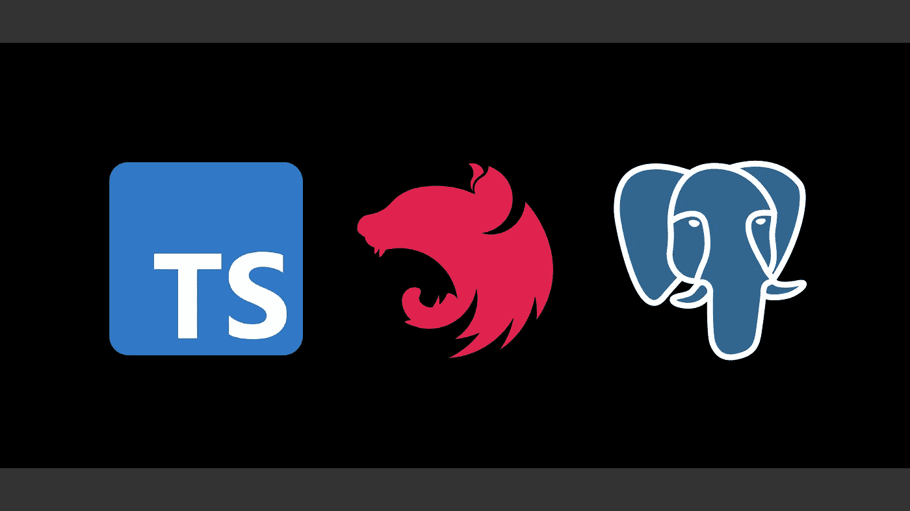

# 带 TS / Nest / Postgres 的全栈

> 原文：<https://itnext.io/full-stack-with-ts-nest-postgres-e684b464dbc5?source=collection_archive---------2----------------------->

## 用 TS、Nest 和 PostgreSQL 实现一个简单的 web 应用程序

TypeScript、NestJS 和 PostgreSQL 徽标

## 介绍

在本文中，我们将研究使用 [TypeScript](https://www.typescriptlang.org/) 、 [NestJS](https://nestjs.com/) 和 [PostgreSQL](https://www.postgresql.org/) 构建一个非常简单的 web 应用程序的过程。这个干净有效的堆栈既轻便又强大，允许快速和持久的 web 应用程序的快速原型化。

有关该项目的源代码副本，请参见[本报告](https://github.com/kenreilly/ts-nest-postgres-example)。

## 概观

这个示例包含一个 Nest 应用程序，它提供一个简单的前端，该前端由 HTML 和 TypeScript 以及一个由 PostgreSQL DB 支持的 API 构建。可以使用任何前端框架，但是出于示例目的，为了简单起见，选择了 vanilla TS。

NestJS 提供了一组广泛的特性，对于构建强大的 web 应用程序、微服务等非常有用。这个应用程序使用`serve-static`、`pg`和`config`库来服务静态资产、连接到数据库和配置环境变量。

要构建和运行这样一个应用，一定要为你的操作系统和环境安装 [NestJS](https://docs.nestjs.com/#installation) 和 [PostgreSQL](https://www.postgresql.org/download/) 。

## 数据库模式

数据库模式在 **db/schema.sql:** 中定义

一个简单的`items`表格由`id`、`name`、`description`和`create_timestamp`字段定义。

## 应用入口点

主应用文件是 **src/main.ts:**

NestFactory 创建了 AppModule 的一个实例，并设置了全局前缀`service`，它将作为 API 的基本 URL。然后，应用程序监听端口 3000(在生产中应该使用环境变量)。

## 应用模块

应用模块包含在 **src/app.module.ts** 中:

模块定义了分别导入其他模块、控制器和服务的`imports`、`controllers`和`providers`。ServeStaticModule 用于为除`/services.`以外的任何路径提供静态资产，ConfigModule 加载将在应用程序的其余部分中使用的环境变量。

## 应用控制器

app 控制器文件是`src/app.controller.ts:`

控制器向应用程序的其余部分公开功能，并为 API 定义端点。为这个简单应用程序定义的两个端点是`add-item`和`get-items`。

`add-item`路由使用 NewItemDto 作为[数据传输对象](https://gist.github.com/kenreilly/19d600bde0b7ad57bb07a866b4bf88f2)定义，它将强制验证传入请求对象上预期的参数。该类在**src/dto/new-item . dto . ts:**中定义

## 应用服务

应用支持服务在 **src/app.service.ts:** 中定义

这个类处理应用程序的底层操作，特别是控制器向 API 公开的两个方法。对底层 DB 服务的数据库查询(我们将很快对此进行研究)被包装在 Promise 对象中，以允许处理异步查询操作。

## 数据库ˌ资料库

数据库模块和服务在`src/db/db.module.ts`和`src/db/db.service.ts:`中定义

数据库服务使用数据库连接字符串创建到 PostgreSQL 数据库的客户端连接。`query`方法接受一个 SQL 字符串和一个值数组，并返回一个包装数据库响应的`Promise`对象。

## 应用程序前端

UI 是用 HTML、CSS 和普通类型脚本构建的。为了清楚起见，省略了 HTML 和 CSS(它们在项目 repo 中可用)。app 前端的核心是 **web/ts/app.ts** :

当加载 UI 时，输入被初始化，并且调用 load_items 从数据库中检索当前的项目列表，并在屏幕上呈现它们。

当创建一个新条目时，从输入字段中检索数据并提交给 API 以插入到 DB 中。

## 摘要

这个简单的应用程序展示了设置一个基本的全栈 web 应用程序有多简单，包括静态 UI、REST API 和后台数据库。所使用的技术都是高质量的，并且将简单性与性能和耐用性结合起来，以允许相对容易地开发非常健壮的应用程序。

感谢您的阅读，祝您的下一个项目好运！