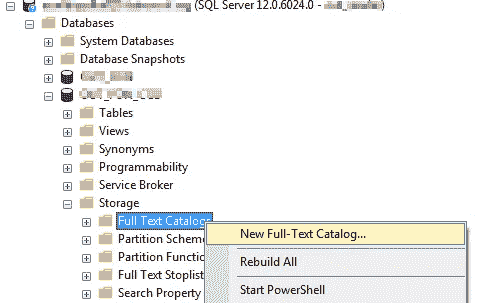
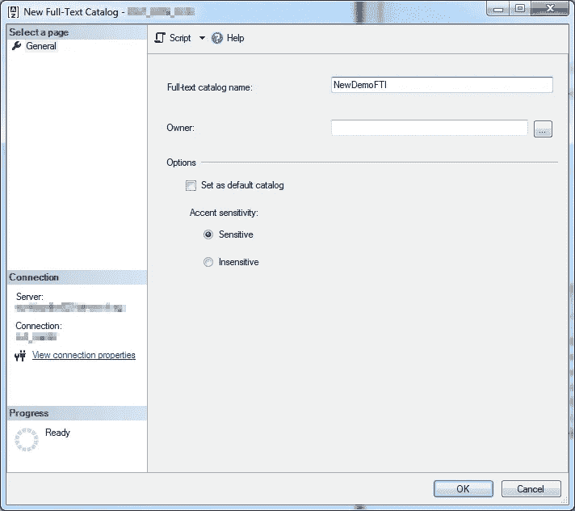
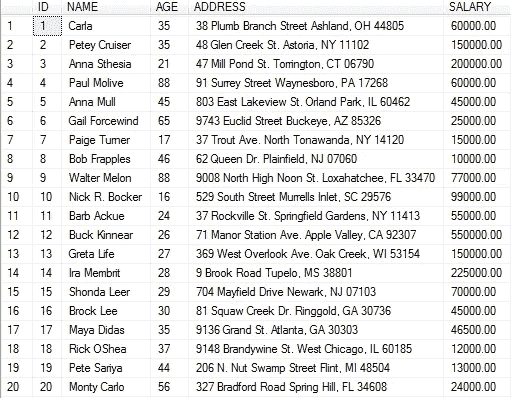
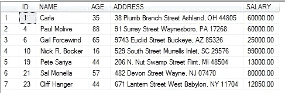
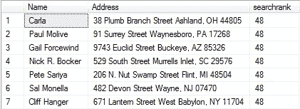
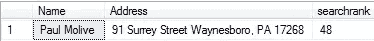

# 全文搜索—如何在 SQL Server(和外部系统)中安装、配置和使用它

> 原文：<https://itnext.io/full-text-search-how-to-install-configure-and-use-it-with-sql-server-and-outsystems-23fcf316e870?source=collection_archive---------1----------------------->

在我的一个项目中，我们必须从外部系统的 web 应用程序中获取大量数据并搜索文本数据。当时我知道 Elasticsearch，但不幸的是客户端没有它，所以我唯一可用的选择是从 SQL Server 开始使用全文搜索。

*注意:我只触及了 SQL Server 全文搜索的皮毛。我想在这里为您提供能够使用全文搜索的基础知识。*

**什么是全文搜索**

SQL Server 中的全文搜索允许用户和应用程序对 SQL Server 表中基于字符的数据运行全文查询。全文查询可以包括简单的单词和短语，也可以包括单词或短语的多种形式。[阅读更多](https://docs.microsoft.com/en-us/sql/relational-databases/search/full-text-search?view=sql-server-2017)

**我为什么使用全文搜索？**

获取搜索的表有大约 400 万条记录(并且还在增加！)带有多个大的文本列。查询这些数据非常慢。如果我们使用 LIKE 操作符进行查询，结果会更糟，导致超时。

> 将列添加到全文索引后，用户和应用程序可以对列中的文本运行全文查询。这些查询可以搜索以下任何内容:
> 
> 一个或多个特定单词或短语(*简单术语*)
> 
> 以指定文本(*前缀术语*)开头的单词或短语
> 
> 特定单词的屈折形式(*代名词*
> 
> 与另一个词或短语接近的词或短语(*接近术语*)
> 
> 特定单词的同义形式(*同义词库*)
> 
> 使用加权值的单词或短语(*加权术语*

**SQL LIKE 运算符的问题**

> 与全文搜索相比， [LIKE](https://docs.microsoft.com/en-us/sql/t-sql/language-elements/like-transact-sql?view=sql-server-2017) Transact-SQL 谓词只对字符模式有效。针对大量非结构化文本数据的 LIKE 查询比针对相同数据的等效全文查询要慢得多。对数百万行文本数据的 LIKE 查询可能需要几分钟才能返回结果；而对相同的数据进行全文查询只需要几秒钟甚至更短的时间。

数据库索引用于在查找 WHERE 子句中定义的内容时提高性能。然而，在过滤某些文本时，例如，使用类似以下的内容:

```
WHERE TextColumn LIKE ‘%string%’
```

那么搜索就会很慢，因为数据库索引的工作方式是针对匹配一列的全部内容而不是一部分内容进行优化的。具体来说，包含通配符的 LIKE 搜索不能使用任何类型的索引。

**如何开始使用 SQL 全文搜索**

因此，在查询中使用全文搜索似乎会大大提高执行速度。那你需要从什么开始呢？

在对表运行全文查询之前，数据库管理员必须对表创建全文索引。[阅读更多](https://docs.microsoft.com/en-us/sql/t-sql/statements/create-fulltext-catalog-transact-sql?view=sql-server-2017)

**安装全文搜索**

默认情况下，不会安装 SQL Server 2008 的全文搜索功能，因为它是数据库引擎的可选组件。在 SQL Server 2008 安装过程中，数据库管理员需要选择全文搜索。[阅读更多](https://www.outsystems.com/forums/discussion/8934/how-to-install-configure-and-use-full-text-search/)

**为全文搜索配置数据库**

*   **创建全文目录**

连接到 SQL Server 2008 实例，并展开“数据库”节点>您的数据库名称>存储。



右键单击全文目录，然后从下拉列表中选择新建全文目录。



*   **创建全文索引**

现在我们已经准备好了目录，下一步是创建全文索引。在本例中，我们将在 Customers 表上创建一个全文索引。

转到新建全文目录的属性，选择你想要的表的"全文索引"。(*注意:该表必须有唯一索引。*)然后选择要索引的列。


我们现在准备开始在 Customers 表中执行一些全文查询，该表现在是全文索引的。

**现在怎么办？我们来做一些查询吧！**

我将在下面的例子中使用，用**(*一个或多个特定的单词或短语)进行查询。还可以查看参考文献，查看*前缀术语、生成术语、邻近术语、同义词库*或*加权*术语。*

*给定我们的客户表:*

**

*根据你的目标，有可能从比赛中提取排名分数。*

*让我们在 Customers 表的 Address 列中搜索单词“street”。*

*   ***没有排名***

```
*select *
from customers
where contains(customers.Address,'street')*
```

**

*它查找地址中包含“街道”一词的所有客户。*

*   ***同排名得分***

```
*select customers.Name, customers.Address, key_search.rank
from customers
INNER JOIN CONTAINSTABLE(customers,(Address),’street’) AS key_search on customers.Id = key_search.[Key]*
```

**

*在这个示例中，我使用了全文 CONTAINSTABLE，它查看一个表中的一列(或多列)并找到单词“street”。*

*当搜索中有不止一个单词，并且您想按排名分数排序时，这可能非常有用。*

*现在，如果您想要搜索包含单词“street”的地址，并且它位于州“PA”。然后我们需要用 AND's 或 OR's 来打破字符串，并按排名排序:*

```
*select customers.Name, customers.Address, key_search.rank as searchrank
FROM CUSTOMERS
INNER JOIN CONTAINSTABLE(customers,(address),'"street" and "PA"') AS key_search on customers.Id = key_search.[Key]
order by searchrank desc*
```

**

*全文查询使用一小组 Transact-SQL 谓词(CONTAINS 和 FREETEXT)和函数(CONTAINSTABLE 和 FREETEXTTABLE)。你必须使用更适合你的。*

***结论***

*如果您想在字符串中搜索一个或多个单词，现在可以利用全文搜索。唯一剩下的就是谈论结果了。在重构应用程序查询以使用全文搜索后，每个查询的平均性能显著提高了！根据我的经验，有些查询会在几秒钟内产生结果。*

***Outsystems 和 SQL 全文搜索***

*现在，等待的问题是:这如何适应外部系统？*

*SQL 全文搜索和 Outsystems 的不太好的地方是，您仍然需要开发高级查询，并且不能在聚合中这样做。所以，是时候对 T-SQL 进行一些投资和学习了(它将帮助您在未来更好地理解数据，甚至做出最佳的聚合！)*

*好的一面是，您不需要向外部系统添加任何新的东西(当然除了查询)。既然是数据库级别的，就可以用了！*