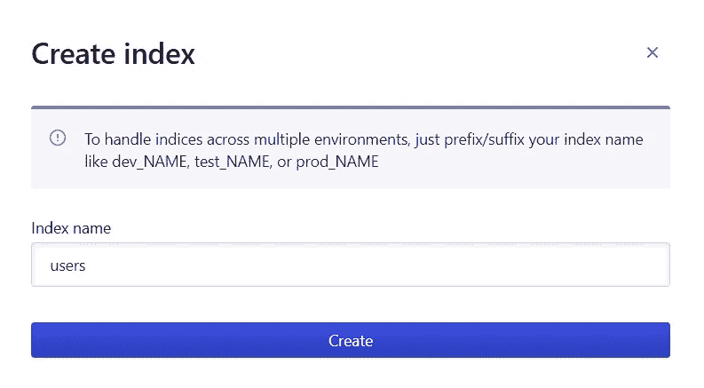
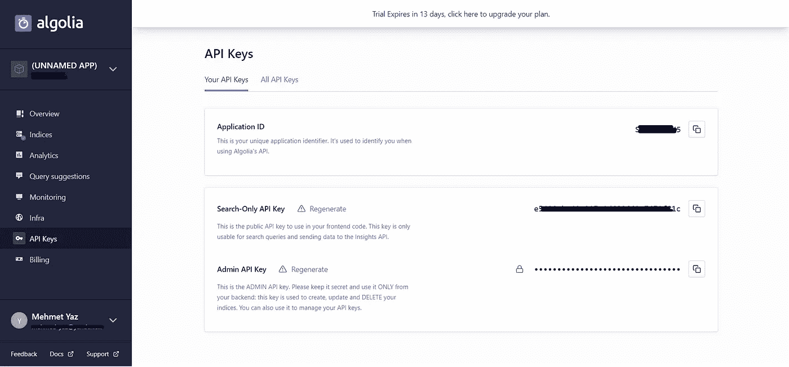
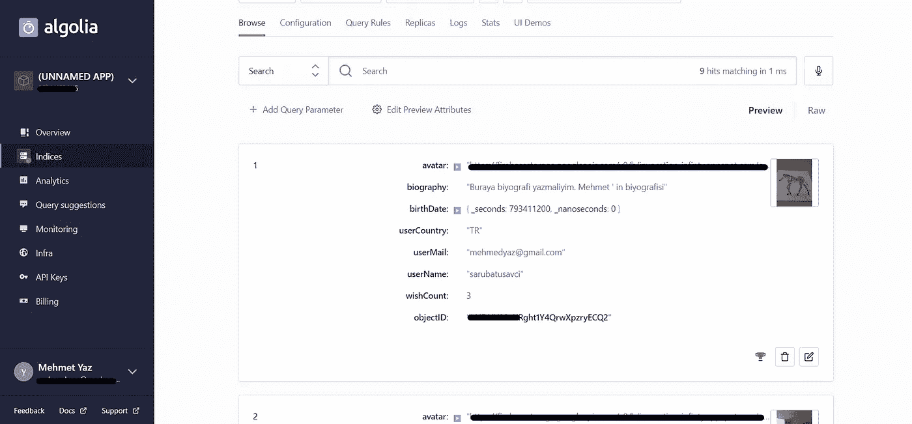
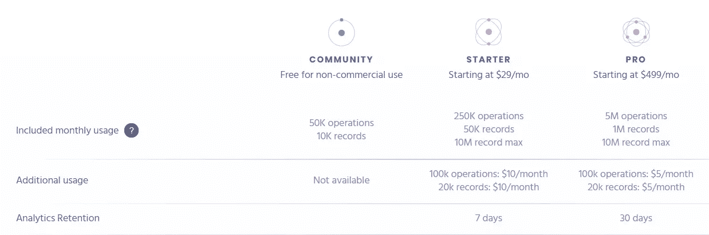
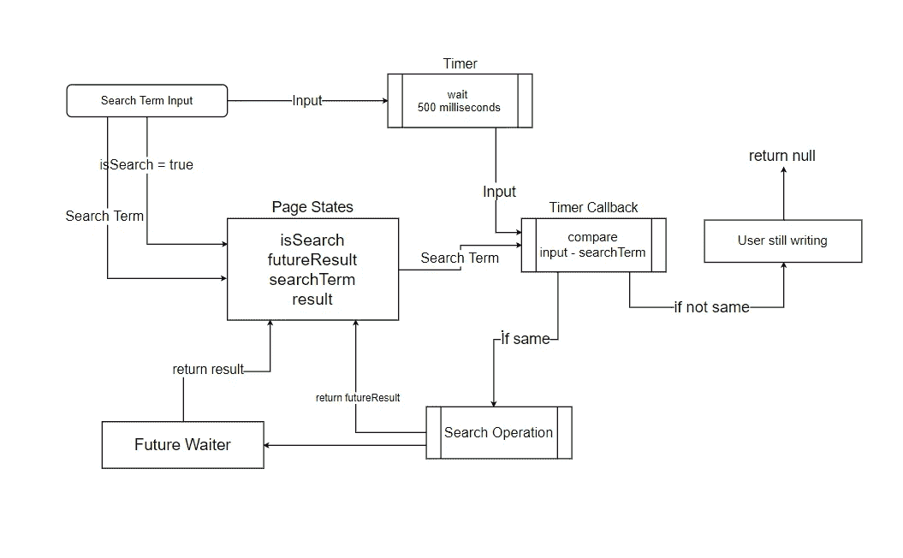
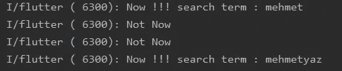

# 在 Flutter 中使用 Algolia、Firestore、云函数和优化进行全文搜索。

> 原文：<https://itnext.io/full-text-search-in-flutter-with-algolia-firestore-cloud-functions-with-optimization-54004d727ad1?source=collection_archive---------1----------------------->


许多移动应用程序都需要搜索功能。如果你用 like Firebase 服务做数据库和后台，你可以用查询操作搜索任何文档。在这种情况下，您可以为每个集合和每个不同的查询编写许多代码。而且您会因为切换单词相似性而进行过多的查询操作或读取集合中的所有文档。

Firebase 在其文档中推荐 Algolia 进行全文搜索。

我会告诉你如何在颤振，而不是专业，快速，并尽可能清楚地告诉你。我也给你一些优化技巧。

我不会重复“如何在 Flutter 中读写 Firestore？”“我如何设置云功能？”等。因为有许多指导性文件。

1) **你需要一个 algolia 账户。https://www.algolia.com/**T2

2 ) **在 Algolia 仪表盘中创建 Algolia 指数**。在这个例子中，我创建了一个**“users”**索引。



3) **通过触发功能从 Firestore 向 Algolia** 发送数据。



你的钥匙

3.1) **Algolia 储物类型**

Algolia 搜索所有字段。例如，你不希望"电子邮件"被包括在结果中，你可以在记录操作时删除。如果您想输入相关单词并影响结果，您可以将它们记录在数组中。

{
《阿凡达》: [https://](https://firebasestorage.googleapis.com/v0/b/invocation-infinty.appspot.com/o/userProfile%2FoHDHV92vXRght1Y4QrwXpzryECQ2%2Fprofile.jpg?alt=media&token=1b89f4a8-43e0-454f-8132-50b5c426acad) ……”、
"userCountry": "TR "、
" user mail ":"[mehmedyaz@gmail.com](mailto:mehmedyaz@gmail.com)"、
"userName": "sarubatusavci "、
"relevantWords": ["mehmet "、"…"]、
" objectID ":" ohd HV 92 vxrght 1y 4 qrwxpzryecq 2 "
}

**objectID 是重要且必要的**

**3.2)初始化 index.js 中的常量**

```
const ALGOLIA_ID = "SF...."; //ApplicationID
const ALGOLIA_ADMIN_KEY = "4e8ba...."; //Admin API Key
const ALGOLIA_USER_INDEX = 'users'; //Your index name
const algoliaClient = algoliasearch(ALGOLIA_ID, ALGOLIA_ADMIN_KEY);
```

**3.3)触发函数和初始化 algolia 客户端。**

```
***exports***.setAlogliaApp = functions.firestore
    .document("users/{userID}")
    .onWrite((change, context) => {
        //init algolia client
        const index = algoliaClient.initIndex(ALGOLIA_USER_INDEX);
        .....
        .....
        return null;
    });
```

我的函数触发了“users/{userID}”文档中的所有更改。我需要在阿尔戈利亚只有“用户名”和“头像”领域的存储记录。

所以我的功能必须被触发；

**3.3.1)“用户帐户创建时”**

```
if (!change.before.exists && change.after.exists) {
            const user = change.after.data();
            user.objectID = change.after.id;
            index.saveObject(user);
        }
```

**3.3.2)“用户名或头像更改时”**

```
else if (change.before.exists && change.after.exists) {
            if (
                //ConditionBlockStart
                (change.before.data().userName !== change.after.data().userName)
                ||
                (change.before.data().avatar !== change.after.data().avatar)
                //ConditionBlockEnd
            ) {
                const user = change.after.data();
                user.objectID = change.after.id;
                //update - create record operation are same.
                index.saveObject(user);
            }
```

**3.3.3)“当用户帐户被删除时”**

```
else if (change.before.exists && !change.after.exists) {
            index.deleteObject(change.before.id);
        }
```

**现在记录操作成功了！**



**4)在颤振中执行搜索**

**4.1)依赖关系**

```
//add dependencies in pubspec.yamldependencies:
  flutter:
    sdk: flutter
  algolia: ^0.1.7
```

**4.2)初始化**

```
class AlgoliaApplication{
  static final Algolia *algolia* = Algolia.init(
    applicationId: 'SF.....', //ApplicationID
    apiKey: 'e5....', //search-only api key in flutter code
  );
}
```

**4)搜索操作和类型**

```
final Algolia _algolia = AlgoliaApplication.*algolia*;AlgoliaQuery query = _algolia.instance.index("users").search(input);AlgoliaQuerySnapshot querySnap = await query.getObjects();List<AlgoliaObjectSnapshot> results = querySnap.hints;AlgoliaObjectSnapshot object = results.first; //example firstString objectID = object.objectID;Map<String, dynamic> objectData = object.data;String userName = objectData["userName"];
int someInt = objectData["someNumber"];
```

你可以在任何地方输入并放置一个搜索按钮，当用户按下按钮时，你可以开始搜索操作并在未来的 Builder 和 ListView 或 GridView 或 SliverList 等中显示你的搜索。

但是:如果你想在没有搜索按钮的情况下开始操作(比如我的视频)，你可以启动 operation TextField > onChange(val)函数。

！！在这种情况下，操作次数会增加。因为每个字母有一个操作。所以会产生不必要的成本。



**5)求解(优化):**

您需要有关“用户写更多”或“用户写并等待结果”的状态信息

我的图表:



**5.1)创建搜索页面**

```
import 'dart:async';
import 'package:algolia/algolia.dart';

class SearchPage extends StatefulWidget { const SearchPage({Key key, this.analytics, this.user}) : super(key: key);
  @override
  _SearchPageState createState() => _SearchPageState();
}

class _SearchPageState extends State<SearchPage> {
  final GlobalKey<ScaffoldState> _searchPageState = GlobalKey<ScaffoldState>();

  final Algolia _algol = AlgoliaApplication.*algolia*;
  String _searchTerm;
  bool _isSearch; Future<List<AlgoliaObjectSnapshot>> _futureResults;
  List<AlgoliaObjectSnapshot> _results = List<AlgoliaObjectSnapshot();

  @override
  void initState() {
    _isSearch = false;
    super.initState();
  }

  @override
  void dispose() {
    super.dispose();
  }

  @override
  Widget build(BuildContext context) {
    return .... ;
  }
}
```

**5.2)搜索操作**

```
Future<List<AlgoliaObjectSnapshot>> _operation(String input) async {
  List<AlgoliaObjectSnapshot> results = new List<AlgoliaObjectSnapshot>();
  AlgoliaQuery query = _algol.instance.index("users").search(input);
  AlgoliaQuerySnapshot snap = await query.getObjects();
  results = snap.hits;
  return results;
}
```

**5.3)带定时器的搜索操作功能，**

```
_searchResultOperation(String input) {
  if (input.length > 0) {
    Duration duration = Duration(milliseconds: 500);
    Timer(duration, () {
      if (input == _searchTerm) {
        // input hasn't changed in the last 500 milliseconds..
        // you can start search print('Now !!! search term : ' + _searchTerm);
        if (_isSearch) {
          Future<List<AlgoliaObjectSnapshot>> searchRes =
              _operation(_searchTerm); //SEARCH OPERATION
          setState(() {
            _futureResults = searchRes;
          });
          _setResult(_futureResults);
        }
      } else {
        //wait.. Because user still writing.. print('Not Now');
      }
    });
  }
}
```



我们没有为“买买提”和“买买提”进行操作

**5.4)未来服务员**

也可以在“_searchResultOperation”中设置结果。

```
_setResult(Future<List<AlgoliaObjectSnapshot>> objects) async {
  List<AlgoliaObjectSnapshot> snapshot = await objects;
  setState(() {
    _results = snapshot;
  });
}
```

**5.5)搜索词输入**

```
Color secondary = Theme.*of*(context).primaryColorDark;return Scaffold(
      key: _searchPageState,
      backgroundColor: primary,
      appBar: AppBar(
        automaticallyImplyLeading: false,
        title: TextField(
          decoration: InputDecoration(
              border: InputBorder.*none*,
              hintText: "Search...",
              hintStyle: TextStyle(color: secondary.withAlpha(50))),
          onChanged: (val) {
            setState(() {
              if (val.length > 2) {
                _isSearch = true;
                _searchTerm = val;
                _searchResultOperation(val);
              } else {
                _isSearch = false;
              }
            });
          },
        ),
      ), .
      . floatingActionButton: FloatingActionButton(
        onPressed: () {
          Navigator.*pop*(context);
        },
        child: Icon(Icons.*arrow_back*),
      ),
    );
```

**5.6)显示结果**

```
@override
Widget build(BuildContext context) {
  Color secondary = Theme.*of*(context).primaryColorDark;
  return Scaffold(
    key: _searchPageState,
    backgroundColor: primary,
    appBar: AppBar(...),
    body: SafeArea(
      child: _isSearch && _results.length > 0
          ? ListView.builder(
              itemCount: _results.length,
              itemBuilder: (context, i) {
                return ListTile(
                  onTap: () {
                    onTapAction(_results[i].objectID);
                  },
                  title: Text(
                    _results[i].data['userName'],
                    style: TextStyle(color: secondary),
                  ),
                  leading: CircleAvatar(
                    backgroundImage: _results[i].data['avatar'] == null
                        ? AssetImage("assets/default_profile.jpg")
                        : NetworkImage(_results[i].data['avatar']),
                  ),
                );
              })
          : Center(
              child: Text(
                "Please enter terms for searh users...",
                style: TextStyle(color: secondary),
              ),
            ),
    ),
    floatingActionButton: FloatingActionButton(
      onPressed: () {
        Navigator.*pop*(context);
      },
      child: Icon(Icons.*arrow_back*),
    ),
  );
}
```

**关闭**

我是一名新开发人员(6 个月)，英语水平较低。

因此，我很抱歉由于错误。

好好工作！