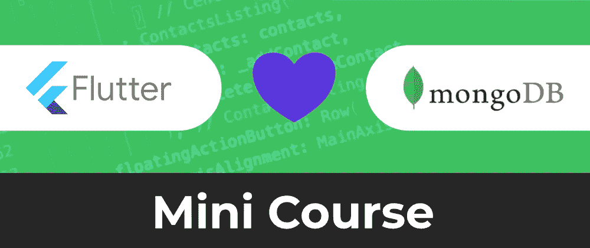
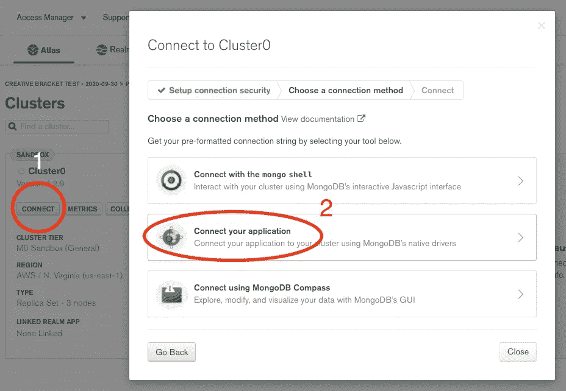
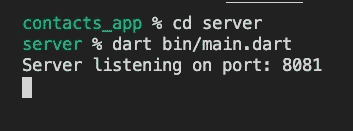

# Fullstack Flutter 和 MongoDB Cloud 迷你课程|免费观看！！！

> 原文：<https://itnext.io/fullstack-flutter-and-mongodb-cloud-mini-course-free-to-watch-65dff946c62?source=collection_archive---------3----------------------->

## 用 Flutter、Serverside Dart 和 MongoDB Cloud Atlas 构建联系人应用程序



在无数次请求制作 Flutter 和 MongoDb 组合后，我花时间制作了一个完整的 Flutter 和 MongoDB 云迷你课程。我们将构建一个联系人列表应用程序，用于管理 MongoDB Cloud Atlas 数据库中的联系人。我们还将实现一个 Dart 后端服务器，用于与 MongoDB 数据存储对话。这个应用程序将为 Flutter 移动和 web 平台而构建。

# 入门指南

您将需要一个 [MongoDB 云帐户](https://www.mongodb.com/cloud)来创建一个项目和集群。这将为我们提供一个安装了 MongoDB 的环境和一个连接到 MongoDB 实例的用户。

迷你课程的内容如下:

*   [00:07](https://www.youtube.com/watch?v=juKDXPk7kU4&t=7s) 应用程序演示
*   [02:08](https://www.youtube.com/watch?v=juKDXPk7kU4&t=128s) 设置 MongoDB 云图项目和集群
*   通过终端连接到 MongoDB 集群
*   [04:32](https://www.youtube.com/watch?v=juKDXPk7kU4&t=272s) 检查基本代码和依赖关系
*   [05:13](https://www.youtube.com/watch?v=juKDXPk7kU4&t=313s) 从代码库连接到 MongoDB
*   [06:14](https://www.youtube.com/watch?v=juKDXPk7kU4&t=374s) 创建服务器和初始路由
*   [07:30](https://www.youtube.com/watch?v=juKDXPk7kU4&t=450s) 添加帖子并删除端点
*   [09:59](https://www.youtube.com/watch?v=juKDXPk7kU4&t=599s) 执行初始联系人屏幕
*   [11:44](https://www.youtube.com/watch?v=juKDXPk7kU4&t=704s) 实现“无联系人”视图
*   [13:41](https://www.youtube.com/watch?v=juKDXPk7kU4&t=821s) 实现联系人添加功能
*   [14:59](https://www.youtube.com/watch?v=juKDXPk7kU4&t=899s) 样式列表框小工具
*   [16:22](https://www.youtube.com/watch?v=juKDXPk7kU4&t=982s) 重构无联系人小部件
*   [17:01](https://www.youtube.com/watch?v=juKDXPk7kU4&t=1021s) 创建联系人列表控件
*   [18:20](https://www.youtube.com/watch?v=juKDXPk7kU4&t=1100s) 使用 Faker 包
*   [18:53](https://www.youtube.com/watch?v=juKDXPk7kU4&t=1133s) 增加联系人删除功能
*   [20:07](https://www.youtube.com/watch?v=juKDXPk7kU4&t=1207s) 实现 ContactsApi 类
*   [23:26](https://www.youtube.com/watch?v=juKDXPk7kU4&t=1406s) 创建联系人 PODO
*   [28:21](https://www.youtube.com/watch?v=juKDXPk7kU4&t=1701s) 在 api 类上实现联系人创建方法
*   [29:51](https://www.youtube.com/watch?v=juKDXPk7kU4&t=1791s) 在颤振网上运行 app

克隆并检查 [Github repo](https://github.com/graphicbeacon/flutter_mongodb_contacts_app) 上的`starter`分支。这将为 Fullstack Flutter 和 MongoDB Cloud 迷你课程提供正确的设置。

这个小型课程中包含的 Dart 包有:

1.  **sevr** —受 ExpressJS 启发编写 HTTP 服务器的 Dart 库。我们用它来编写一个与我们的 MongoDB 云集群通信的服务器。
2.  dio—Dart 的强大 HTTP 客户端。我们用它向我们的 Dart 后端服务器发出请求。
3.  **faker**——生成各种虚假数据的库。我们用它来生成我们的 Fullstack Flutter 应用程序的联系人姓名。
4.  **mongo_dart** —一个用于与 MongoDB 数据库通信的库。这让我们可以和 MongoDb 云图对话。

# 实现服务器

在 **server/lib/server.dart** 中发起一个到 MongoDB 云图的连接:

```
import 'package:mongo_dart/mongo_dart.dart';
import 'package:sevr/sevr.dart';void start() async {
  // Log into database
  final **db** = await **Db.create**(
      'mongodb+srv://**<user>**:**<password>**[@cluster0](http://twitter.com/cluster0).xpkap.mongodb.net/**<dbname>**?retryWrites=true&w=majority'); await **db.open**(); // Open the connection final coll = **db.collection('contacts')**; // Define a handle to the contacts collection
}
```

单击集群上的“**连接**按钮，然后选择“**连接您的应用程序**”作为连接方法，可以找到数据库连接字符串。



打开到我们的 MongoDB 云集群的连接意味着我们可以创建一个服务器，作为我们数据库的网关:

```
void start() async {
  // Log into database
  ..
  // Create server
  const **port** = 8081;
  final **serv** = **Sevr()**;
}
```

我们的 HTTP 服务器包含在`sevr`变量中，这允许我们继续定义我们的第一条路由:

```
void start() async {
  // Log into database
  ..
  // Create server
  const port = 8081;
  final serv = Sevr(); // Define routes
  **serv.get**('**/**', [
    (ServRequest **req**, ServResponse **res**) async {
      final **contacts** = **await coll.find().toList()**;
      return **res**.**status**(200)**.json(**{**'contacts': contacts**}**)**;
    }
  ]);
}
```

我们的第一个路由描述了一个路径和向它发出请求的任何客户机返回的数据，在这个例子中是对我们服务器的根路由的一个`GET`请求。我们将返回 MongoDb 集合中的联系人列表。

要激活我们的服务器和路由，我们需要侦听传入的连接:

```
void start() async {
  // Log into database
  ..
  // Create server
  ..
  // Define routes
  ..
  // Listen for connections
  serv.**listen**(**port**, callback: () {
    print('**Server listening on port: $port**');
  });
}
```

在终端中运行这个命令会得到如下输出:



从完整的迷你课程中了解更多信息。

→ [**观看 Fullstack Flutter MongoDB 云迷你教程**](https://youtu.be/juKDXPk7kU4)
→ [**获取源代码**](https://github.com/graphicbeacon/flutter_mongodb_contacts_app)

# 相关小型课程

*   [Google Cloud and Flutter 迷你课程发布](https://creativebracket.com/google-cloud-platform-and-flutter-mini-course-released/)

# 分享是关怀🤗

如果你喜欢读这篇文章，请通过你的社交媒体渠道分享。还可以查看并 [**订阅我的 YouTube 频道**](https://youtube.com/c/CreativeBracket) ( *也点击铃铛图标*)观看 Dart 上的视频。

[**订阅时事通讯**](http://eepurl.com/gipQBX) 获取我的免费 35 页**Dart**电子书入门，并在新内容发布时得到通知。

**喜欢，分享** [**关注我**](https://twitter.com/creativ_bracket) 了解更多关于 Dart 的内容。

*原载于*[*creativebracket.com*](https://creativebracket.com/fullstack-flutter-mongodb-mini-course/)