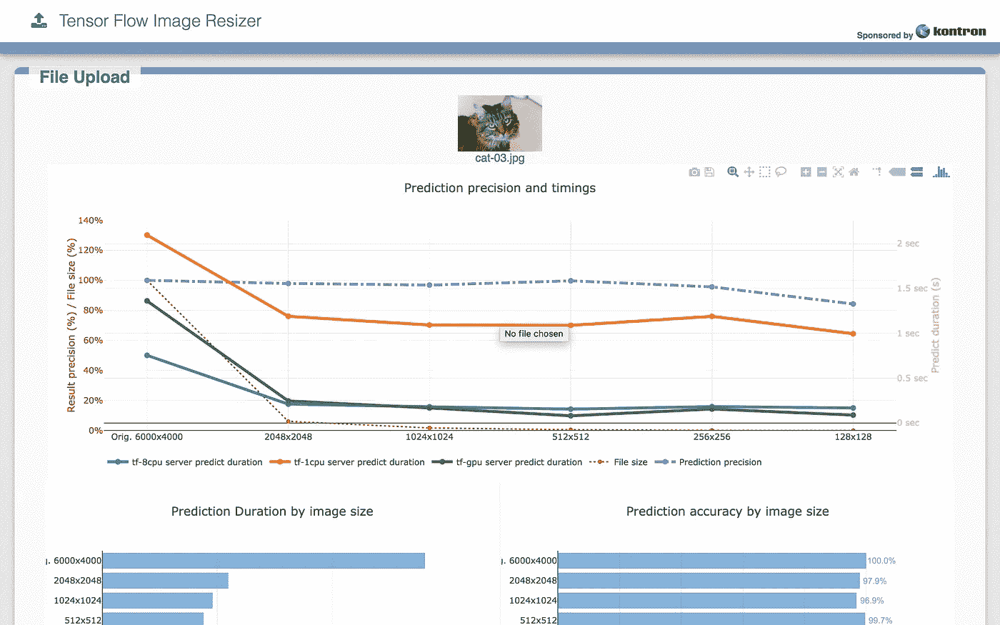
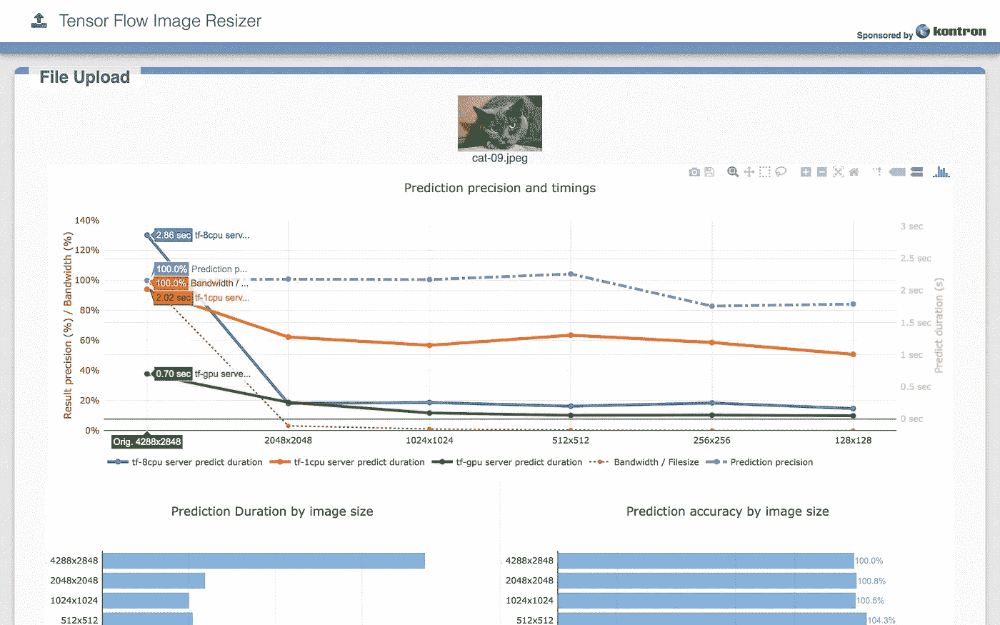

# Kubernetes & Tensorflow 服务带来的乐趣

> 原文：<https://itnext.io/fun-with-kubernetes-tensorflow-serving-4fef8d7502b9?source=collection_archive---------2----------------------->

Tensorflow 服务有多种可用的演练，可以在 K8s 或其他平台上运行。大多数情况下，您仍然需要使用 Tensorflow Python 客户端来发布图像或您想要分析的任何内容。

虽然你可以从[文档](https://www.tensorflow.org/performance/performance_guide)中找到关于 Tensorflow 本身性能优化的数据，但它并没有真正涵盖一些运营细节，当你打算运行这项服务时，这些细节可能会很有趣。对于一个初始模型，你应该使用 PNG 图像吗？JPEG 文件？如果使用高质量的图像，性能会更好吗？还是应该缩小图像的尺寸？如果使用高质量的图像，准确性会更好吗？

为了开始回答这些问题，我与提供硬件访问的 [Kontron](https://symkloud.com/) 和我所知道的最好的 Python 大师[罗南·德拉克洛瓦](https://www.linkedin.com/in/ronan-delacroix/)合作。

我们做到了:

1.  使用从文档中获取的参数，以优化和非优化的方式，从为 CPU 和 GPU 提供二进制文件的源 TF 构建；
2.  用这些新的二进制文件构建 Docker 映像；
3.  看看如何准备由 TF Serving 服务的 inception 模型；
4.  构建一个 Kubernetes 清单来部署具有各种资源约束的 TF 服务；
5.  使用简单的 API 构建一个 web 应用程序，通过它我们可以发布图像，运行简单的预处理管道并比较结果；
6.  得出一些早期结论。

现在，我们想分享这种令人敬畏的体验！并收集您的反馈以对其进行迭代。

# 先决条件

要复制这篇文章，您需要访问 Kubernetes 1.6+集群，最好是其中有 GPU 的集群。

在我们这里的例子中，我们使用了 Kubernetes 的 1.8.7 版本的[规范发行版，该版本使用](https://www.ubuntu.com/kubernetes) [Kontron Symkloud MS2911](https://www.kontron.com/products/systems/cloud-systems/symkloud-ms2910.html) 部署在一个 6 worker HA 集群上。其中两个节点配备了 nVidia Tesla P4 卡。

# 准备 Tensorflow 服务

构建“恰到好处”的 TF 服务绝非易事，尤其是因为它是一个快速移动的目标。这个练习是基于 TF 1.5 的，我不能保证它是可重复的。我花了很多时间把它做好，但我仍然对整件事不满意。

## 开发 Docker 图像

首先，我们需要构建一个基础映像，然后我们可以用它来构建模型服务器的各种版本。我们可以使用多级 Docker 图像，但为了理解我们在做什么，我在这里只是手动操作。

基础“FROM”来自最新的 CUDA 映像，因此我们可以同时进行 CPU 和 GPU 构建，您可以在 repo 中找到源代码。

在这个 repo 的 src 文件夹中，您会找到一个很好的 docker 文件。构建方式:

```
$ cd src
$ docker build — rm -t ${USER}/tf-dev -f Dockerfile.tf-dev .
$ cd ..
```

现在我们需要下载 Tensorflow 服务。在 1.4 和 1.5 之间有一个很大的变化，子模块被删除了。这个变化在文档和构建系统中没有完全考虑到，所以我们需要在这里做一点修改。

```
$ git clone --recurse-submodules [https://github.com/tensorflow/serving](https://github.com/tensorflow/serving)
# This will in the end NOT download some required dependencies, so
$ cd serving
$ git clone --recursive [https://github.com/tensorflow/tensorflow.git](https://github.com/tensorflow/tensorflow.git)
$ git clone --recursive [https://github.com/tensorflow/models.git](https://github.com/tensorflow/models.git) tf_models
```

此时，您已经准备好了 docker 映像以及要构建的源代码。现在让我们运行它

```
$ docker run -it -name tf-dev -v $PWD/serving:/serving ${USER}/tf-dev bash
```

## 建筑 TF 服务

现在你在容器中，要构建 TF 服务器，你有几个选择:

1.  GPU，非优化:

```
# cd /serving
# bazel build -c opt --config=cuda \
    --crosstool_top=[@local_config_cuda](http://twitter.com/local_config_cuda)//crosstool:toolchain \
    tensorflow_serving/model_servers:tensorflow_model_server \
    && cp bazel-bin/tensorflow_serving/model_servers/tensorflow_model_server \
 /usr/local/bin/tensorflow_model_server.gpu.standard \
    && bazel clean --expunge
```

2.GPU，优化:

```
# cd /serving
# bazel build -c opt --config=cuda \
    --crosstool_top=[@local_config_cuda](http://twitter.com/local_config_cuda)//crosstool:toolchain \
    --copt=-msse4.1 --copt=-msse4.2 --copt=-mavx --copt=-mavx2 — copt=-mfma — copt=-O3 \
    tensorflow_serving/model_servers:tensorflow_model_server \
    && cp bazel-bin/tensorflow_serving/model_servers/tensorflow_model_server \
 /usr/local/bin/tensorflow_model_server.gpu.optimized \
    && bazel clean --expunge
```

3.CPU，非优化

```
# cd /serving
# bazel build -c opt \
    tensorflow_serving/model_servers:tensorflow_model_server \
    && cp bazel-bin/tensorflow_serving/model_servers/tensorflow_model_server \
 /usr/local/bin/tensorflow_model_server.cpu.standard \
    && bazel clean --expunge
```

4.优化的 CPU:

```
# cd /serving
# bazel build -c opt \
    --copt=-msse4.1 --copt=-msse4.2 --copt=-mavx --copt=-mavx2 --copt=-mfma --copt=-O3 \
    tensorflow_serving/model_servers:tensorflow_model_server \
    && cp bazel-bin/tensorflow_serving/model_servers/tensorflow_model_server \
 /usr/local/bin/tensorflow_model_server.cpu.optimized \
    && bazel clean --expunge
```

这需要很多时间。在我的至强 E5 24 内核上，非优化 CPU 版本为 521 秒(9 分钟)，优化 GPU 版本高达
1427 秒(22 分钟)。在这个过程的最后，您将在 docker 容器的/usr/local/bin/中获得这 4 个二进制文件。

现在我们还需要构建另一个 dev 二进制文件来服务于 Inception。如果您已经有了自己的模型，则无需执行此步骤:

```
# cd /serving
# bazel build -c opt \
    tensorflow_serving/example:inception_saved_model
```

另一方面，如果您在 tensorflow_serving/…上运行构建，您将构建更多的示例，尽管这会花费更长的时间。可能对某些用例有用。

另一方面，这应该是工作的*，但是这里报告的[有一个错误，阻止了它正常工作。如果你真的需要这个，好消息是 bitnami docker 映像**bitnami/tensor flow-inception:latest**在**/opt/bitnami/tensor flow-inception/bazel-bin/tensor flow _ serving/example/inception _ saved _ model**包含一个工作二进制文件](https://github.com/tensorflow/serving/issues/737)*

## 提取二进制文件

所有的二进制文件都构建好了，现在您可以使用以下命令从另一个 shell 中提取它们:

```
$ mkdir bin
$ for type in gpu cpu; do
    for version in standard optimized; do
      docker cp tf-dev:/usr/local/bin/tensorflow_model_server.${type}.${version} ./bin/
    done
  done
```

为了保存我们将用于解包模式的工具，我们使用以下内容提交 docker 映像:

```
$ docker commit tf-dev ${USER}/tf 
```

如果您打算使用 bitnami 映像，则不必这样做。

# 构建 TF 服务图像

现在您已经准备好了所有的二进制文件，可以用它们来构建相对较小的 Docker 映像了

同样，您可以在这个存储库的 src 文件夹中找到源代码。您也可以修改文件来运行非优化版本

```
$ for type in gpu cpu; do
    docker build — rm -t ${USER}/tf-serving:${type} -f src/Dockerfile.${type} .
    docker push ${USER}/tf-serving:${type}
  done
```

# 创建可服务的初始模型

奇怪的是，当你有更多的操作背景时，你下载的模型不能开箱即用。首先，您需要将它们转换成一个冻结的模型，为变量添加一个文件，然后，也只有到那时，您才能为它们服务。不太实际，但很好，就是这样…

从 Google Storage 下载 Inception 模型，然后提取它:

```
$ cd /tmp
$ curl -sL [http://download.tensorflow.org/models/image/imagenet/inception-v3-2016-03-01.tar.gz](http://download.tensorflow.org/models/image/imagenet/inception-v3-2016-03-01.tar.gz)
$ tar xfz inception-v3–2016–03–01.tar.gz
$ cd -
```

现在你需要把它转换成可以被 TF 服务的东西:

```
$ mkdir model-data
$ docker run — rm \
    -v $PWD/model-data:/model-data \
    -v $PWD/serving:/serving \
    -v /tmp/inception-v3:/inception \
    ${USER}/tf \
    /serving/bazel-bin/tensorflow_serving/example/inception_saved_model \
       --checkpoint_dir=/inception \
       --output_dir=/model-data
```

此操作的输出是模型数据文件夹中的一个子文件夹，其中包含 saved_model.pb 文件和 variables 文件夹。这是 model_server 用来服务模型的。

**注意**:如果您陷入了上面报告的 tensorflow bug，请使用以下代码:

```
$ mkdir model-data
$ docker run — rm \
    -v $PWD/model-data:/model-data \
    -v /tmp/inception-v3:/inception \
    bitnami/tensorflow-inception \
    /opt/bitnami/tensorflow-inception/bazel-bin/tensorflow_serving/example/inception_saved_model \
      --checkpoint_dir=/inception \
      --output_dir=/model-data
```

它将输出如下内容:

```
Welcome to the Bitnami tensorflow-inception container
Subscribe to project updates by watching [https://github.com/bitnami/bitnami-docker-tensorflow-inception](https://github.com/bitnami/bitnami-docker-tensorflow-inception)
Submit issues and feature requests at [https://github.com/bitnami/bitnami-docker-tensorflow-inception/issues](https://github.com/bitnami/bitnami-docker-tensorflow-inception/issues)
Send us your feedback at [containers@bitnami.com](mailto:containers@bitnami.com)2018-02-22 17:25:00.723742: I external/org_tensorflow/tensorflow/core/platform/cpu_feature_guard.cc:137] Your CPU supports instructions that this TensorFlow binary was not compiled to use: SSE4.1 SSE4.2 AVX AVX2 FMA
Successfully loaded model from /inception/model.ckpt-157585 at step=157585.
Exporting trained model to /model-data/1
Successfully exported model to /model-data
```

# 开发 Python API 来发布图像

Ronan 开发了一个应用程序，它具有以下功能:

*   允许上传(猫的)图像
*   从适合 2048x2048 的盒子到适合 128x128 的盒子(我们实际上缩小到了 32x32，但是效果不够好)
*   将每个版本代码转换为 PNG 格式和 JPEG 格式
*   同时将每个版本发布到 3 台 Tensorflow 服务器
*   显示结果的比较图

这个应用程序的代码是[这里](https://github.com/ronhanson/tensorflow-image-resizer.git)，它被打包成一个 docker 图像，你可以下载

```
docker pull ronhanson/tensorflow-image-resizer 
```

# 在 Kubernetes 部署

## 将模型部署到节点

好吧，所以我没有机会有任何可用的存储，我不希望我的演示出现带宽和 IO 问题。所以我使用 hostPath 来存储模型(是的，我知道，真可耻)

您应该能够做一些事情，比如

```
$ scp -r model-data <remote-instance>:model-data
```

对于您的每个工作节点，然后 SSH 到每个工作节点，并且:

```
remote-instance:$ sudo mv model-data /
remote-instance:$ exit
```

好了，在这个阶段，你已经在所有节点上共享了你的模型。显然，如果您在云中运行，请使用存储类并将内容发布到其中。如果你在这一步挣扎，请给我发消息。

## 部署 TF

在 src 文件夹中，您将找到 3 份清单，部署 3 个 Tensorflow 服务实例，其中包括 1 个 GPU、1 个 CPU 和 8 个 CPU 核心。使它们适应您的需要(根据需要更改 TF 映像和约束)，然后使用

```
kubectl create -f src/manifest-tensorflow-serving-gpu.yaml
kubectl create -f src/manifest-tensorflow-serving-1cpu.yaml
kubectl create -f src/manifest-tensorflow-serving-8cpu.yaml
```

## 部署前端

您还可以在 src 中找到将 Python 前端部署到 K8s 的清单。注意，出于实际原因，我们在这个例子中调整服务器端的大小，这是 CPU 密集型的。您可以更改资源请求以缩短响应时间。结论中对此有更多的说明。

另请注意，我们使用的是节点端口，这也是出于实际原因，因为我们只运行裸机集群。您可以将其更改为更适合您的用例的东西，例如负载平衡器。

```
kubectl create -f src/manifest-tensorflow-image-resizer.yaml
```

# 玩我们的集群

太好了！！现在，您可以在端口 30501 (http:// <node-ip>:30501)上连接任何节点的 IP 地址，并查看 UI:</node-ip>



一只猫的 2400 万像素图像分析



(另一只猫的)1400 万像素图像分析

# 结论

老实说，我们得出的一些结论是有道理的，其他的就不那么直观了。请注意，它们是在初始模型上得到的发现，并且您可能在您自己的模型上有不同的发现。我们相信这很容易复制，你可以运行(和分享！！)你的结果和想法

1.  **图像大小(因此带宽)对预测精度的影响非常小**。这意味着在将图像提交给 Tensorflow 服务模型服务器之前，将图像大小调整为 1024x1024 甚至 512x512 几乎总是有益的。您损失了不到 5%的准确性，但节省了 99%的带宽！！
    所以，如果你运行一个公开可用的系统，你可以调整图像客户端的大小来优化你的管道。使用 javascript 很容易做到这一点(实际上 Ronan 的代码禁用了它，但你可以很容易地打开它)
    如果你只使用 M2M 运行数据中心或边缘计算，那么调整大小/代码转换管道将提高整体性能并节省带宽。
2.  **形象类型确实重要**。您不会在 UI 中直接看到这一点，但是您可以从 API 中收集 JSON 输出，并注意到在 PNG 中分析相同大小的相同图像所需的时间是在 JPEG 中的 4 到 5 倍。这告诉我们，压缩显然是好的，颜色空间对于初始模型的性能来说可能不是太大的问题。我们需要更多的研究和文件类型来解决这个问题。
3.  图像大小对预测的持续时间没有太大的影响，至少在我们开始调整大小时。我们使用的原始源(每个超过 10M 像素)将需要很长时间来运行，但是当我们低于 4MP 时，预测持续时间大约是恒定的。这一张很奇怪，因为我预计“小”图像的预测会快得多。事实并非如此。
4.  **一旦调整了图像的大小，1x GPU (nVidia P4)大约相当于 8 个英特尔至强处理器超线程核心**，但是如果您查看全尺寸图像，它会更好。所以我想这是一个用例的问题。
    因此，如果您寻求绝对的精度，您将需要一个 GPU 来获得不错的性能并使用大图像
    如果您以精度/准确度为代价来寻求速度，那么使用 CPU 的传统高密度方法可能更有意义。

如果你认为我们应该运行更多的用例和测试，让我们知道(欢迎 PRs)。

如果您希望在真实的客户场景中运行，以下内容可以帮助您提高性能:

*   用于 TF 服务的[批处理 API](https://github.com/tensorflow/serving/blob/master/tensorflow_serving/batching/README.md)应该是提高性能的一个很好的方法，特别是对于 GPU
*   ZenDesk 发布了一篇关于一些深度细节的论文[这里](https://medium.com/zendesk-engineering/how-zendesk-serves-tensorflow-models-in-production-751ee22f0f4b)

如果您正在考虑复制和扩展这篇文章，请注意这个应用程序有一个完整的 API，您可以使用它来自动测试和处理 JSON 输出。详细信息在自述文件中。欢迎您测试和发布:

*   更多编译选项
*   其他 GPU 性能指标。我们使用 P4 是因为它对高模块化 MSP 平台的功耗要求低，外形友好。
*   K8s 与其他解决方案？(实际上，所有这些都可以在 Docker 和 K8s 之外运行，这样设置对我们来说更容易)

无论如何，我们希望你像我们喜欢建造它一样喜欢它！别忘了为它鼓掌！！如果你有其他用例或研究，罗南和我也可以帮助你开始使用 Kubernetes。

该演示将在[世界移动通信大会上的 Kontron 展台](https://www.mobileworldcongress.com/exhibitor/kontron/)上展示。来看看，讨论一下！

# 参考

你可以在这里找到代码:

*   python App:【https://github.com/ronhanson/tensorflow-image-resizer/ 
*   Blogpost 及来源:[https://github . com/madeden/blog posts/tree/master/k8s-TF-serving](https://github.com/madeden/blogposts/tree/master/k8s-tf-serving)