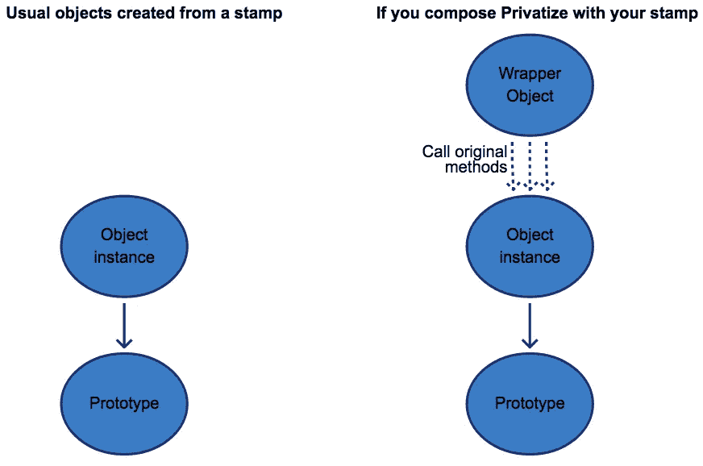

# 邮票的乐趣。第 21 集。JavaScript 中的私有数据。邮票的 4 种使用方法

> 原文：<https://itnext.io/fun-with-stamps-episode-21-private-data-in-javascript-4-ways-using-stamps-f43ba93e25bb?source=collection_archive---------1----------------------->


你好。我是开发者瓦西里·博罗维亚克，欢迎来到第 21 集*瓦西里·博罗维亚克为*带来 ***乐趣*** *。*

[*点击这里在 LinkedIn 上分享这篇文章*](https://www.linkedin.com/cws/share?url=https%3A%2F%2Fitnext.io%2Ffun-with-stamps-episode-21-private-data-in-javascript-4-ways-using-stamps-f43ba93e25bb)

人们经常问的一个问题是——如何在 stamps 中拥有私有的(或者受保护的，或者仅仅是特权的)数据或方法。

**回答** —一般来说，与 JavaScript 中的做法相同。这里有 4 种方法。

TL；DR:闭包、符号、WeakMap、代理对象(通过[私有化](https://www.npmjs.com/package/@stamp/privatize)戳记)。

# 1.关闭

这是最广为人知和最隐私的隐藏数据的方法。(看评论！)

让我们用私有数据`token`和私有函数`request`创建一个`BlockchainApi`戳。

```
**const** rp = require(*'request-promise'*)
**const** {init} = require(*'@stamp/it'*) ***// using the init shorthand here*****const** BlockchainApi = init(**function** ({config}) {
  ***// private data***
  **const** token = config.token
  ***// public property***
  **this**.url = config.url ***// private method accesses both the public and the private data***
  **const** request = ({path = '', body, method = 'GET'} = {}) => {
    **return** rp({
      url: **this**.url + *'/'* + path, ***// url is public***
      headers: {authorization: token}, ***// but token is private***
      json: true,
      body,
      method
    })
  } ***// public method accesses the private method* **  **this**.ping = () => request()
})
```

在另一文件中:

```
**const** config = {token: *'1'*, url: *'http://i.ua'*}
**const** blockchainApi = BlockchainApi({config}) ***// create instance***blockchainApi.ping().then(() => console.log(*'ok'*)) ***// have access***
```

如你所见，stamp `BlockchainApi`只有一个初始化器。在这里，我们创建了公共方法`ping`，它可以访问私有方法`request`，而私有方法又可以访问私有数据`token`。

这意味着每个需要访问`request`的新方法都必须是这个闭包的一部分。这有时可能不太理想。邮票最好很小。

优点:

1.  这是隐藏数据最私密的方式。没有人可以访问它。
2.  私有方法可以访问**一些**公共方法(`request`可以访问`ping`)。

缺点:

1.  内存效率不高。它为每个对象实例创建了两个封闭函数。
2.  要添加另一个方法(如`verifyBlock()`)，它应该是**同** `**init**` **功能**的一部分。一般来说，膨胀单个图章是个坏主意。如果`BlockchainApi`戳记由另一个戳记组成，那么它将不能访问`request`方法。

# 2.标志

看评论。

```
**const** rp = require(*'request-promise'*)
**const** stampit = require(*'@stamp/it'*)

**const** requestMethod = Symbol(*'requestMethod'*)
**const** tokenData = Symbol(*'tokenData'*)

**const** BlockchainApi = stampit({
  init ({config}) {
    ***// protected data***
    **this**[tokenData] = config.token
    ***// public property***
    **this**.url = config.url
  },

  methods: {
    ***// protected method accesses both public and protected data***
    [requestMethod] ({path = *''*, body, method = *'GET'*} = {}) {
      **return** rp({
        url: **this**.url + *'/'* + path,
        headers: {authorization: **this**[tokenData]},
        json: **true**,
        body,
        method
      })
    },

    ping () {
      ***// public method accesses the protected method***
      **return this**[requestMethod]()
    }
  }
})
```

在另一文件中:

```
**const** config = {token: *'1'*, url: *'http://i.ua'*}
**const** blockchainApi = BlockchainApi({config}) ***// create instance***

blockchainApi.ping().then(() => console.log(*'ok'*)) ***// have access***
```

我们使用符号作为属性键。这意味着如果代码可以访问符号本身，那么它就可以检索“受保护”的数据。

优点:

1.  这是一种简单的隐藏数据的方法。大多数时候都适用。
2.  与闭包不同，内存友好。
3.  受保护的方法可以访问**所有**公共方法。

缺点:

1.  私有数据和方法仍然可以用更多的 JavaScript 代码来访问和修改([示例](https://derickbailey.com/2015/10/12/hide-the-backing-variable-of-object-propertiesattributes-using-es6-symbols/))。
2.  要添加另一个方法(如`verifyBlock()`)，它应该是**相同文件**的一部分。如果这个`BlockchainApi`戳记是由另一个文件中的另一个戳记组成的，那么它将不能访问`request`方法。

# 3.WeakMap

```
**const** rp = require(*'request-promise'*)
**const** stampit = require(*'@stamp/it'*)

**const** mapOfPrivateObjects = **new** WeakMap()

***// private method accesses both the public and private data***
**function** requestMethod ({path = *''*, body, method = *'GET'*} = {}) {
  **return** rp({
    url: **this**.url + *'/'* + path,
    headers: {authorization: mapOfPrivateObjects.get(**this**).token},
    json: **true**,
    body,
    method
  })
}

**const** BlockchainApi = stampit({
  init ({config}) {
    ***// private data and method***
    mapOfPrivateObjects.set(**this**, {
      token: config.token,
      request: (...args) => requestMethod.apply(**this**, ...args)
    })
    ***// public property***
    **this**.url = config.url
  },

  methods: {
    ping () {
      ***// public method accesses the private method***
      **return** mapOfPrivateObjects.get(**this**).request()
    }
  }
})
```

在另一文件中:

```
**const** config = {token: *'1'*, url: *'http://i.ua'*}
**const** blockchainApi = BlockchainApi({config}) ***// create instance***blockchainApi.ping().then(() => console.log(*'ok'*)) ***// have access***
```

我们使用 WeakMap 作为每个对象实例的私有数据存储。这比符号更好，数据现在是真正的私有了。此外，这比闭包要好——内存效率更高。

优点:

1.  这是一种隐藏数据的私人方式。没有人能改变它。
2.  记忆友好。
3.  私有方法**可以**访问**任何**公共方法。

缺点:

1.  要添加另一个方法(如`verifyBlock()`，它应该是**相同文件**的一部分。如果这个`BlockchainApi`图章是由另一个文件中的另一个图章组成的，那么它将无法访问`request`方法。

# 4.代理对象通过[私有化](https://www.npmjs.com/package/@stamp/privatize)盖章

如果您用您的图章组合`Privatize`,那么从您的新图章创建的对象将是包装对象。这些方法将把每个方法(除了您声明为私有的方法)包装到包装器方法中，包装器方法将调用原始的对象实例方法。见图片。



左:对象实例指向其原型。右图:包装器对象调用对象实例方法，并指向其原型。

返回的包装对象将具有与原始对象实例相同的方法集，但没有任何属性。

```
**const** rp = require(*'request-promise'*)
**const** stampit = require(*'@stamp/it'*)
**const** {privatizeMethods} = require(*'@stamp/privatize'*)

**const** BlockchainApi = stampit({
  init({config}) {
    ***// private data***
    **this**.token = config.token
    ***// private data too!!! But was public in previous examples***
    **this**.url = config.url
  }
},
privatizeMethods(*'request'*), ***// Hiding a method***
{
  methods: {
    ***// private method accesses private data, or public methods***
    request({path = *''*, body, method = *'GET'*} = {}) {
      **return** rp({
        url: **this**.url + *'/'* + path,
        headers: {authorization: **this**.token},
        json: **true**,
        body,
        method
      })
    },

    ping() {
      ***// public method accesses the private method***
      **return this**.request()
    }
  }
})
```

在另一文件中:

```
**const** config = {token: *'1'*, url: *'http://i.ua'*}
**const** blockchainApi = BlockchainApi({config}) ***// create instance***blockchainApi.ping().then(() => console.log(*'ok'*)) ***// have access***
```

不确定赞成还是反对，但是所有公共方法都可以访问所有私有方法(比如经典类中的`protected`关键字)。因此，如果您可以访问从戳记创建的对象实例，您就不能访问私有数据和方法。但是，您可以使用原始的戳记，向它添加一个方法，并授予自己访问所有私有数据和方法的权限。

优点:

1.  只有 stamp 的成员可以访问私有数据和方法。
2.  所有私有方法都可以访问所有公共方法。
3.  您可以从**其他文件**中添加其他方法(如`verifyBlock()`)。(如果这个`BlockchainApi`戳由另一个文件的另一个戳组成，那么那里的每个方法都可以访问`request`方法。)

缺点:

1.  内存不友好。为每个方法创建一个小的包装函数。
2.  所有的财产都变成私有。您需要为公共属性创建一个 getter。如`getUrl()`。

玩邮票玩得开心！

*   第一集。邮票基础知识
*   [第二集。FP 中的依赖注入](https://medium.com/p/37be8e9a5714)
*   [第三集。与 ES2015 类比较](https://medium.com/p/e387ef041896)
*   [第四集。在 30 LOC 中自己实现 stamps](https://medium.com/p/e52f5c17dcfe)
*   [第五集。构图设计模式](https://medium.com/p/fe55721c571a)
*   [第六集。静态—邮票上的属性](https://medium.com/@koresar/fun-with-stamps-episode-6-statics-properties-on-stamps-e2b85825152c)
*   [第七集。早期和晚期依赖注入](https://medium.com/@koresar/fun-with-stamps-episode-7-early-and-late-dependency-injection-caef5c91794a)
*   第八集。追踪和覆盖构图
*   第九集。正在分离合成()
*   第十集。我的邮票心理模型
*   [第十一集。干扰成分](https://medium.com/@koresar/fun-with-stamps-episode-11-interfering-composition-7abc44ac1f99)
*   第 12 集。新@戳首页
*   [第十三集。方法冲突控制](https://medium.com/@koresar/fun-with-stamps-episode-13-method-collision-control-d34ec0c8cc8d)
*   [第十四集。新的@stamp/it 作为 Stampit 的替代品](https://medium.com/@koresar/episode-14-new-stamp-it-as-a-replacement-of-stampit-191ef0f4c53e)
*   [第十五集。@stamp/模块生态系统](https://medium.com/@koresar/fun-with-stamps-episode-15-the-stamp-modules-ecosystem-a296d15be599)
*   第十六集。打字稿混合类 vs 邮票
*   [第十七集。JS 中简单的 100%单元测试覆盖率](https://medium.com/@koresar/fun-with-stamps-episode-17-easy-100-unit-test-coverage-in-js-d97e09591f18)
*   [第十八集。依赖注入天堂](https://medium.com/@koresar/fun-with-stamps-episode-18-dependency-injection-paradise-10d4a3e39d45)
*   [第十九集。JavaScript 中的 Java/C#抽象方法](https://medium.com/@koresar/fun-with-stamps-episode-19-java-c-abstract-methods-in-javascript-65b1458e0b93)
*   [第二十集。Stampit v4](https://medium.com/@koresar/fun-with-stamps-episode-20-stampit-v4-9a043a36a984)
*   **第 21 集。JavaScript 中的私有数据。4 邮票使用方式** *(本文)*
*   [第 22 集。作为可组合戳记的 JavaScript 实例](https://medium.com/@koresar/fun-with-stamps-episode-22-javascript-instanceof-as-composable-stamp-3956619b249d)
*   [第二十三集。拥有所有文件的新 stampit.js.org](https://medium.com/@koresar/fun-with-stamps-episode-23-new-stampit-js-org-with-all-the-docs-38a2f50ec252)
*   [第二十四集。新的“名称”功能](https://medium.com/@koresar/fun-with-stamps-episode-24-new-name-feature-4be91c27edcb)