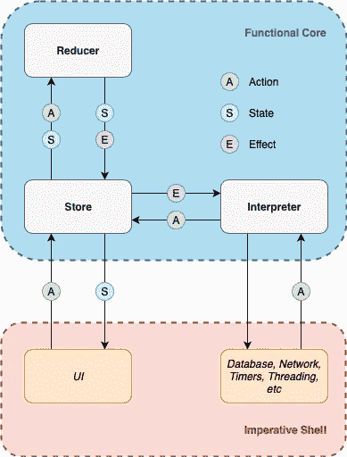

# 驯服副作用

> 原文：<https://itnext.io/functional-architecture-e9031090ff18?source=collection_archive---------5----------------------->



功能核心，命令式外壳

作为一个已经在这个行业中工作了 7 年多的人，我注意到许多软件都存在不能很好地处理副作用的问题。

# 什么是副作用？

副作用是赋值操作——它改变了应用程序的全局状态。

```
private var n = 1 // global statefunc plus(_ value: Int) -> Int {
    n += value     // assignment
    return n
}
```

## 为什么这样不好？

如果我有一个返回结果的函数`f(x)`，我希望它能通过测试`XCTAssert(f(x), f(x))`。

然而，如果函数依赖于变化的全局状态，这个测试将失败。让阅读该测试的开发人员感到困惑的是。在上面的例子中，`XCTAssert(plus(1), plus(1))`将总是 ***失败*** ，因为它依赖于变异变量`n`。

虽然这是一个相当人为的例子，但是您可以想象这可能会成为应用程序中其他状态片段的问题，特别是当您在这些变化的状态片段之上构建整个应用程序时。

产生副作用的函数称为 ***不纯*** 函数。

## 不纯函数包括:

*   不可组合——我们需要以特定的顺序执行操作，否则我们会得到奇怪的竞争条件
*   不可预测—结果随 ***时间*** 变化
*   不是线程安全的——我们将需要一个锁来执行赋值。

理想情况下，我们希望减少这种全球状态的失控突变。我们要 ***纯*** 功能。

***纯粹的*** 函数只依赖于传入的参数，对于给定的输入总是返回相同的输出。没有副作用。

## **纯功能有:**

*   可组合——你可以构建小块的功能，然后像乐高积木一样组合它们。
*   高度可测试性——给定一个特定的输入，无论调用该函数多少次，都可以得到相同的输出。
*   可重用——你可以将它复制并粘贴到另一个项目中，它不会抱怨缺少依赖项。
*   线程安全——无论它们在什么线程上运行，都将返回相同的值。

## 变量

一旦我们将`var`引入代码，我们就必须处理 ***时间*** 。由于变量会随时间变化，它会受到竞争条件和死锁的影响。

在 Swift 中，我们应该尽量减少代码中`var`的数量，尤其是当它们存在于函数之外的时候。理想情况下，我们希望在大多数时候处理函数中的`let`值或参数。

## 在命令式的世界中进行功能性思考

*Swift* 是**而不是**一种*功能性*语言，它是一种*混合型*语言。这意味着我们可以利用函数式编程的优势来增强不变性和可预测性，并且有能力退出到 OOP 世界来执行副作用或处理用户交互。

## 流向

最常见的架构是双向的，比如 MVVM ( `M<->VM<->V`)、MVP ( `M<->P<->V`)、MVC ( `M<->VC`)。VIPER 可能是最复杂的一个，需要一个*线框*来将所有的部分放在一起。

通过允许流双向发生，事件的顺序可以以任何顺序发生，由于竞争条件，稍后会产生调试噩梦。

例如，在 MVP 中，我可能会在*视图*设置之前调用*表示器*上的函数，这可能会导致意外行为或崩溃，具体取决于代码是如何实现的。

为了提高可预测性，降低复杂性，减少代码中的耦合，我们应该致力于使用单向架构。实现这一目标有许多不同的方式，有些方式比其他方式更复杂。

*   榆树可能是你能找到的最纯粹的树，然而有了这种纯粹，你可能会失去像动画一样的东西。有一些人已经走上了这条路，比如克里斯·埃德霍夫的《雨燕的茶》。
*   [RxAutomaton](https://github.com/inamiy/RxAutomaton) 是一个轻量级的例子，但是它要求我们使用 Rx，而我们可能并不总是需要 Rx，这可能会让不熟悉这个框架的人感到困惑。
*   [cycle . Swift](https://github.com/BrianSemiglia/Cycle.swift)Swift 中 Cycle.js 的一个实现，它需要相当大的范式转换，并且不能很好地与现有的 Rx 框架兼容。然而，原则上其背后的逻辑是可靠的。
*   [resswift](https://github.com/ReSwift/ReSwift)、 [RxState](https://github.com/RxSwiftCommunity/RxState) 、 [RxReduce](https://github.com/RxSwiftCommunity/RxReduce) 是 Redux 在 Swift 中的实现。Redux 可能是最轻量级的单向架构，也是我选择在下面解释的架构——我不会使用框架，因为我相信如果你自己实现某个东西，它会更干净、更具可扩展性。

# Redux 是什么？

Redux 是从大部分代码中抽象出副作用的方法之一。副作用仍然可能发生，但是它们只能以可控的方式发生，这使得它们在出错时更容易调试(比如竞争条件或死锁)。

Redux 使用了一些概念来实现这一点…

## 商店

一个集中的`Store`，它将包含一个对最新`State`的*引用*。

## 行动

改变`State`的**唯一的**方式是向`Store`分派一个`Action`，然后将当前的`State`和`Action`传递给一个`Reducer`。

## 还原剂

A `Reducer`接收当前`State`和`Action`并返回新的`State`和我们想要执行的任何`Side Effects`。

然后`Store`将其*引用*更新为`State` ，并将`Side Effects`传递给`Interpreter`。

## 解释者

`Interpreter`是**唯一能够访问外部**依赖**并能够实际**作用于**那些`Side Effects`的地方。**

这是您实现保存到数据库、从网络获取、日志、分析、运行计时器等事情的地方。

# Redux 有什么好处？

## **易于调试**

通过限制**何时**和**发生**副作用(在`Interpreter`中)，我们对正在发生的事情完全透明(我们甚至可以按照它们发生的顺序记录它们)，这使得查找线程问题变得更加容易。

## **易于测试**

测试再简单不过了，而且它几乎是自己写的。*给*一个特定的`State`，*当*一个特定的`Action`是`Reduced`，*那么*我可以期待一个新的`State`和`Effects`。我们只需要测试一下`Reducer`。

## **具有可预测的不可变状态，带有变化描述**

`Actions`是简单的*值*——包含一条可能与`State`相关的信息的类型。

`Reducers`取一个旧的`State`和一个`Action`，返回一个新的`State`和任何应该发生的`Effects`。

## **防止状态相关的死锁和竞态条件**

我们的`Store`将一次只处理一个 `Action`的**，这防止了在不需要信号量和锁的情况下围绕突变状态的竞争条件/死锁问题。**

## 减少代码中不纯函数的数量

上述所有概念的重要之处在于，除了包含对**最新** `State`的*引用*的`Store`类*之外，它们都是*值类型(枚举、结构、原语)*和*纯*函数。*

# 与 MVVM 相比

让我们将 Redux 与典型的 MVVM 解决方案进行比较，因为这是 iOS 上常见的设计模式。

## 状态

*   视图不是将事件分派给视图模型，而是将`Actions`分派给`Store`。
*   它不是观察 ViewModel 中的视图状态，而是观察`Store`中最新的`State`。

## 事件

*   在 MVVM，发送到 ViewModel 的事件将调用*服务*或*用例*，它们将使用新值进行响应。我们还经常需要组合多个值，以便用户界面能够理解它——这就是问题所在，因为异步代码是不可预测的。大多数时候，这些异步块是用队列、锁、信号量来管理的，或者在 *Rx* 中，我们可以使用`combineLatest`、`merge`、`zip`、`flatMap`等操作…
*   在 Redux 中，`Actions`将被发送到`Reducer`以创建新的状态和/或`Effects`。`Interpreter`将调用服务或用例，这些服务或用例将执行并分派新的`Actions`来更新`State`。然后`Actions`将按顺序执行，无需担心与状态相关的死锁或竞争条件。

## 单元测试

*   在 MVVM，我们需要测试 ViewModel，但是如果你注意到上面我们有异步代码——这意味着我们需要创建尽快响应的模拟对象，探子来跟踪执行，并在 XCTest 中使用 *waitForExpectation* (或使用 RxBlocking/RxTest) *创建测试调度程序。*这给测试我们的视图模型在基于执行顺序的众多场景中的正确行为带来了很大的复杂性。此外，如果一些异步逻辑发生变化，可能会破坏所有的测试。
*   在 Redux 中，我们简单地测试一下，如果我们的`Reducer`接收到一个特定的`State`和一个`Action`，它会返回一个新的`State`和`Effects`。这变得更容易测试，因为没有模拟或异步等待。因为我们比较的是简单的对象，我们甚至可以依靠快照测试框架。

# **结论**

正如你在上面看到的，MVVM 和 Redux 之间的对比对 MVVM 来说是致命的。

*   当数据来自多个来源并需要组合时，MVVM 使 UI 更新变得复杂。在 Redux 中我们简单观察`State`。
*   MVVM 还将看似简单的测试场景复杂化，增加了对模拟、间谍和等待的需求。在 Redux 中，我们根本不需要这些概念来测试我们的业务逻辑，因为没有*时间组件，这意味着测试会执行得更快，也更容易维护。*

*如果你有兴趣了解上面提到的 Redux 概念，请看看我下面的示例项目，它包含一个操场和一个示例应用程序。*

*例子:[https://github.com/cjnevin/FunctionalRedux](https://github.com/cjnevin/FunctionalRedux)*

## *参考资料:*

*罗伯特·马丁介绍:[https://www.youtube.com/watch?v=7Zlp9rKHGD4](https://www.youtube.com/watch?v=7Zlp9rKHGD4)
布兰登·威廉姆斯介绍:[https://www.youtube.com/watch?v=QOIigosUNGU](https://www.youtube.com/watch?v=QOIigosUNGU)*