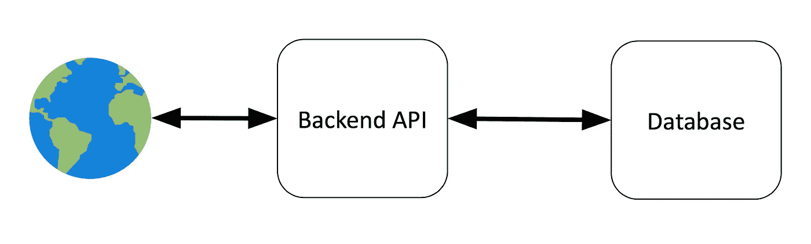
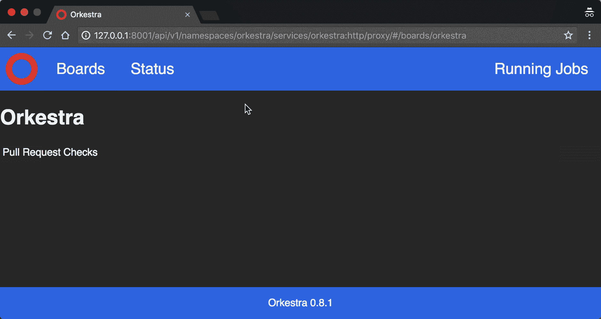
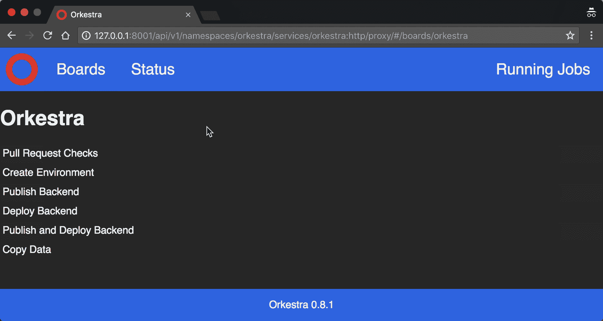

# 使用 Scala 和 Kubernetes 的函数式开发

> 原文：<https://itnext.io/functional-devops-with-scala-a-kubernetes-3d7c91bca72f?source=collection_archive---------3----------------------->

# 语境

作为一名函数式后端开发人员，我总是对 **DevOps** 如何远离所有**函数式编程范例**感到惊讶。很明显，后端在这个领域是领先的，我们已经看到了用 Scala 将它引入前端的成功尝试。JS，那为什么不是 DevOps 呢？

一般来说，DevOps 是关于使用通过声明性配置(YAML、XML……)配置的工具，如果工具中有缺口，我们用一些命令性脚本(Bash、Python……)来弥补。

但是如果我们用 **Scala** 做所有的事情呢？我们可以使用库来代替工具，以**函数式编程**风格(声明式)配置，库的缺口也可以用 **Scala** 编写(如果足够通用，以后可以提取为库)。你听起来很熟悉吗？事实上，这正是我们在开发中一直在做的事情，编写我们的解决方案，并使用库来解决常见的问题，避免一次又一次地重复发明轮子。

因此，让我们尝试一些新的东西，用我们在应用程序中使用的相同的函数式编程方法来部署我们的服务。

# 用例

为了简单起见，在这个故事中，我们将把我们想要部署的系统的架构简化到最小。

因此，我们的系统将简单地由一个**后端 API** 和一个**数据库**组成:

这里需要注意几点:

*   **后端 API** 将是一个可以从 web 访问的无状态服务。
*   **数据库**将是有状态的，在这个例子中，我们假设它是 Elasticsearch。

了解这里的业务用例并不重要，除了这个系统必须在快速迭代中交付到产品中。

我想第一个问题是**我们将在哪里运行我们的应用程序？**

# 库伯内特斯

> Kubernetes 是一个开源系统，用于跨多个主机管理[容器化应用](https://kubernetes.io/docs/concepts/overview/what-is-kubernetes/)；为应用程序的部署、维护和扩展提供基本机制。
> 来源:[https://github.com/kubernetes/kubernetes](https://github.com/kubernetes/kubernetes)

这听起来像是一个运行我们的应用程序而不需要关心底层硬件的好解决方案。Kubernetes 为我们提供了这种抽象，开发者只需构建他们应用程序的容器，然后将它们交给 Kubernetes 集群，该集群将负责在任何有计算能力的地方运行它们。

我们不打算在这里深入探究 Kubernetes 是如何工作的，但是作为一名开发人员，理解一些高级概念是很重要的，这些概念在[https://kubernetes.io/docs/concepts/](https://kubernetes.io/docs/concepts/)上有很好的记录。

好了，现在你可能想知道**我们将如何在 Kubernetes 上部署**？

# 奥克斯特拉

> Orkestra 是一个开源的持续集成/持续部署服务器，作为一个库运行在 [Kubernetes](https://kubernetes.io/) 上。
> 它利用 Kubernetes 的概念，如作业或秘密，以及配置为 [Scala](https://scala-lang.org/) 中的代码，以充分利用编译时类型安全性以及与 Scala 或 Java 库的兼容性。
> 来源:[https://orestra . tech](https://orkestra.tech)

这听起来像是我们想要的用例。我们感兴趣的关键特性是:

*   我们是**功能性**开发者，被它相对于不安全的 Yaml、Python 或 Groovy 代码的优势所折服。所以这里很完美，因为配置是在 **Scala** 中。
*   使用 Scala/Java 库是可扩展的。
*   它运行在 Kubernetes 上，因此我们可以通过使用托管的 Kubernetes 集群(如 GKE 或 EKS)来减少运营管理。此外，我们可以将集群上剩余的计算能力重新用于开发运维任务。
*   这是**高度可用的**，并不是说我们期待一个内部工具 100%的正常运行时间，但它使操作维护成为可能，而不影响工具在工作时间的使用。
*   它是完全可伸缩的，所以如果底层的 Kubernetes 集群足够大，我们可以并行运行许多作业。

# 连续累计

持续集成相当容易，有很多工具可以做到这一点，比如 Travis、CircleCI、GitLabCI、Jenkins 等等。

我们想要的可能是对每一个**拉请求**执行一次完整的编译、测试、一些 linter(比如 Scalafix、Scalafmt ),并且可能检查贡献者许可协议是否已经签署。在任何情况下，这应该是几个命令的问题。

当然，Orkestra 可以对 pull 请求运行这些检查。让我们看一下代码。请记住，您可以随时在 https://orkestra.tech 上获得更多关于 Orkestra 的文档。

我们首先需要定义一个执行检查的作业:

这是我们第一次定义工作，所以让我们花点时间来一步一步地了解这里发生了什么:

*   我们定义了一个代表 UI 的`**board**`。有不同类型的板，但我们在这里将使用`**JoabBoard**` 。
    在`JoabBoard`中，我们定义了这个任务将要执行的函数的签名，这里是`GitRef => Unit`。
    我们需要给显示器一个唯一的 ID 和一个好听的名字。
    最后，我们给出了参数表单的 UI 元素。这里只有一个名字好听的`Input[GitRef]`供展示。
*   然后，我们定义一个负责执行工作负载的`**job**`。
    A`Job`需要引用`JobBoard`所以我们传递它。有趣的事情开始了！我们传递当 PR 被更新时将被执行的函数。因为这是 DevOps，我们将经常处理文件和目录。为了以引用透明的方式做到这一点，我们有一个类型为`Directory`的上下文对象，它知道我们在哪个目录中，这就是`workDir`所要做的。当然我们不想到处传递这个参数，所以我们把它隐式化。
    `gitRef`是用户通过板卡中的参数表单给出的参数值。
    `Github.statusUpdated`是一个帮助函数，它将让 Github 知道测试何时开始以及测试是否失败。它还负责为您检查 git ref 并移入 git 目录。最后，我们执行一个 shell 命令来运行测试。

现在我们已经定义了作业，我们需要创建 Orkestra 服务器，向它注册作业并配置 GitHub Pull 请求挂钩:

*   我们通过扩展`OrkestraServer`来创建 Orkestra 服务器，这迫使我们实现`board`(UI)和*作业*(可触发的作业)。
*   `board`现在只是 PullRequestChecks 板的文件夹。
*   `jobs`将只包含`PullRequestChecks`任务。
*   然后我们需要配置 Pull 请求 Github 挂钩。

好了，让我们看看用户界面，看看它有多漂亮:

持续集成非常简单，但是现在我们有了这么好的代码，我们必须在某个地方运行它！

这就产生了一些问题，如:

*   **我们将部署什么**？(我们的应用程序、数据库？…)
*   **哪里有**？(Kubernetes？AWS 托管服务？GCP 管理服务？…)
*   **如何**？(Docker？好吃吗？…)
*   **配置**？(自动缩放？，秘密？环境？…)
*   **额外任务**？(运行迁移、在环境之间复制数据、切换负载平衡器……)

在这里，我不认为 Travis、CircleCI、GitLabCI、Jenkins…对 CI 之外的任何东西都很好，因为它只在 Git pushes 上运行一堆迭代命令，这对于简单的任务来说是可以的，但一旦你不得不做更多的事情，就非常困难了。

对此问题的通常解决方案是结合其他技术，如 Ansible、Chef、Terraform…来处理硬件/软件供应和部署逻辑，我们将从上述 CI 之一运行这些逻辑。

我不太喜欢这个解决方案，因为它引入了许多技术，因此增加了复杂性。另外，这些技术与我们这些函数式开发人员所习惯的函数式编程相去甚远。

对于我们的示例，让我们回答上面的一些问题:

*   **什么？**我们知道我们将不得不部署我们的后端和一个弹性搜索数据库。
*   **哪里？**我们说过我们将使用 Kubernetes 来运行我们所有的服务。
*   **如何？**由于我们将使用 Kubernetes，因此将使用 Docker 图像。
*   **配置？**我们可能想要多个环境，例如能够测试新版本而不影响生产用户。

# 环境

在进行任何部署之前，我们可能需要一个部署服务的环境，正如我们刚刚看到的，实际上有多个环境:

*   **Staging** :我们将持续部署主分支机构。
*   生产:我们将在哪里部署版本，我们确信他们正在进行测试。我们的最终用户将使用这一环境，因此它需要一直保持运行！

在这些环境中，部署的最低要求是:

*   一个 Kubernetes **名称空间**
*   一个**数据库**

所以让我们写一个创造环境的作业:

*   注意，现在我们运行的函数是`**String => Unit**`，因此我们使用一个`Input[String]`。
*   作业的核心现在运行 2 个`Futures`，一个创建**名称空间，**另一个用于**部署我们的数据库** Elasticsearch，它等待结果。

我们需要登记这份新工作。这是我们之前创建的`Orkestra`的新版本:

# 持续部署

我们创建了我们的环境，现在我们需要**在这些环境上部署**我们的后端工件。让我们写这个作业:

我们可能还需要一个任务，让**发布**工件:

让我们也创建一个由**直接发布和部署**的任务，这样如果我们想从源代码部署，我们只需要做一个动作:

同样，我们需要更新`Orkestra`对象来注册我们的新任务。同时，我们可以添加一个 GitHub 挂钩，用于将主分支自动部署到 staging:

*   请注意，只要主分支被更新，我们就使用一个`BranchTrigger`来触发`PublishAndDeploy`作业。

太好了，我们现在有了一个最小可行 CI/CD！

# 额外工作

这种架构已经给我们带来了一些重复性的任务，我们必须不时地去做。

其中之一是将数据子集从生产环境复制到登台环境。我们可能希望用来自生产的新的真实世界的数据来覆盖所有的暂存数据，比如每周。

让我们编写这个复制数据作业:

用 Scala 编写这项工作的好处是，如果你的后端是用 JVM 语言(Java、Scala、Groovy……)编写的，你可以发布它的一个 jar，使 Orkestra 项目依赖于它并直接调用函数。在这个例子中，我们假设`copyData()`是后端代码中定义的一个函数。

同样，不要忘记登记工作和董事会。我们将添加一个 Cron 触发器，以便该作业在每周一上午 5 点(开发人员工作时间之外)运行，这样我们就可以用新数据开始一周的工作:

# 松散集成

你现在可能会想，这东西很酷(或者不酷？)但是我习惯于在其他配置项上有大量的插件，这里仅举一个例子:一个 Slack integration，它在 staging 或 prod 上完成部署时发送消息，以便团队中的每个人都知道。

记住我们在这里写的是普通的 Scala，因此我们可以依赖任何库。更确切地说，我们可以访问所有 Maven central。你知道 Maven central 有多少图书馆吗？肯定有人用 Scala 写了 Slack 客户端！

宾果:[https://github.com/gilbertw1/slack-scala-client](https://github.com/gilbertw1/slack-scala-client)
我不会在这里介绍这个库的用法，但我认为它在回购协议中有很好的记录。

# 结论

这个故事通过一个简化的例子展示了我们如何将函数式编程用于 DevOps 目的，以及它带来的所有好处。

我们设置了一个 CI 来检查我们的拉取请求，创建了一些作业来创建和部署我们的架构，甚至还为其他任务创建了一些作业。所有这些都是用一种技术完成的:Scala/Orkestra，然而可能性是无穷的，因为我们可以使用 Scala 和 Java 生态系统中的库。

别忘了在 Github 上查看完整代码，评论，分叉和改进:

 [## orkstracd/演示

### 完成配置项和 CD 的 Orkestra 设置。

github.com](https://github.com/OrkestraCD/demo) 

Orkestra 的文件:

 [## 奥克斯特拉

### 使用 Scala 和 Kubernetes 的函数式开发

orkestra.tech](https://orkestra.tech) 

欢迎在 Twitter 上关注我:

 [## 琼·戈雅(@JoanG38) |推特

### Joan Goyeau 的最新推文(@JoanG38)。与斯卡拉、卡夫卡和库伯内特一起创作。英国伦敦

twitter.com](https://twitter.com/JoanG38) 

我还想特别感谢 [DriveTribe](https://drivetribe.com) ，他们启动了整个项目，现在正在全面使用 Orkestra。