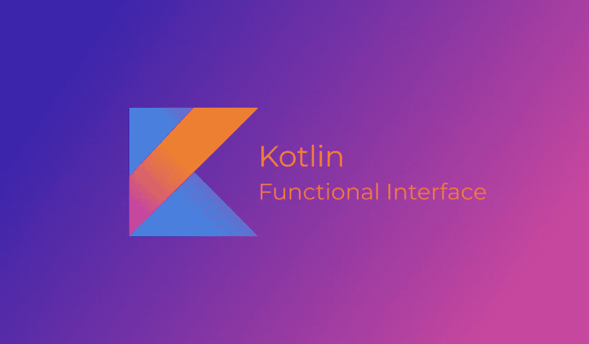

# Kotlin 中的函数接口

> 原文：<https://itnext.io/functional-interfaces-in-kotlin-ec6ab9e472e3?source=collection_archive---------1----------------------->



大家好，我们几乎都见过 Kotlin 中类似 view.setOnClickListener { }或 view.setOnLongClickListener { }的代码，当你点击它查看源代码时，它会向你展示 Java OnClickListener 接口。但是你问过自己这是什么语法吗？是科特林分机吗？你怎么能这样调用你的自定义监听器呢？在这篇小文章中，你会知道所有这些问题的答案，所以让我们开始吧😋。

这个语法不是扩展而是 SAM 转换，但是 SAM 代表什么？

SAM 代表单个抽象方法接口，它也被称为函数接口，这是一个只有一个非默认方法和任意数量的默认方法的接口，例如在 JDK 中我们有 Runnable 类，它只有一个名为 run 的方法，在 Android SDK 中我们有 OnClickListener、OnLongClickListener…等等。

如何才能创建自定义的功能界面？

在 Java 中声明一个函数接口很容易，例如，你只需要用一个方法创建一个普通的接口。

```
public interface FunInterface {
    void method();
}
```

在 Kotlin 中，从 1.4 版本开始，你需要声明它是一个有趣的接口，而不仅仅是接口。

```
fun interface FunInterface {
    fun method()
}
```

例如，在 Kotlin 中，你可以使用 Java 或 Kotlin 函数接口作为 Lambda 表达式。

```
fun *learnFunInterface*(fi : FunInterface) { ... }
```

例如，你可以将 FunInterface 作为一个匿名对象传递给这个函数。

```
*learnFunInterface*(object : FunInterface { 
    override fun method() {
        println("Hello") 
    } 
})
```

但是因为它是函数接口，你可以把它作为 lambda { }传递，这就是所谓的 SAM 转换。

```
*learnFunInterface* ({ println("Hello") })
```

同样，在 Kotlin 中，如果你的最后一个参数是 functional interface，你可以将 lambda 移出括号( )之外。

```
*learnFunInterface* {
    println("Hello")
}
```

现在你可以意识到 setOnClickListener { }只是因为这个方法把函数接口 OnClickListener 作为参数。

注意，如果你的函数接口是像 OnClickListener 一样用 Java 编写的，同样的语法也适用于 Kotlin。

额外资源:

*   [https://kotlinlang.org/docs/fun-interfaces.html](https://kotlinlang.org/docs/fun-interfaces.html)
*   [https://kot linlang . org/docs/Java-interop . html # Sam-conversions](https://kotlinlang.org/docs/java-interop.html#sam-conversions)
*   【https://jorgecastillo.dev/kotlin-sam-conversions 

你可以在: [**GitHub**](https://github.com/amrdeveloper) ， [**LinkedIn**](https://www.linkedin.com/in/amrdeveloper/) ， [**Twitter**](https://twitter.com/amrdeveloper) 上找到我。

享受编程😋。