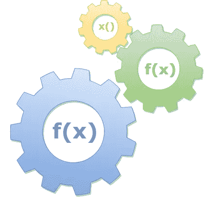

# 函数式编程:Groked

> 原文：<https://itnext.io/functional-programming-groked-c6bc9115cf3c?source=collection_archive---------2----------------------->

## 具有节点、反应、角度和 Vue



娱乐和利润的 FP

自从 90 年代末的艰难岁月以来，我一直与 JS 一起工作。我想我非常了解什么是函数式编程。

然而，到处都是这些术语和概念，我开始怀疑:我真的明白了吗？

所以我开始挖掘。这篇文章分享了我在挖掘过程中所学到的东西。

我认为，就具体细节而言，函数式编程(FP)相当容易理解。我在很大程度上是对的:仅仅是让*使用* JS，我就获得了很多。对你来说可能也是如此。

当我学会了礼节，我开始明白对计划生育有三个方面的理解:

*   **基本要点:**看到代码就理解
*   **战术:**充分理解 FP 的战术，以便在编码时将其作为一个工具
*   **策略:**充分理解 FP 的策略，以设计出结合其他方法使用它的系统

还有第四个潜在的东西:

*   **深奥:**语言层面的实现和哲学。这是一些令人兴奋的东西。

我希望能帮助你理解前三个问题。

在这篇文章中，我将从现代 JS 中的四个关键潮流来谈谈什么是 FP 并举例说明: **NodeJS** ， **React** ， **Angular** 和 **VueJS** 。

如果要我用一句话来回答“什么是函数式编程”这个问题，我会说:函数式编程是一门使用函数达到最佳效果的学科，目的是在松散耦合的组件之间实现清晰的语法和较小的表面积。

事不宜迟！

# 一级函数

函数式编程的概念依赖于一级函数(FCF)。FCF 与正常功能使用的区别在于，该功能被视为一个独立的事物，能够独立存在并被独立处理。

这也称为*作为数据的功能。本质上，当你为一个函数创建一个变量，传递一个函数作为一个参数，或者使用一个函数作为一个返回值的时候，你是在使用一级函数/函数作为数据。*

## **功能引用**

一个很好的例子是函数引用，如下所示。

```
let myFunction = new function() { console.info("foobar!"); }
```

有了引用，您就可以将该函数作为完整的代码成员来使用。这包括调用它，将其作为参数传递，或将其用作返回值。并不是所有的语言都是如此，它创造了独特的逻辑和设计方法的可能性。

在 JS 中，可以用普通语法调用它:

```
myFunction(); // outputs "foobar"
```

JavaScript 允许您定义自定义函数类型，就像它允许您使用`prototype`定义自定义对象类型一样。

## 元功能

利用其他函数的函数。我称它们为*元函数。*它们也被称为*高阶*功能*。*

我们将依次介绍两种基本类型:作为参数的函数(消费者)和返回函数的函数(生成器)。

## **消费者:作为参数的函数**

这才是 FP 真正的心脏。让我们看看它在服务器上的运行情况。这里看一下 node 和 express web 框架中的路由映射。

```
var express = require('express');
var app = express();app.get('/', function (req, res) {
  res.send('One Love!');
});
```

这是一些经典的 FP。当我们调用`app.get()`时，我们传递一个函数。

事实上，启用 NodeJS 的整个想法就是[事件循环](https://nodejs.org/es/docs/guides/event-loop-timers-and-nexttick/)。Node 架构的核心是 FP:函数被交给引擎来执行。

注意函数将如何从框架中接收参数(`req`和`res`)。

## "回拨"

这通常被称为回调函数。这些已经在 JS 中大量使用了..永远不会。这大概是 FP 最显眼也是最重要的特点。简而言之:你可能一直在使用回调，所以你可能一直在使用 FP。

回调是一个很好的、显而易见的术语:你正在传递一个函数，无论你传递给谁，它都将被回调。

这个看似简单的特性实际上为应用程序中的“连接点”带来了很多好处，定义了应用程序的各个部分如何交互。例如，当您在普通 JS(或任何框架)中将一个函数传递给 DOM 时，您是通过一个函数回调与浏览器进行交互。

“回调”简单明了，但是围绕这个想法还有很多其他复杂的术语。

## 匿名函数

当我们定义传递给 Express 的函数时，它是内联定义的，没有变量引用。这是一个匿名函数。

任何时候你看到一个没有引用的函数定义，那就是一个匿名函数。

## `=>`胖箭头语法

JavaScript 6(又名 ECMAScript 6)引入了函数定义的简写。我们可以这样写快速回调。

`app.get('/', (req, res) => {
res.send('One Love!');
});`

请注意，我们已经删除了`*function*` 关键字。这个清洁剂。我们可以更进一步:

`app.get('/', (req, res) => res.send('One Love!') );`

现在我们也去掉了花括号。相当干净。注意，如果只有一个参数，可以去掉括号；如果有返回值，而你没有花括号，函数将自动返回它计算的任何值。

## React.js 中的函数使用者

FP 在前端 JS 里也是遍地开花。在 React 中，回调用于处理元素上的事件:

```
<button onClick={function() { alert('click'); }}>
  Click THIS.
</button>
```

当然，我们也可以使用粗箭头 synax:

```
<button onClick={ () => alert('click'); }>
  Click THIS.
</button>
```

## **匿名函数，胖箭头，** `**this**` **关键字**

除了更简洁之外，胖箭头语法处理`this`绑定的方式与普通匿名函数不同。

本质上，`this`关键字将被解析为周围的功能上下文。因此，您可以说，胖箭头定义的函数将假定父函数或包装函数的上下文，而不是为自己创建新的上下文。在代码中:

```
var o = {};
o.test = function(){
  var standardAnon = function(){ 
    console.log("this = " + this);  
  }
  var fatArrow = () => console.log("this = " + this);
  standardAnon(); 
  fatArrow();
}
o.test();
```

产出:

`this = [object Window]
this = [object Object]`

如果你多看几遍,`this`的本质和两种匿名函数将会被牢牢植入(如果还没有的话)。

## 词汇“范围”

胖箭头语法的上述行为被称为*词法范围。*这是一种奇特的说法:由代码的单词本身定义的上下文。

换句话说，词法范围是在执行函数的代码行中找到的上下文，*而不是在函数定义的新上下文中。*

换句话说:如果词法范围有效，那么 *this* 关键字将用于函数的执行。

**边注:**根据 JavaScript 的*自己的命名约定*，这个应该叫做*词法上下文。*上下文的意思是“什么是`this`”。范围的意思是“哪些变量是可用的”。*叹息。*

## 关闭

你将看到的另一个 FP 术语是 *closure。Closure 更像是一个语言实现术语:它意味着功能上下文会一直存在，直到不存在对它们的引用。*

这意味着函数范围能够被打包(“封闭”)并保持超出其自身的存在，以便在该范围之外执行。

换句话说:函数的词法范围继续存在。例如:

```
foo = function(){
  var closuredVar = "From the parent closure";
  var bar = function(){
    console.log("I can see closuredVar: " + closuredVar);
  }
  bar();
}
foo();
```

对于 JS 开发人员来说，这可能很平常，但这是一种重要的语言:它足够聪明，可以为了执行内部上下文而维护外部上下文。

另一个你可能很熟悉的例子，即使你不知道这个新奇的词。

在这种情况下，你可能会想，“这就是它应该如何工作……显然，仍然存在对`foo()`的调用，所以语言应该保留上下文，包括内部函数的上下文。”

这是真的，这是它应该工作的明显方式(就像在任何垃圾收集语言中，您期望任何仍然有引用的变量继续存在)。只是在构建*语言本身的过程中，*实现那个显而易见的行为是不明显的，也不是微不足道的，至少可以这么说，交付它的方法被称为*闭包。*

## 使用集合

对于函数式编程来说，集合是一个明显的胜利——也许是最明显和突出的例子。通过使用函数参数，处理集合变得更容易和更容易理解。

各种数组(和类数组)函数:`forEach, map, filter`和`reduce`是这个故事中的明星。这些都内置在 JS 的集合中，它们都将函数作为参数，并将各个项传递给那个参数。

作为一个简单的例子，下面是`map`遍历一个数组并创建一个单词颠倒的新数组。

```
let words = [“test”,”foo”,”bar”];
let reversed = words.map(x => x.split(“”).reverse().join(“”))
```

这些方法的真正美妙之处在于它们紧凑，并且允许代码和思想的流动顺利进行。

## 流畅的编程

一般来说，关于集合 API 和 FP 的另一个伟大之处是“流畅编程”这个名字。这只是将函数链接在一起的能力，因为每个函数都返回一个值，下一个函数可以对该值进行操作。

例如，在下面，我们使用上面的`map`例子，并用对`reduce`的调用来链接它。最终结果是，我们从`map`得到一个新数组，其中包含反转的单词，然后从`reduce.`得到一个组合字符串

```
let words = [“test”,”foo”,”bar”];
words.map(x => x.split(“”).reverse().join(“”))
  .reduce((combined, x) => combined + “, “ + x);
```

这清除了在“命令式”编码中看到的无关的逻辑，由此呈现了框定要完成的工作的逻辑，即循环数组。在循环修改的方法中做上面的事情会占用更多的代码行，并且不容易阅读。

开发人员很少停下来思考，可以关注他们试图实现的业务逻辑。

从更广泛的意义上来说，FP 的工作方式是允许组件通过谨慎的、可移植的代码块(即函数)进行交互或通信。

驱动 OOP(面向对象编程)的原理和驱动 FP 的原理是一样的:封装和编码到接口。

只是这个函数是传递的功能中最小的一个。这使得它成为一个更干净的设计，因为任何时候你减少组件的表面面积，或者组件本身的占用空间，代码都更简单。

换句话说，您可以将函数传递给其他函数(在数组 api 中或其他地方)视为函数接口。提供者函数(使用参数函数)是一般化逻辑的插件。

这看起来很像 OOP 中的*策略模式*，但是同样，函数的紧凑性(以及 JavaScript 类型系统的动态性)使得组件协议非常紧密。

FP 与 OOP

在 OOP 这个主题上，有一些风吹着，声称一个比另一个更好。这是一个完整帖子的主题，但我要在这里提到，他们每个人都擅长不同的事情。

一般来说，你不会在它们之间做出选择；你为了一个特定的目的在它们之间进行选择。

总的来说，OOP 有利于构建结构，FP 有利于执行动作。对象和类就像汽车的底盘，或人体的骨骼，FP 就像电气或神经系统。

你可以看到这是事实，像 react、vue 和 angular 这样的现代 UI 框架都是基于*组件的*系统，这些系统类似于并经常使用 OOP 来定义结构。

**生成器:返回函数的函数**

FP 的另一个常见元素是返回函数的函数。这远不如函数作为参数常见。

这是因为函数生成器通常在框架或库方面比在应用程序客户端代码方面更有用。应用程序开发人员通常负责向其他函数提供函数以满足框架需求，但很少负责提供创建函数的函数。

下面是一个常见 react 模式的示例，其中粗箭头语法是链式的:

`handleChange = field => e => {
e.preventDefault();
// Handle event
}`

上面的目的是创建一个事件处理程序，它将接受有问题的字段，然后是*和*事件。这很有用，因为您可以将同一个`handleChange`应用于多个字段。简而言之:同一个处理程序可用于多个领域。

## 简化的功能

上面的 react 处理程序是一个定制函数的例子。“Curried function”是一个有点令人沮丧的名字:它纪念一个人，这很好，但它没有描述这个概念，这令人困惑。

无论如何，这个想法是当你有返回函数的函数时，你可以把对它们的调用链接在一起，这比创建一个有多个参数的函数更灵活。

当调用这些类型的函数时，您会遇到独特的“链式括号”语法:

`handleChange(field)(event)`

这是对 React 如何调用我们的`handleChange()` curried 函数的一种推测。我们调用根函数，传入字段参数，然后取回另一个函数，并执行它，传入事件对象。

# 更多代码示例

## 角度 4+和 RxJS

Angular 2 是一个干净的突破和重写。它所做的真正有远见的事情之一是采用 [RxJS](https://www.learnrxjs.io/) 作为它的事件系统。这带来了两个巨大的好处:每个事件在任何地方都用相同的系统处理；赛事系统质量高，维护严谨。

而且事实证明:RxJS 本身就是 FP 的一个漂亮例子。

RxJS 的核心思想是通过创建事件生产者(可观察对象)和事件订阅者来分离代码，然后用函数操作符处理事件流。

这类似于我们前面看到的 JS 数组方法的工作方式；事实上，将数据集合作为一组独立实例进行操作的想法被称为*流。*

为了强调相似性，许多 JS 数组方法，如`map`，以 RxJS 操作符的形式出现；不同之处在于，RxJS 被设计为处理来自几乎任何来源的流数据，包括具有不确定的开始、停止、间歇和错误的实时来源。

在 RxJS 的世界里，它被称为*反应式*编程。这里有一个简单的例子:

```
var button = document.querySelector(‘button’); Rx.Observable.fromEvent(button, ‘click’).subscribe(() => console.log(‘Clicked!’));
```

这应该是显而易见的。这是一个应用于按钮元素的简单事件处理程序。

在 Angular 里，你会随处看到这个*。*处理组件事件和组件间交互，转换数据，处理后端 API 请求。

以下是 Angular 监听鼠标事件，然后在光标移动到左上角时取消订阅的示例:

```
const [subscription](https://angular.io/api/service-worker/SwPush#subscription) = mouseMoves.subscribe((evt: MouseEvent) =>{console.log(`Coords: ${evt.clientX} X ${evt.clientY}`);
  if (evt.clientX < 40 && evt.clientY < 40) {
    subscription.unsubscribe();
  }
});
```

这里有一个更复杂的例子:

```
const typeahead = fromEvent(searchBox, ‘input’).pipe(
  map((e: KeyboardEvent) => e.target.value),
  filter(text => text.length > 2),
  debounceTime(10),
  distinctUntilChanged(),
  switchMap(() => ajax(‘/api/endpoint’))
);
```

我不打算在这里深究这个，但是看一看:这都是 FP。它本质上处理来自提前键入功能的事件，通过使用一个可观察的(通过`pipe()`命令)来确定何时命中提前键入数据的后端。

(这些例子来自[角度文档](https://angular.io/guide/practical-observable-usage))。

## vue . j

Vue 与 React 和 Angular 是同一个概念。它依赖于 FP，虽然不像其他两个那样严重:

```
data: function() {
  return {
    item: {
      name: 'Foo',
      description: 'Bar',
    }
  }
}
```

以上是 Vue 组件上的数据字段的示例。这是一个从另一个函数返回一个函数的简单例子。

Vuex 更加以 FP 为中心。

# 再来几个 FP 术语

## 希腊字母的第 11 个

经常与*匿名函数、*混淆，我们在这里讨论过。现实中，*更是一阶函数的同义词，*也涵盖在这里。

λ是函数作为数据的任何使用，即匿名函数或函数引用。

所有匿名函数都是 Lambdas。并非所有的 Lambdas 都是匿名函数。我发现这个术语最好的解释者是这里的。

## 纯函数

没有副作用的功能。

这些被认为是重要的(我认为是正确的),因为它们是复杂性的死胡同。

我的意思是:一个纯函数接受它的参数，并返回它的值，而不修改其他任何东西。用相同的参数重复调用一个纯函数肯定会返回相同的结果。

在 Angular 的通量式存储(ngrx)中，减速器在修改状态时使用纯函数作为动作。React 鼓励纯功能，并坚持在修改道具时组件的行为要像纯功能一样。

如果你能把逻辑表现为一个纯函数，那就去做。这意味着你已经实现了你的目标，没有不必要的改变外部状态或增加复杂性。

## 对透明性有关的

这与纯函数密切相关。

本质上，这意味着所讨论的函数对于它所修改的引用是透明的。再次:归结为只有参数和返回值参与执行它的工作。

# 结论

底线是 JS 已经*一直*相当面向 FP，这是它对函数巧妙处理的结果。普通 JS 和 jQuery 一代框架的事件处理程序都是 FP 风格的，就像 React 一样。

事件的概念是 FP 的核心。通过使用函数作为软件组件之间的交互点，交互可以简化为事件回调的思想。这提供了非常小的接触点，并且组件之间的表面积越小越好。

再次强调，理解 FP 的三个维度:

*   **具体细节:**当你看到代码时理解它，并以类似的方式使用它:这对所有 JS 开发人员都很重要
*   **战术:**理解 FP 的战术，足以在编码时将其作为工具；对架构师或主要开发人员至关重要
*   **策略:**充分理解 FP 的策略，以设计结合其他方法使用它的系统；如果您正在构建类似 React 的东西，而不是使用 React，可能会更有趣

希望，在追求这三个目标的过程中，我已经给了你一些动力。

## 关于计划生育的深层思考

关于 FP 的第四维(**深奥的**)的离别之思:我发现自己在阅读[溯因推理](https://en.wikipedia.org/wiki/Abductive_reasoning)，心想:“这是一些深奥的东西。”FP 诞生于编程进化过程中形成阶段的激烈思考。

因此，它直接关系到支撑软件本身的底层逻辑和心理结构。

我喜欢那东西。但是它与日常编码没有什么关系。

顺便说一下，你知道吗，如果你点击并按住拍手按钮，它会增加。还蛮好玩的…如果你想试试的话:)