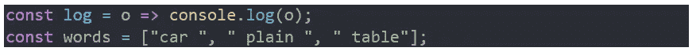
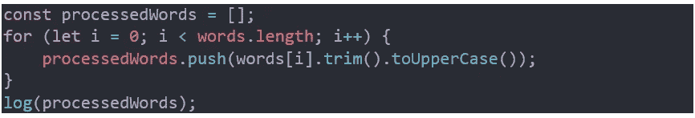
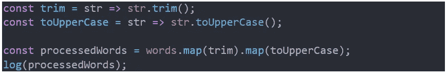
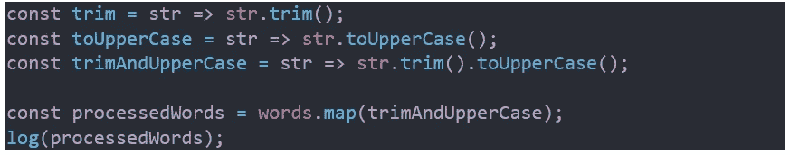
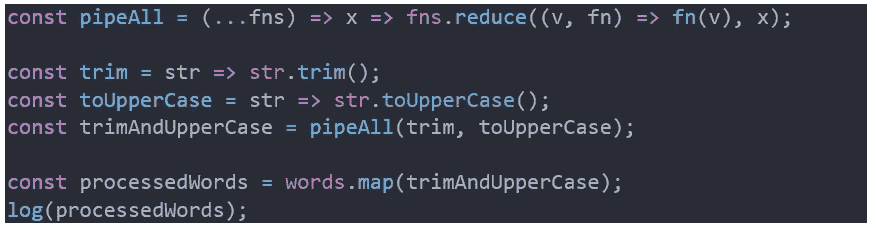
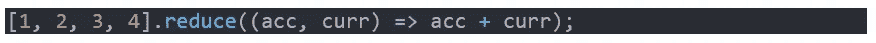
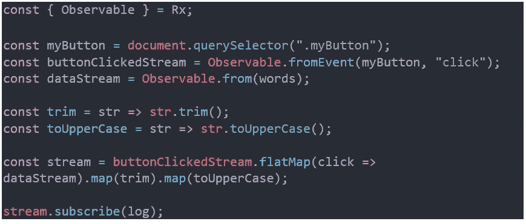
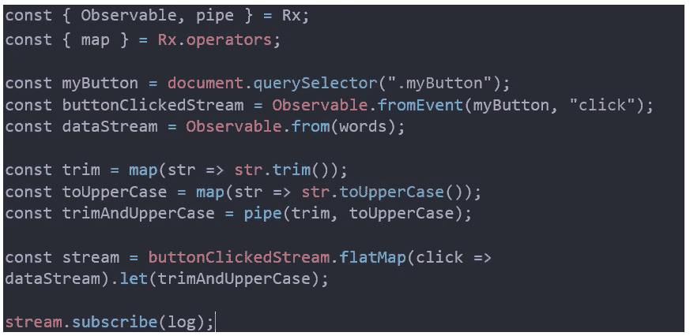
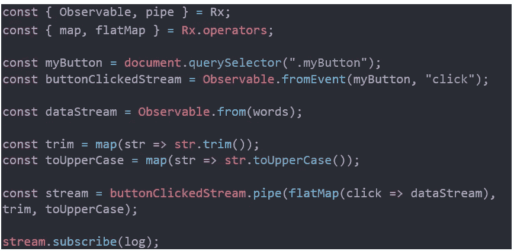

# 函数式反应式编程用简单的方式解释，用 JavaScript…是的，用简单的方式。

> 原文：<https://itnext.io/functional-reactive-programming-explained-in-a-simple-way-in-javascript-yes-in-a-simple-way-925b14cddf75?source=collection_archive---------1----------------------->

如果你读过这篇文章，为了理解它，你应该熟悉 JavaScript，应该了解什么是反应式编程(RP)，以及什么是函数式编程(FP)；虽然你不一定要精通它们中的任何一个，但是希望你离开时能够对函数式反应式编程(FRP)有一个更清晰的理解。

我想写这篇文章的原因是，在网上看了关于 FRP 的文章后，我找到的几乎都是 RP 的文章和声称是 FRP 但在“功能方式”上却什么都没做的例子。似乎有很多困惑；写 FRP 的开发人员，很多时候只是用点符号链接操作符到转换流，而不是通过使用**管道**链接*纯函数*，这是 FP 的核心。如果你不明白最后一句话，不要担心，解释它是这篇文章的重点。

让我们暂时忘记 FRP 和 RP，让我们看看传统的命令式和声明式编程方式之间的区别。为此，我将首先用我们大多数人用 JavaScript 编写代码的方式编写代码，然后我将使用 FP。这将刷新你的思维，如果你以前见过 FP，但有点生疏，它将帮助你理解从 RP 到 FRP 的过渡，以及为什么这两个术语不是一个意思。我将尽量保持例子的简单，这样它们就容易推理，但是，要完全理解这篇文章，你需要熟悉 RP 和 FP。

问题是:

*你有一个保存字符串数组的变量，你的任务是获取每个字符串，修剪它，将其转换为大写字母，然后将新的结果数组打印到浏览器控制台。*

我们永远不会修改原始数组，我们将在整篇文章中使用以下两个变量。除此之外，我将重复我们在每个示例中需要的代码，这样您就有了完整的代码片段，即使您正在使用手机，并且手边没有 IDE 或代码编辑器，也可以跟着做。

**传统命令式方式:**

我们对循环使用了一个**，并且我们将方法 **trim** 和 **toUpperCase** 链接在一起，没有什么新奇的东西，类似于我们可能每天都会看到的代码。**

**一种陈述方式:**

现在，我们以一种可以重用的方式创建了两个变量，并使用了 **Array.prototype.map** 方法来实现我们的目标。您可能已经注意到，通过这种方式解决问题，我们的效率很低，因为我们已经遍历了数组两次，首先是修剪值，然后将它们转换为大写。我知道如果我们就这样不管，你今晚会睡不好，我也是；所以让我们做点什么吧。

**改善效率低下:**

我们可以感觉更好，现在没有低效率。如果你认为第一个例子中的循环的**比**映射**函数执行得更好更快，我建议你看看这个伟大的演示[https://www.youtube.com/watch?v=g0ek4vV7nEA](https://www.youtube.com/watch?v=g0ek4vV7nEA)，我保证，它会改变你的想法。**

如果你是 FP 的拥护者，或者至少你喜欢它所提倡的东西，你会觉得有些事情看起来不对劲，你会认为有办法做得更好。无论如何，如果我们倾向于一种更实用的方法，我们确实可以做些别的事情。

既然你熟悉 FP，你至少知道 **pipeAll** 变量背后的思想，但我还是会稍微讲一下。 **Array.prototype.reduce**

在我们的例子中，数组中包含的元素不是数字，而是函数，比如 **trim** 和 **toUpperCase** ，所有这些函数都是通过将前一个函数返回的结果传递给它们中的每一个来执行的，对于 **words** 数组中的每一个值。这就像如果所有这些函数组成一个管道，每个**单词**都要通过它，并且在最后，它已经被修剪并转换成大写字母。如果你仍然不明白，你可能应该看看关于使用 **reduce** 的例子，并阅读一篇旨在恰当而全面地解释其工作原理的文章，相信我，这是值得的。

你可以在像兰博达、这样的库中找到像 **pipeAll** (名字其实是 **pipe** )这样的实现。我想在这段代码中包含实现，而不使用 Rambda，这样您就可以看到发生了什么，而不用去任何其他地方，我调用 **pipeAll** 而不是 **pipe** 的唯一原因是这样它就不会与**pipe***pure***函数*冲突，您将在**反应式编程**一节中看到。*

*现在，我们可以灵活地“管道化”我们想要的任意多的函数，这给了我们高度的灵活性来组合函数，我们甚至不必创建像 **trimAndUpperCase** 这样的变量，我们只需像这样内联 **map** 和 **pipeAll** :*

**

*现在我们的代码有了一个声明性的新外观，我们可以通过使用 Rambda 的 **curry** 方法****来创建我们自己的 **map** 版本。然后我们就可以删除前面那行代码中的点符号*了，但是我认为这对本文的目的来说太过分了。还有一点，这并不是真正的纯函数代码，因为我们访问的是**单词**变量，它的作用域并不局限于一个*纯函数*和，因为我们是在编写浏览器控制台，但在本文中我们不必如此严格，达到完全纯净并不是我们的目标。******

*****接下来，我将展示一个简单的 RP 示例，其中的问题几乎相同，但略有不同(因此我们看到了“反应方式”)。一旦用户点击页面上分配了 css 类“myButton”的按钮，我们必须将 **words** 数组中的值转换成大写字母，并打印到浏览器控制台。我们将使用 RxJS 库的 5.5.11 版本，因此可以随意添加一个指向[https://cdnjs . cloud flare . com/Ajax/libs/RxJS/5 . 5 . 11/rx . min . js](https://cdnjs.cloudflare.com/ajax/libs/rxjs/5.5.11/Rx.min.js)的脚本标签。*****

*******反应式编程:*******

**********

*****我知道你已经告诉我你熟悉 RP，但是如果你不太记得 **flatMap** 是做什么的，你可以看看大卫·威尔森写的这篇很棒的文章:[https://medium . com/@ w . Dave . w/being-more-reactive-with-rxjs-flat map-and-switch map-CCD 3 FB 7b 67 fa](https://medium.com/@w.dave.w/becoming-more-reactive-with-rxjs-flatmap-and-switchmap-ccd3fb7b67fa)。*****

*****这就是 RP，在了解了本文前面的函数式代码之后，我希望最后一个代码示例对您来说一点也不函数式。事实上，RxJS 5 引入了几个*纯函数*，就是那些允许我们做 FRP 的函数。*****

*******使用*让*和新的 pure 函数更加实用:*******

**********

*****这里我们使用了 **map** 和 **pipe** ，它们的 RxJS 版本，其操作方式与您在本文之前看到的相同。所以，即使你是 FRP 的新手，这段代码也应该是有意义的，这也是我一开始带你走这条过渡之路的原因，所以把你的心智模型从 RP 转移到 FRP 会更容易。*****

*****我们可以比这更有功能。让我们看看最后一个代码示例:*****

**********

*****我们以某种方式重构了代码，我们还“管道化”**平面图**，以及 **trim** 和 **toUpperCase** ，并且我们去掉了 **trimAndUpperCase** 变量。希望到现在为止，你能区分 RP 和 FRP，如果你能，我会很高兴，因为这意味着我已经完成了我的目标。*****

*****如果你像我一样，当你看到新的技术或方法或范例时，你想知道你能否用它们建立重要的、大的、可维护的、可重用的和可扩展的系统，你想知道你能否用反应式编程做到这一点，总的来说，我建议你观看这个非常有趣的演示:[https://www.youtube.com/watch?v=XRYN2xt11Ek](https://www.youtube.com/watch?v=XRYN2xt11Ek)。剧透一下，RP 为网飞的大部分开发基础设施提供了动力，包括客户端和服务器端，这应该回答了你的问题。*****

*****编码快乐！*****