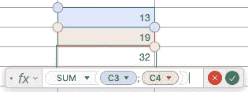

# Scala 中的函数式反应式编程(第 1 部分)

> 原文：<https://itnext.io/functional-reactive-programming-in-scala-from-scratch-part-1-9f9db0c47478?source=collection_archive---------4----------------------->

在这一系列的文章中，我们想从头开始为 Scala 中的函数式反应式编程开发一个小框架。这是这个系列的第一部分。剩下的部分可以在这里找到:[第二部分](/functional-reactive-programming-in-scala-from-scratch-part-2-3d1559a11629)，[第三部分](/functional-reactive-programming-in-scala-from-scratch-part-3-d999dca5fa69)。


照片由[马库斯·斯皮斯克](https://unsplash.com/@markusspiske?utm_source=medium&utm_medium=referral)在 [Unsplash](https://unsplash.com?utm_source=medium&utm_medium=referral) 拍摄

自从[反应式宣言](https://www.reactivemanifesto.org)发表以来，反应式编程经历了相当多的炒作。已经为基本上每一种主要的编程语言开发了一堆库来促进反应式编程。其中最突出的是针对 Javascript、Python、Scala 和其他一些语言的 ReactiveX 库。

虽然这些库很棒，但是不要将它们与*功能性*反应式编程混淆。正如 ReactiveX 本身的文档中所述:

> 它有时被称为“功能反应式编程”，但这是一个误称。ReactiveX 可能是功能性的，也可能是反应性的，但“功能性反应性编程”是不同的动物。

ReactiveX 和 Functional Reactive Programming 等反应式库之间的主要区别在于，这些库大多只查看*事件*，而不查看*行为*。事件是随着时间推移而发出的离散值，如鼠标点击。行为是始终有当前值的连续值，例如鼠标位置。

(鼠标点击本身没有值，它只是一个每当用户点击某个地方时被触发的事件。另一方面，鼠标位置总是有一个当前值——但是它不会在特定的时间点被“触发”。)

如果你对这一切感到困惑，看看我的文章[揭开函数式反应式编程的神秘面纱](/demystifying-functional-reactive-programming-67767dbe520b)吧，这篇文章详细讨论了我刚刚提到的所有这些术语。

在这一系列文章中，我们将为 Scala 中的函数式反应式编程开发一个小框架，一步一步来，完全从头开始。我们要看的代码是 Martin Odersky 和 Ingo Maier 的 Scala 的简化版本。React 在用 Scala 反对观察者模式的论文[中也有描述。反应](https://infoscience.epfl.ch/record/176887/files/DeprecatingObservers2012.pdf)

我写这篇文章的灵感来自于观看马丁·奥德斯基关于函数式编程的在线课程的[视频](https://www.coursera.org/lecture/progfun2/lecture-4-2-functional-reactive-programming-pEsTy)，在视频中他简短地解释了 Scala.React 的部分内容。然而，如果你不是马丁·奥德斯基，你可能会发现这个视频很难理解。代码中有相当多的内容不会立即呈现在眼前。这一系列的文章将试图更温和地解释这些概念。我相信提议的编程框架会产生非常优雅的代码，即使您在日常工作中不使用它，也有很多东西可以从中学习。

包含这里讨论的所有代码的笔记本可以在 [GitHub](https://github.com/timo-stoettner/frp-scala) 上找到。

*(注意:我假设对 Scala 有一些基本的了解。然而，我将尝试解释即将出现的更高级的语言特性，因此如果您不是 Scala 专家，也应该能够理解。)*

# 动机

反应式编程通常用电子表格来解释。想象一个单元格包含另外两个单元格的总和。如果您更改一个单元格的值，包含总和的单元格也会立即更新—它*对另一个单元格的更新做出*反应。



电子表格:两个单元格的总和

根据经典的功能反应式编程，单元的值是*行为*。它们包含随时间变化的值。总和是时间的*函数*,取决于其他两个单元格的值。

行为有时也被称为*信号*。在下文中，我也称它为*信号*,因为我觉得用这个词更合适。(一个信号并不只是以它想要的方式“表现”,而是反映了一个可能反过来依赖于其他信号的值。)还有，Scala。React 也称之为信号。

在这篇文章中，我们将看到一个非常相似但稍微简单的例子，不要把事情复杂化。我们将看一个银行账户类的例子，让你存钱和取钱。然后，合并器会汇总你告诉它所依赖的银行账户，这样你就可以随时知道你的总余额。(合并器类似于电子表格示例中的求和单元格。)

说得够多了，让我们来看一些代码。我们追求的是能够编写如下所示的代码:

类只是让你存钱和取钱，并跟踪你银行账户的余额。`consolidated`函数返回一个`Signal`，对您传递给它的`BankAccount`的余额求和。

很优雅，不是吗？最后，只要你愿意，你就可以简单地打电话给`total()`，获得你两个银行账户的当前价值。你不必像在[观察者模式](https://en.wikipedia.org/wiki/Observer_pattern)中那样跟踪观察者和主题。实际上，你会有一个连续的值(如 FRP 的“行为”)，它依赖于其他值并自动更新。

那么我们要如何实现这些神秘的`Signal`和`Var`呢？让我们开始吧。

# 理解`Var`

首先，为了简单起见，让我们忽略这样一个事实，即我们想要以上面显示的方式合并不同的银行账户。我们只看一下`BankAccount`这个职业本身。我们如何实现`Var`来让下面的代码工作？

虽然理解这段代码中发生的事情应该很简单，但是如果你对 scala 有基本的了解，这里有很多 scala 的语法糖的例子。不了解它们，您可能很难实现`Var`。所以让我们快速浏览一下。

## `apply`在伴物体中

正如您可能知道的，如果您在一个类的伴随对象中定义了一个`apply`方法，那么您可以创建一个没有`new`关键字的类的实例。伴随对象被定义为与它“伴随”的类同名的对象。要使语句`val balance = Var(0)`工作，您需要执行以下操作:

这里我们只定义了类`Var`，它接受一个整数和一个带有 apply 方法的 compantion 对象，该方法返回一个`Var`的实例。此外，我们为`Var`添加了一个变量`curVal`，以便能够在以后更改该类的值。

## b) `apply`作为类方法

当添加一个方法`apply`到一个类(不是它的伴随对象)时，类的实例可以像方法一样被调用。编译器自动将其转换成对 classes `apply`方法的调用。举个例子，

`balance()`

将被编译器转换成

`balance.apply()`。

有了这些知识，添加使我们能够通过调用`balance()`来检索`balance`的当前值的功能就变得非常简单了:

现在，当我们将`balance`定义为`Var`的实例并调用`balance()`时，我们将检索存储在`curVal`中的当前值。

*(实际上，*`*apply*`*)-trick 对同伴对象的工作方式和对类方法完全一样。当你调用* `*Var()*` *时，编译器会将此转换为* `*Var.apply()*` *。由于没有实例就不能调用类方法，这就调用了伴随对象的* `*apply*` *方法。当调用* `*balance()*` *时，这就唤起了该类的* `*apply*` *方法，即* `*balance*` *是的一个实例。)*

## c) `update`作为类方法

正如我们所见，scala 编译器将`balance()`转换为`balance.apply()`。同样，这条线

`balance() = 5`

被转换成

`balance.update(5)`。

你可能已经不知不觉地用了这个语法糖很多次了。当有一些数组`arr`时，代码`arr(1) = 5`被转换成`arr.update(1,5)`

了解了这一点，让线`balance() = curBalance + x`工作起来应该是相当直截了当的。使上面的 BankAccount 类工作的完整代码如下:

# 理解信号

在这个例子中，到目前为止，我已经忽略了`Signal`的实现。你可能已经注意到，函数`consolidated`应该返回一个`Signal`，到目前为止我们只涉及了`Var`。

实际上，`Var`应该是`Signal`的子类。我们所追求的是，我们希望能够用`Signal`定义一个不可变的信号(一个总是有相同值的信号)，以及一个其值可以用`Var`改变的信号。

所以在定义了`val s = Signal(3)`之后，无论如何`s`的值都将保持为 3。然而，正如我们已经看到的，我们可以像这样更新`Var`余额，将其值更改为 20:

```
val balance = Var(0)
balance() = 20
```

(注意 balance 本身是用`val`定义的不可变值。只有`Var`实例的私有变量发生变化，而我们不能给`Var`的新实例赋值`balance`本身。)

你可能会问自己:如果一个`Signal`是不可变的，那么它有什么用处呢？难道`consolidated`不应该在每次更新余额时自动更新吗？

实际上，`consolidated`的值是它所依赖的`BankAccount` s 值的*函数*。功能不应该改变。只有这个函数返回的值会随着时间而改变。如果这还不清楚，希望以后会变得更清楚。

那么回到我们对`Var`的定义，我们如何扩展上面的实现来更新`balance`？让我们来看看:

我们在这里所做的是，我们基本上只是从上面获取了`Var`的实现，并将其命名为`Signal`。为了反映你不能从类外(或子类)修改信号的事实，我们在`update`方法中添加了`protected`关键字。最后，`Var`扩展了`Signal`并且`update`方法在没有`protected`关键字的情况下被覆盖，以便能够从外界使用该方法。

看起来不错，对吧？现在我们有了所有需要的构件。我们已经定义了`Signal` s 和`Var` s，类型检查器很满意。所以让我们试一试吧！

嗯，不幸的是，这还没完全实现。

事情是这样的:函数`consolidated`检索每个账户的余额，将它们相加，并返回一个带有计算结果的信号。如果你看一下`Signal`的类定义，`initVal`就是按值调用。这意味着它的整数值是在初始化时计算的，并且永远保持不变。代码片段中的以下微小变化说明了这一点:

这里，在定义`total`之前，我们在银行账户`a`的余额上加了 20。因此`total()`等于 20，不管我们之后可能对账户余额做什么改变。

在本系列的下一部分[中，我们将看看如何解决这个问题，敬请关注！如果到目前为止您有任何意见或建议，我将非常感谢您的反馈。](/functional-reactive-programming-in-scala-from-scratch-part-2-3d1559a11629)