# JavaScript 中的功能情感分析

> 原文：<https://itnext.io/functional-sentiment-analysis-in-javascript-754f58628746?source=collection_archive---------2----------------------->

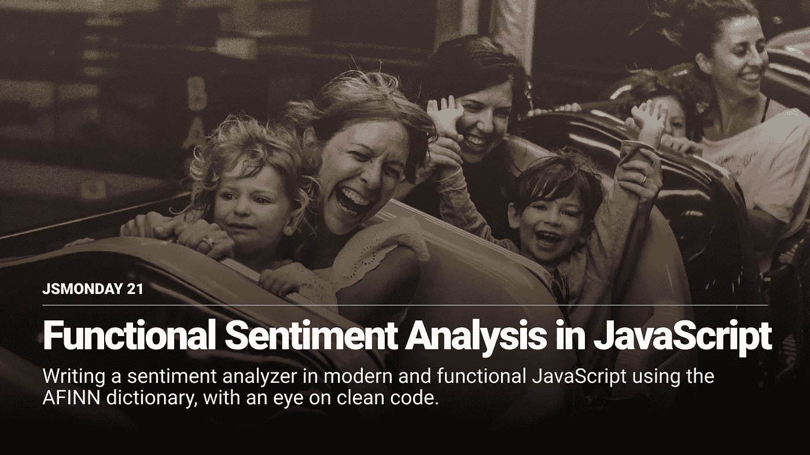

假设你有一个很受欢迎的博客，你想知道某个帖子上所有评论的情绪。
我们可以很容易地用 **Brain.js** 建立一个神经网络(我不久前写了一篇关于这个的文章[**)，但是我们有一个更简单的情感分析的替代方法:AFINN**](https://medium.com/openmindonline/emotion-detection-with-javascript-neural-networks-5a408f84eb75) 字典。

**AFINN Dictionary** 是由**Finn RUP Nielsen**用一个介于`-5`和`5`之间的整数手动评估的英语术语列表(但是你可以很容易地找到其他语言的对应词)。
当一个术语被评为高等级(例如，“**杰出”**被评为`5`)，这意味着它是非常积极的。相反，当一个术语被评为低等级时，意味着它非常负面。

所以如果给定的文本在情感分析后给出`5`、`10`、`2`的结果，就意味着具有积极的情绪。
否则有负一。

# 构建分析器

首先，我们需要 AFINN 字典。我做了一个 JSON 版本，可以在这里 访问 [**。
如您所见，这是一个巨大的对象，其中每个键都是一个术语，其评级是一个值，让我们先睹为快:**](https://api.myjson.com/bins/1aoxir)

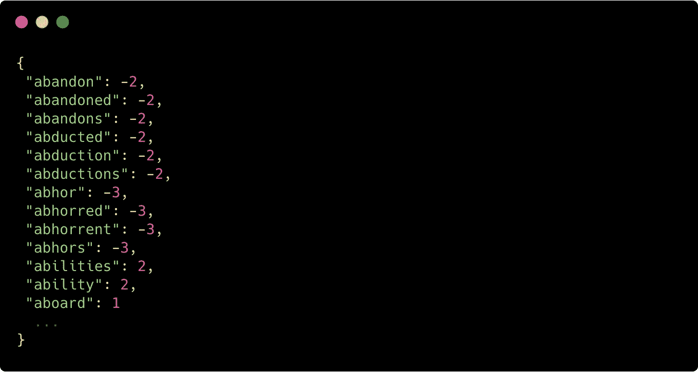

现在我们需要创建分析器本身。这个算法非常简单:我们只需要标记我们的输入文本，并将每个单词与其对应的 AFINN 值相关联。

因此，首先，让我们创建一个函数来标记我们的文本:

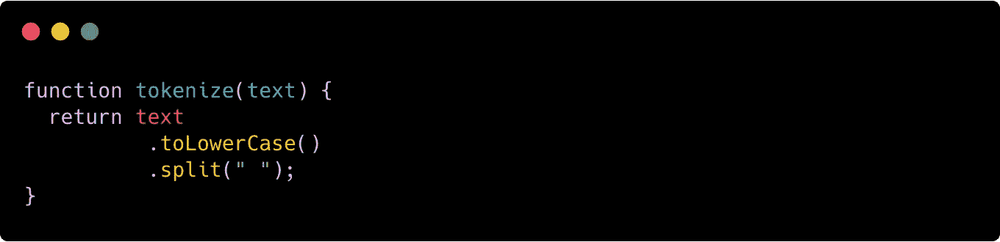

额外提示:我是正则表达式的超级粉丝，但是我注意到使用正则表达式拆分一个大文本非常慢。出于这个原因，在上面的函数中，我使用了一个空白字符来分割它，这有点不太优雅，但是速度更快！(**)**

**接下来，我们需要删除每个非单词字符。例如，现在我们可能有一个如下所示的数组:**

**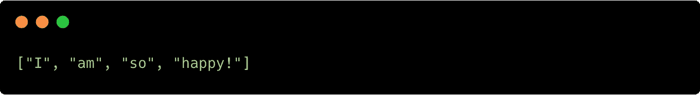**

**但是你可以看到，`"happy!"`字符串包含一个感叹号，需要删除。否则，我们将无法在 AFINN 对象中找到单词“happy ”:**

**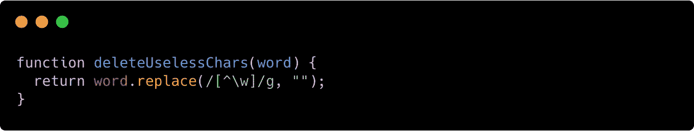**

**我知道我们以前说过正则表达式很慢。但是这里出现了计算机科学中一个有趣的概念:**干净代码**。
我们可以使用多个`replace`语句来编写上面的函数，但是作为一个解决方案会有多脏呢？
与`tokenize`函数不同，为了获得可维护性、可读性和更干净的代码，我们自愿采用了一个性能较低的解决方案……这完全值得！**

**如果你不熟悉 RegEx，在我们的`word.replace`语句中，我们刚刚说过检测每个非单词字符并删除它。**

**很好，现在我们需要使用 AFINN 字典为每个单词分配一个比率。另一个问题来了:我们应该使用循环、递归、高阶函数( [**)吗？贴图方法**](https://medium.com/openmindonline/jsmonday01-the-awesome-map-method-dfaae3233ae2) )？**

**答案是:看情况。
循环非常高效，但是难以阅读和维护。
递归更容易阅读和维护，但是有一些已知的 [**内存相关的**](https://medium.com/openmindonline/js-monday-06-adopting-memory-safe-recursion-d26dcee409c9) 和 [**性能**](https://medium.com/openmindonline/improve-performances-using-memoization-b01963dd3624) 问题。**

**我个人倾向于使用`.map`方法，原因有二:**

1.  **它有助于采用功能方法解决问题。**
2.  **它是内存安全的。**
3.  **它使代码更容易阅读。**

**同样，我们没有采用最快的解决方案是有原因的:编写更好的代码库。**

**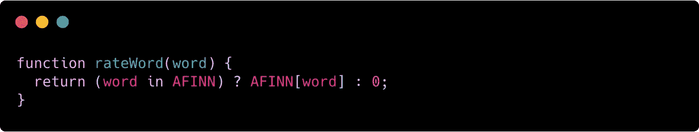**

**嘿嘿嘿这是怎么回事？！我们只是声明了一个简单的`rateWord`函数，它检查给定的单词是否是 AFINN 字典的一部分。如果是这样的话，我们就从字典中取 is rate，否则我们就把`0`赋值为 rate。那么我们现在有什么？**

**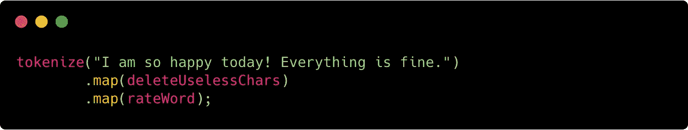**

**我们现在能够利用 [**函子**](https://medium.com/openmindonline/js-monday-09-understanding-functors-43a426d34e26) 的优势，并连接多个`map`方法，以检索表示文本中每个单词的值数组:**

**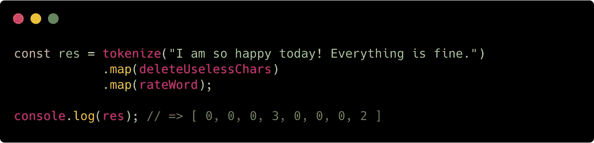**

**所以现在我们有了一个很容易求和的整数数组…这个和就是我们的结果！**

**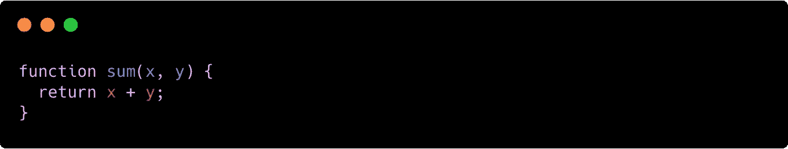**

**这实际上是我们需要的最后一个函数。让我们使用`[**reduce**](https://medium.com/openmindonline/js-monday-08-reduce-eff9fac970b5)`方法将所有东西放在一起:**

**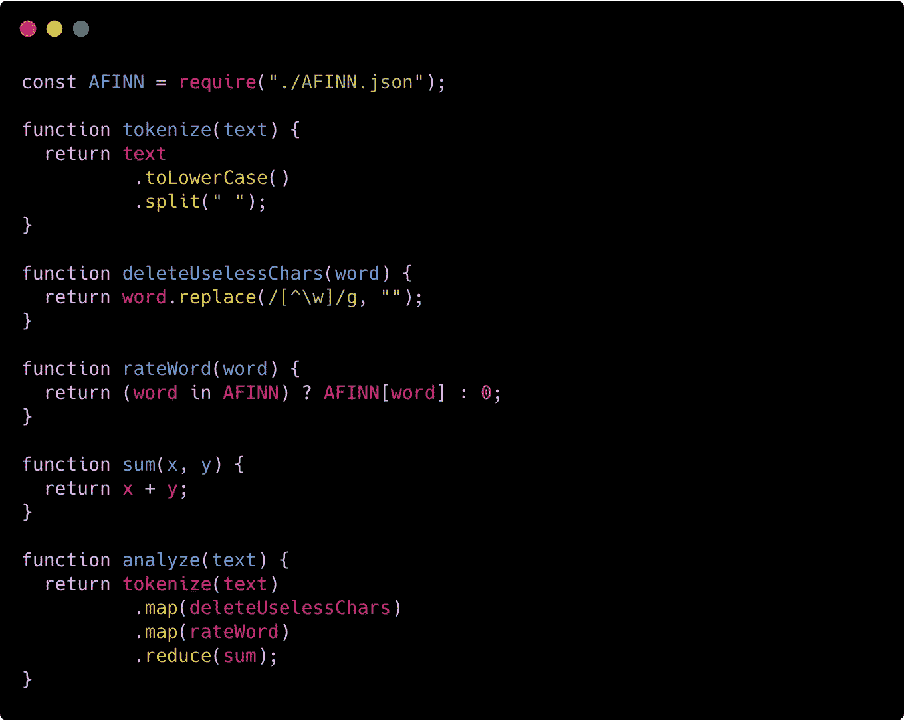**

**仅此而已！让我们做一些快速的情绪分析:**

**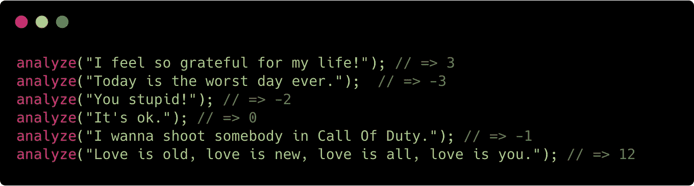**

**效果非常好！
那么，在构建这个简单的情感分析器时，我们学到了什么？**

****函数方法**帮助我们编写更易维护和测试的代码。
当你作为一名程序员工作时，你会花大部分时间阅读你现有的代码。浪费时间阅读糟糕的代码会降低你的工作效率，并且很容易让你在代码库中引入一些错误。
我们今天写的每一个函数**都是一个纯函数**，可以很容易地用确定性的方式测试。
代码流易于遵循和扩展，当我们需要对现有代码库进行一些更改或添加一些新功能时，这将使我们更加高效。**

****