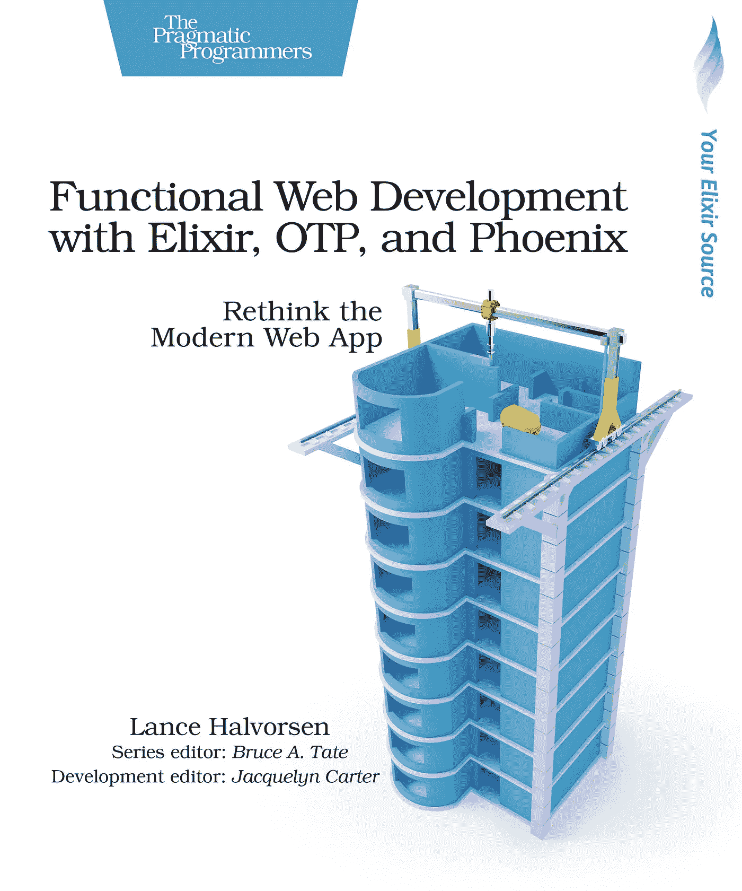

# 用 Elixir、OTP 和 Phoenix 进行功能性 Web 开发——书评

> 原文：<https://itnext.io/functional-web-development-with-elixir-otp-and-phoenix-a-book-review-b95bbb4ae98f?source=collection_archive---------3----------------------->

最近，我很高兴地阅读了 Lance Halvorsen 的“使用 Elixir、OTP 和 Phoenix 进行功能性 Web 开发”。作为《长生不老药》和《凤凰城》的粉丝，我想我应该花点时间写一篇对这本书有建设性的评论，这样其他正在寻找这个主题的好书的人就可以自己选择了。

# **先决条件**:

这本书不会教你长生不老药或凤凰。它假设您对这两者都有所了解。我也有同感。为了从这本书中得到最好的收获，你应该对仙丹和凤凰有所了解。尽管有很多关于这些主题的资源，我还是推荐以下三个

*   https://pragprog.com/book/elixir16/programming-elixir-1-6[迪夫·托马斯](https://pragprog.com/book/elixir16/programming-elixir-1-6)的《编程仙丹 1.6》
*   Bruce Tate、Jose Valim 和 Chris McCord 编写的《编程凤凰 1.4》——[https://pragprog.com/book/phoenix14/programming-phoenix-1-4](https://pragprog.com/book/phoenix14/programming-phoenix-1-4)(目前，这本书处于测试版)。你也可以使用 1.3 版本。
*   Benjamin Hao 的《Little Elixir & OTP 指南》——[https://www . manning . com/books/the-Little-Elixir & OTP 指南](https://www.manning.com/books/the-little-elixir-and-otp-guidebook)(这本书可选读，但很棒)

# **这本书有什么好的:**

在本书中，作者采用了一种不同的方法来编写 web 应用程序。尽管大多数 web 应用程序是无状态的，并围绕着某种数据库进行状态管理，但在本书中，作者在不使用任何数据库的情况下维护了应用程序的状态。该应用程序是以自下而上的方式开发的，保持了业务领域逻辑与 web 框架自身强加的领域逻辑的分离。因此，应用程序(在这种情况下是游戏)本身独立于 web 层，即使没有 Web 层也可以独立测试和运行。

这本书清晰地呈现了信息，非常引人注目。作者小心谨慎地选择数据结构，一步一步地展示每个模块/功能/数据结构，以便于理解、实现和单独测试。我不得不说很少有书能如此清晰地呈现如此复杂的主题。

这本书分为三个部分—

**第 1 部分**是开发游戏应用程序及其所有数据结构和业务逻辑的地方。已经开发了状态机来跟踪应用程序状态。在第一部分的最后，它是一个独立的应用程序，可以从 **iex** 运行和测试。

第 2 部分是 OTP 出现的地方，原因有两个——容错和并发管理。作者很好地描述了 gen server/Supervisor/Application 行为的必要概念，并且非常清晰地实现了这些概念。

**第 3 部分**是作者将 Phoenix Web 层放在第 2 部分之前开发的 OTP 应用程序之上的地方。我不得不说，尽管所有关于渠道和存在的概念都被小心翼翼地提出来，并做了很好的解释，我还是对这部分有点失望。我希望一个成熟的凤凰应用程序与前端视图和模板。但事实并非如此。相反，作者实现了后端代码，并从浏览器控制台验证了实现工作。在一本关于 Web 开发的书中，这让我很失望。此外，没有真正的代码来验证用户的渠道，而是作者提到了克里斯麦科德的书上面提到的。我在运行书中的一些代码时遇到了问题，但这可能是由于版本的差异——我用的是 Phoenix 1.4，而这本书涵盖了 1.3。

# **什么能让它变得更好**:

我认为这本书内容的以下两个变化可以帮助进一步超越这本书，使它更加完整和独立—

*   **带认证的成熟 web 应用** —将游戏应用转变为带通道认证的成熟 Web 应用，并添加带有视图/模板的前端代码**。**
*   **Umbrella App** —与其像书中那样通过 mix.exs 添加后端 OTP 应用程序作为依赖项，我认为一个 Umbrella 应用程序的演示会更合适。

我还会加入一章关于测试的内容，但我认为克里斯·麦考德的书在这方面做得很好。

# **申请代码:**

最后，我已经在我阅读的书中写了应用程序代码。如果有人感兴趣，代码可以在我的 github 上找到—

 [## 伊梅拉杰/凤凰城 _ 游乐场

### 在 GitHub 上创建一个帐户，为 imeraj/Phoenix_Playground 的开发做出贡献。

github.com](https://github.com/imeraj/Phoenix_Playground/tree/master/1.4) 

总的来说，我很高兴我遇到了这本书。我希望这篇评论能鼓励 Elixir/Phoenix 新手们挑选一本关于这个主题的好书。

*更多详细和深入的未来技术帖子，请关注我这里或上*[*Twitter*](https://twitter.com/meraj_enigma)*。*