# 测试组分与酶反应的基本技巧

> 原文：<https://itnext.io/fundamental-tips-for-testing-react-components-with-enzyme-2c56e73de951?source=collection_archive---------3----------------------->

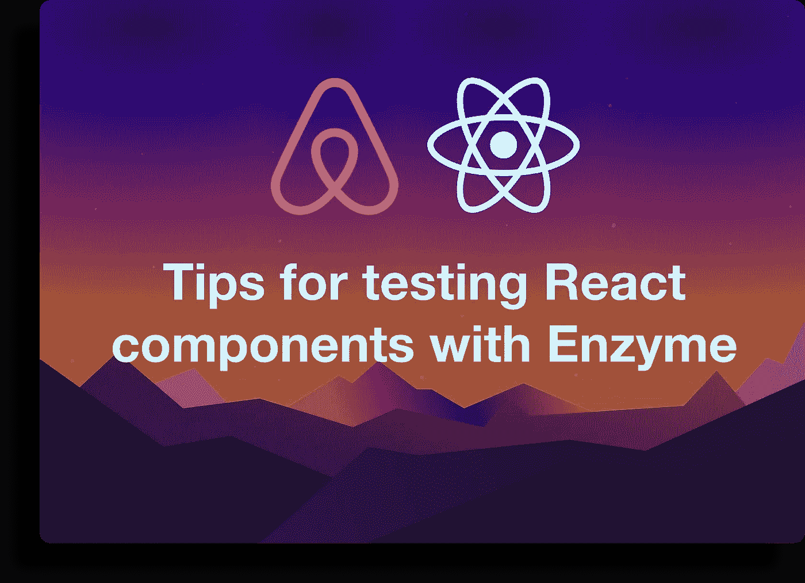

如果你不熟悉所有可用的工具，用酶测试反应成分是很棘手的。这篇文章将涵盖 Enzyme 提供的帮助编写 React 组件单元测试的基本技巧和实用程序。

# #1 查看 HTML 输出

在用 Enzyme 编写测试时，能够看到组件的 HTML 输出是很方便的。为此，您可以在挂载的元素上使用`debug`方法:

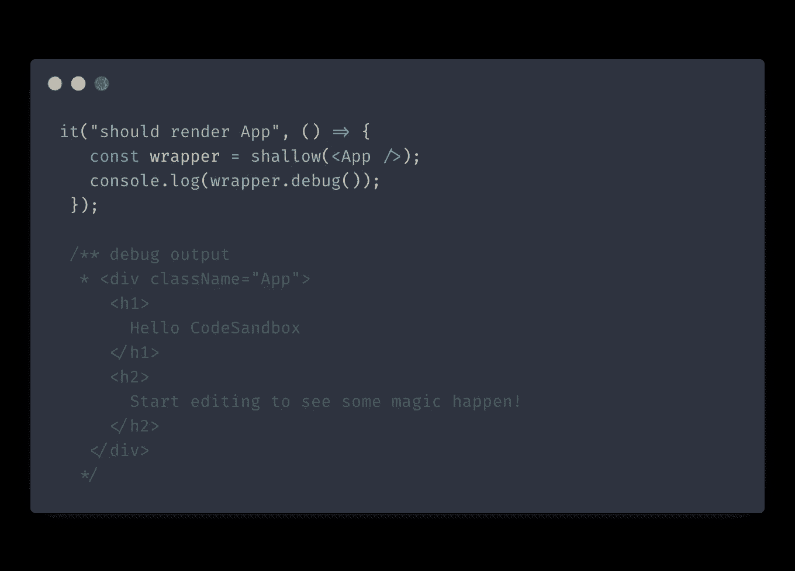

# #2 向组件传递上下文

用于浅层渲染组件的`shallow`方法接受第二个选项参数，让您指定`context`选项。[库文档](https://enzymejs.github.io/enzyme/docs/api/shallow.html#shallownode-options--shallowwrapper)声明您可以使用该选项将上下文传递给 React 组件。然而，它有一个问题。这种方法只适用于遗留的`context`对象，不适用于现代的上下文 API。

那么现代 API 的工作方式是什么呢？更好的方法是使用`wrappingComponent`选项将上下文提供者指定为包装器:

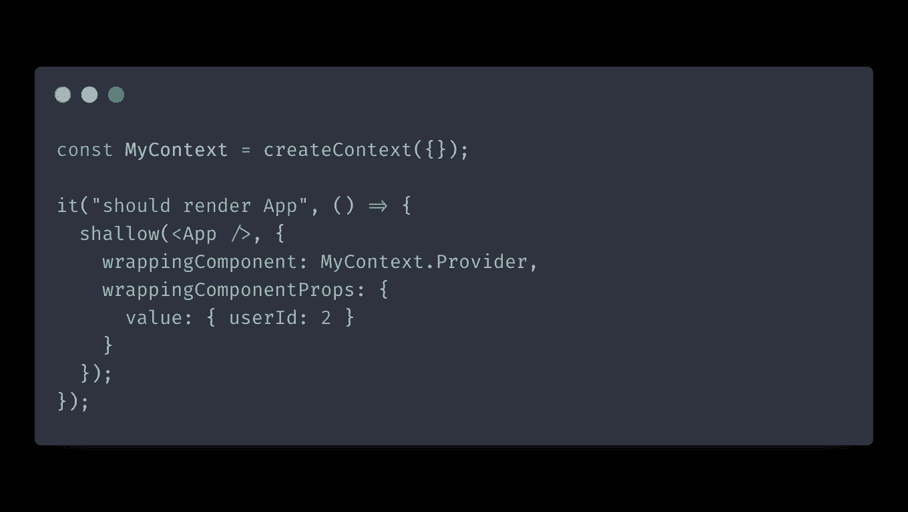

以这种方式提供上下文确保了`shallow`方法的返回值仍然是您的目标测试组件。

# #3 选择器类型

人们通常使用 CSS 选择器来寻找酶中的成分。但是，您还可以使用其他类型的选择器，具体来说有五种。

## 半铸钢ˌ钢性铸铁(Cast Semi-Steel)

我们讨论过的常规 CSS 选择器:

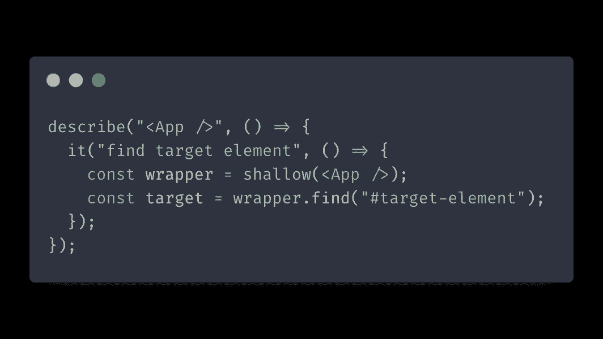

## 支柱

该选择器基于组件属性的值来定位组件。语法与 CSS 属性选择器相同:

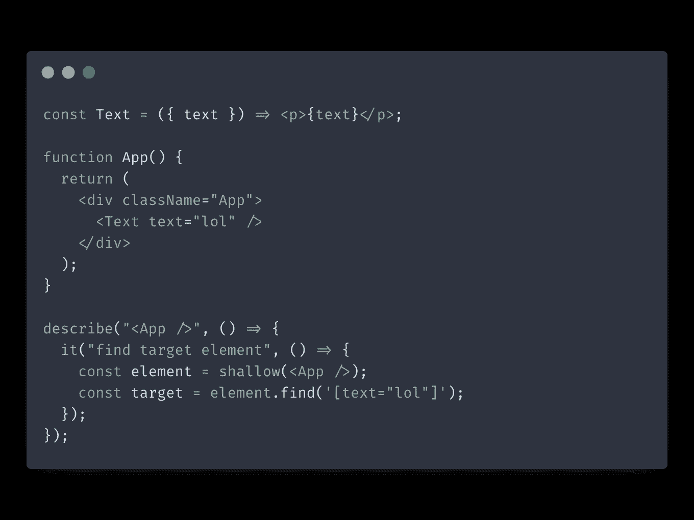

## 组件构造器

使用组件的构造函数查找组件。只需将引用传递给构造函数:

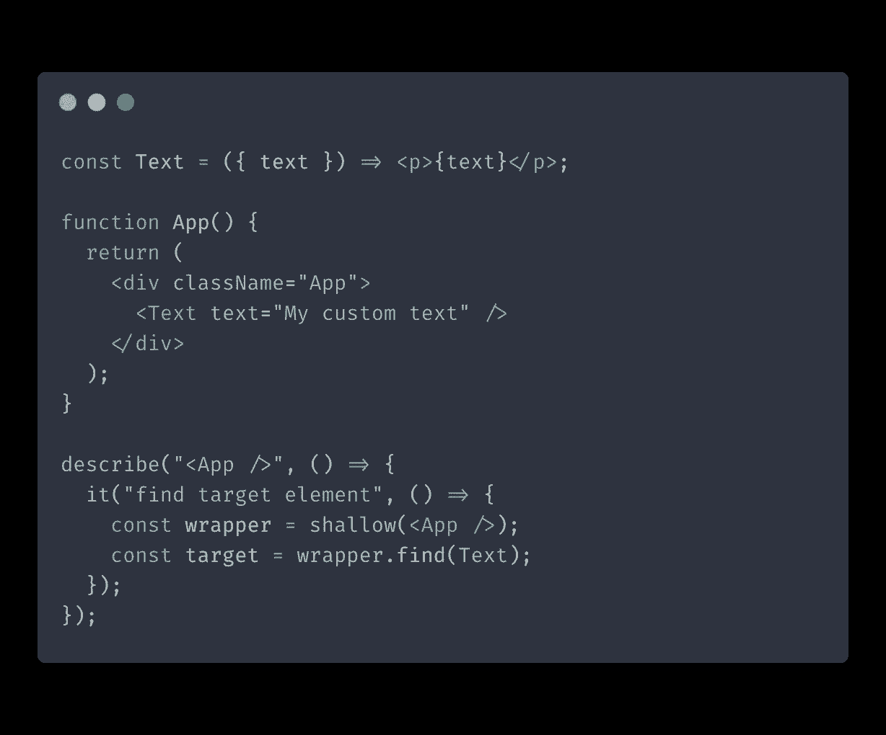

## 组件显示名称

我们可以简单地传递组件的显示名称来找到它。需要注意的一点是:`displayName`必须以大写字母开头，否则 Enzyme 会将其解释为 CSS 选择器。

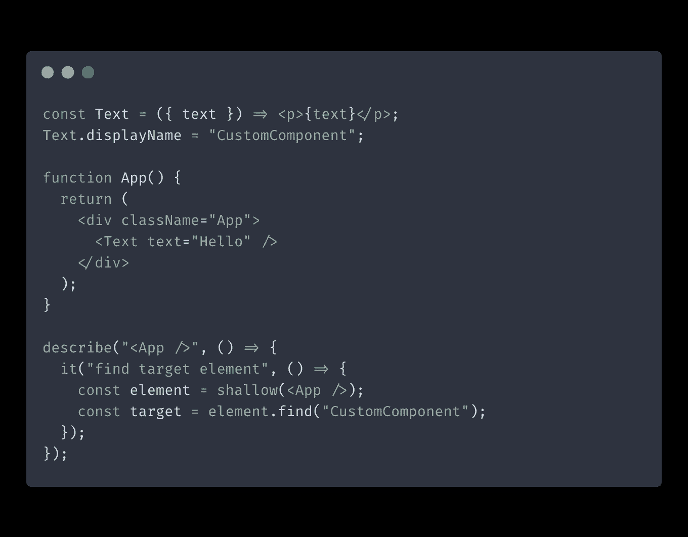

## HTML 属性选择器

我们可以使用这个选择器根据 HTML 属性的值来查找目标元素。我们所需要做的就是传递一个对象，该对象与我们试图寻找的 HTML 元素的属性相匹配。

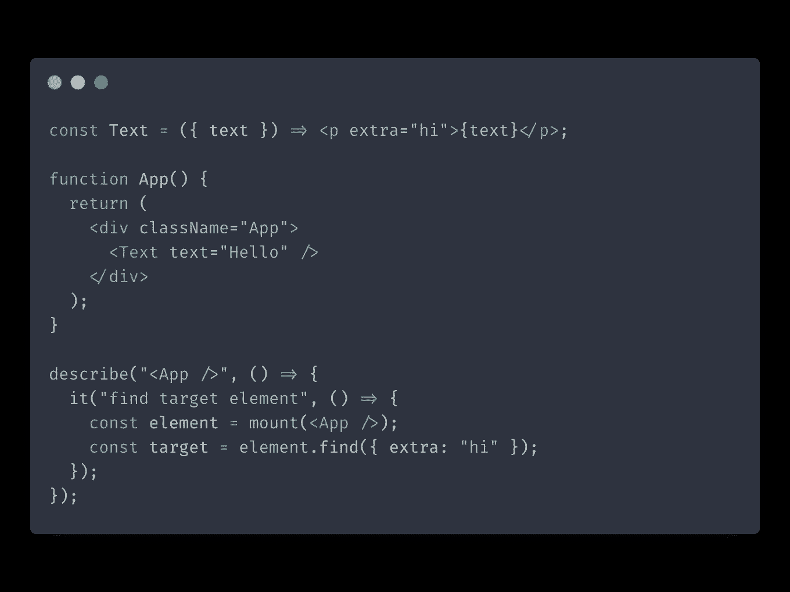

# #4 访问道具

对于酶，有两种不同的`props`方法可以使用。您可以直接在挂载的组件上调用 props，或者您可以使用`instance().props.`在组件的实例上调用 props。正如您可能猜到的，它们的返回值之间存在差异:

*   `instance().props`返回 React 组件本身的道具。
*   直接在包装器上调用`props`将返回底层 HTML 节点的属性。

# #5 模拟事件

`simulate`函数模拟包装器根节点上的事件。您可以用它来模拟点击、滚动、输入和其他用户动作。

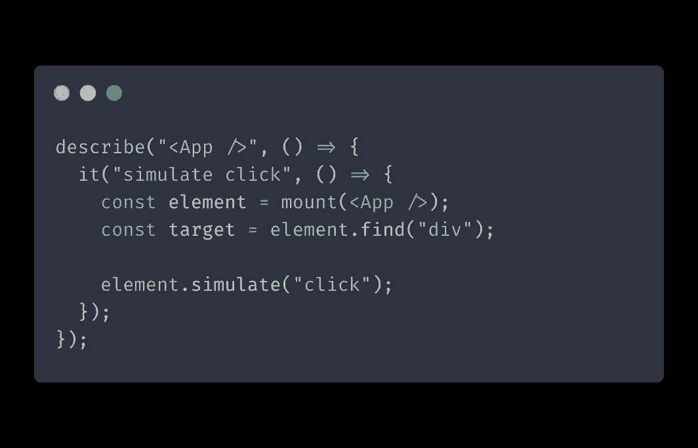

最重要的是，`simulate`接受可选的事件参数，这允许您模拟事件对象:

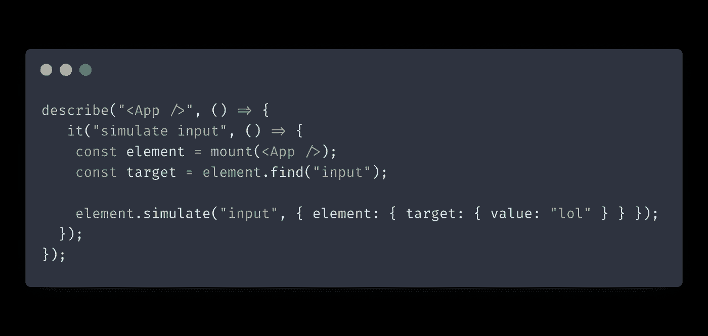

# #6 测试连接到 Redux 的组件的简单方法

测试连接到 Redux 的酶组件通常很棘手。一种广泛使用的方法是用 Redux provider 包装 React 组件并挂载它，或者使用 [redux-mock-store](https://github.com/reduxjs/redux-mock-store) :

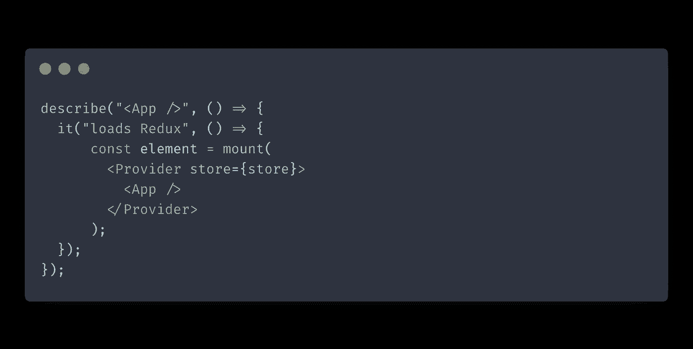

但是通常，您想要测试的只是组件是否正确地响应事件并触发正确的动作。为此，您不一定需要包含 Redux 本身。相反，您可以直接使用您试图测试的组件，而不是连接到 Redux 的高阶组件。

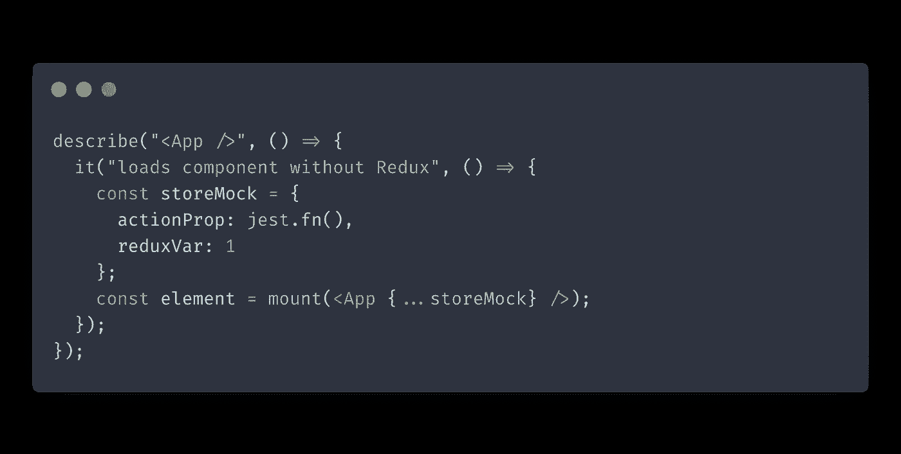

这种方法有两个主要好处:

*   我们可以用`shallow`代替`mount`。使用前面的方法，您经常需要使用`mount`来访问连接的组件。这样做会渲染所有的组件树，而我们通常不需要这样做。
*   您不再需要模仿 Redux 存储，也不再需要关心它的实现细节。相反，只需提供组件直接使用的道具来模拟 HOC 如何注入相同的道具。

# #7 检查您的组件是否启动功能

您可以使用`toHaveBeenCalled`和`toHaveBeenCalledWith`来测试您的组件是否按照您期望的方式触发功能。

两者的区别在于`toHaveBeenCalledWith`允许您指定您期望函数接收的确切参数:

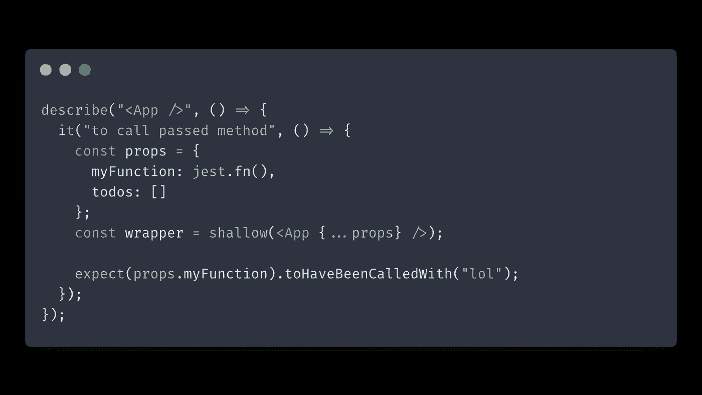

这就是这篇文章的全部内容。在这里，我们简要介绍了用酶编写 React 组件单元测试的基本技巧和实践。

*原载于 2021 年 11 月 22 日 https://isamatov.com***。**