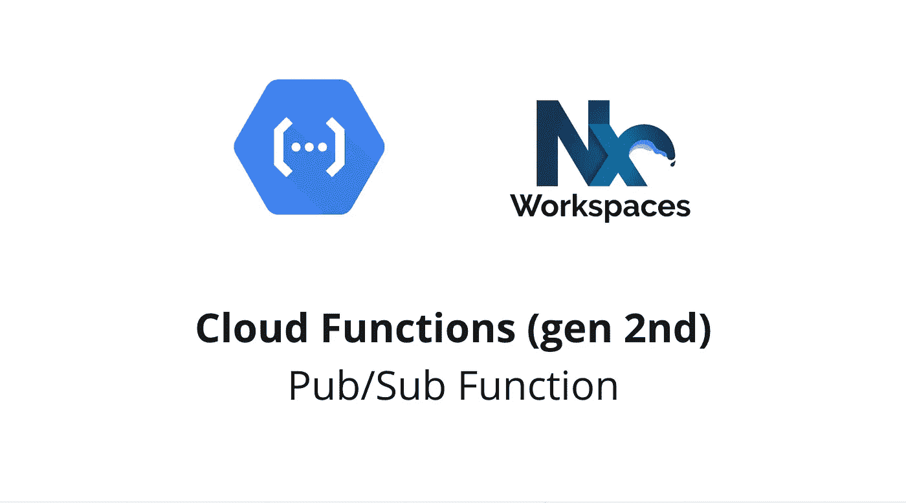
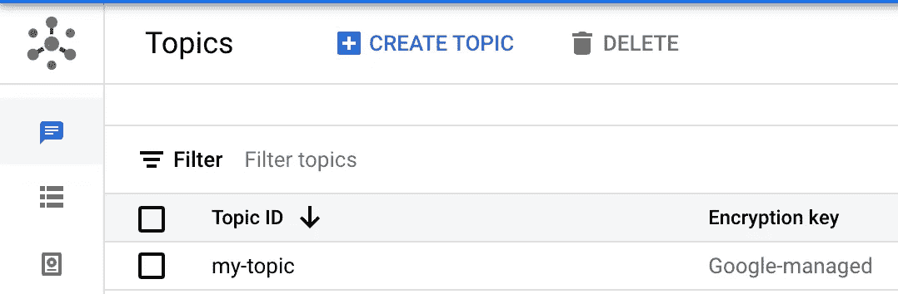
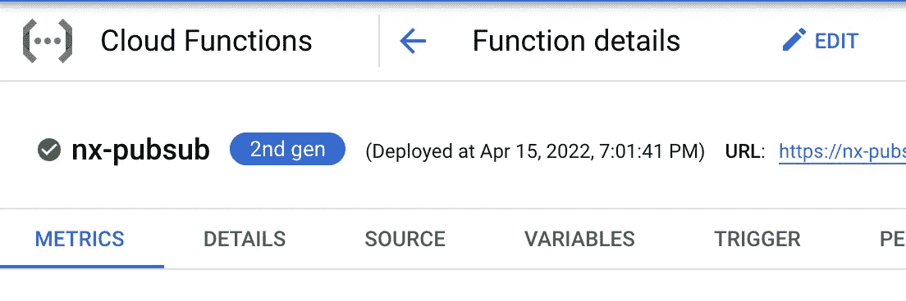
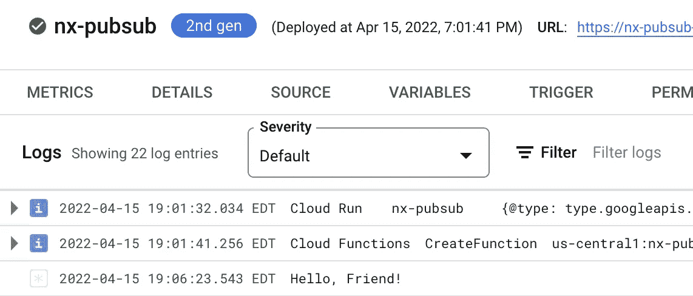
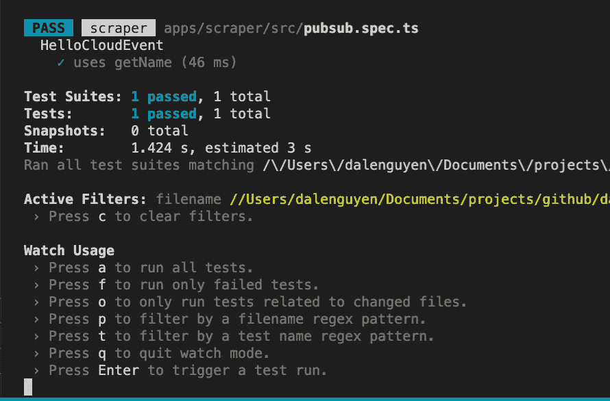

# GCP 云功能(第二代)发布/订阅开发和测试

> 原文：<https://itnext.io/gcp-cloud-functions-gen-2nd-pub-sub-development-testing-2c498fa4464e?source=collection_archive---------1----------------------->



Nx WorkSpace 中的发布/订阅功能开发

> 注意:第二代包含在谷歌云服务条款的[预发布条款](https://cloud.google.com/terms/service-terms#1)中。请避免在产品中使用它，直到它完全发布。

[快速浏览:使用 Nx Workspace](/deploy-2nd-gen-gcp-cloud-functions-with-nx-workspace-5d75fcf21566)[部署第二代 GCP 云函数本地测试&开发](https://dalenguyen.medium.com/2nd-gen-cloud-functions-local-testing-development-7c518f7bd0b1)
[使用 Express 创建 REST API&第二代 GCP 云函数](https://dalenguyen.medium.com/create-rest-apis-with-express-2nd-gen-gcp-cloud-functions-d244dd9a4717)
[完美匹配:NestJs &云函数(第二代)&Nx Workspace](https://dalenguyen.medium.com/a-perfect-match-nestjs-cloud-functions-2nd-gen-nx-workspace-f13fb044e9a4)[**GCP 云函数(第二代)发布/订阅开发**](https://dalenguyen.medium.com/gcp-cloud-functions-gen-2nd-pub-sub-development-testing-2c498fa4464e)

## 先决条件

在创建发布/订阅云函数之前，必须首先启用发布/订阅以在项目中创建身份验证令牌:

```
PROJECT_ID=$(gcloud config get-value project)
PROJECT_NUMBER=$(gcloud projects list --filter="project_id:$PROJECT_ID" --format='value(project_number)')

# Allow service account token creation
gcloud projects add-iam-policy-binding $PROJECT_ID \
--member=serviceAccount:service-$PROJECT_NUMBER@gcp-sa-pubsub.iam.gserviceaccount.com \
--role=roles/iam.serviceAccountTokenCreator
```

## 创建新主题

```
dalenguyen$ gcloud pubsub topics create my-topic
Created topic [projects/sherpa-lab/topics/my-topic].
```

您可以在 GCP 仪表板中看到这个新主题



**创建样本功能**

cloudEvent 函数将允许回调在调用时接收 cloudEvent 对象

```
// main.tsimport { cloudEvent } from '[@google](http://twitter.com/google)-cloud/functions-framework'// Register a CloudEvent callback with the Functions Framework that will
// be executed when the Pub/Sub trigger topic receives a message.cloudEvent<{ message: { data: string } }>('helloPubSub', (event) => {
  // The Pub/Sub message is passed as the CloudEvent's data payload.
  const name = getName(event)
  console.log(`Hello, ${name}!`)
})export const getName = (event: any) => {
  const base64name = event.data.message.data
  return base64name ? Buffer.from(base64name, 'base64').toString() : 'World'
}
```

## 部署云功能

在部署之前，您需要更新 project.json 中的部署脚本

```
// project.json"deploy": {
  "executor": "[@nrwl/workspace](http://twitter.com/nrwl/workspace):run-commands",
  "options": {
    "commands": [
 **"gcloud beta functions deploy nx-pubsub --region us-central1 --gen2 --runtime nodejs16 --trigger-topic my-topic --entry-point helloPubSub --source ./dist/apps/api-nest --project {args.gcpProject}"**
    ],
    "color": true,
    "parallel": false
  }
}
```

构建应用程序

```
dalenguyen$ npx nx build api-nest> nx run api-nest:buildchunk (runtime: main) index.js (main) 2.65 KiB [entry] [rendered]
webpack compiled successfully (90f062bcb8b8b600)>  NX   Successfully ran target build for project api-nest (6s) 
```

运行部署脚本

```
dalenguyen$ npx nx deploy-pubsub api-nest --gcpProject YOUR_PROJECT> nx run api-nest:deploy-pubsub --gcpProject=YOUR_PROJECTPreparing function... timeoutSeconds: 60
  uri: [https://nx-pubsub-000-uc.a.run.app](https://nx-pubsub-eyoojzj54q-uc.a.run.app)
state: ACTIVE
updateTime: '2022-04-15T23:01:41.239409158Z'———————————————————————————————————————————————————————————————>  NX   Successfully ran target deploy for project api-nest
```

你可以在你的 GCP >云功能中找到新功能



**测试发布/订阅功能**

```
dalenguyen$ gcloud pubsub topics publish my-topic --message="Friend"messageIds:
- '4423022555302472'
```

如果您查看云运行中的日志，您会在日志中看到`Hello Friend`



您也可以使用命令来检查功能

```
dalenguyen$ gcloud beta functions logs read nx-pubsub --gen2LEVEL  NAME       TIME_UTC                 LOG
I      nx-pubsub  2022-04-15 23:07:02.011
       nx-pubsub  2022-04-15 23:07:02.010  Hello, Friend!
```

## 本地测试和开发

您可以使用的另一种方法是利用测试驱动开发(TDD)方法。您可以编写一组单元测试，并观察开发过程中的变化。通过这样做，您可以节省大量时间，因为您可以模拟 cloudEvent 的行为&事件中使用的函数。

由于我使用的是 TypeScript，所以存在类型不匹配的问题，如果你有任何建议，请告诉我。

```
// pubsub.spec.tsimport { getFunction } from '[@google](http://twitter.com/google)-cloud/functions-framework/build/src/testing'
import { CloudEvent } from 'cloudevents'
import * as Main from './main'describe('HelloCloudEvent', () => {
  beforeAll(async () => {
    // load the module that defines HelloCloudEvent
    await import('./main')
  })it('uses getName', () => {
    const getName = jest.spyOn(Main, 'getName')const helloPubSub = getFunction('helloPubSub') as any
    helloPubSub(
      new CloudEvent({
        type: 'com.google.cloud.functions.test',
        source: '[https://github.com/GoogleCloudPlatform/functions-framework-nodejs'](https://github.com/GoogleCloudPlatform/functions-framework-nodejs'),
        data: {
          message: {
            data: 'V29ybGQ=',
          },
        },
      }),
    )
    // assert that the cloud function invoked `getName()`
    expect(getName).toHaveBeenCalled()
    expect(getName).toHaveReturned()
    expect(getName).toHaveNthReturnedWith(1, 'World')
  })
})
```

然后可以边看测试边开发逻辑。



## 参考

[https://cloud . Google . com/functions/docs/2nd-gen/getting-started](https://cloud.google.com/functions/docs/2nd-gen/getting-started)