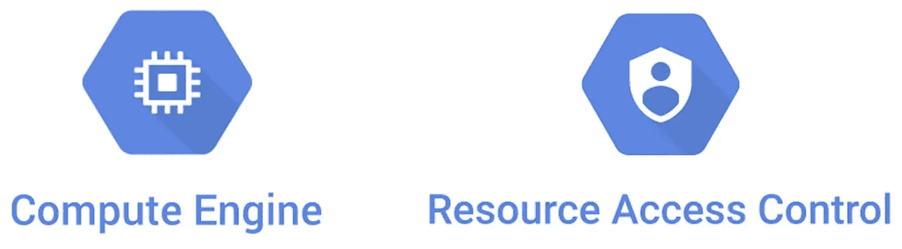
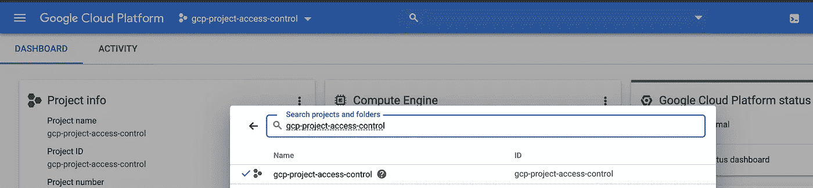
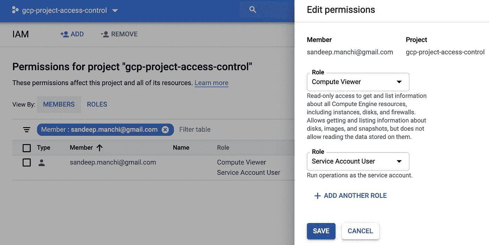
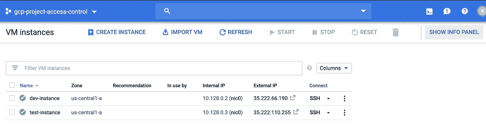
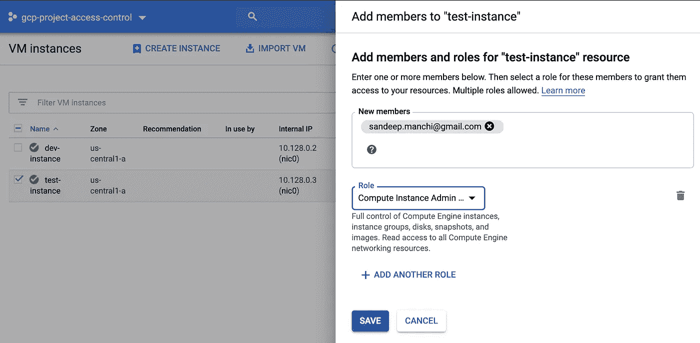

# GCP 计算引擎和资源级访问控制

> 原文：<https://itnext.io/gcp-how-to-assign-users-to-specific-compute-engine-resources-9b29bfeb58fb?source=collection_archive---------2----------------------->

**提倡最小特权原则**

GCP 资源层次结构由组织、文件夹和项目组成。组织是资源层次结构的根，文件夹是多层组织层次结构的构建块，项目是由资源组成的粒度构建块。资源示例包括计算引擎虚拟机、应用引擎实例、云存储桶、云发布/订阅主题等。Cloud IAM 用于跨资源层次结构设置访问控制

典型的项目由多个计算引擎资源组成，如虚拟机实例、磁盘、快照和映像。一些用户可能需要访问所有资源，但大多数用例将涉及只需要利用特定资源的用户。在资源级别设置访问控制是实现最小特权原则的最佳方式。本文是将用户分配到特定 VM 实例的分步指南。

**将用户分配到特定虚拟机实例的分步指南:**

1.  登录到 GCP 控制台。单击“Google Cloud Platform”横幅旁边的项目选择器，过滤您选择的项目(包含计算引擎资源)

2.在“IAM & Admin”菜单下；导航到“IAM”部分

3.添加新用户或选择现有用户，需要在虚拟机实例级别限制其访问权限

4.添加两个角色—计算查看者角色和服务帐户用户角色(在 GCP，角色被定义为一组权限)

5.在菜单下—“计算引擎”；导航到“虚拟机实例”一节。在右上角；选择“显示信息面板”选项

6.将用户分配到特定的实例，例如“测试实例”；选择特定实例，然后选择“添加成员”选项。筛选用户并分配“计算实例管理员”角色。该角色授予用户对实例的完全访问权限，包括 SSH 访问权限

7.但是，如果用户试图访问任何其他实例，例如“开发实例”；则不允许用户 SSH 到实例中，而是限制为计算查看者角色。这基本上确保了最低特权原则，即用户可以获得执行各自工作所需的最低权限

**注意**:要限制用户使用其他计算引擎资源，如磁盘、映像和快照，可按上述流程执行