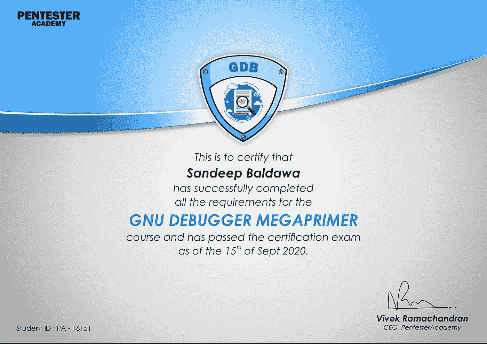

# Gdb 调试器和相关认证

> 原文：<https://itnext.io/gdb-debugger-and-related-certification-91b727916cc7?source=collection_archive---------4----------------------->

我的 GNU 调试器专家认证考试之旅！

# 背景

你可以在这里找到关于什么是 gdb 调试器的细节。它非常受欢迎，是许多技术的基础元素，如[逆向工程](https://medium.com/@sandeepbaldawa/my-journey-to-ecre-elearnsecurity-certified-reverse-engineer-2d9ba626dc2b)、[开发](https://medium.com/@sandeepbaldawa/xds-v1-elearnsecurity-course-review-cda5bb12f95b)等。牢记这一点，开始探索学习 gdb 的高效方法。在这篇文章中，我将试着分享我的经历，并回顾我所学的课程。

# 搜索

关于 gdb 的文档是非常庞大和详尽的，然而，快速浏览并不容易。因此我在寻找一个学习 gdb 的好方法。无法立即找到一个广泛的课程/培训，涵盖了从实用角度来看的内容。

搜索了一番后，我看到很多博客和论坛推荐了来自[pentest academy](https://www.pentesteracademy.com/)的 gdb 课程。好的一面是他们在 youtube 上也有一些免费视频，人们可以在去上课前尝试一下。

# GDB 课程

最终买了一张为期一年的五旬节学院所有课程的通行证。[这个](https://www.pentesteracademy.com/course?id=4)具体就是广发课程。在购买同样的产品时，他们的价格是 249 美元/年，对于课程内容来说，这似乎是一笔很棒的交易(他们也有很多其他课程)，而且还包括实验室。

# 课程内容

课程从解释很多基本概念开始，比如符号文件和分析、使用 strace/ltrace 的调用跟踪、断点、寄存器、内存等等。这包括可以在提供的实验室中使用的实际例子。

本课程继续解释破解二进制的技术。它从用符号破解二进制的技术开始。它为不同的平台解释了这一点，如 32/64 位 Linux、qemu、arm 等。除此之外，它还引入了一些有趣的概念，如修改寄存器/内存、方便变量、调用例程等。

课程中一个非常有趣的部分讲述了如何破解不包含符号的二进制文件(这是该领域中出现的另一种二进制文件)。好的一面是，这门课程是逐步建立在概念的基础上的，不会突然向你抛出所有的东西。这让学习变得有趣，也不那么费力。

# 本课程的一些提示

以下是一些对我很有效的建议

*   课程内容有时很慢，因此如果需要，您可以考虑以 1.5 倍的速度播放视频
*   在教授理论的同时跟进实际例子
*   安装 [gdb-peda](https://github.com/longld/peda) 可能是有用的，因为它使得使用 gdb 非常容易，就像打印堆栈帧/寄存器等。每次我们单步执行代码，设置反汇编模式等等。
*   阻止二进制是一门艺术， [Vivek](https://twitter.com/vivekramac) 在这方面也很棒，也许值得花更多时间在解释这一点的视频上。
*   在课程中做详细的笔记，并准备一份所用命令的备忘单，这对考试会很方便。
*   来自[的 Julia Evans](https://twitter.com/b0rk) 的笔记很棒，就像广发银行的[这个](https://twitter.com/b0rk/status/1172566529768132609/photo/1)
*   注意细节，做好进入事物杂草的准备:)

# 认证考试

考试时间为 3 小时，考试日期很容易找到。考试结束时需要一份小报告(不要太复杂，只是解释一下过程)。总的来说，考试很有趣，有助于验证理解。

# 总结想法

总的来说，我会给这门课打 9/10 分，内容很棒，流程也很精彩。一个可以让体验变得更好的小改进可能是自动注册/开始考试的过程(同样，这不是很糟糕，但可以改进，就像 elearnSecurity 和一些公司所做的那样，他们提供随时开始认证按钮)。