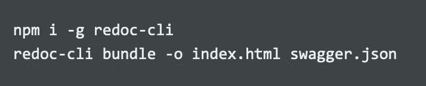
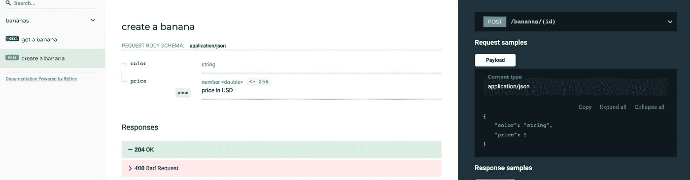
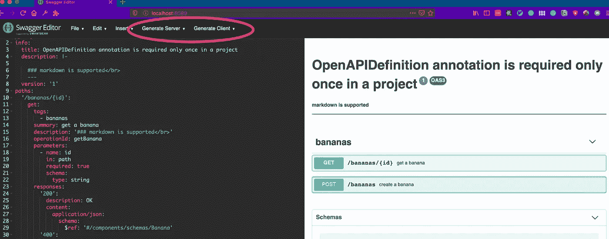

# 大摇大摆的 java 注释。

> 原文：<https://itnext.io/generate-api-docs-clients-server-code-using-swagger-java-annotations-f25ad69e00be?source=collection_archive---------1----------------------->


gRPC，JSON，或者 graphQL？每种方法都有其优点，JSON RESTful API 是最简单、最古老和最常用的。然而，它的简单是有代价的。与 REST API 集成需要手动编写客户端代码，这需要进行测试。由于需要启动/停止 web 服务器，测试往往会变得很慢。此外，设计 RESTful APIs 有一些惯例和指导原则，一旦你破坏了一个惯例(例如，错误地在路径中包含了一个动词)并发布到产品中，改变它将需要破坏向后兼容性，这一点都不好玩。正因为如此。在实现之前审查设计好的 API 是这个过程中的一个重要步骤。然而，编写可以手动审查的 API 文档是乏味的，并且记住在每次更改时更新它们是徒劳的。

O [penApi](https://www.openapis.org/) 原名 Swagger，试图通过从 Api 描述文件中生成 api 文档、客户端甚至模拟 web 服务器来解决这些问题并改善 API 用户的开发体验。然而，这个文件很快变得巨大而复杂。即使使用 swagger-editor 编辑它也是一件痛苦的事情，尤其是对于大型项目。

OpenApi 倡议的子项目， [Swagger 2。X Annotations](https://github.com/swagger-api/swagger-core/wiki/Swagger-2.X---Annotations) 使用反射从代码中生成 OpenApi 定义。带注释的类、值对象、方法和参数被用作 swagger 生成器的输入。输出是一个 swagger 定义文件，它可以用来生成客户机/服务器代码和 API 文档。让我们看一个例子。

# 服务定义

*   `GET /bananas/{id}`
*   `POST /bananas`

简单的服务定义

没有依赖或框架。与 HTTP 头、路径参数或解析/编码请求/响应体无关。

请注意与 gRPC 服务定义的相似之处。

gRPC 服务定义

Google protocol buffers 编译器可以生成客户端和服务器代码，也可以使用 [**gRPC-gateway**](https://github.com/grpc-ecosystem/grpc-gateway) 以及一些 protobuf 注释来生成 RESTful API 桥甚至 swagger 定义。

用 google.api.http 注释的 rpc 定义

上面的比较只是为了强调从描述文件中生成客户机/服务器代码的思想。Swagger 和 gRPC 的一个很好的对比可以在 [**这里**](https://medium.com/apis-and-digital-transformation/openapi-and-grpc-side-by-side-b6afb08f75ed) 。

# 作为代码/ Swagger 注释的 API 描述

夸张的注释

这是我们在帖子开头定义的服务，用 openApi 注释进行了注释。它几乎被注释隐藏了，它们很冗长，可能会让不熟悉的读者感到困惑。但是，另一种方法是手动管理 Swagger.yaml，这种方法更糟糕。

开发人员已经习惯了 IDE。代码完成、语法突出显示、代码格式化、代码折叠、快速导航、快速检查以及调用这些功能的键盘快捷键，极大地简化了注释服务的过程。此外，用反射扫描值对象和函数参数，如果它们改变，生成的 API 定义将自动改变。此外，swagger annotations 项目有很好的文档记录，为了理解任何注释的角色，只需要“步入”它的定义并阅读它的 javadoc 注释。

# 生成 Swagger 定义(swagger.json)

为了生成 Swagger 定义，我们需要运行一个 gradle 任务。这里有一个完整的工作示例[。](https://github.com/viggin543/swagger/tree/master/bananas-service)

本质上，Gradle 配置使用了 [swagger-gradle 插件](https://github.com/swagger-api/swagger-core/tree/master/modules/swagger-gradle-plugin)，并且有一个任务需要配置。

梯度构型

通过运行`./gradle resolve`，插件将扫描 **com.banana** 包，寻找用`@Path`注释标注的类，并生成`src/open-api/BananaAPI.json`。上面的例子只为两个简单的 API 端点生成了一个 100 行的 JSON 文件。

# 生成 API 文档

> *Redoc——终于有了值得你骄傲的 API 文档。*

Redoc 是一个从 swagger 定义中生成漂亮的静态 api 文档的工具。

它的安装和使用非常简单:



安装 redoc

这将生成如下所示的 index.html 文件:



redoc 文档

这些文档有深度链接、搜索、代码片段和其他很酷的功能。

# 生成客户端/服务器代码

*   使用 swagger-cli

运行 swagger 代码生成

*   使用 [Swagger-Editor docker 图像](https://github.com/swagger-api/swagger-editor)

```
docker run -d -p 8089:8080 -e URL=/foo/BananaApi.json -v /Users/…/personal_projects/open_api_java_annotations/open-api/:/usr/share/nginx/html/foo swaggerapi/swagger-editor
```

将启动一个装载了 swagger 定义文件的 swagger 编辑器容器。在 [localhost:8089/](http://localhost:8089/) 上打开浏览器，将显示编辑器 UI。



招摇的编辑

可以使用这个 UI 生成代码，但是单击 generate 按钮将发出下面的 HTTP 请求:

使用 swagger 公共 api 生成

swagger 公共 API，它接受 JSON swagger 定义文件作为输入，并返回包含生成的项目的 zip 文件。

# 生成的客户端示例用法(kotlin+vert.x)

java 客户端示例

# 服务器存根生成

gRPC 优于 openAPI 的一大优势是，open API 不仅需要支持几乎所有可能的语言，甚至 Rust 和 Huskel。而且每个 web 框架都是如此，这是一个不可能的任务，因为框架总是在变化。另外，swagger 不支持增量更新，所以一旦你更新了你的 API。例如通过添加路线。虚张声势只能再次产生整个事情。解决这个问题的唯一方法是 git 将新生成的代码与主分支(包含以前的版本)合并，在我看来，所有这些努力都不值得。此外，自从我们编写值对象并对它们进行注释以来，已经完成了一半的工作。

# 关于项目结构的一个注释

以上所有代码都可以在这里找到，这是一个 gradle 多[项目](https://github.com/viggin543/swagger)的例子。遵循鲍勃大叔在他的[清洁建筑](https://blog.cleancoder.com/uncle-bob/2012/08/13/the-clean-architecture.html)博客帖子中的指导方针。它有三个子项目

*   bananas-service(一个包含服务定义和 swagger 注释的库项目)
*   java 客户端生成的(由 swagger 生成的库项目)
*   web 服务器(web 服务器，它使用上述库(插件))

不同项目的分离是有意的，业务逻辑应该对 web 服务器和 web 客户端一无所知。可以在不发送或接收 HTTP 请求、不启动/停止 web 服务器的情况下测试业务逻辑。

可以使用生成的客户端测试 web 服务器，它可以模拟业务逻辑，也可以使用真实的业务逻辑。在我看来，将不同的层分离到不同的项目有助于执行依赖规则(依赖指向内部)。但这既不必要也不充分。存在许多其它包装技术来实现相同的目标。

# 模拟网络服务器

一个开源项目可以从一个 swagger 定义文件中旋转出一个模拟的 web 服务器。

```
#!/bin/bash
npm install -g @stoplight/prism-cli
prism mock /Users/domrevigor/tg/svc-payments/openApi/swagger.json
```

这将在本地启动一个 web 服务器，实现 swagger json 中定义的 api，它将使用 swagger 注释中提供的示例值进行响应。如果有另一个团队在等待新的 api 准备好，他们可以在开发的第一天得到一个模拟的 web 服务器。

```
## example value taken from @Schema annotation
@field:Schema(description = “price in USD”, maximum = “256”, example = “5”) val price: Double,
```

# 关于 kotlin 协程和 swagger 注释的一个注释。

Kotlin 协同例程是该语言的一个惊人特性，它允许编写简单的异步代码，类似于 javascript async/await 机制，没有未来和承诺的复杂性。然而，当 kotlin 挂起函数被编译成字节码时，它们会被赋予一个额外的参数。延续对象，它完成了隐藏承诺和未来的肮脏工作。Swagger 注释有 **@Parameter(hidden = true)** 注释来处理不属于 API 定义的方法参数。然而，不可能注释只存在于字节码中的参数。我找到的解决方法是，要么从您的服务返回一个承诺，并保持它是一个常规函数，要么返回一个挂起闭包**(注意= suspend {在下面的代码片段中)**

# 摘要

RESTfull web 服务将继续存在。Swagger 通过生成 api 文档和客户端代码来帮助其他人集成您的服务，使用 swagger 注释，过程甚至更简单，API 文档由您的代码维护，不依赖于外部定义文件。它适用于任何支持注释的 JVM 语言，如 Kotlin 或 Scala，并且不依赖于任何 web 框架。

# 资源

[霸气 API/霸气核心](https://github.com/swagger-api/swagger-core/wiki/Swagger-2.X---Annotations)

[RESTful API 设计指南—最佳实践|黑客正午](https://hackernoon.com/restful-api-designing-guidelines-the-best-practices-60e1d954e7c9)

[grpc-生态系统/grpc-网关](https://github.com/grpc-ecosystem/grpc-gateway)

[重做/重做](https://github.com/Redocly/redoc)

[swagger-API/swagger-core](https://github.com/swagger-api/swagger-core/tree/master/modules/swagger-gradle-plugin)

[swagger-API/swagger-editor](https://github.com/swagger-api/swagger-editor)

[OpenAPI 和 gRPC 并行](https://medium.com/apis-and-digital-transformation/openapi-and-grpc-side-by-side-b6afb08f75ed)

[干净的程序员博客](https://blog.cleancoder.com/uncle-bob/2012/08/13/the-clean-architecture.html)

[prism —模拟服务器](https://github.com/stoplightio/prism#readme)