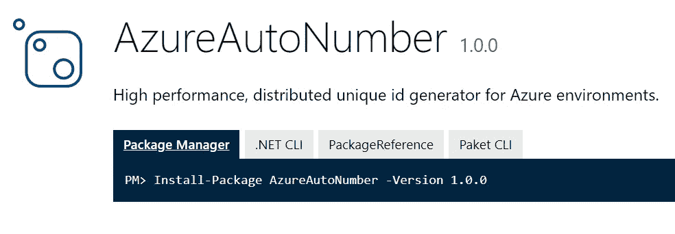
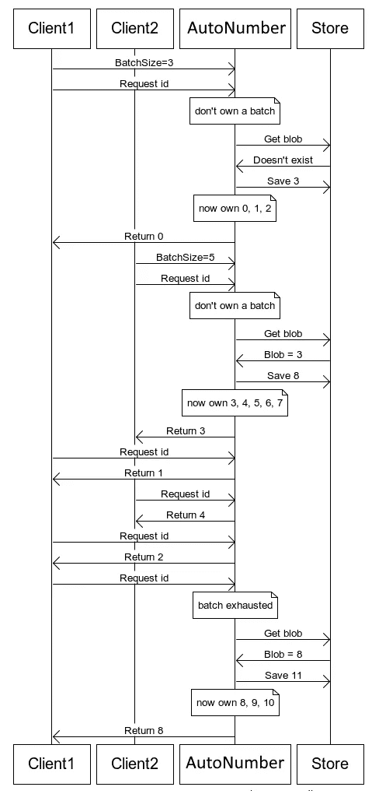

# 在 Azure 上生成自动递增 id

> 原文：<https://itnext.io/generate-auto-increment-id-on-azure-62cc962b6fa6?source=collection_archive---------3----------------------->

## AzureAutoNumber:用于 Azure 环境的高性能分布式唯一 id 生成器。

如果你使用过 **TableStorage** 或 **Cosmos DB，**你就会知道，由于一致性级别的原因，它们不提供自动增量 id。但是在许多用例中，我们需要生成对人类友好的标识，以便于客户阅读。

像 GUID 或 UUID 这样的 ID 太难看，太痛苦，记不住，想象一下下面的例子:

```
Your order is on process. Please keep your invoice id for further tracking.Invoice id:
e3a52fee-2ad5-4c35-b9c0-4edcf438bdff
```

有一些变通方法可以在 Azure 上生成增量 id，比如使用 Azure SQL。但是，通过使用它，您可以将所有的写操作序列化到一个线程中，从而放弃了队列架构等所有可能的好处。

投入一些时间后，我为它管理了一个图书馆；我把它叫做 [Azure AutoNumber](https://www.nuget.org/packages/AzureAutoNumber/) 。该项目使用的是最新版本的 Azure NuGet 包，它支持**。网标 2.0** 和 **2.1** 。



## 如何使用自动号码

首先，通过 NuGet 安装它:

```
dotnet add package AzureAutoNumber --version 1.0.0
```

为了生成 id，您需要创建一个`UniqueIdGenerator`类的**单例**实例。这个类依赖于`BlobOptimisitcDataStorage`类。

```
var blobStorageAccount = Microsoft.WindowsAzure.Storage.CloudStorageAccount.Parse(connectionString);var blobOptimisticDataStore = new BlobOptimisticDataStore(blobStorageAccount, "unique-ids");var idGenerator = new UniqueIdGenerator(blobOptimisticDataStore);
```

BlobOptimisitcDataStorage 将在 blob 存储上创建一个名为“unique-ids”的新容器。如前所述，UniqueIdGenerator 的实例应该是每个应用程序域中的单例。

现在通过调用 **NextId** 方法，很容易生成 Id。NextId 方法需要一个名为 ScopeName 的参数。通过 ScopeName，您可以为不同的作用域创建不同的 id。

```
var orderId = idGenerator.NextId("orders");
var invoiceId = idGenerator.NextId("invoices");
```

如果你更喜欢在[微软依赖注入](https://docs.microsoft.com/en-us/aspnet/core/fundamentals/dependency-injection?view=aspnetcore-3.1)中注册`IUniqueIdGenerator`及其依赖，你可以像下面的例子一样使用这个包的服务扩展。

```
// configure the services
services.AddAutoNumber();// Inject `IUniqueIdGenerator` in constructorpublic class Foo
{
  public Foo(IUniqueIdGenerator idGenerator)
  {
      _idGenerator = idGenerator;
  }
}
```

唯一的警告是你需要在注册`AutoNumber`之前在 DI 中注册`CloudStorageAccount`。

## 它是如何工作的？

首先，它为每个正在运行的实例分配一批 id。Azure Blob 存储用于协调这些批处理。Azure Blob 存储通过标准 HTTP 头进行乐观并发检查。在持久化层面上，自动编号为每个 id **作用域**创建一个小的文本文件。

```
var orderId = idGenerator.NextId("orders");
var invoiceId = idGenerator.NextId("invoices");
```

考虑上面的例子；这两个调用将在容器上创建或修改两个新的文本文件。

```
- unique-ids
--- orders -> contains "1"
--- invoices -> contains "2"
```

所以基本上，对于每个作用域，我们将有一个纯文本文件来存储该作用域最新生成的 id。在第一次调用时，它会保留一批 id，以备将来在应用程序域中使用。批量中的那些 id，你不用就浪费了。为了更好地理解它，请看这张图表:



如果您喜欢服务注册扩展方法，您可以通过`appsettings.json`轻松设置批量大小。

```
{
  "AutoNumber": {
    "BatchSize": 50,
    "MaxWriteAttempts": 25,
    "StorageContainerName": "unique-urls"
  }
}
```

或者您可以通过`BatchSize`属性进行更改:

```
idGenerator.BatchSize = 25;
```

## 源代码

你可以在 [GitHub](https://github.com/0x414c49/AzureAutoNumber) 中访问源代码。

## 很高兴知道

几年过去了 [Tatham Oddie](https://tatham.blog/2011/07/14/released-snowmaker-a-unique-id-generator-for-azure-or-any-other-cloud-hosting-environment/) 发布了一个名为 **SnowMaker** 的库。我分取了他的作品，并做了很多修改，以便在**上发布。网标(2.0 和 2.1)** 。SnowMaker 已经过时了，使用的是非常旧版本的 Azure 包。这个项目的所有荣誉都归于他。