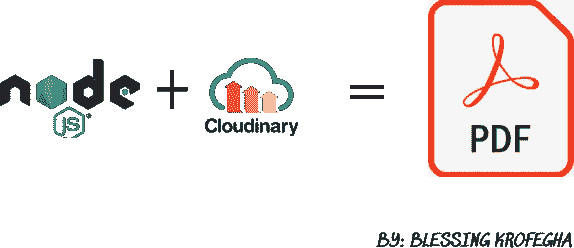
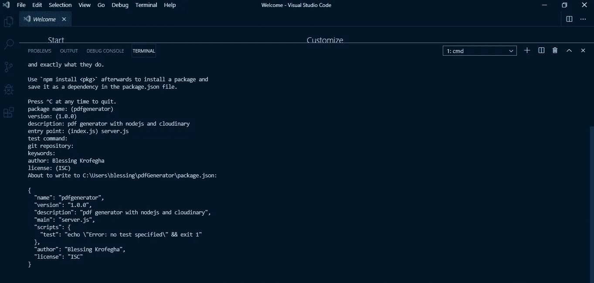
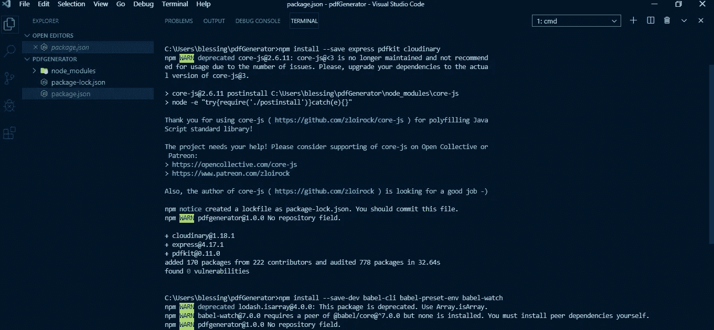
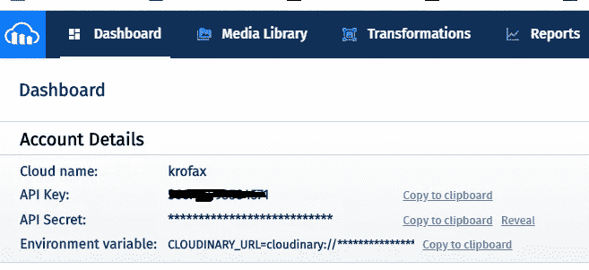
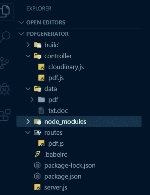
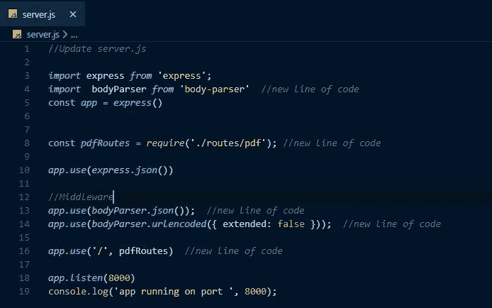
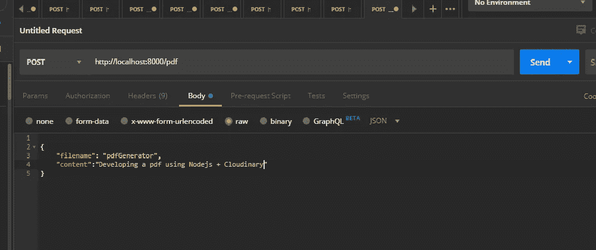
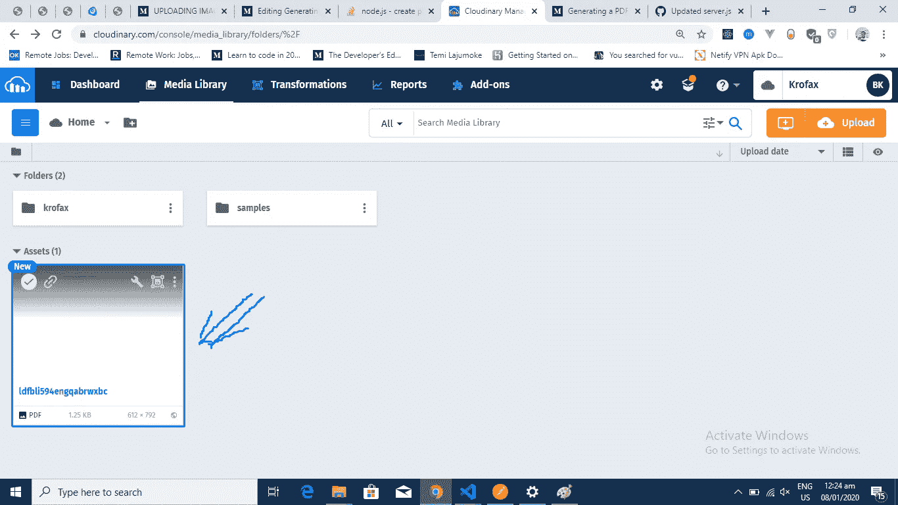
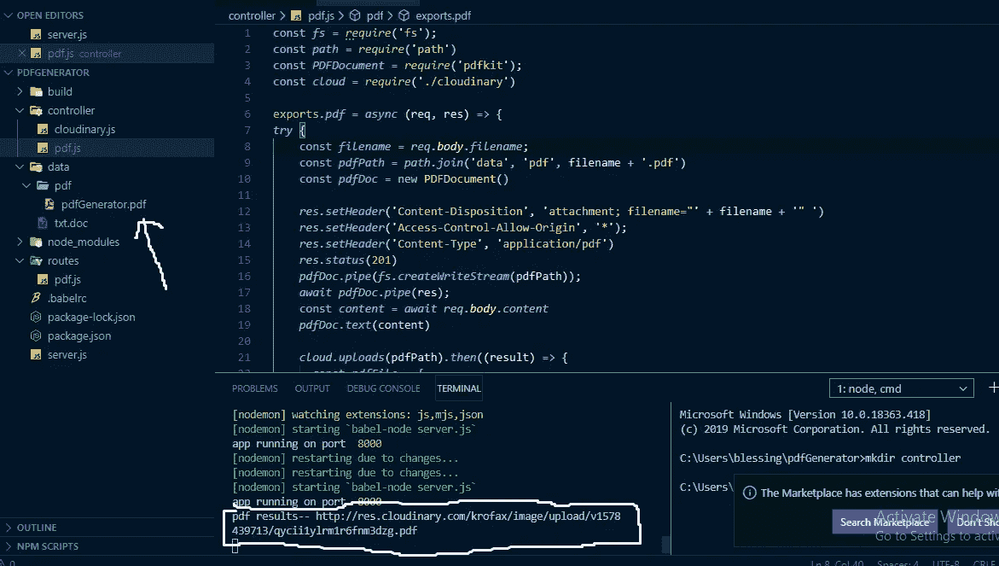
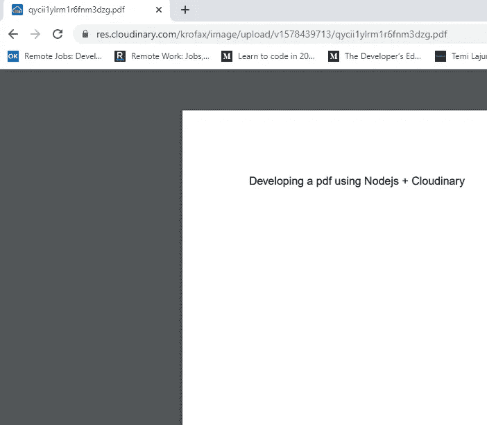

# 使用节点生成 PDF。Js & Express + Cloudinary

> 原文：<https://itnext.io/generating-a-pdf-with-node-js-express-cloudinary-8a9b9160207?source=collection_archive---------1----------------------->



你好，世界！建立一个平台来动态生成文档(如 pdf、Excel 表等)的需求越来越迫切，这也是制作本教程的原因！

喝杯咖啡，享受旅程吧！

# 我们将建造什么？

在本文中，我们将创建一个接受 post 请求的 RESTful API，我们的目标是使用 Node.Js/Express 和 [PDFKit](https://pdfkit.org/) 将传入的 pdf 存储到 [Cloudinary](https://cloudinary.com/) 。

我们将使用模型视图控制器(MVC)方法，还将使用 express.js，这是一个 Nodejs 框架，可以帮助我们轻松地设置路由。

因此，在您开始阅读本教程之前，我建议您应该了解 [Nodejs](https://nodejs.org/en/) 。

本文将跨越三个步骤:

*   **第一步:**创建一个样例项目，初始化并安装项目的所有依赖项
*   **第二步:**设置服务器、Express、PdfKit 和 Cloudinary。
*   **第三步:**创建控制器和路由。

# 入门指南

在继续之前，如果您的系统上还没有安装以下软件，请安装

*   [Nodejs](https://nodejs.org/en/download/)
*   NPM——NPM 是一名 Javascript 包经理
*   用 [Cloudinary](https://cloudinary.com/) 创建一个账户

# 项目设置

*   在你的系统上创建一个新的项目目录，你可以把它叫做`pdfGenerator`
*   将工作直接转换到项目上，如果你使用的是窗口系统，在你的终端或命令提示符下运行`npm init`——运行`npm init`会提示你一些问题来帮助设置你的项目



完成后，您应该会在项目中看到`package.json`文件，它包含了项目的基本信息。

```
{"name": "pdfgenerator","version": "1.0.0","description": "pdf generator with nodejs and cloudinary","main": "server.js","scripts": {"test": "echo \"Error: no test specified\" && exit 1"},"author": "Blessing Krofegha","license": "ISC"}
```

接下来，让我们安装构建项目所需的所有包依赖项

**安装项目的所有依赖项:**

*   expressjs 是一个 nodejs web 应用程序框架，它让我们能够创建快速简单的 API。
*   Pdfkit — PDFKit 是用于节点和浏览器的 PDF 文档生成库，使创建复杂的多页可打印文档变得容易。
*   Cloudinary — **Cloudinary** 是提供全面的基于云的图像和视频管理平台的市场领导者。
*   主体解析器——在处理程序之前解析中间件中的传入请求主体，在`req.body`属性下提供。

运行以下命令来安装上述所有软件包

```
**$ npm install --save express pdfkit cloudinary body-parser**
```



如果一切顺利，您应该会看到类似这样的内容

你会注意到`express and pdfkit, cloudinary and body-parser`在`dependencies`之下，这是因为当我们将代码部署到产品中时，这些是需要的。
您还应该在项目根目录中看到一个名为`node_modules`的新文件夹——这个文件夹包含我们下载的包的源代码。

# 项目结构

使用以下格式设置项目结构

```
-pdfGenerator
  |-package.json
  |-.babelrc
  |-server.js
  |-src
    |-controllers
      |-pdf.js
      |-cloudinary.js     |-routes
      |-pdf.js
```

# 服务器设置

将以下代码添加到`server.js`

从上面的代码中，我们导入了`express`并设置了一个新的 express 实例`const app = express()`。我们建立了一个新的`express.json()`中间件——这是访问请求体所需要的。最后，我们设置了一个示例端点来测试服务器是否正常工作。

不要担心，你得到这个错误是因为 nodejs 运行时不能理解我们使用的一些 ES6 特性——例如`import`。Babel 将帮助我们把代码编译成 nodejs 运行时可以理解的 ES5。要设置通天塔，请快速浏览 [***教程***](https://medium.com/@onlykiosk/complete-babel-7-guide-for-beginners-in-2019-7dd78214c464)

# 设置云控制器

首先，我们将设置我们的 Cloudinary 控制器。确保您在其他平台登录您的 Cloudinary 仪表板，以访问您的 **api_key** 和 **api_secret。**



打开`controller/cloudinary.js`并添加以下代码

上面这段代码可以解释如下:

我们通过 npm 或 yarn 导入了之前安装的 Cloudinary 包，然后我们定义了注册后 Cloudinary 给我们的 cloud inary***cloud _ name***、 ***api_key、*** 和 ***api_secret*** 。为了遵循最佳实践，您可能希望将所有配置变量放在一个 ***中。env*** 文件，这样就可以了，但是在本教程中，我们将关注主题。

我们的 Cloudinary 控制器的第二部分是一个用于上传 PDF 文件的标准上传 API，该 API 向我们提供 pdf Url 和 pdf Id 作为响应。这当然你可能想发送到客户端，以方便下载。

不过，在控制器文件夹上创建一个名为 ***pdf.js*** 的文件，并将以下代码添加到`controller/pdf.js`

在上面的代码中，我们导入了作为 Nodejs 核心模块的 fs 和 path。我们还从`controller/cloudinary.` 导入了云。我们还导入了 [PDFkit](https://pdfkit.org/) ，这是一个用于节点和浏览器的 PDF 文档生成库，可以轻松创建复杂的多页可打印文档。

此外，我们为我们的 pdf 定义了一个名称，创建一个名为 ***data、*** 的文件夹，该文件夹将在服务器上创建的 pdf 保存在我们的文件系统中。我们使用 Nodejs ***path*** 模块使之成为可能。

您的文件夹结构现在应该如下所示



我们还设置了适当的标题，通过管道将创建的文档和创建的 pdf 传递给 ***text*** 方法，并在完成后使用 ***PDFDoc.end()*** 结束流程，就像我们的例子一样。

最后，我们需要在 routes 文件夹中定义我们的路线，并确保我们现在可以生成 pdf。创建一个 ***routes*** 文件夹，并新建一个名为 ***pdf.js*** 的文件，并将以下代码添加到`routes/pdf.js`

现在转到 server.js 并更新该文件，如果您更新该文件，它应该如下所示



如果你已经走了这么远，拍拍自己的背吧！

现在，让我们使用 Postman 测试我们的 API。



现在让我们检查一下我们的`data/pdf`文件夹，看看 pdf 是否已经生成，以及它是否已经上传到 Cloudinary。



我们的 pdf 上传到 Cloudinary



我们的文件系统和 cloudinary 链接中的 pdf



这是我们访问链接时生成的 Pdf。

你可能想提前一点添加一些风格和感觉到你的 pdf，请访问[pdf 包](http://pdfkit.org)文档了解更多信息。

感谢阅读，如果你喜欢阅读这篇文章，请鼓掌，分享，别忘了在 Twitter 上关注我@ [beveloper](https://twitter.com/Beveloper) 。


谢谢

# 资源

*   [如何使用 Agility CMS 设计内容优先战略](https://agilitycms.com/resources/guide/how-to-design-a-content-first-strategy-using-agility-cms) — Agility CMS
*   [结构化内容管理系统的无头项目策略](https://www.smashingmagazine.com/2018/11/structured-content-done-right/)—Knut melvr
*   [为什么你作为一个开发者应该使用 CMS](https://agilitycms.com/resources/posts/why-you-as-a-developer-should-be-using-a-cms)
*   [无头商务解释:定义、用例、障碍|敏捷 CMS](https://agilitycms.com/resources/posts/headless-commerce-explained-definitions-use-cases-and-roadblocks)
*   [API vs . SDK:有什么区别？|敏捷 CMS](https://agilitycms.com/resources/posts/apis-vs-sdks-what-s-the-difference)
*   [2021 年最值得关注的静态站点发电机](https://agilitycms.com/resources/posts/static-site-generators)
*   [https://agility CMS . com/resources/posts/what-s-the-difference-between-headless-CMS-and-static-site-generator/](https://agilitycms.com/resources/posts/what-s-the-difference-between-headless-cms-and-static-site-generator/)
*   什么是 Netlify？作为一名编辑，你为什么要关心它？|敏捷 CMS
*   [什么是无头 CMS？|敏捷 CMS](https://agilitycms.com/resources/guide/what-is-a-headless-cms)
*   [无头 CMS 相对于传统 CMS 的优势|敏捷 CMS](https://agilitycms.com/resources/guide/top-10-reasons-why-you-should-choose-a-headless-cms-over-a-traditional-cms)
*   内容架构:组织和管理你的内容和团队的关键
*   WordPress 及其替代品:无头 CMS |敏捷 CMS
*   开源 CMS 与专有 CMS:你能拥有二者的优势吗？|敏捷 CMS
*   选择 React CMS:寻找什么？|敏捷 CMS
*   [掌控你的内容架构:内容建模](https://agilitycms.com/resources/posts/content-modelling)
*   [DXP vs 无头 CMS:现代 DXP 建筑](https://agilitycms.com/resources/posts/the-benefits-of-a-hybrid-dxp)
*   Jamstack 开发:[2021 年你需要了解的 10 个 JAMstack 先驱](https://agilitycms.com/resources/posts/top-jamstack-pioneers)