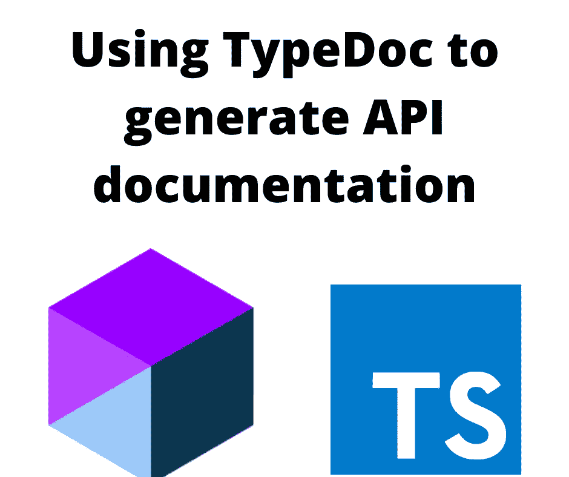
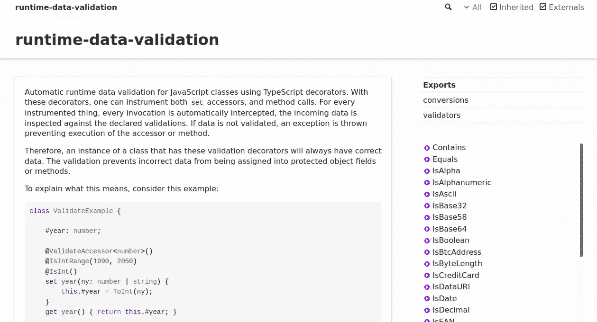
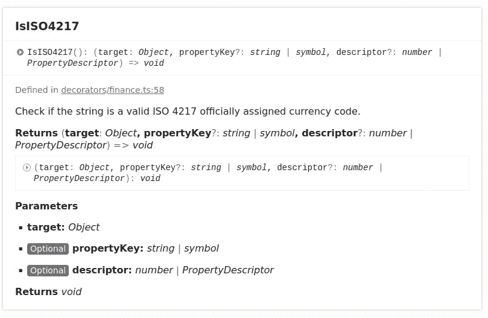

# 使用 TypeDoc 为 TypeScript 包生成 API 文档

> 原文：<https://itnext.io/generating-api-documentation-for-typescript-packages-with-typedoc-9e0061108548?source=collection_archive---------0----------------------->

## 更好的文档可以更好地为您的包的用户服务



**使用 TypeDoc，可以向 TypeScript 源代码添加结构化注释(JSDoc 样式注释)。有了这些注释中的数据，TypeDoc 可以生成很好的 API 文档，您可以很容易地将其发布到网站上。通过添加另一个工具 *gh-pages* ，可以很容易地将文档发布到 GitHub Pages。**

将 API 发布到包中，显示函数、方法参数、数据类型等等，这一点很重要。API 的用户需要知道哪些功能是可用的，等等。这有助于他们提高速度，并利用您的 API。API 文档越全面越好。

这使得发布高质量的 API 文档成为一种最佳实践。

不幸的是，对于大多数 JavaScript 包来说，API 文档并不全面。作为许多 Node.js 包的用户，我经常对粗略的 API 描述感到沮丧。我认为缺乏好的 API 文档的项目不知道简化生成 API 文档的工具。在我自己的包中，我自己也对此感到内疚，而且根本不知道有这样的工具。这让我不得不手工生成 API 文档，这当然不是最佳实践。

在本文中，我们将介绍如何使用 TypeDoc 为 TypeScript 包发布高质量的 API 文档。

我在为我的最新项目建立了一个网站和 API 文档后，立即写下了这篇文章。我们将把它作为一个实际的例子。

*   [https://runtime-data-validation-js.github.io/](https://runtime-data-validation-js.github.io/)—`runtime-data-validation`包是一组用于加强数据有效性的类型脚本装饰器
*   [https://runtime-data-validation-js . github . io/runtime-data-validation-typescript/](https://runtime-data-validation-js.github.io/runtime-data-validation-typescript/)—是这个包的 API 文档
*   [https://github . com/runtime-data-validation-js/runtime-data-validation-typescript](https://github.com/runtime-data-validation-js/runtime-data-validation-typescript)—封装源代码。在`api`目录中查找构建 API 站点的过程。
*   [https://github . com/runtime-data-validation-js/runtime-data-validation-js . github . io](https://github.com/runtime-data-validation-js/runtime-data-validation-js.github.io)—网站源代码。

# JSDoc、TSDOC 和 TypeDoc 结构化注释

JSDoc 是 JavaScript API 文档的标准工具之一，但是它不支持为 TypeScript 代码生成文档。JSDoc 方法使用这样的结构化注释:

```
/**
 * Description of the purpose or results of the function. 
 *
 * @param target Documentation for parameter 'target' 
 * @param text   Documentation for parameter ´text´. 
 * @return Comment about return value 
 */ 
function doSomething(target: any, text: string): number {
     // code 
}
```

TSDoc 是用于 TypeScript 的标准注释标记的建议。它不是一个生成文档的工具，而是一个标准的标签列表。

TypeDoc 是一个类似于 JSDoc 的工具，但是它支持 TypeScript。这是一个很好的工具，可以清楚地展示函数参数、返回类型等细节。它使用与 JSDoc 相同的结构化注释，并支持 TSDoc/JSDoc 注释标签的子集。

TypeDoc 使用的 JSDoc 样式的注释遵循一致的结构，这有助于阐明代码结构，使注释本身成为代码的有用补充。此外，IDE(如 Visual Studio 代码)可以在编辑代码时在弹出窗口中显示来自这些注释的信息。

许多语言中都使用了类似的结构化注释。

如果省略结构化注释，TypeScript 编译器可以推断出大量信息。但是，通过使用注释，您可以添加自己的描述以获得更好的结果。

# 在 TypeScript 项目中安装 TypeDoc

因为 TypeScript 和 TypeDoc 都是 Node.js 工具，所以必须先安装 Node.js。因为大多数阅读这篇文章的人已经知道了这一点，所以我假设你已经安装了它。如果没有，请阅读:[设置 Typescript 编译器以与 Node.js 开发集成](https://techsparx.com/nodejs/typescript/setup.html)

若要启动空白的 TypeScript 项目:

```
$ npm init -y 
$ npm install typescript @types/node --save-dev
```

您现在可以键入以下内容来查看使用说明:

```
$ npx tsc --help
```

这将验证 TypeScript 已安装并且正在运行。

下一步是一个类型脚本配置文件`tsconfig.json`。因为您可能已经是一名 TypeScript 程序员，所以您可能已经设置了这个配置。典型的配置是将 TypeScript 源代码存储在一个目录中，如`src`，而让 TypeScript 将文件构建到另一个目录中，如`dist`或`build`。

要安装 TypeDoc，请运行以下命令:

```
$ npm install typedoc --save-dev
```

这将安装 TypeDoc，并将其保存到`devDependencies`。

因为 TypeDoc 会生成一个网站，所以拥有一个本地 HTTP 服务器非常有用，这样您就可以在本地预览文档。

```
$ npm install @compodoc/live-server --save-dev
```

这个特殊的服务器非常好，包括当内容改变时的实时重新加载，以及其他有用的功能。

# 在 TypeScript 项目中使用 TypeDoc 的快速入门

作为一个快速启动实验，运行以下命令:

```
$ npx typedoc --out api src/index.ts 
$ npm live-preview api
```

这个命令假设您的 TypeScript 源代码在`src`目录中。对于 TypeDoc 来说，什么目录包含构建的 JavaScript 代码并不重要，因为它会读取 TypeScript 源代码。

这将从一个特定的源文件开始将文档构建到`api`目录中。在此替换作为包的主入口点的任何源文件。



这是为`[runtime-data-validation](https://github.com/runtime-data-validation-js/runtime-data-validation-typescript)`包生成的默认 API 文档。

主要部分来自项目自述文件。侧边栏中的函数列表是 API。顶部是包中包含的几个子模块。

对于此版本，没有对文档进行任何自定义。



这是软件包中某个功能的文档。这个包是关于数据验证的，因此它是关于描述一个验证装饰函数的参数和结果的。

显然，这是高质量的 API 文档。以有组织的方式清楚地描述了功能参数和结果。我们有地方放我们的话。有一个到源代码的链接，直接链接到 GitHub 库。

但是，在仔细检查结果后，我发现了一些需要改变的地方。

*   从 API 文档页面导航回主项目网站
*   使用项目自述文件以外的文本
*   如果在文档页面上，如何导航回主 API 页面
*   拥有任何子模块的概述文档
*   TypeDoc 在呈现 TypeScript 装饰器的文档方面做得很差。`runtime-data-validation`包含一长串装饰函数，但是 API 的读者不知道这些函数是装饰函数。我无法找到解决这个问题的好办法。

TypeDoc 提供了许多定制输出的方法，所以让我们来看看。

# 配置 TypeScript 包以使用 TypeDoc

配置 TypeDoc 最有效的方法是使用配置文件。所有的选项都可以在命令行上使用，但是很快就会变得很长。

创建一个名为`typedoc.json`的文件，它将包含配置。从这个开始:

```
{
     "customTitle": "runtime-data-validation-js.github.io",
     "customTitleLink": "https://runtime-data-validation-js.github.io/",
     "name": "Runtime data validation for TypeScript",
     "includeVersion": true,
     "hideGenerator": true,
     "out": "api",
     "readme": "README-api.md",
     ... 
}
```

属性`out`命名输出目录。

属性覆盖了用于主页文档的默认自述文件。项目自述文件已经出现在 GitHub 资源库和`npmjs.com`页面中。为什么人们要第三次阅读同样的文档。为什么不在这里使用对阅读 API 文档的人有用的文本，比如使用文档的建议。

这提供了一些有用的导航改进。

# TypeDoc 插件和主题

TypeDoc 为更深入的定制提供了两种途径:

*   *主题*覆盖 API 文档的默认表示。例如，一个主题导致文档作为降价文件输出。
*   *插件*可以进行其他更改

在`runtime-data-validation`项目的情况下，我选择不开发自定义主题，只安装了一个插件。定制主题可能需要一些时间来适应，默认主题已经很好了。

用于安装:`npm install typedoc-plugin-extras --save-dev`

要在配置文件和插件之间构建 API 文档:

```
$ npx typedoc --plugin typedoc-plugin-extras --options typedoc.json ./src/index.ts
```

`--plugin`选项启用插件，`--option`使用选项文件。

# 有用的文档注释

在为`runtime-data-validation`项目开发 API 文档时，我选择了 JSDoc/TypeDoc 注释的以下特性。

**类别**让您将功能或其他对象组织成组。类别名称是自由形式的，因为您可以选择对您有意义的类别名称。

```
/**
 * @category Finance Validator
 */
```

例如，`runtime-data-validation`项目包含一长串数据验证函数。这导致了一种或另一种验证功能的几个类别。

**外部文件**的链接通过`{@link}`标签启用。

```
/** 
 * check if the string is a valid RFC 3339 date. 
 * {@link https://tools.ietf.org/html/rfc3339} 
 *  
 * @param value The string to validate 
 * @returns  
 * @category Date Validator  
 */
```

通过这种方式，API 的用户可以很快找到官方文档。

**内部类型**的链接也通过`{@link}`标签启用。

```
/** 
 * Check if the input is a valid ISO8601 date.  
 *  
 * @param value The string to validate 
 * @param options {@link IsISO8601Options} 
 * @returns  
 * @category Date Validator 
 */
```

在这种情况下，定义了一个单独的类型用作函数参数。这是一个指向该类型的方便链接。

**模块注释**让你给出一组函数或类的概述文档。

```
/** 
 * Overview documentation for a module. 
 * @module module-name 
 */
```

标签上方的 Markdown 风格的链接是到主 API 文档页面的方便链接。这样，API 的读者可以更容易地浏览。出于某种原因，TypeDoc 不包括到主页的链接。

# 发布 API 文档供公众使用

当然，这样做的目的是将 API 文档发布到人们可以阅读的地方。下面就来说一些实用的方法。我们将使用我在`[runtime-data-validation-js.github.io](https://github.com/runtime-data-validation-js/runtime-data-validation-js.github.io)`中使用的方法作为例子。

使用`typedoc`命令，我们可以生成一个充满 HTML、JavaScript 和 CSS 文件的目录。但是用这些文件制作一个合适的网站的最好方法是什么呢？你的答案当然取决于你。在我的例子中，我已经构建了一个静态网站生成器(AkashaCMS ),并且有一个简单的工作流程，可以使用它将网站发布到 GitHub 页面。GitHub Pages 是 GitHub 的一个特性，你可以在你的存储库中指定一个分支作为一个网站显示。

首先，我创建了一个 GitHub 组织，`[runtime-data-validation-js](https://github.com/runtime-data-validation-js)`来容纳这个项目。`[runtime-data-validation-js.github.io](https://github.com/runtime-data-validation-js/runtime-data-validation-js.github.io)`库包含 AkashaCMS 代码，用于生成一个网站，该网站可见于[https://runtime-data-validation-js . github . io](https://runtime-data-validation-js.github.io)

该网站包含使用该软件包的文档，以及一个博客。出于讨论的目的，我们来关注一下导航栏:


这是显示在每个页面上的主导航栏。例如，*搜索*框使用 DuckDuckGo 作为特定网站的搜索引擎。导航条的[实现是一个普通的引导导航条。一个重要的特性是名为`API`的链接，这是一个到使用 GitHub Pages](https://github.com/runtime-data-validation-js/runtime-data-validation-js.github.io/blob/main/partials/navbar.html) 发布的[文档的链接。这意味着阅读网站的人有一个简单的方法来获得 API 文档，只需点击 API 链接。](https://runtime-data-validation-js.github.io/runtime-data-validation-typescript/)

API 文档由 `[runtime-data-validation](https://github.com/runtime-data-validation-js/runtime-data-validation-typescript)` [包](https://github.com/runtime-data-validation-js/runtime-data-validation-typescript)的 [GitHub 库中的代码生成。对于 TypeScript 项目来说，这是一个普通的日常 GitHub 存储库。对于这个讨论，重点关注`api`目录，其中有一个子项目专门用于生成 API 文档。在那个目录中是一个`package.json`，它包含了用于驱动构建和发布过程的`scripts`条目](https://github.com/runtime-data-validation-js/runtime-data-validation-typescript)

```
"scripts": {
     "build": "npx typedoc --plugin typedoc-plugin-extras --options typedoc.json ../lib/index.ts",
     "publish": "npx gh-pages -b gh-pages -d site",
     "preview": "live-server site" 
},
```

你会看到`build`运行`typedoc`来构建 HTML，而`preview`运行`live-server`来进行本地预览。`build`步骤引用`../lib/index.ts`作为入口点，因为这是文件相对于`api`目录的位置。

`publish`脚本使用`gh-pages`发布到 GitHub 页面。`[gh-pages](https://github.com/tschaub/gh-pages)`工具既是发布到 GitHub 页面的 API，也是命令行工具。它负责使用 GitHub 页面发布 HTML 所需的一切。

在这种情况下，API 文档构建在名为`site`的目录中。`-b gh-pages`选项意味着`site`目录的内容被推入主存储库中的`gh-pages`分支。

# 摘要

使用 TypeDoc 为您的 TypeScript 项目构建非常好的 API 文档是非常容易的。

使用`gh-pages`可以非常容易地将文档发布到 GitHub 页面。

# 关于作者

[***大卫·赫伦***](https://davidherron.com) *:大卫·赫伦是一名作家和软件工程师，专注于技术的明智使用。他对太阳能、风能和电动汽车等清洁能源技术特别感兴趣。David 在硅谷从事了近 30 年的软件工作，从电子邮件系统到视频流，再到 Java 编程语言，他已经出版了几本关于 Node.js 编程和电动汽车的书籍。*

*最初发表于*[*https://techsparx.com*](https://techsparx.com/nodejs/typescript/typedoc.html)*。*