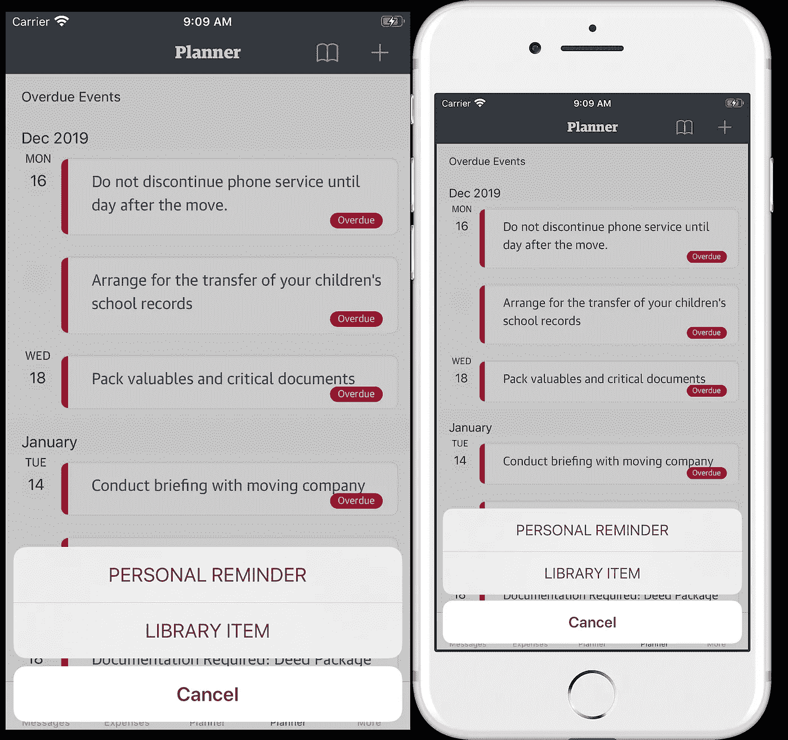
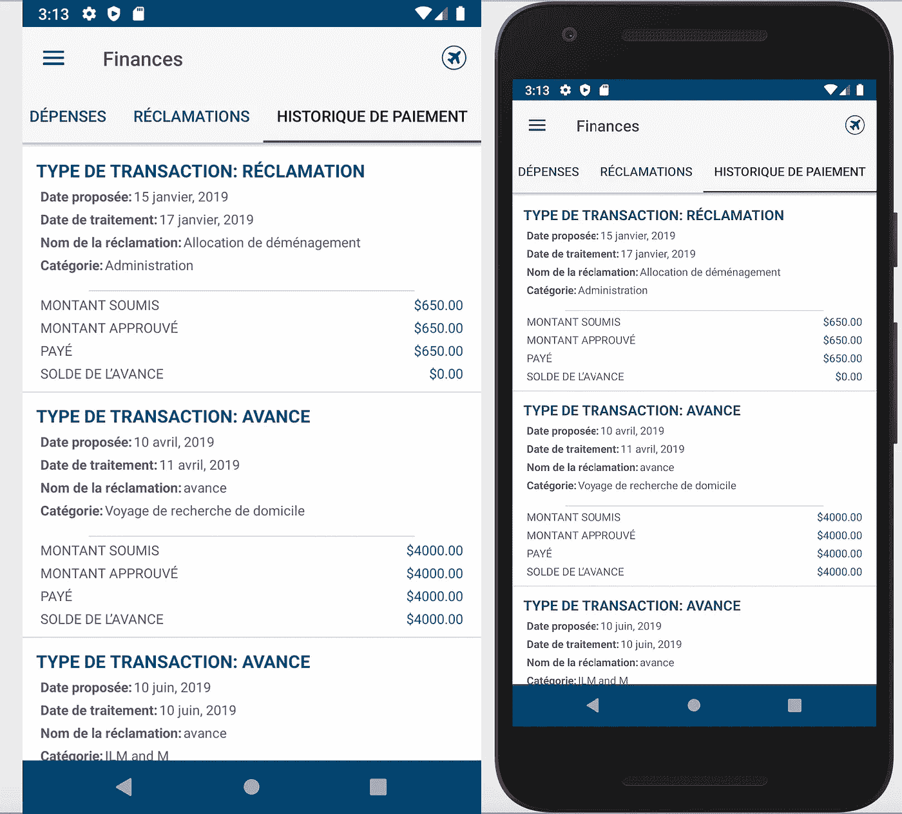
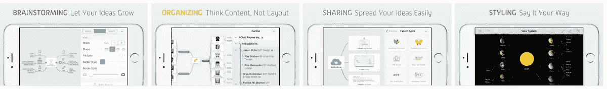
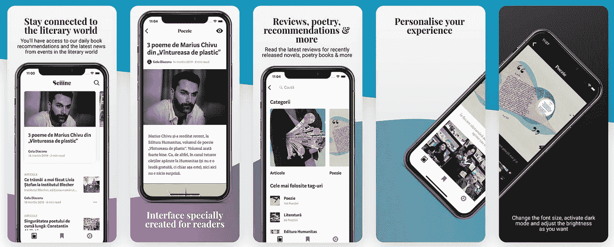

# 在 2023 年即时为 iOS 和 Android 屏幕截图生成漂亮的帧

> 原文：<https://itnext.io/generating-beautiful-frames-for-your-ios-android-screenshots-instantly-5175d77a0493?source=collection_archive---------4----------------------->

## 加快演示游戏的简单技巧

## 添加设备帧到截图现在是一个单一的命令！

H 你是否曾经需要与其他团队成员分享你的应用截图，但为了节省时间而跳过添加框架？截图就像点击一样简单，但是设计&处理图片编辑工具绝对不是开发者的强项。好了，添加一个设备框架现在是一个简单的键盘点击！

在 [iOS 编程子编辑](https://www.reddit.com/r/iOSProgramming/)中，我看到了一个问题的答案，这个问题把我带到了浪子教授如何使用自动化 UI 测试获取[屏幕截图](https://docs.fastlane.tools/getting-started/ios/screenshots/)的页面。在那里，我偶然发现了`frameit`命令。

*第一个原型是一家新兴的移动应用程序设计和开发咨询小型企业，专门从事 Xamarin 表单和原生应用程序。在* [*我们的网站*](https://thefirstprototype.com/mobile-app-development-toronto-ios-android.html) *，和* [*支持*](http://twitter.com/prototypemakers) *我们在* [*社交媒体*](http://instagram.com/prototypemakers) *上注册，在*[*iOS*](https://apps.apple.com/app/numberbomb/id1560372045)&[*安卓【上了解我们的五星数字炸弹游戏等项目的简单创新*](https://play.google.com/store/apps/details?id=com.tfp.numberbomb)

## 入门指南

你可以遵循[文档](https://docs.fastlane.tools)中提到的几种方法。我更喜欢用`homebrew`。首先你需要安装`homebrew`，然后安装`fastlane`，最后使用下面的命令安装`imagemagick`:

```
$ ruby -e "$(curl -fsSL https://raw.githubusercontent.com/Homebrew/install/master/install)"
$ brew update && brew install fastlane
$ brew install imagemagick
```

## 适用于 iOS



用银框分幅截图前后

将您的截图放在一个文件夹中，打开该文件夹的终端，然后运行`fastlane frameit`。在几秒钟内，所有图像的副本将与框架一起制作完成！

如果你运行`fastlane frameit silver`来代替，截图将会在银色的 iPhone 设备皮肤中生成。

你会注意到，它会自动检查你的截图的尺寸，以选择将哪个 iPhone 框架添加到图像中。

## 适用于 Android



使用`frameit`前后截图

在 android 截图的文件夹中，只需运行带有 Android 修改器的 frameit 命令，而不是`fastlane frameit android`。

*注意*:Android 部分对我来说不太好用，因为我得到了一个错误的说法`Tried looking for offset information for ‘portrait’, Nexus 5X in ‘/.fastlane/frameit/ latest/offsets.json’`。当我打开那个位置的`offsets.json`文件时，我注意到 Nexus 5X 被写成了 Nexus 5x，于是我更新了文件，保存了它，它修复了错误。

# 提交的截图

你成功地为你的截图创建了框架，太棒了！现在提交你的应用到任何一个应用商店，也需要提交截图。虽然你可以使用简单的截图，但你也可以通过在截图的同时添加描述来让你的应用看起来更有吸引力。因此，如果你想让你的截图更上一层楼，你可以使用以下一些免费工具:

## 浪子

浪子有一个高级功能，可以为应用商店制作截图，让我们使用上面显示的相同命令。你需要做的就是在同一个文件夹[中创建一个`Framefile.json`文件，如下图](https://docs.fastlane.tools/actions/frameit/#titles-and-background-optional)所示，包含你想要的配置。



截图和描述

## 菲格玛

如果你创建一个免费账户并浏览[社区页面](https://www.figma.com/community)，你会发现像[这个](https://www.figma.com/file/wzIoDByWrrhnrboVh8y27p/AppStore-Screenshot-Template-(Community)?node-id=2%3A2&t=cLymFpPD3TSKa9Vg-0)一样的免费模板的金矿，你可以简单地编辑它们，在几分钟内创建惊人的应用商店截图！

## 应用程序模型

这个网站还允许你用几个漂亮的模板免费制作更有趣的截图。



截图显示什么样的应用程序模型可以做

## Canva.com

Canva 是一个真正强大的网站，由成千上万的众包资产提供创意。如果你登录并在搜索栏中搜索“应用”，你可以在侧边菜单中找到一个类别过滤器，甚至可以帮助你获得应用图标。你可以通过付费来调整你的创意。我能够使用视频/移动视频中的创意作为灵感和启动模板，为聋人应用程序创建这个视频。

## 预览过了。应用

我通常不会把最好的留到最后，但是[这个网站](https://previewed.app)是个宝藏。除了免费创建截图之外，通过付费帐户，您可以在几分钟内为应用商店创建美丽的预览视频，如下所示:

预览过了。应用程序演练视频创建工具

[如果你有什么令人印象深刻的免费网站或工具，请告诉我，这样我就可以把它们添加到这里来与他人分享！](http://twitter.com/saamerm)