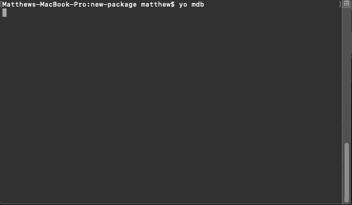
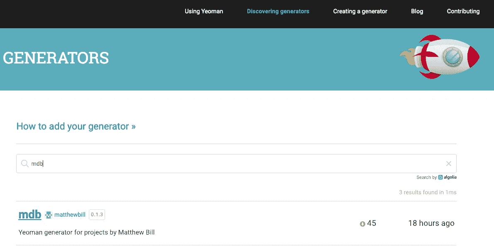

# 用 Yeoman js 生成代码

> 原文：<https://itnext.io/generating-code-with-yeoman-js-f13e0da87374?source=collection_archive---------0----------------------->



我最近在 [nor(DEV):con 2019](http://www.norfolkdevelopers.com/nordevcon/) 上发表了一篇关于用 [Yeoman js](https://yeoman.io/) 生成代码的演讲。这篇文章是那次演讲的延伸，有相应资源的链接。如果你想让我在你的会议或活动上发表演讲，请通过 [LinkedIn](https://www.linkedin.com/in/matthewbill/) 或 [Twitter](https://twitter.com/matthewbill) 给我发消息。

## 摘要

演讲的摘要如下:

> 厌倦了在工作中写样板文件？想摆脱可怕的单一回购，但担心代码的一致性？在这个 5 分钟的快速演示中，了解使用跨平台的 Yeoman js 自动生成代码和打包模板是多么容易。”

## 资源

*   [发电机 Github 报告](https://github.com/matthewbill/mdb.generator)
*   [幻灯片](https://docs.google.com/presentation/d/12QdEe1ZVOykP5WW0ZH-FAgkIumXD_3QAlzzc2Gw1brI/edit?usp=sharing)

# 问题是

随着从 monorepos 转向基于包的解决方案的持续趋势，我们面临着一个共同的工程挑战。如果我们不小心，那么我们可能会一次又一次地为公共存储库功能编写相同的模板代码，而不是为手头的任务编写所需的独特代码。简而言之，我们失败在*【干】*。我们还可能遇到一致性问题，我们希望确保使用相同的文件结构、类名、林挺规则、测试配置等。如果我们转向微服务架构，这个问题会进一步加剧，我在我的文章 *'* [*10 个从实施微服务中吸取的实际经验教训*](https://medium.com/@matthewdbill/10-practical-lessons-learnt-from-implementing-microservices-61cff03157df) *'* 中谈到了这一点。

# 通用功能

存储库中需要的一些常见功能示例如下:

*   版本控制文件
*   包文件
*   林挺
*   静态分析
*   测试
*   海峡群岛
*   激光唱片
*   证明文件
*   汽车文档
*   许可证

这个功能必须存在于存储库中，即使它只是某种共享包的链接。例如，我们的林挺配置可能在一个我们可以下拉的包中，但是我们仍然需要创建一个到那个包的链接。

# 解决方案

一个可能的解决方案是使用代码生成器，它将生成我们需要的所有模板代码，这样我们就可以保持一致性，并可以专注于编写特定于功能的代码。更好的是，如果我们可以指定某些可变的属性，比如名称和模板文件被这些值覆盖。有一个工具可以帮助我们做到这一点，那就是约曼 js。

## 约曼是什么

> “Yeoman 是一个通用的脚手架系统，允许创建任何类型的应用程序。它允许快速启动新项目，并简化现有项目的维护。”
> 
> “约曼是语言不可知论者。它可以用任何语言(Web、Java、Python、C#等)生成项目。)"

【https://yeoman.io/learning/ 号

虽然 Yeoman 本质上是一个 Node.js 包，但它可以用来创建任何语言的代码文件，无论是 C#、Python、Scala 还是纯文本。归根结底，它只是一个从模板创建文件并运行附加支持代码的工具。有些语言有自己的生成器(比如。但是如果你是一个多语言组织，并且只选择一种工具，你可能要考虑避免使用它们。

## 为什么是约曼

市场上有许多不同的代码生成器，为什么要使用 Yeoman 而不是其他的呢？我认为重要的一些主要原因如下:

*   被广泛采用
*   跨平台
*   使用方便
*   出色的文档
*   大多数人都知道 JavaScript

## 安装约曼

约曼是使用 npm 安装的。如果您的机器上还没有安装，您将需要安装 npm 捆绑的[节点](https://nodejs.org)。您可以通过运行以下命令来确定是否安装了 npm:

```
npm --version
```

> 注意:对于更熟悉 Node.js 的用户来说，' [npm doctor](https://docs.npmjs.com/cli/doctor.html) '命令是提供更多安装信息的好方法。

安装 npm 后，可以通过运行以下命令全局安装 Yeoman 并将其添加到您的路径中:

```
npm install yo -g
```

你现在设置使用约曼，但你没有安装任何发电机。所有约曼发电机也是 npm 产品包，需要在全球范围内安装使用。要查看您安装了哪些生成器，您可以运行:

```
yo
```

许多生产开源工具和库的组织利用 Yeoman 来创建例子或让人们开始使用。您可以访问约曼网站，探索不同的发电机。一个很好的，也许是意想不到的例子是微软的[代码生成器](https://github.com/Microsoft/vscode-generator-code)，它用于创建 [vs 代码](https://code.visualstudio.com/)扩展

要运行发电机，可在运行*‘yo’*命令后选择 if，或使用以下命令直接调用:

```
yo {name}
```

您可能还想考虑在内部和外部为您的工具的消费者使用 Yeoman。你个人可能发现有用的另一件事是创建自己的生成器，因为它在面试过程中对技术测试非常有用。

# 裸机发电机

所以，让我们开始创建自己的发电机。这实际上是一个非常简单的过程，不需要太多的改变。我们将从一些简单的东西开始，但是如果你进一步研究一下 Yeoman API，你会发现它的特性非常丰富。

## 步骤#1:创建包。Json

Yeoman 发现模板的方式是通过包的命名约定，它存储在 *'package.json'* 文件中。因此，首先，使用*‘NPM init’*创建您的 package.json 文件，并选择一个名称。

```
generator-{name}
```

如果对节点包使用私有注册表，您仍然可以使用范围:

```
@{scope}/generator-{name}
```

您将希望您的*‘package . JSON’*文件看起来像下面这样:

安装时，您需要确保安装最新版本的*【约曼发电机】*:

```
npm install yeoman-generator --save
```

通过使用关键字*‘yeoman-generator’*并将您的生成器发布到官方 npm 注册表，您的生成器将自动在 Yeoman 网站上被发现。



## 步骤 2:添加文件

接下来，我们需要一些文件。我们的 package.json 文件中的 files 部分指示 Yeoman 在哪里寻找生成器。在我们的示例中，这是发电机文件夹。我们的文件结构希望以类似这样的方式结束(我们将在下一步编辑 index.js)。

```
├───package.json
└───generators/
 ├───app/
 │ └───index.js
   ├───templates
   │ └─── {files to copy}
```

默认情况下，当使用*‘yo’*命令运行生成器时，Yeoman 将在*‘app’*文件夹中查找 index.js 文件。在 index.js 文件中，我们至少需要以下内容:

注意，我们的 generator 类继承了我们之前安装的 yeoman-generator 模块。

需要注意的一点是，在创建和上传 npm 包时，a .gitignore 不会包含在其中。如果您想要生成一个. gitignore 文件，这可能会是一个问题，这是一件很常见的事情。一种简单易行的方法是将您的。gitignore 文件不同的东西(比如。gitignore-template)并且当你复制它给它一个正确的名字时。

## 第 3 步:用户输入

当用户运行您的生成器时，您可能需要获取某些值来确定输出什么文件或者将什么文件注入到文件模板中。用 Yeoman 很容易做到这一点，当用户运行生成器时，他们会被要求输入这些信息。

输入的类型可以是文本，也可以是选项列表，比如我在许可证输入中使用的内容。它也可以是使用*‘confirm’*类型的布尔值。您可能会注意到这段代码位于一个名为*‘prompting()’*的特殊函数中。有许多生命周期方法，你可以把你的代码放在那里，它们的名字都很明显。下一步你会发现另一种生命周期方法，叫做*‘writing()’*。

## 第 4 步:写文件

生成文件有两种主要方式。第一个是从我们的 templates 文件夹中直接复制的，这对于像. gitignore 这样不变的文件可能很有用。

第二种方法是接受一个模板并向其中传递变量，比如用户输入或日期。

在您的模板中，您可以使用*'<% = { variable } %>'*符号将值注入其中。下面是一个简单的 README.md 模板示例:

您可能还希望只根据用户输入生成文件。

## 第五步:测试

在将新的生成器上传到 npm 注册中心或您自己的私有注册中心之前，您需要对其进行测试，以确保其行为正确。这可以很容易地通过在你的生成器的根目录使用 [npm 的 link](https://docs.npmjs.com/cli/link) 命令来完成。

```
npm link
```

使用生成器创建一个新文件夹，在其中创建一个新的解决方案，然后从该文件夹的根目录运行以下命令:

```
yo
```

## 第六步:发布

就是这样！现在要做的就是将你的包发布到 npm 注册中心或者你自己的私有注册中心。现在，任何人都可以使用您的生成器了，只需使用以下命令进行全局安装即可:

```
npm install generator-{name} -g
```

现在，如果你运行*‘yo’*，它应该列出你的发电机，你就可以开始了。如果您没有看到它，那么在 *'package.json'* 文件中检查您的包的名称，以确保它遵循正确的约定。

# 接下来呢？

我们可以用发电机做更多的事情。鉴于它只是 Node.js，你可以使用 Yeoman 创建任何你能想到的东西。这包括与其他 API 的交互，比如 Github 和设置支持 DevOps 的工具。一些可能有用的东西是:

*   安装依赖项
*   初始化本地 git 报告
*   创建远程存储库
*   设置 CI/CD 管道

这将使您的工具从仅仅是一个代码生成器变成一个创建组件所需的一切的工具。您也可以使用 *'this.spawnCommand'* 运行另一个命令行工具。

这对于微服务架构非常有用，因为您希望能够尽快创建新的服务。

## 请在社交媒体上与您所有的朋友分享，并点击下面的拍手按钮来传播消息。请回复你的自耕农发电机。👏

如果你喜欢这篇文章，那么请关注我并查看我的其他文章。

## 关于

Matthew Bill 是来自英国的热情的技术领导者和敏捷爱好者。他喜欢打破现状，带来变革和卓越的技术。拥有强大技术背景的(Node.js/。NET)，他通过使用创新的解决方案来解决复杂的问题，并擅长实施强大的 DevOps 文化。

他是技术社区的活跃成员，[写文章](https://medium.com/@matthewdbill)，发表演讲，[贡献开源](https://github.com/matthewbill)，共同创建[诺里奇节点用户组](https://www.meetup.com/Norwich-Node-User-Group/)。如果你想让他在你的会议上发言或者为你的出版物写一篇文章，请联系我们。

在 matthewbill.gihthub.io 找到更多关于 Matthew 和他的项目的信息

感谢阅读！

## 你可能会❤️的其他 Node.js 帖子

[](https://medium.com/@matthewdbill/node-js-project-structure-5655ee0e1d5) [## Node.js 项目结构

### 如果您第一次开始使用 Node.js，您可能想知道应该如何构建项目。与视觉不同…

medium.com](https://medium.com/@matthewdbill/node-js-project-structure-5655ee0e1d5) [](https://medium.com/@matthewdbill/top-vs-code-settings-for-node-js-76482cbab900) [## Node.js 的 Top VS 代码设置

### #1 自动保存

medium.com](https://medium.com/@matthewdbill/top-vs-code-settings-for-node-js-76482cbab900)