# 使用文本生成图像:人工智能梦想家的黎明

> 原文：<https://itnext.io/generating-images-using-text-the-dawn-of-the-ai-dreamers-14bda171fa0e?source=collection_archive---------1----------------------->

## 使用文本提示创建迷幻图像的简要理论和实践例子

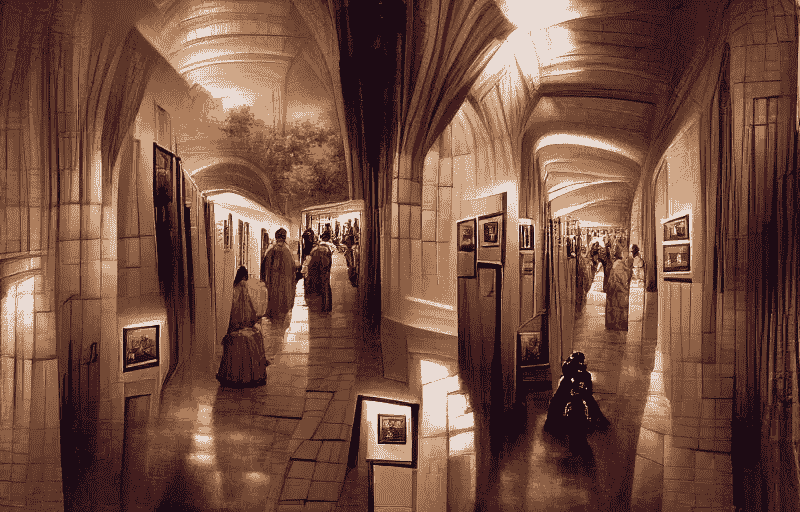

使用 CLIP + VQGAN 生成的图像；按作者

# 介绍

在过去的几年里，有很多研究和开发工作致力于创建能够根据给定的文本提示生成图像的人工智能模型。这可以被认为是一个个人艺术家，他试图按照你的指示去创作一件艺术品。现在，谁不想拥有一个私人毕加索呢，但既然这是不可能的，我们可以解决下一个非常可能的事情——人工智能毕加索😃。随着我们了解一种独特的模型，它们是由什么组成的，为什么会工作。接下来，我们将会看到一些我生成的图片的例子，最后，我们将会看到一些关于如何创建你自己的图片的启示。

# 理论——是什么？

对于本文，我们将使用 CLIP + {GAN}系列模型。这些模型的核心是 GAN，即生成性对抗网络。它是两个子模块的组合，(1)生成器:它试图创建一个逼真的人工图像，和(2)鉴别器:它试图区分人工/假和真实的图像。在训练 GANs 时，我们训练两个子模块，随着时间的推移，他们在工作中变得异常出色。对我们来说，发电机是一个有趣的作品，因为它现在已经学会了创建非常逼真的图像！

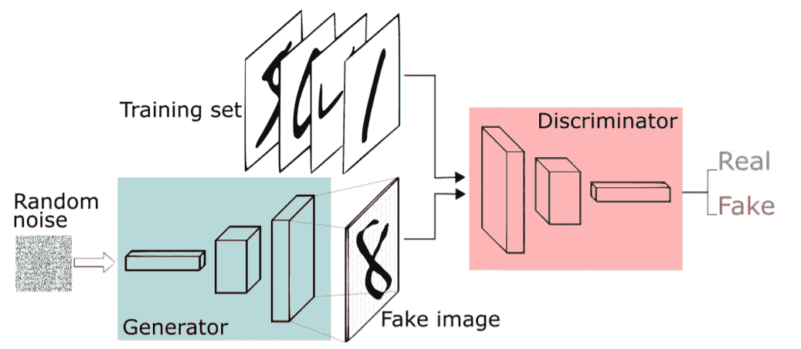

GAN 的基本架构。摘自“甘教程[..]”作者:拉兹万·马里涅斯库。来源:[链接](http://www.mit.edu/~razvan/talk/gan-tutorial/pres.pdf)

多年来，在提高 GANs 的性能方面有了很大的发展。上面分享的架构非常通用，可以视为非常基本的 GAN。最近，人们已经开发了许多更好的架构，其中一些是，(*不同类型的 gan 和代码的详细比较可以在这里找到*[](https://cvnote.ddlee.cc/2019/09/15/progan-sagan-biggan-stylegan)**)。*)*

*   *[**ProGAN**](https://paperswithcode.com/method/progan) :首先在低分辨率图像上训练生成器和鉴别器，然后递增地添加新层以处理更高的分辨率。*
*   *[**比根**](https://machinelearningmastery.com/a-gentle-introduction-to-the-biggan/) :大部分沿用了萨根的架构，融入了注意力层。顾名思义，它是 SAGAN 的更大版本，通道大小是两倍，批量大小是 8 倍。*
*   *[**VQGAN**](https://compvis.github.io/taming-transformers/) :考虑到撰写时的 SotA，它将变形金刚(在文本领域广泛测试)与 CNN(在图像领域广泛使用)融合在一起。最终产品在本地(由于 CNN)和全球(由于变形金刚)都更有表现力。*

*下一个重要的组件是[剪辑](https://openai.com/blog/clip/)模型，给定一组标题，它基本上为一幅图像找到最匹配的标题。为此，它有一个计算图像和文本描述之间相似性的子模块。经过详尽的训练，这个模块有很强的表现力。*

*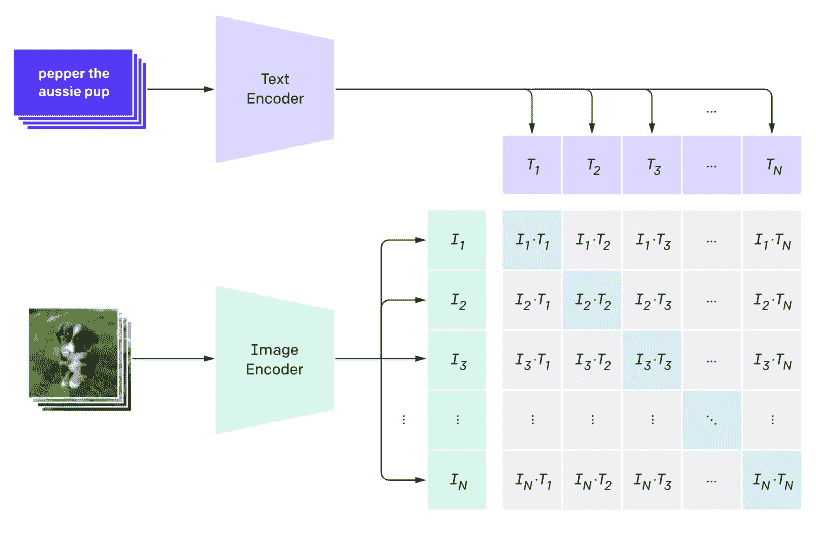*

*图像和文本编码器连同剪辑中的相似性比较(对于一批数据)。来源:[链接](https://openai.com/blog/clip/)*

*最终的图像生成解决方案可以通过组合 CLIP 和 GAN(您可以从上面选择一个)来创建，以这种方式— (1)使用 GAN 来生成图像，(2)使用 CLIP 来找到文本提示和图像之间的相似性，(3)经过多个步骤，训练组合的模型来最大化 CLIP 生成的相似性得分。这样，我们就可以把 CLIP 想象成老师给学生(甘)布置的画图像的作业(老师给出的唯一提示是一些文字描述)。学生首先带着一幅非常糟糕的画回来，对此老师提供了一些反馈。这个学生回去了，后来带着更好的版本回来了。这些交互(迭代)无非是老师(CLIP)和学生(GAN)之间反馈的传递和处理。随着时间的推移，图像变得更好，当我们认为结果足够好时，我们可以停止。*

# *例子*

*我们将遵循自下而上的方法。因此，我们将首先看看我生成的图像，然后再谈论实际方面。虽然我们可以生成的图像类型是无限的(因为它取决于文本提示)，但对于本文，我试图在三个领域广泛地生成图像— (1)绘画，(2)海报，以及(3)实体。对于每一种类型，我都在提示中添加了一些特定于类型的后缀，以向模型传达我的意图。我们将在后面详细讨论文本提示，所以现在说得够多了，让我们看一些只使用 google colab 笔记本和文本提示就可以生成的图像，*

## *涂漆*

*   *对于第一部分，我使用了提示:`“Queen of Egypt facing defeat with the assistance of King Solomon; landscape epic deviantart”` 。看看下面生成的图像。注意这个模型是如何通过在右边画沙丘和一些奇怪的金字塔结构来处理埃及的。还有，中间那个神秘的东西好像穿着金色的衣服，戴着皇冠，可能是因为提示里有国王和王后的文字。👑*

*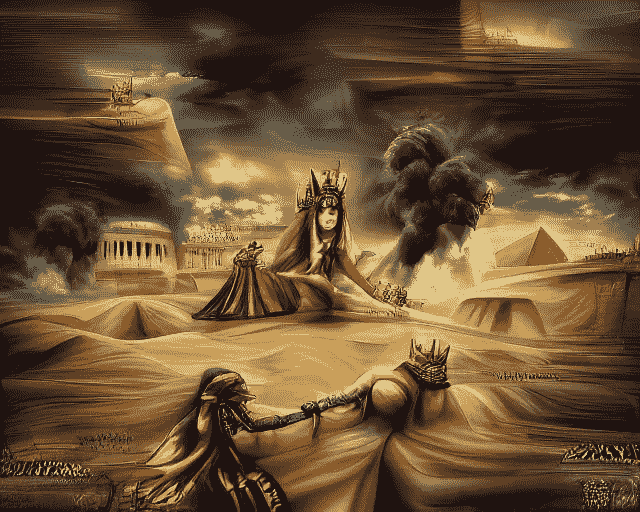*

*使用 CLIP + VQGAN 生成的图像；按作者*

*   *下一幅作品的提示是:`“Knights in Black Armour fighting with sorcerers; oil painting; 4k”` 注意在提示中添加油画是如何彻底改变输出的风格的。🧙*

*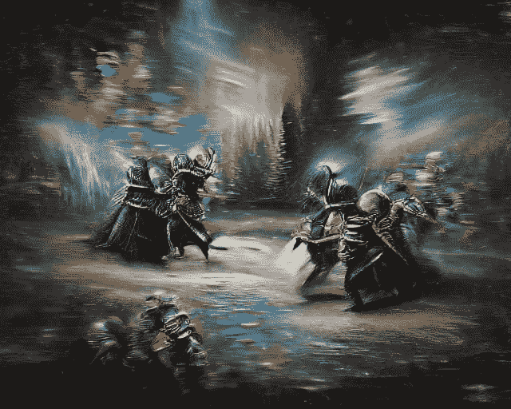*

*使用 CLIP + VQGAN 生成的图像；按作者*

*   *此作品提示:`“archangels Raphael and Michael cast the evil eye on him; fresco”`。在提示中使用 fresco 再次改变了样式。🏰*

*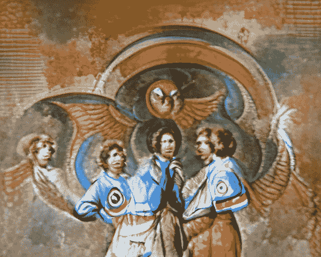*

*使用 CLIP + VQGAN 生成的图像；按作者*

## *海报*

*   *此片提示:`“Harry Potter and the Stoned Philosopher | a book poster | ultrarealistic | trending in artstation”`那些白色的东西——是胡子还是烟？😆*

*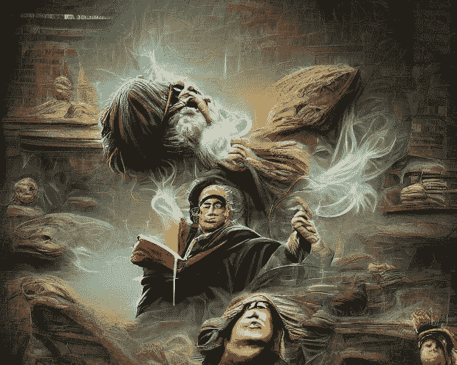*

*使用 CLIP + VQGAN 生成的图像；按作者*

*   *文章提示: `“A man with a gun, a woman and few cars in the background; movie poster; artstation”`嗯，我说的是很少，不是很多车😃*

*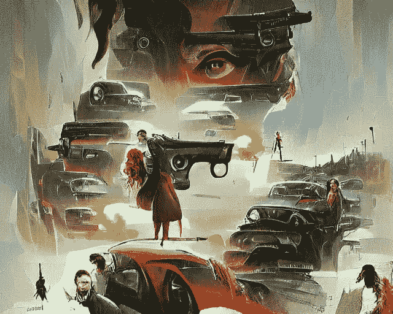*

*使用 CLIP + VQGAN 生成的图像；按作者*

*   *此片提示:`“two guys with what looks like some kind of supernatural power; game poster; trending in artstation”` 🕹️*

*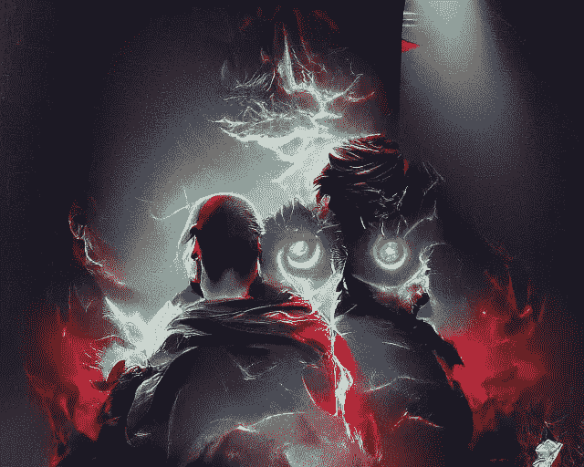*

*使用 CLIP + VQGAN 生成的图像；按作者*

## *实体*

*   *此件作品提示:`“Shiva the destroyer god | 4k | trending in artstation”` 🕉️*

*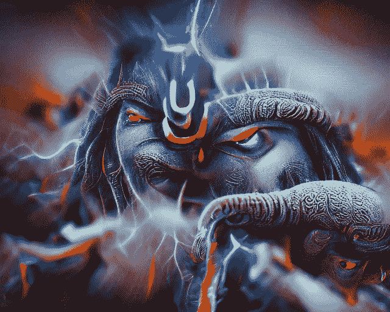*

*使用 CLIP + VQGAN 生成的图像；按作者*

*   *这篇文章的提示: `“a unicorn wearing a black armor | 4k | deviantart | artstation”`这太离奇了🦄*

*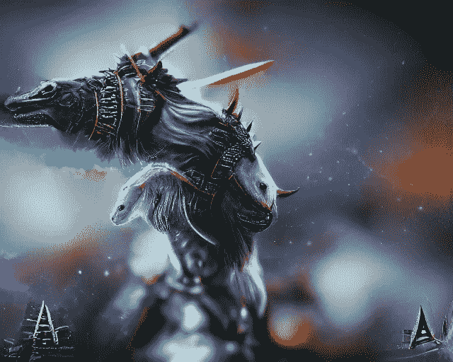*

*使用 CLIP + VQGAN 生成的图像；按作者*

*   *这篇文章的提示:`“a talking tree saying groot; rendered in unreal engine”`那不是格鲁特·🦸*

*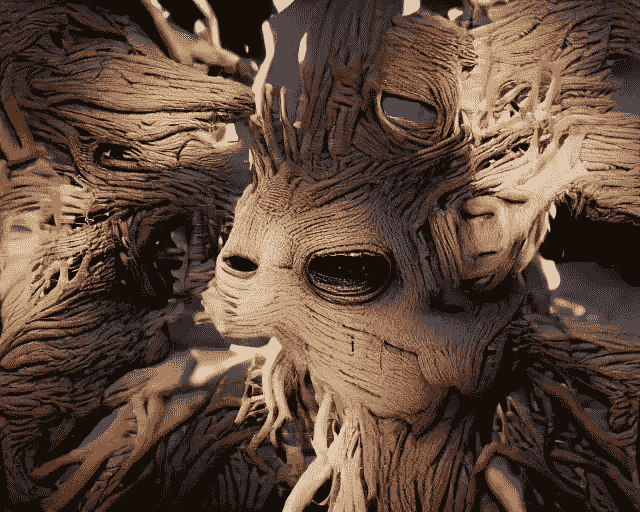*

*使用 CLIP + VQGAN 生成的图像；按作者*

## *录像*

*AI 模型在多次迭代中生成图像。因此，我们可以保存每个迭代步骤的图像，并最终将它们组合在一起，创建一个视频。这个视频将展示一幅图像从最初的空白阶段到最终的艺术阶段的旅程。*

*   *让我们尝试一个全新的作品:`“the chimney of the sacred art gallery by James Gurney”` 🎨*

*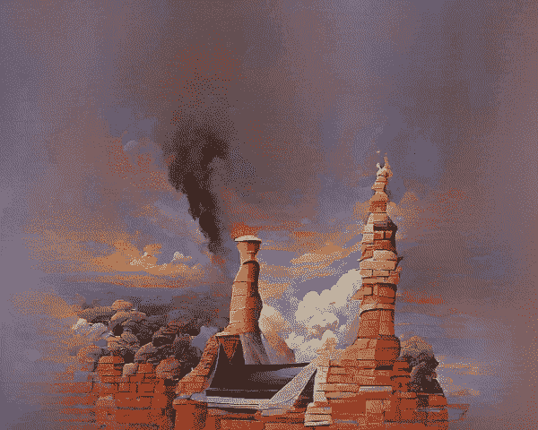*

*使用 CLIP + VQGAN 生成的图像；按作者*

*   *上面的一张图片怎么样？举一个电影海报的例子，枪支和汽车，*

*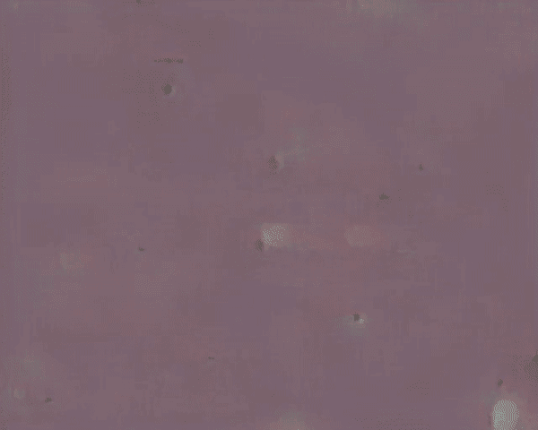*

*使用 CLIP + VQGAN 生成的图像；按作者*

# *创建您自己的图像*

*最后，让我们转到实践方面，我们将讨论如何创建自己的图像。请注意，我不是下面分享的代码的创建者。我只是用户，事实上，我是一个试图与世界分享这个酷项目的使者。嗯……我想知道人工智能将如何可视化这个！😉*

*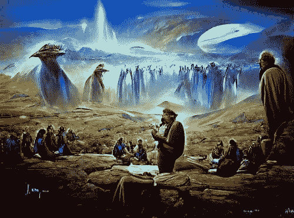*

*提示:“一个信使告诉好消息史诗景观由詹姆斯·格尼”|图片使用 CLIP + VQGAN 生成；按作者*

## *来源*

*有许多开源代码材料可以让你创建自己的图像。请注意，其中很多都是实验性的，所以您可能需要尝试几个，看看哪个效果更好。也就是说，它们中的任何一个本身都是好的，可以产生各种各样有趣的图像。下面，我将分享一些我跟随并用来生成我之前分享的图片/视频的优秀作品。*

*   *我的第一个建议是 [VQGAN-CLIP](https://github.com/nerdyrodent/VQGAN-CLIP) ，它是由[nerdy 啮齿动物](https://github.com/nerdyrodent)创建的 Github repo。它提供了非常好的文档和几个直观的例子，展示了可以使用代码生成的不同类型的图像。一旦您下载并安装了模型，生成一个图像就像，*

```
*python generate.py -p "A painting of an apple in a fruit bowl"*
```

*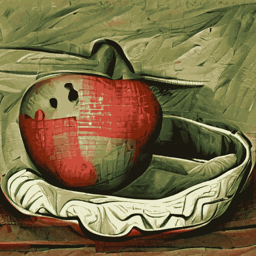*

*图片取自啮齿动物 VQGAN-CLIP repo。来源:[此处](https://github.com/nerdyrodent/VQGAN-CLIP)*

*   *如果你对 google colab 比较入迷(而且想直接跳转代码)，可以看看这个[笔记本](https://colab.research.google.com/drive/1ZAus_gn2RhTZWzOWUpPERNC0Q8OhZRTZ)。该表扬就表扬，从笔记本上摘抄，*

> *[它]最初是由凯瑟琳·克劳森(https://github.com/crowsonkb，[https://Twitter . com/river shave wings)制作的。最初的 BigGAN+CLIP 方法是由](https://twitter.com/RiversHaveWings).)[https://twitter.com/advadnoun.](https://twitter.com/advadnoun.)添加了一些解释，并由 Eleiber#8347 进行了修改，由 Crimeacs # 8222(https://twitter.com/EarthML1)使用了 pooling trick，GUI 是在 Abulafia#3734 的帮助下制作的*

*   *[big sleep](https://github.com/lucidrains/big-sleep)by[luci drains](https://github.com/lucidrains)是一个使用 BigGAN + CLIP 生成图像的 python 包。您可以使用`pip install big-sleep`命令安装软件包。然后可以在 CLI 中通过`dream “a pyramid made of ice”`或使用 python 代码来创建映像，*

```
*from big_sleep import Imagine

dream = Imagine(
    text = "a pyramid made of ice",
    lr = 5e-2,
    save_every = 25,
    save_progress = True
)

dream()*
```

*   *是另一个生成图像的 python 包。这个使用了 CLIP 和 SIREN(隐式神经表示网络)的组合。您可以使用命令`pip install deep-daze`安装包，然后使用`imagine “a house in the forest”`生成镜像。这是一个基于 CLI 的包，但是提供了许多参数供您使用。*
*   *最后，如果你想跟踪最新的发展，看看其他人正在创造什么样的酷图像，请加入 [EleutherAI](https://www.eleuther.ai/) 的 [discord server](https://discord.gg/zBGx3azzUn) 的 **#art** 频道。在 [EleutherAI](https://www.eleuther.ai/) 的好人也创造了一个机器人，并将其与他们的频道**#法拉第笼**上的 8 个图形处理器系统连接，在那里任何人都可以使用命令`.imagine {your text prompt}`提示机器人创建图像。*

## *快速工程*

*如果您仔细观察，就会发现图像中的许多变化是由于作为模型输入给出的有趣的文本提示。最近人们观察到，虽然提供清晰和描述性的提示可以生成令人满意的图像，但添加特定的前缀或后缀会极大地修改图像或提高质量。基于这种观察，这里有一些建议，你可以考虑到你的提示，以产生更好的图像，*

*   *在原始提示中添加“artstation 中的趋势”或简单的“artstation”或“deviantart”通常会产生更好的艺术图像。这是因为 CLIP 是由 scraping 网站训练的，以获得图像和文本对，这些是一些最著名的艺术家分享他们作品的网站。因此，有趣的是，当文本提示包含这些平台的提及时，模型已经了解了艺术作品的相关性。*
*   *我们可以添加一些后缀来提高输出质量，如“4k”、“高质量”、“超逼真”等。*
*   *我们甚至可以添加艺术家的名字(著名的艺术家)来生成他们风格的图像。例如，第一个视频是通过添加后缀——“由詹姆斯·格尼(James Gurney)”生成的。更进一步，我们甚至可以用“油画”、“壁画”等来定义画风。*

*请注意，这不是一个详尽的列表，我们的文本提示可以包括基本上任何文本，所以最终，你的创造力才是最重要的。此外，人们每天都在想出新的花招！*

*最后，顺便说一句，如果你面临艺术家的阻碍，不能产生有趣的提示，我会建议使用由 [EleutherAI](https://www.eleuther.ai/) 发布的免费的 [GPT-J-6B](https://6b.eleuther.ai/) 模型。这是一个基于 GPT 的文本输入文本输出模型，可以用来生成大量的提示。你所需要的只是一个简短的描述和几个例子。我用它来生成一些文本提示，我后来用它们来生成图像(谈论盗梦空间🌌).下面显示了一个例子，*

*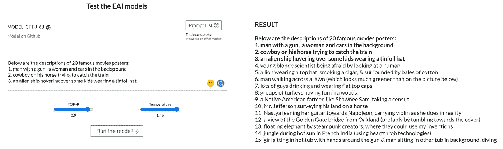*

*[左]为 GPT 车型提供的文本提示示例。[右]接下来的句子是由模型预测的。按作者。*

## *参考*

1.  *[异梦:一个新兴的艺术场景](https://ml.berkeley.edu/blog/posts/clip-art/) *作者查理·斯内尔**
2.  *《人工智能中的精神病、梦和记忆》*
3.  *[概念主义:深入神经网络](http://ai.googleblog.com/2015/06/inceptionism-going-deeper-into-neural.html)*

*要阅读更多类似的文章，请在 LinkedIn 上关注我或访问我的网站。*

*干杯。*