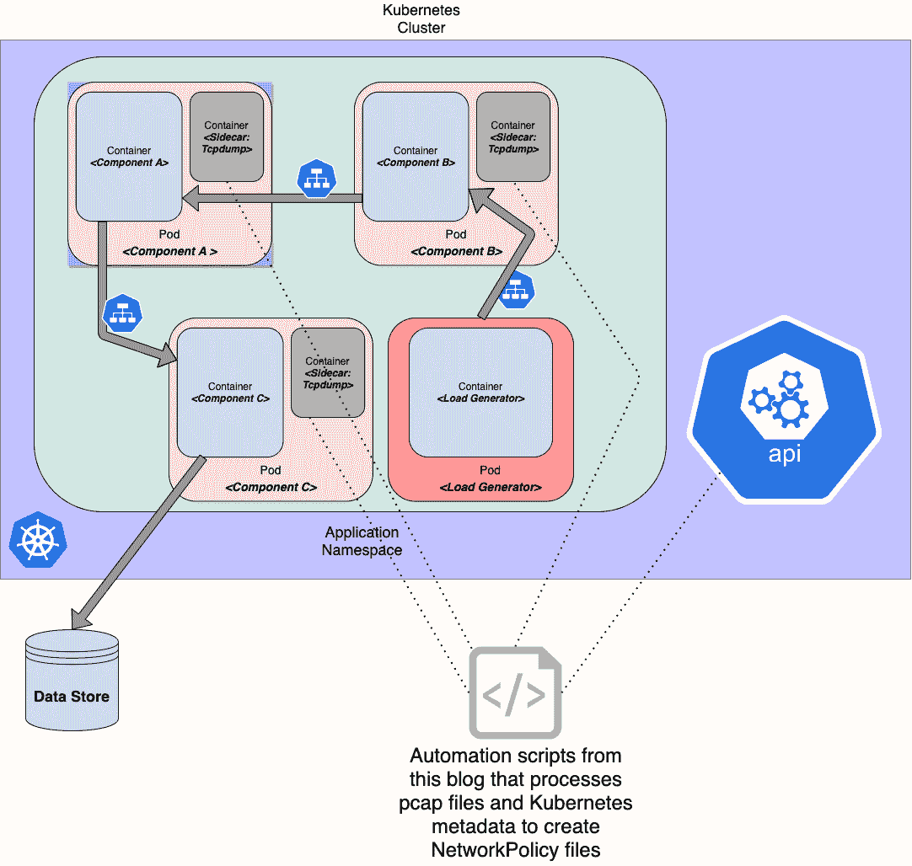
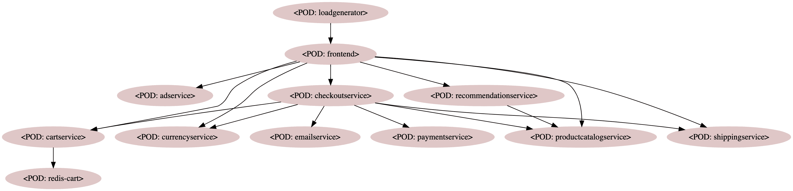
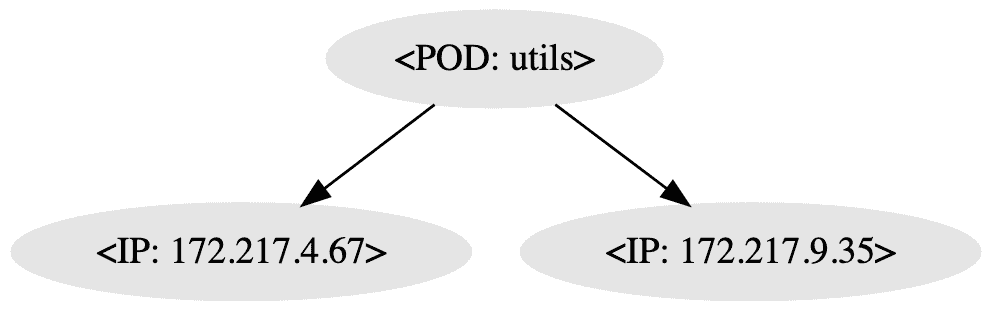

# 通过嗅探网络流量自动生成 Kubernetes 网络策略

> 原文：<https://itnext.io/generating-kubernetes-network-policies-by-sniffing-network-traffic-6d5135fe77db?source=collection_archive---------2----------------------->

这篇博文是关于一个实验，该实验基于从 Kubernetes 集群上运行的应用程序捕获的实际网络流量，自动创建 [Kubernetes 网络策略](https://kubernetes.io/docs/concepts/services-networking/network-policies/)。

**这篇博文中提到的所有代码都可以在这里**[](https://github.com/mcelep/blog/tree/master/automated-networkpolicy-generation)****找到。****

***我们与一位 VMware 同事合作撰写了这篇博文:*[*Assaf Sauer*](https://ch.linkedin.com/in/assaf-sauer-b6261b23)*。***

## **但是为什么呢？**

**[网络策略](https://kubernetes.io/docs/concepts/services-networking/network-policies/)用于允许/阻止在 Kubernetes 集群上运行的应用程序的网络流量。处理关键客户数据的企业，如金融机构(银行、保险等。)有非常严格的安全要求，那些在 Kubernetes 集群上运行应用程序的人很可能使用*网络策略*(或者根据他们使用的 CNI 插件，类似于它的东西，如 [Antrea 的 ClusterNetworkPolicy](https://github.com/vmware-tanzu/antrea/blob/a9adf5a58acee9bfb06fbe75b0f2d097ec362c99/docs/antrea-network-policy.md) 或 [CiliumNetworkPolicy](https://docs.cilium.io/en/v1.8/concepts/kubernetes/policy/#ciliumnetworkpolicy) )来控制应用程序允许的入口/出口网络流量。**

**对于简单的应用程序，例如由前端和连接到数据库的后端组成的传统三层架构应用程序，创建*网络策略*是非常简单的。然而，由许多组件组成的更复杂的应用程序(想想具有许多组件的基于微服务架构的应用程序)提出精确的正确网络策略(这里我们所说的精确是指，只有在明确需要时才允许两个组件之间的通信，并且只允许在已知的端口上通信)可能非常耗时。这就是为什么我们想出了几个脚本，使创建标准的(非 CNI 特定的)Kubernetes 网络策略变得更容易。**

## **怎么会？**

**网络策略生成自动化背后的想法很简单。下图对此进行了总结:**

****

**它由下述步骤组成:**

## **1)捕获网络流量**

**首先，我们需要一种方法来捕获每个 pod 运行的网络流量。我们使用传统的 [tcpdump](https://en.wikipedia.org/wiki/Tcpdump) 来捕捉流量，使用 [kubernetes sidecar 模式](https://www.google.com/search?q=kubernetes+sidecar+pattern)。为此，我们需要运行 [tcpdump 映像](https://hub.docker.com/r/dockersec/tcpdump)的 pod/容器的正确权限，即 tcpdump 容器需要以 root 用户身份运行。我们意识到这在高度安全的企业 kubernetes 安装中可能是不可行的。也就是说，此回购中脚本的预期用途是在集群中运行应用程序，该集群:**

*   **根本不实施网络策略(或者通过使用诸如 [this](https://kubernetes.io/docs/concepts/services-networking/network-policies/#default-allow-all-ingress-traffic) 和 [this](https://kubernetes.io/docs/concepts/services-networking/network-policies/#default-allow-all-egress-traffic) 之类的网络策略来允许所有入/出流量)**
*   **允许 pod 以 root 用户身份运行**

**如果在一个群集上生成策略，而应用程序在另一个群集上运行，您需要确保为网络策略指定的 IPs、FQDNs 针对目标环境进行了相应的调整。例如，如果有一个用于连接到在 IP 10.2.3.4 上运行的 Oracle 数据库的出口网络策略，并且如果该 IP 在应用程序将部署到的实际目标环境上不同，则您将需要调整该 IP。**

## **2)生成网络流量**

**为了创建正确的网络策略，我们需要捕获代表所有用例的网络流量，从而捕获与应用程序相关的所有潜在网络通信。由您来确保在捕获网络流量期间，您在应用程序上生成有意义的负载。例如，如果您的应用程序是一个基于 REST 的 web 应用程序，您应该确保访问所有相关的 REST 端点。如果应用程序基于从 MessageQueue 接收的消息进行一些处理，那么就由您将这些消息发送到队列，以便应用程序执行它在生产中通常执行的操作。**

## **3)收集捕获文件和 Kubernetes 数据**

**Tcpdump sidecar 容器使用以下命令运行 tcpdump:`tcpdump -w /tmp/tcpdump.pcap`。因此，在我们分析流量之前，我们需要从 pod 收集所有 pcap 文件。此外，我们还需要一些来自 Kubernetes 的元数据。我们将获取有关 Kubernetes 资源的信息，如服务、部署、副本集等，以便稍后我们可以使用这些信息来分析哪个应用程序拥有哪个 IP。**

## **4)分析数据并生成网络策略**

**收集了所有关于 IP、端口和标签的数据包捕获和 kubernetes 数据后，现在我们可以构建一个图表。在该图中，节点/顶点将代表 pod，而边将是这些 pod 之间的网络通信。在生成网络策略的 python 脚本中，首先构建一个图，然后遍历边，并为每条边生成一个网络策略。**

## **让我们看看它的实际效果吧！**

**让我们看一下下面的步骤，看看我们能否为测试应用程序生成网络策略。测试应用程序是一个来自谷歌的微服务演示应用程序，可以在[这里](https://github.com/GoogleCloudPlatform/microservices-demo)找到。**

## **环境准备**

**您需要访问 Kubernetes 集群，并且需要安装以下工具:**

*   **Kubernetes CLI**
*   **Python (v3)**
*   **Pip(管理 python 依赖关系)(v3)**
*   **Tshark 是一个基于终端的 [Wireshark](https://www.wireshark.org/) (见[此处](https://www.wireshark.org/docs/man-pages/tshark.html))**
*   **[切](https://man7.org/linux/man-pages/man1/cut.1.html)**
*   **[Jq](https://stedolan.github.io/jq/)**

**要安装 python 依赖项，从顶层项目文件夹运行以下命令:`pip install -r requirements.txt`**

**我们已经在 Mac OS 和 Linux 上测试了这个报告中的脚本。**

## **部署测试应用程序**

**`env.sh`顶层项目文件夹中的文件包含一些在多个脚本中使用的变量。请用您的首选值覆盖这些变量，例如 **TARGET_NS** 是将用于所有脚本的 Kubernetes 名称空间。默认情况下 *TARGET_NS* 设置为 *netpol-demo* ，如果您愿意，您可以对其进行编辑。**

**下面的摘录用于创建 Kubernetes 名称空间，然后部署一个测试应用程序。这种情况下的测试应用程序是一个微服务演示应用程序，可以在本[报告](https://github.com/GoogleCloudPlatform/microservices-demo)中找到。然而，你可以使用任何你喜欢的应用程序。**

```
source env.sh
# create a namespace if it does not already exist
kubectl create ns $TARGET_NS --dry-run -o yaml  | kubectl apply -f -
# deploy application
kubectl apply -f https://raw.githubusercontent.com/GoogleCloudPlatform/microservices-demo/cbd3c9643400de7471807821e212a6f3db38ed14/release/kubernetes-manifests.yaml -n ${TARGET_NS}
```

## **$TARGET_NS 中的修补程序部署**

**运行以下命令:`./1-inject-sidecar.sh`修补所有部署，并注入一个 sidecar 容器，该容器使用以下命令运行 tcpdump:`tcpdump -w /tmp/tcpdump.pcap`。在我们的测试应用程序中，我们只有由部署控制的 pod。如果您要使用一个不同的应用程序，演示谷歌应用程序在这里使用，您将需要采用 sidecar 注入机制。**

## **准备复制捕获和元数据**

**注意，下面的脚本(*2-copy-capture-and-metadata . sh*)将捕获 pod 名称，然后打印出它将等待 *TEST_DURATION_IN_SECONDS* 。在此期间，您应该“加载”应用程序，以便生成涵盖真实用例中所有潜在通信模式的网络流量。**

**运行下面的命令:**

**`./2-copy-capture-and-metadata.sh`**

**如果在运行该脚本时遇到问题，可以重新运行它。请记住，虽然你将需要确保在重新运行的应用程序流量也产生。**

## **产生流量**

**在我们的演示应用程序中，有一个名为*负载生成器*的 pod，它将与其他应用程序组件一起部署。这个 pod 不断调用 ui 来生成应用程序流。您可以通过运行`kubectl -n $TARGET_NS logs $(kubectl get pods -l app=loadgenerator -o jsonpath='{.items[0].metadata.name}' -n $TARGET_NS) -c main`来查看*负载生成器* pod 的日志。**

**如果使用相同的谷歌微服务演示应用程序来产生网络流量，则不需要做任何额外的工作。然而，如果您使用另一个应用程序，您将需要运行您自己的负载生成工具，而脚本*。/2-copy-capture-and-metadata . sh*继续输出该消息:“将等待 X 秒，以便生成应用程序流量……”**

## **分析数据并构建网络策略**

**运行以下命令来分析数据并生成网络策略。脚本的输入是一个以 *capture-* 为前缀的捕获 json 文件。您可以通过运行`ls .tmp/capture-*.json`找到候选捕获文件。**

```
./3-analyse.py .tmp/capture-XXX.json
```

**生成的网络策略应该在*中。tmp/网络策略*文件夹。对于我们的演示应用程序，我们为每个应用程序生成了一个网络策略文件，包括入口和出口规则。此外，默认情况下会创建一个允许在端口 53 上进行出站通信的 DNS 策略。**

**作为运行 *3-analyse.py* 脚本的结果，还有一个图形(以[点](https://graphviz.org/doc/info/lang.html)格式)生成。您可以使用在线工具，如 [this](https://dreampuf.github.io/GraphvizOnline) 或 [this](https://edotor.net/) 来创建图表的可视化表示。以下是一些通过点表示创建的图像示例。**

****

**[https://github . com/MC elep/blog/blob/master/automated-network policy-generation/graph _ ms _ demo . png？raw=true](https://github.com/mcelep/blog/blob/master/automated-networkpolicy-generation/graph_ms_demo.png?raw=true)**

****

## **清理**

**只要 tcpdump sidecar 在运行，它就会持续捕获网络流量。所以，不要忘记在你完成后把那些边车容器拿走。运行`./4-delete-sidecar.sh`清除 tcpdump 边车容器。**

## **逮到你了**

**此报告中的脚本是在概念验证设置中创建的，代码质量有改进的空间。有一些限制:**

*   **开发脚本是为了为在单个命名空间中运行 pod 的应用程序生成网络策略。因此，如果有调用发生在应用程序运行的地方之外的其他名称空间，网络策略将不会被正确处理。**
*   **进出群集外部的流量的网络策略规则是基于 IP 的。如果应用程序与受我的多个 IP 支持的域通信，则只有在脚本运行期间解析的 IP 才有网络策略规则。所以，你可能会错过一些规则。**
*   **仅分析 TCP 流量。有一个为 DNS 生成的网络策略，但不会创建其他基于 UDP 的网络策略。**
*   **运行 tcpdump 需要一些提升的权限。在实施网络策略的环境/集群中，您可能无法获得这些提升的权限。然而，我们认为，这篇博文中提供的概念/脚本在一些用例中可能是有益的，比如用于 Kubernetes 的 COTS(商业现货)软件。在 Kubernetes 上的 COTS 软件场景中，供应商可以从在集群中生成网络策略中获益，从安全角度来看，这种策略不是非常严格。然后，生成的网络策略可以作为模板提供给软件供应商的客户。**

**请随意扩展这些脚本以涵盖更多的用例:)**