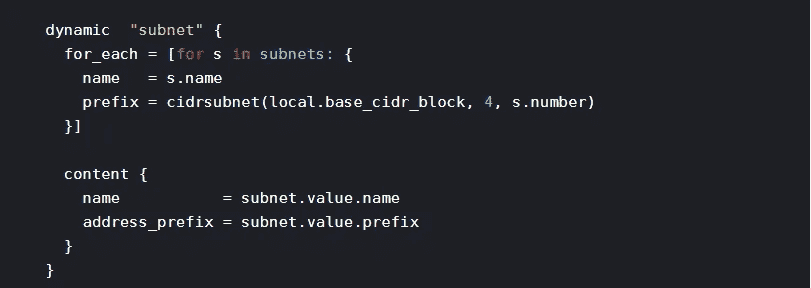

# 使用 Terraform 在 Azure 容器注册表上生成网络规则

> 原文：<https://itnext.io/generating-network-rules-on-azure-container-registry-with-terraform-667667f2493f?source=collection_archive---------4----------------------->



地形动态块

许多 Azure 资源，如 Azure Container Registry (ACR)、Storage 和 Key Vault，都支持通过授予某些 IP 范围或虚拟网络来访问资源，从而添加网络级保护。这些控制是建立控制资源访问的分层方法的重要部分。虽然许多资源正在脱离虚拟网络规则，转而支持私有端点，但您会发现我的苦难对学习一些 Terraform 结构很有用。

本文将重点介绍我在尝试使用 Terraform 构造(for、for_each 和 dynamic blocks)从子网标识符的输入列表中生成网络规则列表时遇到的一些挑战。当我遇到这些问题时，我四处搜索，看到其他人也面临着同样的问题，但是这些帖子没有提供解决方案。

这是我最初的方法。我尝试使用 for_each 和一个动态块。不幸的是，变量 var.allowed_subnet_ids 不可达，并返回代码片段下面的错误。困惑之余，我开始排除故障，用一个硬编码的数组替换了这个变量…它会生成正确的配置。是时候发挥创造力了

```
variable "allowed_subnet_ids" {
  type        = list(string)
  description = "List of subnet IDs to be allowed to access the ACR"
}resource "azurerm_container_registry" "acr" {
  name                     = module.azure_naming.acr_name
  location                 = var.location
  resource_group_name      = azurerm_resource_group.acr_rg.name
  sku                      = "Premium"
  admin_enabled            = false
  georeplication_locations = var.georeplicated_region_list
  network_rule_set {
    default_action = "Deny"
    dynamic "virtual_network" {
      for_each =  var.allowed_subnet_ids
      # for_each =  ["/subscriptions/xxxxxxxxxxxxxxxxxxxx/resourceGroups/rg-app1-network-sbox-canadaeast-persistent/providers/Microsoft.Network/virtualNetworks/vnet-app1-network-sbox-canadaeast/subnets/Private", "/subscriptions/xxxxxxxxxxxxxxxxxxxx/resourceGroups/rg-app2-network-sbox-canadaeast-persistent/providers/Microsoft.Network/virtualNetworks/vnet-app2-network-sbox-canadaeast/subnets/Private"]
      content {
        action    = "Allow"
        subnet_id = virtual_network.value
      }
    }
  }
}
```

**错误:**

```
Error: Unknown variable
  on ../acr_resource/main.tf line 25, in resource "azurerm_container_registry" "acr":
  25:       for_each =  var.allowed_subnet_ids
```

# 变得有创造力

仔细考虑问题和故障排除排列，很明显我仍然需要生成网络规则列表。作为一个计算/生成，我使用局部变量来解决这个问题。这被证明是一个简单的解决方案；虽然我希望动态块能够工作。

```
locals {
  allowed_virtual_networks = [for s in var.allowed_subnet_ids : {
    action    = "Allow",
    subnet_id = s
  }]
}resource "azurerm_container_registry" "acr" {
  name                     = module.azure_naming.acr_name
  location                 = var.location
  resource_group_name      = azurerm_resource_group.acr_rg.name
  sku                      = "Premium"
  admin_enabled            = false
  georeplication_locations = var.georeplicated_region_listnetwork_rule_set {
    default_action  = "Deny"
    virtual_network = local.allowed_virtual_networks
  }
}
```

关于 For、for_each 和动态块的更多信息，这个资源非常有用(尽管它把我引入了动态块的老鼠洞)。

[](https://www.hashicorp.com/blog/hashicorp-terraform-0-12-preview-for-and-for-each/) [## 哈希公司 Terraform 0.12 预览版:For 和 For-Each

### 作为 Terraform 0.12 发布前的一部分，我们发布了一系列功能预览博客帖子。的…

www.hashicorp.com](https://www.hashicorp.com/blog/hashicorp-terraform-0-12-preview-for-and-for-each/) 

其他人面临类似问题的其他资源:

*   [https://Alex harv 074 . github . io/2019/09/17/adventures-in-the-terraform-DSL-part-VII-resource-for _ each-in-terraform-0 . 12 . 6 . html](https://alexharv074.github.io/2019/09/17/adventures-in-the-terraform-dsl-part-vii-resource-for_each-in-terraform-0.12.6.html)
*   [https://www . Reddit . com/r/terra form/comments/gh15g 4/using _ dynamic _ inside _ blocks _ in _ a _ resource/](https://www.reddit.com/r/Terraform/comments/gh15g4/using_dynamic_inside_blocks_in_a_resource/)
*   https://discuse . hashi corp . com/t/using-dynamic-inside-blocks-in-A-resource/8542/2—对我的发现的后续回答提供了关于为什么动态块不工作的更多见解。