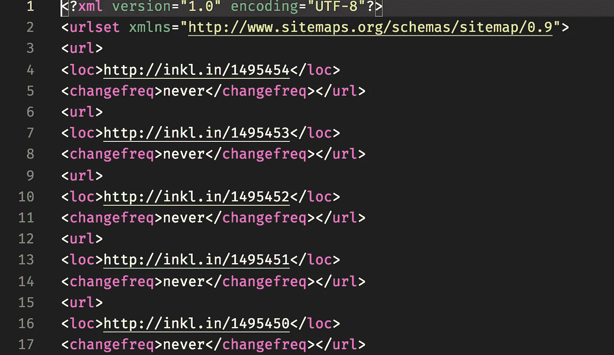
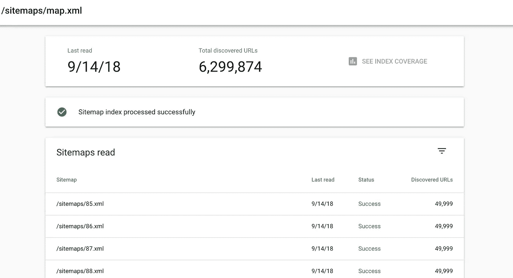

# 为机器人生成站点地图

> 原文：<https://itnext.io/generating-sitemaps-for-bots-a9d927f359b1?source=collection_archive---------1----------------------->

在上一篇关于使用 [Rendertron 和 Kubernetes](https://medium.com/@justindavies/using-rendertron-in-kubernetes-for-spa-seo-39055567c745) 在服务器端渲染我的 React 应用程序的文章之后，我需要一种方式来让这些搜索引擎了解内容(即以太坊块的更新解释)。

由于 [http://inkl.in](http://inkl.in) 上的内容会不断更新，每当链上出现新块时，我需要确保爬虫能找到比发生的有机内部链接更容易的东西。

输入网站地图。

网站地图是一个 XML 文件，它会提示搜索引擎有它应该查看的内容。我说提示，因为它不会强迫像 Google 或 Bing 这样的公司对内容进行索引，但总比什么都没有好。

自从把 inkl.in 网站地图推给谷歌后，我可以看到每天大约有 5000 个页面被索引，并且有有机的搜索流量访问这个网站。

拥有站点上那么多的内容(超过 600 万个块=超过 600 万个页面，加上地址的可视化，超过 3 亿个)的问题是，它不适合一个单一的 sitemap XML 文件。

要解决这个问题，请输入站点地图索引。索引是用于引用所有其他站点地图的另一个 XML 文件。单个站点地图文件中的数据量是有限制的，即 50，000 页，最大 50Mb。

所以需要做两件事，我需要生成一个链接到 inklin 中所有块的站点地图的站点地图索引。我不会太聪明，因为我不介意丢失几千个 404 错误。

inklin API 有一个“活动”端点，它将返回关于最新块的数据(包括块号)

一旦我有了这个，我需要做的就是从那里开始递减到块 1。

这将允许 be 为 Google 或 Bing 决定抓取的每个块生成一个 sitemap 条目。我还需要确保我们为每 50，000 个条目生成一个新的站点地图文件。

最后，一旦我有了网站地图目录，我需要生成索引。

一旦我们有了完整的代码，我需要构建一个 Kubernetes 作业(一个一次性的 Pod)来运行并每天生成它。

你会注意到我定义了一个体积。我使用 Azure Files (CIFS 文件共享),这样 Sitemaps 作业可以生成并保存数据。这很重要，因为你的站点地图需要和你的站点来自同一个域。

我修改了前端 Pod 规范，在 NGINX 根目录下的/sitemaps 下挂载相同的 CIFS 共享。我知道，我知道，我也可以设置一个入口控制器来分离它，但是我花了一个小时就把它黑在一起了！

我的头盔模板现在看起来像这样:

一旦完成，每当 Sitemaps 作业运行时，数据将被刷新，以便 Google 或 Bing 决定重新搜索 Sitemap 索引。这是最终的结果…

