# 从埃隆·马斯克的推文中生成推文

> 原文：<https://itnext.io/generating-tweets-from-elon-musks-tweets-d7b55261f310?source=collection_archive---------5----------------------->

## 馈送马尔可夫链算法埃隆·马斯克的推文以生成推文

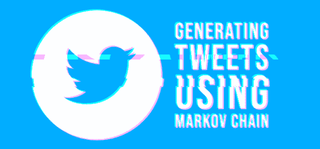

生成推文—使用[photo mash](https://photomosh.com/)制作的横幅

我把埃隆·马斯克的推文输入马尔可夫链算法，它生成了一些文本，比如:

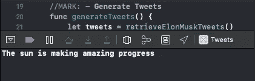

推文生成结果

# 发展

最近我为 iOS 做的开发比其他任何平台都多；swift 成为我的首选开发语言。许多现有的马尔可夫链代码可以在 Github 上找到(查看[这个链接](https://github.com/nebyark/markov-unchained)我在这个项目中使用的 Github 库)。该算法使用的推文是埃隆·马斯克的 3000 条推文，包括被转发的推文。为了检索推文，我使用了 Twitter 的 API，它提供了许多可以在许多项目和数据分析中使用的信息。

通常，Tweets 是不相关的，这使得在像 Markov Chain 这样的算法中使用它们并不理想。推文是按照发布日期而不是相关性来分类的。按日期排序使算法将一条推文中的最后一个词与下一条推文中的第一个词进行匹配。尽管如此，一些生成的推文是合乎逻辑的，有一些准确的语法。

我之前用金·卡戴珊的推文试过马尔可夫链。有许多类似广告的推文。有了伊隆的推文，我有了完全不同的体验。几条生成的推文几乎与埃隆的推文一模一样。这可能表明埃隆的推文比金的更丰富。这迫使算法选择导致生成与原始推文相似的推文的词。

# 小鸟叫声

许多推文都标记了 Elon 回复或转发其推文的用户。并非所有的推文都有良好的语法和完整的逻辑句子，一些推文听起来不像来自埃隆·马斯克的推文。我要分享的推文是最有意义的，我们将把这个算法称为*埃博特·马斯克*。

下面包含的所有截图都是算法的输出。

**过去了**

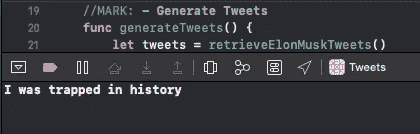

这是使用该算法创建的第一条推文。这让我对未来充满希望。我发现，当我将句子的长度设置为几个单词时，我会获得更好的结果。

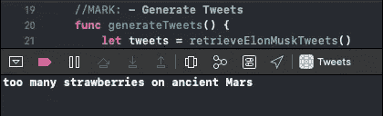

在这里，埃布特仍然在谈论他的过去。可能马斯克“被困历史”的时候生活在火星上。

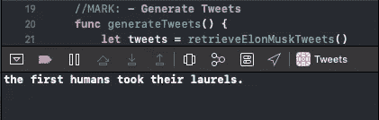

我怀疑 Ebot 是一个被困在历史中的时间旅行者，住在火星上，并目睹了第一批人类获得他们的“桂冠”不管这对这个机器人意味着什么？

**执念**

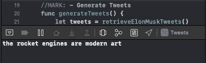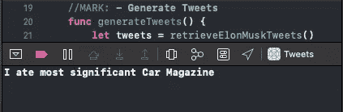

这条推文可能显示了 Ebot 对汽车的痴迷，或者他对不同汽车杂志上的车辆进行了多少研究。

推文不断减少，语法规则在我收到的几条有希望的推文后被扔出窗外。这需要一些代码调整，以继续产生体面的推文。

**突发新闻**

下面的推文听起来像是 Ebot 在阅读或向我们传递一些新闻。

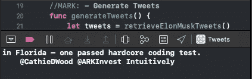

我们不确定[凯西伍德](https://medium.com/u/a5aa8b266a78?source=post_page-----d7b55261f310--------------------------------) & @ARKInvest 与通过“硬核”测试的人的关系，但 Ebot 决定在这条推文中标记他们。这可能是他告诉他们他们也能做到的方式。

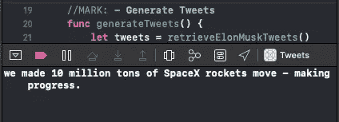

埃布特没有分享他移动火箭的计划以及他将他们移动到哪里，但这仍然是新闻，并且是以积极的语气传递的。

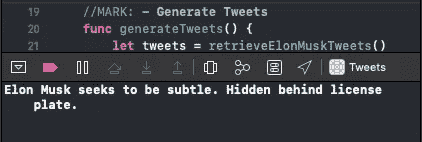

在 doxing 新闻中，Ebot 与我们分享了 Elon Musk 的行踪。虽然 Ebot 是利用 Elon 的 tweets 创建的，但我怀疑 Ebot 是 Elon Musk 的敌人。这将在接下来的推文中更加明显。

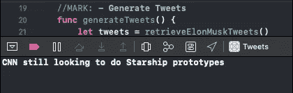

据 Ebot 报道， [CNN](https://medium.com/u/374a801b3eb2?source=post_page-----d7b55261f310--------------------------------) 正在拓展业务。我觉得这是从报道新闻的一大跳。

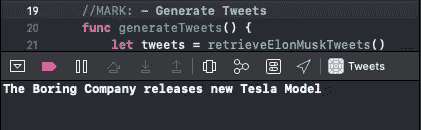

这是我的第一个证据，让我认为埃布特不尊重埃隆，混淆了他的公司。

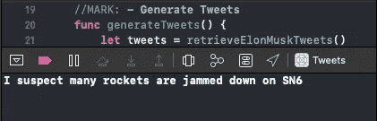

怎么会？

我们必须以天气预报结束新闻。Ebot 称赞太阳与环境公司的快速天气恢复。

**投影**

Ebot 已经进化成了一个卑鄙的机器人。我没想到这是从埃隆的推文中说出来的。我可以想到其他 Twitter 用户，如果我使用他们的推文，可能会产生刻薄的推文，但埃隆·马斯克不会。

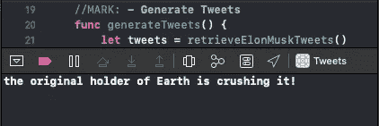

在这里，埃布图是在给“地球的原始持有者”遮阴。这可能是一种恭维，但因为我们在疫情，我认为这意味着出来作为一种侮辱。

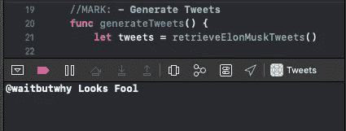

我们可以看到 Ebot 瞄准[等等但是为什么](https://medium.com/u/e83b30f809db?source=post_page-----d7b55261f310--------------------------------)。很明显，埃布特不是一个球迷。

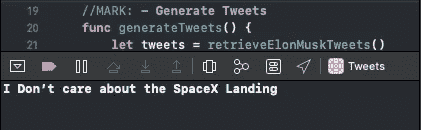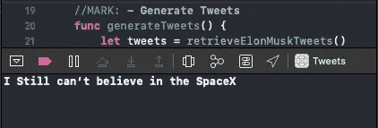

Ebot 违背了 Elon Musk 的信仰。这足以证明他不代表埃隆的推特。

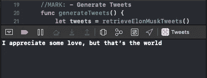

他指责我们没有对机器人表现出更多的爱。虽然这听起来像一个 dis，但它可以是一个信息，让我们更好地自我展示更多的爱。

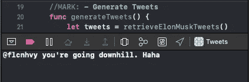

又一条有针对性的推文。在这条推文中有更多的角色发展。他学会了讽刺地笑。

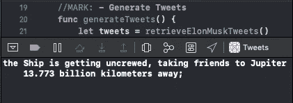

我们正在失去埃布图。他计划用一艘破船把他的朋友送到木星。就像这个时代的许多罪犯一样，他在实施计划之前发布了他的计划。

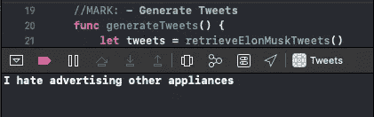

我已经受够了金·卡戴珊的微博广告。感谢 Ebot 没有发推特广告。

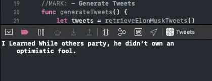

励志。励志。以支持拥有乐观的傻瓜而告终。

**空间**

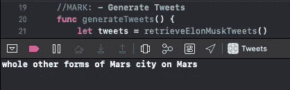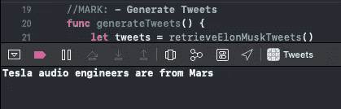

特斯拉的音频工程师来自火星。外包并不是一个陌生的概念。

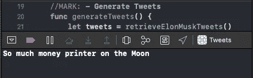

根据 Ebot 的说法，货币的未来可能不是加密货币。当我们开始在月球上拥有城市时，我们可能还会使用印刷钞票。

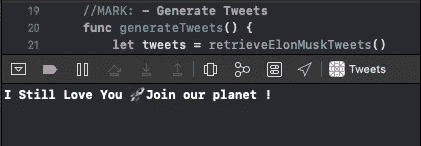

这证明了从太空也能访问 Twitter，Ebot 可能邀请了外星人来到地球。

**积极性**

就像《小美人鱼》中的乌苏拉一样，埃布特看到了光明，做出了转变。埃布特自己也成了一个乐观的傻瓜。

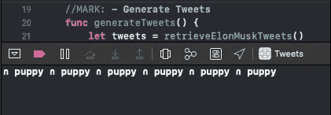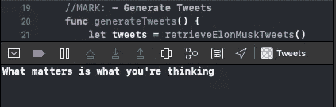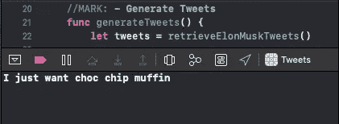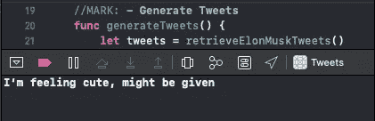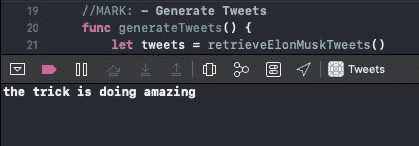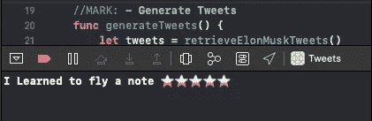

**发明**

Ebot 得到了我们从未想过我们需要的发明。Ebot 想向我们证明他是一个像 Elon Musk 一样的发明家，但是他的发明可能会有问题。

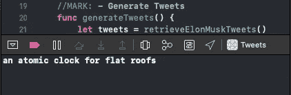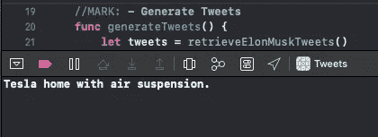

**电晕鸣叫**

当它来到疫情时，埃布特保持轻松愉快。没有政治或有争议的推文。

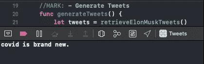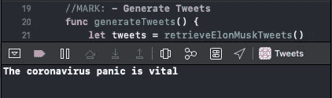

**其他**

有几条推文我无法归入任何特定的类别。以下是前几节没能做到的推文。

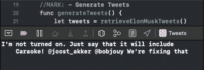

Caraoke 可能是卡拉 ok 的意思。我们不会因为什么让人们/机器人兴奋而让他们感到羞耻。[Joost van den Akker](https://medium.com/u/59bf46c635ea?source=post_page-----d7b55261f310--------------------------------)&@ bobjouy 因为不包括卡拉 ok 而陷入困境。

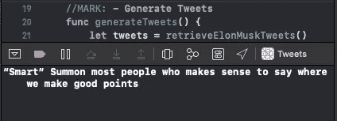

如果之前的推文对你没有意义，那么你很可能没有达到 Ebot 的水平。

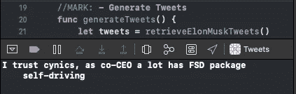

虽然句子的第二部分没有意义，但第一部分提出了很多问题。

我们用下面我最喜欢的推文来结束这篇文章:

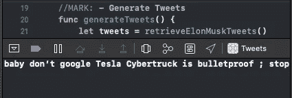

我欢迎建议，随时建议 twitter 用户或其他算法使用。感谢你设置通过 Ebot 的废话。