# 生成器、复制和移动:114 C++算法系列

> 原文：<https://itnext.io/generators-copies-and-moves-the-114-c-algorithms-series-1d0774472877?source=collection_archive---------1----------------------->

欢迎来到 114 C++算法系列的第六部分。今天我们将讨论生成值的算法和标准库提供的许多副本变体。

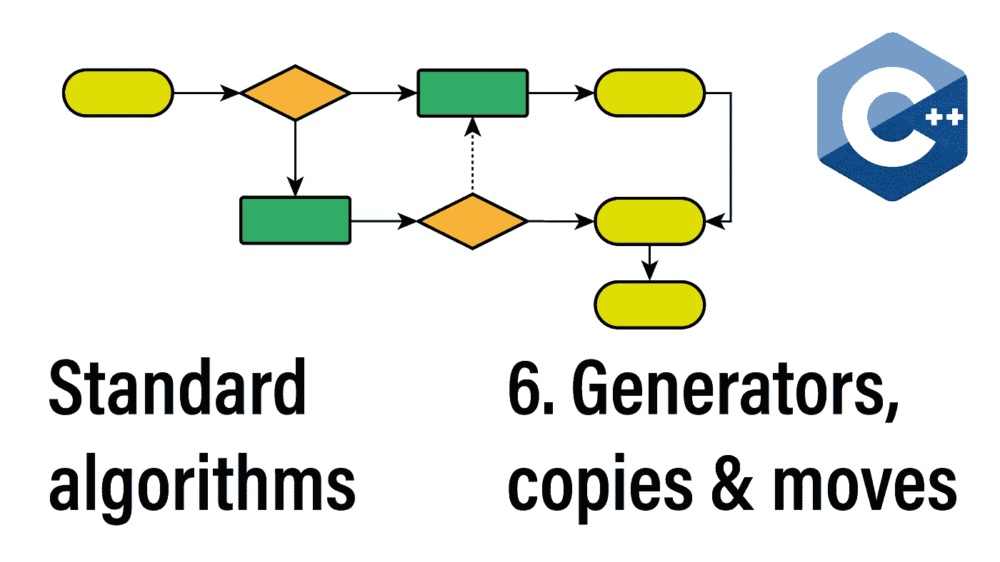

除了今天的算法部分，我们还将绕一小段路，谈谈迭代器适配器。

## 该系列:

*   [简介](/the-114-standard-c-algorithms-introduction-2a75a2df4300)
*   [排序和分割算法](/sorting-partitioning-the-114-c-algorithms-series-6503ad41cede)
*   [对排序或分区范围进行操作的算法](/divide-conquer-and-sets-the-114-c-algorithms-series-d0085a38046e)
*   [转换算法](/transformations-the-114-c-algorithms-series-deacdbd4c373)
*   [左侧折叠和其他缩减](/left-folds-and-other-reductions-the-114-c-algorithms-series-6195724d324)
*   生成器、副本和移动
*   [堆和堆](/heap-and-heap-the-114-c-algorithms-series-1d4215ae9f0d)
*   [搜索和最小值-最大值](https://medium.com/@simontoth/8a6ed951ad40)
*   结论(即将发布)

我们将从生成连续值的原型生成器算法开始。

# 极微小

说到 C++20 *std::ranges* 支持，Iota 是个异类。C++20 引入了懒惰视图版本 *std::views::iota* ，我们在 C++23 中只会得到算法的急切范围版本。

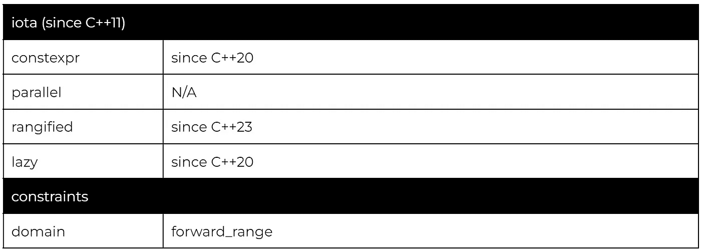

*std::iota* 算法将通过从初始值开始连续应用前缀递增运算符来生成元素。

这里我们利用有限视图构造函数 *std::views::iota(1，10)* 来建立输出大小(第 7 行)，这允许我们使用无限视图 *std::views::iota(5)* 作为第二个参数。在功能上，我们甚至可以把第二个视图换成一个有限的视图。然而，这将强加额外的(且不必要的)边界检查。

# 填充，填充 _n，生成，生成 _n

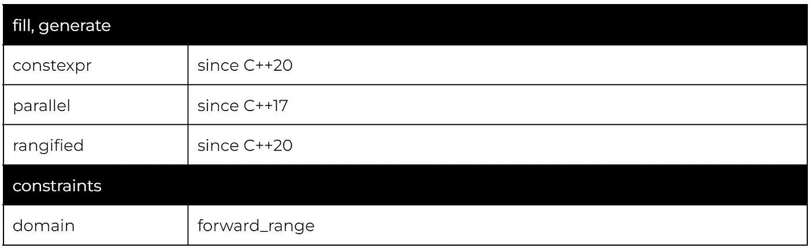

*std::fill* 算法用提供的值填充指定的范围，而 *std::generate* 用连续调用提供的 invocable 得到的值填充指定的范围。

iota 类行为(第 9 行)是可能的，因为该标准保证了对所提供的可调用的连续(从左到右)调用。

当处理不支持随机访问的范围时，提供范围迭代器的结尾可能会很慢或者不可能。该标准提供了*填充*和*生成*的变体，其中使用*开始*迭代器和元素数量来指定范围，以涵盖这种情况。

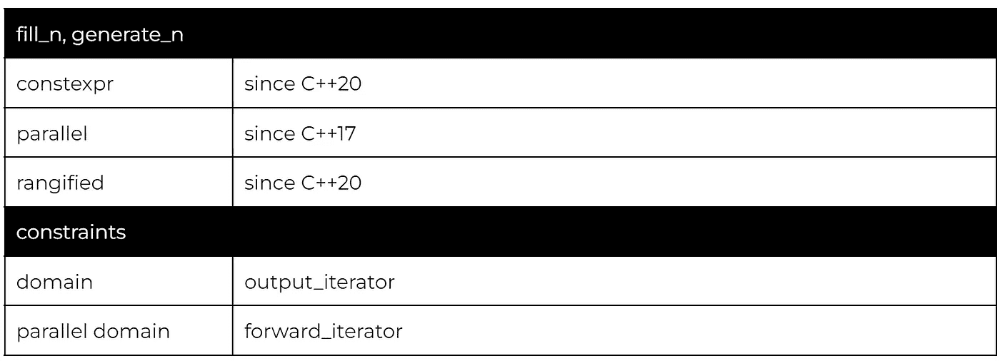

除了如何指定范围的变化，这些变量具有与基线算法相同的行为。

# 迭代器适配器

我们已经在本系列的例子中多次使用了 *std::back_inserter* ，所以让我们从插入器适配器开始。

## 后插入器，前插入器，插入器

该标准提供了三个适配器，它们创建了 *back_insert_iterator* 、 *front_insert_iterator* 和 *insert_iterator* 的实例。当赋值给时，这些迭代器在适配的容器上调用相应的 *push_back* 、 *push_front* 和 *insert* 方法。

所有插入迭代器模型仅输出迭代器概念，因此不能用于需要正向或双向迭代器的算法。

## istream_iterator，ostream_iterator

这两个适配器分别提供对 *istream* 和 *ostream、*的迭代。

*istream_iterator* 在递增时会通过调用相应的*运算符> >* 来读取一个值。

*ostream_iterator* 将通过调用相应的*运算符< <* 来写入一个值。

ostream_iterator 的附加参数指定了在每个元素后添加的分隔符。

*istream_iterator* 模拟输入迭代器，而 *ostream_iterator* 模拟输出迭代器。

## 移动迭代器，生成移动迭代器

*move_iterator* 适配器从适配迭代器继承迭代器类别，但在解引用时将返回一个右值，从而启用移动语义。

## 反向迭代器

我们可以使用双向迭代器的 *reverse_iterator* 适配器来获得相反方向的迭代器。

注意，反向迭代器映射到源方向的前一个元素。因此，当反转*开始*或*r 开始*时，结果分别是*开始*和*结束*。

## counted_iterator

当处理非随机访问范围时，使用一个结合了元素数量的 *begin* 迭代器来指定范围是很方便的。 *counted_iterator* 将这个特性带到了 C++20 范围，而不需要专门的算法变量，如 *std::fill_n* 。

*counted_iterator* 跟踪元素的数量，当计数器达到零时， *counted_iterator* 将比较等于 *std::default_sentinel，*表示范围的结束。

# 复制，移动，向后复制，向后移动

当复制/移动一个范围时，我们需要避免覆盖源范围中尚未被复制/移动的元素。该标准提供了两种复制方向来防止这个问题。我们将从远期版本开始:

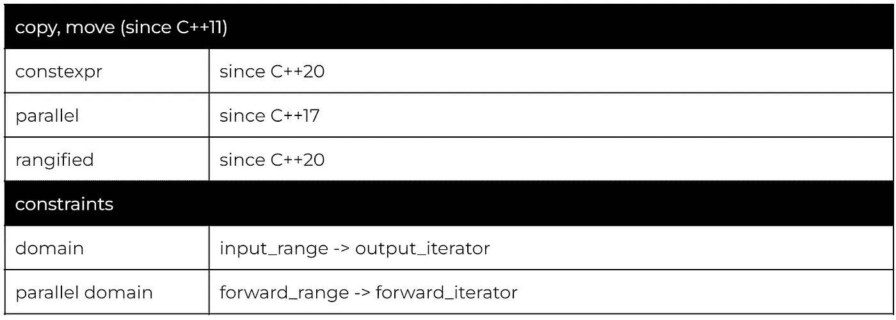

输出迭代器不允许在*【first，last】*(输入范围)内。因此，只有输出范围的尾部可以与输入范围重叠。

Move 的操作是相同的，只是它在赋值前将每个元素转换为一个右值，从而将副本转换为移动。

值得注意的是， *std::move* 是否会移动取决于底层的元素类型。如果底层类型是只复制，那么 *std::move* 的行为将与 *std::copy* 相同。

我们还可以通过使用前面提到的 *move_iterator* 适配器来模拟 *std::move* 。

当我们需要复制到一个不适合正向复制的重叠区域时，我们可以使用反向复制的反向变量。

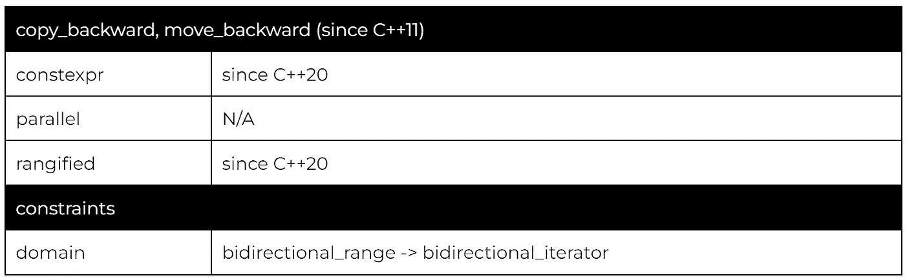

输出迭代器不能在 *(first，last)*内，并将被视为目标范围的结束迭代器，这意味着算法会将第一个值写入 *std::prev(end)* 。

类似于 *fill_n* 和 *generate_n，*该标准还提供了适用于非随机存取范围的 *copy_n* 变体。

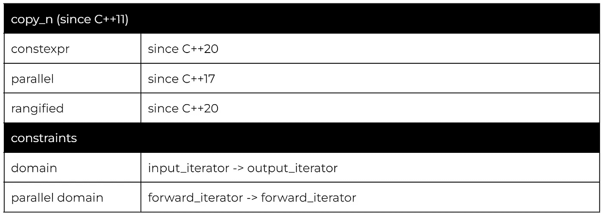

该算法无法检查所请求的计数是否有效并且没有超出界限，因此这个负担落在调用者身上。

# 复制 _ 如果，删除 _ 复制，删除 _ 复制 _ 如果

当我们只需要选择一些要复制的元素时，我们可以使用 *copy_if* 或 *remove_copy_if* 。

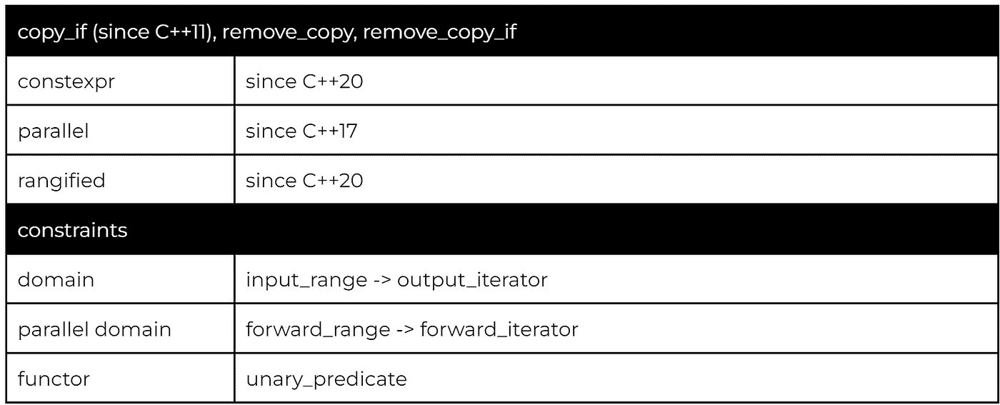

这两种算法提供了相同的逻辑，但语义相反: *copy_if* 将复制谓词返回 *true* 的元素， *remove_copy_if* 将复制谓词返回 *false* 的元素。最后， *remove_copy* 复制与提供的值不匹配的元素。

# 样品

选择性复制的另一个不同之处是*样本*算法。

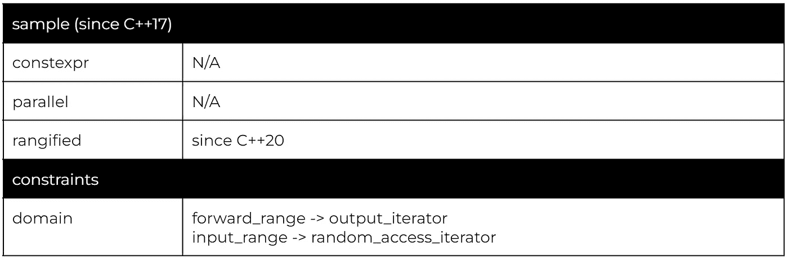

*样本*算法将利用提供的随机数发生器从源范围复制随机选择的 N 个元素到目标范围。

该算法的两个域是由于采样的稳定性质，保持了来自源范围的元素的顺序。

此功能要求输入范围至少是一个前进范围，或者目标范围需要是一个随机访问范围。

# 替换 _ 复制，替换 _ 复制 _ 如果

我们在本系列的前一篇文章中讨论了*替换*算法。复制变量的工作方式相同，替换与谓词或提供的值匹配的值。但是，结果会输出到目标范围，而不是就地应用替换。

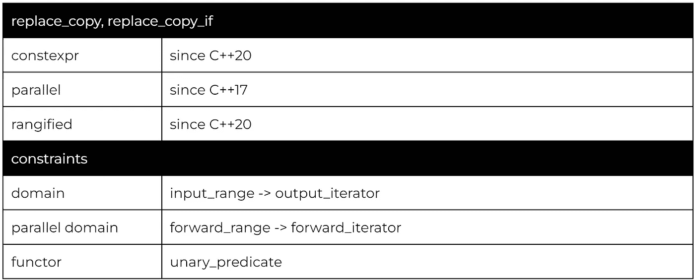

*replace_copy_if* 变量替换谓词返回 true 的元素。 *replace_copy* 替换与提供的值匹配的元素。

# 反向复制，旋转复制

复印机类别中的最后两种算法会改变复制元素的顺序。

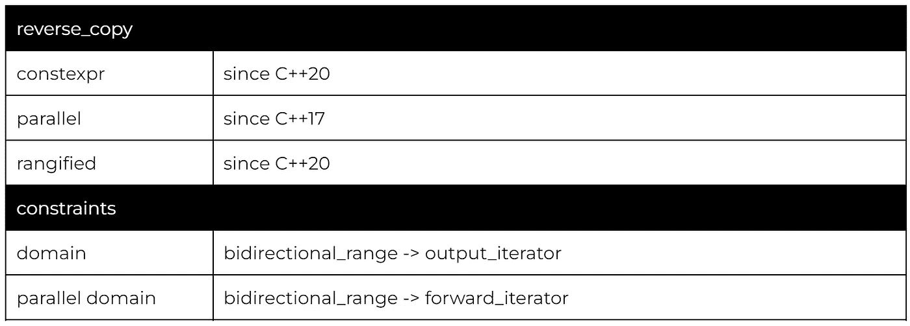

不要与保持元素原始顺序的*copy _ backward*相混淆， *reverse_copy* 将反转复制元素的顺序。

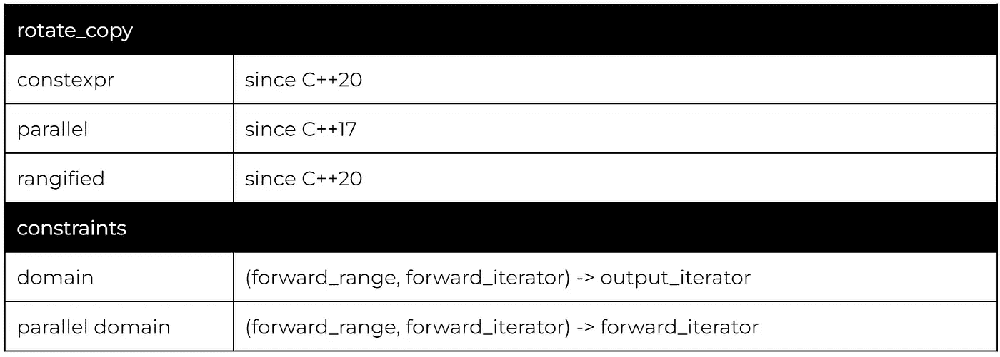

按照旋转算法的逻辑， *rotate_copy* 将首先从指定的中间元素开始复制元素，然后从范围的开始复制其余的元素。

# 感谢您的阅读

不要忘记关注，这样你就不会错过本系列的其他文章。例如，下一篇文章将讨论在未初始化的内存块上操作的算法和实现堆数据结构逻辑的算法。

我也在 YouTube 上发布视频。你有问题吗？在 Twitter 或 LinkedIn 上联系我。