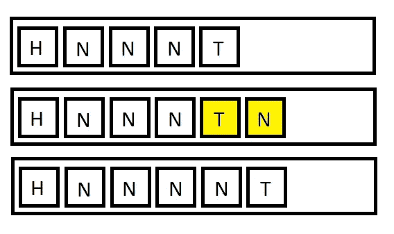

# 带有类型脚本的一般链接列表

> 原文：<https://itnext.io/generic-linkedlist-with-typescript-7bc8a14b63b6?source=collection_archive---------1----------------------->

数据结构是计算机科学中最有趣的事情之一。我最喜欢的是 LinkedList。

什么是链接列表？

> [**链表**](https://en.wikipedia.org/wiki/Linked_list) 是数据元素的线性集合，其顺序不是由它们在内存中的物理位置给出的。相反，每个元素指向下一个

[https://en . Wikipedia . org/wiki/Linked _ list #/media/File:single-Linked-list . SVG](https://en.wikipedia.org/wiki/Linked_list#/media/File:Singly-linked-list.svg)

因为现成的 typescript 不与 LinkedList 一起提供。

女士们先生们，我给你们带来了我在 TypeScript 中的通用 LinkedList 实现。

# LinkedList 节点

首先，我们需要一些结构来存储 LinkedList 条目，也就是节点。

它是一个通用接口，具有保存实际值的属性`value`。以及指向下一个节点的属性`next`。下一个属性可以为空，因为它可以是列表中的最后一个。

# #链接列表

名单本身

等等，那是什么？它是否只存储两个项目，第一个和最后一个节点？惊喜，惊喜，这是真的，它会提供一个你从列表中期待的体验。

# #追加

如果列表为空，`this.head`未设置。那么我们可以很容易地说，`head`和`tail`指向同一个节点。

否则，我们必须在列表的末尾追加一个节点。并用`tail`交换位置。切换只是属性`next`中的指针变化。

油漆——仍然有用

好东西，看起来不错，不是吗？

# #迭代器

列表应该是可迭代的，在 typescript 中，这是很容易做到的。

这就有点混乱了。仔细观察方法`items`开头的`*`。以及`[yield](https://basarat.gitbooks.io/typescript/docs/generators.html)`关键字。

> `function *`是用来创建*生成器函数*的语法。调用生成器函数返回一个*生成器对象*。生成器对象只是跟随[迭代器](https://basarat.gitbooks.io/typescript/docs/iterators.html)接口(即`next`、`return`和`throw`函数)。

要从列表中获取一个项目，从迭代器中调用方法`next()`。每次调用 next()时都会发生 yield。当 while 循环结束时，迭代器中的属性`done`将是`true`。

单元测试是如何工作的一个例子。

# #该删除了

看看这个，我们没有删除任何东西。我们通过重新设置和重新打印指针来摆弄指针。在我圣看来，是这种数据结构最大的优点。因为您不执行调整大小前/后操作。

# #寻找

find 方法需要委托“compare”。委托接受 T 并返回一个布尔值。其中 T 是一般的 LinkedList 类型。

委托 t 函数的定义

# #插页

在列表前面插入项目。

创建一个新节点，设置`node`指针指向`head`。并将 head 设置为新创建的节点。
如果这是第一次迭代，将尾部设置为新创建的节点；

# #结束了

当然，LinkedList 在野外也有现成的解决方案。我这样做是为了锻炼大脑。创造一些在我们日常生活中广泛使用的东西，而不用考虑它是如何工作的，这很有趣。

当不使用它的时候，这在你的头脑中升起了一面红旗。比如 add 和 iterate 会一直快如闪电，但是在里面搜索，[没有](http://cooervo.github.io/Algorithms-DataStructures-BigONotation/index.html)。

GitHub 回购[此处](https://github.com/alzuma/tools/blob/master/src/lists/LinkedList.ts)

告诉我，在计算机科学中，你最喜欢的数据结构是什么？

//Kristaps