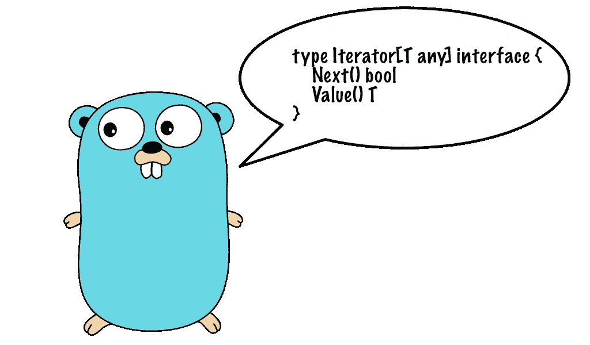

# Go 中的通用映射、过滤和减少

> 原文：<https://itnext.io/generic-map-filter-and-reduce-in-go-3845781a591c?source=collection_archive---------0----------------------->

## 使用泛型在 Go 中实现高阶函数



有了泛型，增加对高阶函数的支持突然变得容易多了，比如 Go 中的`Map`、`Filter`和`Reduce`。然而，围绕这些功能应该如何实现存在很多分歧。

我认为这种困惑部分源于这样一个事实，即许多 Go 开发者来自 Java 和 C#背景。他们已经在主导这些语言的编程社区的面向对象编程思想上投入了大量资金。这导致了将`Map`、`Filter`和`Reduce`定义为方法的尝试。让我们来看一次这样失败的尝试，将`Reduce`作为一个方法添加到一个定制的集合类型`Array`。

```
package main

import "fmt"

type Array[V any] struct {
	elements []V
}

type Reducer[T, V any] func(accum T, value V) T

func (xs Array[V]) Reduce[T any](f Reducer[T, V]) T {
	var accum T
	for _, x := range xs.elements {
		accum = f(accum, x)
	}
	return accum
}

func adder(accum, x int) int {
	return accum + x
}

func main() {
	numbers := Array{[]int{1, 2, 3, 4, 5}}
	total := numbers.Reduce(adder)

	fmt.Println(total)
}
```

程序将无法编译，并显示错误消息:

```
reducer.go:11:26: syntax error: method must have no type parameters
```

原因是我们在`Reduce`方法上引入了一个类型参数`T`。Go 不允许向方法中引入新的类型参数。你必须使用在你的集合上定义的类型参数，比如`V`。一个可能的解决方案是在`Array`参数类型的定义中添加一个额外的类型参数`T`。

然而，我认为这样的解决方案是一个丑陋的黑客，违背了优秀 go 编程的哲学，也是一个糟糕的软件工程选择。让我引用一位核心围棋设计师的话:

> 对于通用数据类型，最好使用函数，而不是编写需要方法的约束。
> 
> 伊恩·兰斯·泰勒

方法被过度使用，Go 不鼓励它们的使用实际上是一件好事。这不仅仅是像 Ian Lance Taylor 这样的围棋设计者的信念，也是 C++社区中一些杰出人士的信念。

> 有效 C++第 23 条:比起成员函数，更喜欢非成员非友元函数
> 
> —斯科特·梅耶斯

Go 中的 I/O 系统给出了一个很好的例子，说明为什么自由函数在大多数情况下比方法好得多。Go 有许多类型的 I/O 对象，如管道、文件、套接字和字符串缓冲区。所有这些 I/O 对象都支持这两个简单的 Go 接口:

```
type Reader interface {
    Read(buf []byte) (n int, err error)
}

type Writer interface {
    Write(p []byte) (n int, err error)
}
```

Go 提供了许多免费的功能，可以使用这些接口。例如，您可以用`Fprintf`函数将格式化的文本输出写到`Writer`对象。因此，您可以使用此函数写入您已打开的文件:

```
file, err := os.Create("message.txt")
if err != nil {
	panic(err)
}
defer file.Close()

fmt.Fprintf(file, "Hello %s!", name)
```

添加`Fprintf`作为方法不是更好更面向对象吗？

```
file.Fprintf(file, "Hello %s!", name)
```

不，这种方法不是一个好的解决方案。这种方法意味着每一个 I/O 类型都需要添加一个`Fprintf`方法到*中。来自面向对象编程爱好者的反对意见是`Fprintf`应该被添加到一个基类中，所有的 I/O 对象都必须继承这个基类。这是一个糟糕的解决方案，原因有几个:*

*   继承产生了紧密耦合。对基类的更改会破坏子类。阅读关于[脆弱基类问题](https://en.wikipedia.org/wiki/Fragile_base_class)。
*   I/O 库的设计者必须预测子类需要的所有可能的功能。
*   Go 不支持继承。

通过将功能添加为独立包中的免费功能，我们可以扩展现有类型的功能，而不必编辑基类的源代码。Swift、Objective-C 和 Smalltalk 等语言通过引入类别的概念解决了这个问题:添加到现有类中的方法集合。

通常，像类别这样的解决方案需要动态语言，其中类是可以在运行时修改的对象。在运行时修改类型会导致自身的一系列问题。

简而言之，好的软件设计迫使我们保持接口最少的类型。类型应该只具有实现类型的最基本功能所需的最少数量的方法。其他功能应该作为免费功能提供。这种策略允许我们将类型的功能扩展组织成包。每个包都有明确的用法，给我们一个更加模块化的代码。

## 将映射、过滤和减少实现为自由函数

实现`Map`、`Filter`和`Reduce`的正确方法是将它们定义为*自由函数*。将它们转换成方法是一个糟糕的选择，因为这意味着在多个类型中重新实现相同的方法。即使 Go 支持继承，但事实上它并不支持，我们也会被让每个集合类型继承相同的基本接口的要求所困扰。我们最终会得到一个紧密耦合且脆弱的设计。

一种简单的方法是实现这些函数来直接处理集合类型:

```
// Don't do this
func Reduce[T, V any](xs Array[V], f Reducer[T, V]) T {
	var accum T
	for _, x := range xs.elements {
		accum = f(accum, x)
	}
	return accum
}
```

为什么这个解决方案是个坏主意？它有一些与早期解决方案相同的缺陷，也有一些新的缺陷:

*   我们必须为每个集合类型实现相同的`Reduce`函数，导致代码重复。
*   Go 不支持函数重载，所以即使你尝试了，这种方法实际上也不会起作用。

您应该认识到的关键点是，您希望对任何集合类型执行相同的基本操作。我们必须抽象出不同集合类型之间的区别，并与接口而不是具体的集合类型对话。

解决方案是使用迭代器而不是具体的类。使用迭代器，我们可以实现像`Map`、`Filter`和`Reduce`这样的算法，这样它们就可以应用于任何可以通过迭代器访问的集合类型。

## 定义集合的迭代器接口

我们希望我们的算法能和抽象迭代器一起工作。算法不需要知道它们是否在二叉树、字典、数组或集合上迭代。我已经在 Go `Scanner`类型如何工作的基础上建模了我的迭代器接口，它有一个类似迭代器的接口。

```
type Iterator[T any] interface {
	Next() bool
	Value() T
}
```

这个接口是专门设计的，因此您应该能够使用 for 循环轻松地迭代集合:

```
// print out every value in the collection iterated over
for iter.Next() {
    fmt.Println(iter.Value())
}
```

我们可以创建这个迭代器接口的一些具体实现。能够迭代一个常规的 Go 切片将非常有用:

```
type SliceIterator[T any] struct {
	Elements []T
	value    T
	index    int
}

// Create an iterator over the slice xs
func NewSliceIterator[T any](xs []T) Iterator[T] {
	return &SliceIterator[T]{
		Elements: xs,
	}
}

// Move to next value in collection
func (iter *SliceIterator[T]) Next() bool {
	if iter.index < len(iter.Elements) {
		iter.value = iter.Elements[iter.index]
		iter.index += 1
		return true
	}

	return false
}

// Get current element
func (iter *SliceIterator[T]) Value() T {
	return iter.value
}
```

我们现在有足够的实现来允许对一部分数字进行迭代:

```
var numbers []int = []int{1, 2, 3, 4, 5}

iter := NewSliceIterator(numbers)
for iter.Next() {
	fmt.Println(iter.Value())
}
```

## 使用迭代器实现算法

现在我们已经定义了迭代器，我们可以使用这些迭代器来定义算法。我们返回一个新的迭代器，而不是收集值并在集合中返回它们。通过返回一个迭代器，我们可以灵活地链接这些高阶函数，并将输出写入任何我们喜欢的数据结构。在查看算法实现之前，我想向您展示一旦实现后如何使用它们:

```
var numbers []int = []int{1, 2, 3, 4, 5}

// Create iterator over a slice of integers
iter := NewSliceIterator(numbers)

// Pick values larger than 3
filtered := Filter(iter, func(x int) bool {
	return x > 3
})

// Square all values
mapped := Map(filtered, func(x int) int {
	return x * x
})

// Collect result from collection
result := Collect(mapped)

for _, x := range result {
	fmt.Println(x)
}
```

`Map`和`Filter`以迭代器作为输入，产生迭代器作为输出。这种设计选择的效果是我们模仿了懒惰评估。当调用`Map`时，集合的值实际上并没有立即被映射。这种策略的一个好处是，如果我们在同一个集合上执行许多算法，我们可以避免大量的内存分配，这可能会降低性能。在上面的例子中，在调用`Collect`之前，不要为结果分配任何内存。

在这个特殊的例子中，调用`Collect`是不必要的，因为我们只是打印出每个值。相反，我们可以直接访问 for 循环中的迭代器:

```
for mapped.Next() {
	fmt.Println(mapped.Value())
}
```

## 地图功能实现

让我们看看要实现的最简单的函数，`Map`。大多数功能实际上都在特殊的迭代器对象中，`mapIterator`返回。实际的值映射发生在`Value`方法中。迭代器存储映射函数`mapper`和迭代器`source`到底层集合。

`Map`函数本身非常愚蠢，它只是构造了一个`mapIterator`并返回它。

```
type mapIterator[T any] struct {
	source Iterator[T]
	mapper func(T) T
}

// advance to next element
func (iter *mapIterator[T]) Next() bool {
	return iter.source.Next()
}

func (iter *mapIterator[T]) Value() T {
	value := iter.source.Value()
	return iter.mapper(value)
}

func Map[T any](iter Iterator[T], f func(T) T) Iterator[T] {
	return &mapIterator[T]{
		iter, f,
	}
}
```

## 过滤功能实现

`Filter`函数被设计成只保留那些与提供的*谓词*相匹配的值。谓词是一个函数，它将一个元素作为输入，并根据所提供的元素是否匹配过滤标准来返回`true`或`false`。一些例子可能是奇数或偶数。如果谓词是奇数，那么只返回奇数。

`Filter`的实现与`Map`略有不同。在这种情况下，功能主要在`Next`方法中，而不是在`Value`方法中。我们不改变任何值，而是故意跳过不匹配谓词的值。

```
type filterIterator[T any] struct {
	source Iterator[T]
	pred   func(T) bool
}

func (iter *filterIterator[T]) Next() bool {
	for iter.source.Next() {
		if iter.pred(iter.source.Value()) {
			return true
		}
	}
	return false
}

func (iter *filterIterator[T]) Value() T {
	return iter.source.Value()
}

func Filter[T any](iter Iterator[T], pred func(T) bool) Iterator[T] {
	return &filterIterator[T]{
		iter, pred,
	}
}
```

## 收集结果

迟早，我们需要从我们对输入数据执行的所有转换中获得结果。这就是`Collect`功能的用途。它接受一个迭代器作为输入，并用迭代器中的值填充一个片。

人们可以想象出`Collect`功能的许多不同变体。我们可以有将输出写到另一个迭代器的变体。在这种情况下，我们需要一个支持设置值的输出迭代器接口。

```
func Collect[T any](iter Iterator[T]) []T {
	var xs []T

	for iter.Next() {
		xs = append(xs, iter.Value())
	}

	return xs
}
```

## 将输入值缩减为单个值

最后是`Reduce`函数，这个函数让无数 Go 程序员挠头，因为我们要处理两个不同的类型参数。我们需要为数组中的每个元素指定一种类型，在本例中，我们将调用`V`来指定值。此外，我们需要不同类型的累计值。在这个例子中，我调用类型参数`T`。

为了使代码更加清晰，我选择给 reducer 函数一个单独的名字，`Reducer.`它是一个二元函数(有两个参数),返回一个值。

```
type Reducer[T, V any] func(accum T, value V) T

// Reduce values iterated over to a single value
func Reduce[T, V any](iter Iterator[V], f Reducer[T, V]) T {
	var accum T
	for iter.Next() {
		accum = f(accum, iter.Value())
	}
	return accum
}
```

许多人对 reduce 函数感到困惑，所以让我给你一个我们如何使用它的例子。示例代码使用加法减少了输入。您可以用乘法替换加号来计算所提供数字的乘积。

```
var numbers []int = []int{1, 2, 3, 4, 5}
iter := NewSliceIterator(numbers)

result := Reduce(iter, func(accum, x int) int {
	return accum + x
})

fmt.Println(result)
```

## 替代迭代器实现

我在这里定义的迭代器接口受到了我在 Go 标准库中看到的类似迭代器的功能的启发，比如 [Scanner](https://pkg.go.dev/go/scanner) 。我的实现非常简单，可以想象会有很多改进，比如存储迭代过程中可能遇到的错误。例如，如果我们将文件访问和从文件中读取行表示为迭代，这可能是有用的。

区分用于读取的迭代器和用于写入的迭代器也很有用。在许多方面，这种需求与 Go 标准库中普遍存在的`Reader`和`Writer`接口非常相似。编写器界面可能如下所示:

```
type OutputIterator[T any] interface {
	Iterator[T]
	SetValue(x T) 
}
```

另一个有用的迭代器设计是由 [Google Cloud 客户端库](https://pkg.go.dev/google.golang.org/api/iterator)使用的。这些迭代器是在泛型之前制造的，但是可以作为创建基于模板的迭代器的模板。下面是一个用法示例:

```
it := client.Books(ctx, shelfName)
for {
	book, err := it.Next()
	if err == iterator.Done {
		break
	}
	if err != nil {
		return err
	}
	process(book)
}
```

就我个人而言，我不知道是否要采用这种方法。一方面，这是谷歌做的，谷歌也做围棋。那一定有意义。另一方面，这种设计看起来与 Go 标准库中的迭代方式大相径庭。对我来说，将迭代结束视为错误条件似乎有点奇怪。我更喜欢`Scanner`有一个独立的错误字段，你可以在迭代结束时读取。

## 在 Go 中应该使用迭代器吗？

实际上，我对实现和使用这些迭代器的实用性持怀疑态度。那你为什么要花一整篇文章来描述如何去做呢？我绝对认为这个想法值得追求，但我不认为你应该仅仅因为有可能就去做某件事。

> Go 不是为这里描述的那种高级函数式编程而设计的。目的是用简单的循环编写枯燥、简单的代码。

我不禁想起我过去在 C++中使用这种高级结构的经历。起初，我满怀信心地接受了它们，但后来发现我从使用它们中获益甚少。例如，简单的 for 循环更容易调试。通过大量迭代器和闭包完成的处理将更难调试。

事实上，我每天都使用很多函数式编程，但那是在 Julia 中，它更适合这种编程。Julia 提供了一个交互式的 REPL 环境，其中每个值都有一个默认的、合理的文本表示。这意味着，在 Julia 中，在调试解决方案并检查其功能时，开发一个非常实用的解决方案是毫不费力的。Go 编程不是基于 REPL 或非常实用的。在为函数式编程设计的语言中，几乎所有东西都是表达式，而不是语句。

我坚信应该按照语言的本意来使用它们。我使用 Objective-C 很长时间了，还记得由于 iOS，这个市场被拥有 Java、JavaScript 和 Ruby 背景的人所淹没。他们带走了许多在客观世界中毫无意义的习语。使用 Objective-C 代码工作一点也不好玩，有人曾试图把它当成 Java 来编程。

同样，试图把 Go 当成某种 Haskell 或 OCaml 来编程也不是个好主意。围棋有自己的成语。Go 编程的一个非常核心的部分是 goroutines 和 channels。我认为对于人们在其他语言中使用的高阶函数，如 map、filter 和 reduce，通道通常是 Go 中更好的抽象。

可行的方法是以简单直接的方式构建东西。如果你发现你得到了很多样板文件和重复的代码，那么你会考虑使用更多的抽象。不要为了解决某个问题而发明大量花哨的抽象概念。那不是正确的方法。围棋道枯燥又简单。