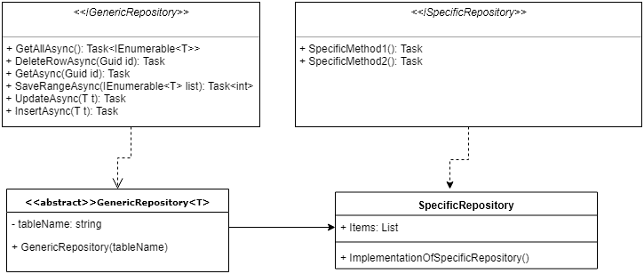
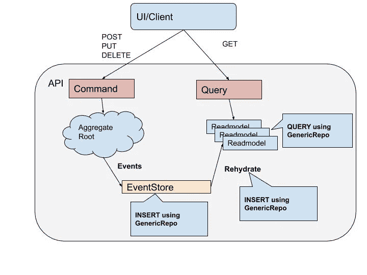
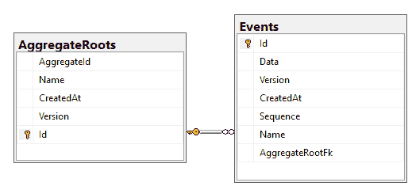
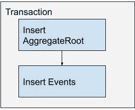

# 使用 Dapper 的通用存储库模式

> 原文：<https://itnext.io/generic-repository-pattern-using-dapper-bd48d9cd7ead?source=collection_archive---------0----------------------->

更新:与此同时，我已经创建了通用资源库项目，可以在以下 github[https://github.com/bolicd/dapper-extensions](https://github.com/bolicd/dapper-extensions)以及 2 个 nuget 包中找到:[https://www.nuget.org/packages/DapperGenericRepository/](https://www.nuget.org/packages/DapperGenericRepository/)

在 Dapper 中实现存储库模式有很多方法。在这篇博客中，我将解释什么是存储库模式，以及如何在 C#中使用反射来实现它。

在网上搜索时，我发现了各种各样的实现，但没有一个是令人满意的——主要是因为必须手动输入表名/字段名，工作单元的实现过于复杂等等。

类似的知识库，正如这里所介绍的，正在生产 CQRS/专家系统中使用，效果很好。

尽管这里描述的用例非常“独特”，但我认为这个存储库的实现可以应用于大多数关系型数据库系统，只需最少的重构。

**什么是知识库模式？**

当谈到仓库模式时，区分仓库的 **DDD 实现**和**通用仓库**模式是很重要的。

**通用存储库**是一个简单的契约，定义为基于每个对象的接口。这意味着一个存储库对象与数据库中的一个表相关。

**DDD 存储库**模式使用聚合根对象，并将其保存在一个或多个表中，或者事件源被用作事件存储中的一系列事件。所以在这种情况下，存储库实际上不是与一个数据库相关，而是与一个可以映射到一个或多个表的聚合根相关。由于阻抗不匹配效应，这是一个复杂的过程，ORM 可以更好地处理这一问题，但*这不是我们的用例。*

通用存储库 UML 图:



*   *GenericRepository 抽象类*实现 *IGenericRepository* 接口。所有共享的功能都在这个类中实现。
*   is specific repository 接口应该有特定用例所需的方法(如果有的话)
*   *SpecificRepository 类*继承自 *GenericRepository* 抽象类，实现*isspecific repository*中的任何特定方法。

**工作单元和事务处理**

工作单元模式为多个存储库对象实现单个事务，确保所有的插入/更新/删除语句按顺序自动执行。

我将不使用工作单元，而是使用更新/插入方法直接保存每个存储库。这样做的原因是这些存储库是为下面详述的特定用例而设计的。

所有事务处理都是通过将多个存储库命令包装到。NET 事务对象。这在不增加额外复杂性的情况下提供了更多的灵活性。

**储存库实现**

让我们首先定义接口:

仓库类的引导代码负责创建 *SqlConnection* 对象并打开与数据库的连接。之后，Dapper 将利用这个连接对数据库执行 SQL 查询。

通用知识库抽象类引导代码

确保您有名为 MainDb 的连接字符串。我使用的是 Visual Studio 提供的 MSSQL LocalDb，lite MSSQL 版本数据库。

```
<add name="MainDb"
connectionString="Data Source=(localdb)\mssqllocaldb;Integrated Security=true;Initial Catalog=dapper-examples;"
providerName="System.Data.SqlClient"/>
```

除了 Insert 和 Update 之外，使用 Dapper 实现这些方法中的大多数都非常简单。

对于 **SaveRangeAsync** ，提供了保存到数据库的项目列表，并返回保存的项目数。这可以通过在事务对象中包装 foreach 来实现。

**实现插入和更新查询**

实现**插入**和**更新**需要更多的工作。总体思路是使用*反射*并从模型类中提取字段名，然后基于字段名生成插入/更新查询。 ***字段名将被用作 Dapper 的参数名，因此确保 DAO 类字段名与实际表中的列名相同很重要。***

在这两种情况下，想法是相同的:接受作为输入参数提供的对象，并生成带参数的 SQL 查询字符串。唯一的变化是生成、插入或更新不同的查询。

这两种方法都使用反射从模型对象中提取字段名。这个类可以是静态的，因为它不使用任何实例变量，也是为了提高性能。

这样做的是使用反射将属性名称列表提取到*列表<字符串>* 中。它不会提取标有“忽略描述”属性的字段。

一旦我们有了这个列表，我们就可以迭代它并生成实际的查询:

更新方法有一些小差异:

这里我们需要注意的另外一件事是，如果没有找到要更新的记录会发生什么。对此有几种解决方案，一些包括抛出一个异常，另一些返回空对象或以某种方式通知调用代码更新没有完成。

在这种情况下，我们依赖于 Dappers executeAsync 方法，该方法返回 int，即受影响的行数。

通用存储库用法示例:

**CQRS/ES 架构中的用例**

CQRS 代表命令查询责任分离，是一种架构模式，它将读模型与写模型分开。我们的想法是拥有两个模型，它们可以独立扩展，并针对读取或写入进行了优化。

Event Sourcing(ES)是一种模式，它规定对象的状态作为事件列表保存在数据库中，并且可以在以后通过按顺序应用这些事件来重建到最新状态。

我不会深入解释这两种模式是什么以及如何实现它们，而是专注于我在一个项目中处理过的特定用例:*如何利用数据映射器 Dapper 和通用存储库模式，将关系数据库(MSSQL)用于读取模型和事件存储。我还将简要地介绍使用相同的通用存储库的事件源。*

示例架构:



在进一步讨论之前，让我们考虑一下为什么在这种特殊情况下使用数据映射器比使用 ORM 更有利:

**事件源中的阻抗不匹配**

对象-关系阻抗不匹配是指在面向对象编程语言中表示来自关系数据库的数据的一系列问题。

阻抗不匹配有很大的相关成本。原因是开发人员必须既了解关系模型又了解面向对象模型。对象关系映射器(ORM)用于缓解这个问题，但不能消除它。它们也倾向于引入新的问题:像 EF 的虚拟财产要求、私有财产映射问题、污染域模型等。

当在事件存储中使用使用事件作为存储机制时，**没有阻抗不匹配**！*原因是事件是领域概念，直接保存在事件存储中，不需要任何对象关系映射。因此，使用 ORM 的需求是最小的，使用 Dapper/Generic repository 变得更加实用。*

**数据库模型考虑事项**

在这个用例中，MSSQL 将用于写入和读取端，这增加了 dapper 存储库的可重用性，因为它可以用于读取和写入端。

**主键考虑**

在这个例子中，我使用了 Guid(。NET Guid 和 uniqueidentifier MSSQL 数据类型)作为主键标识符。也可以是其他的东西，比如 long，int，或者 string。

在任何情况下，这都需要在 Dapper 存储库上做一些额外的工作。首先，接口需要更改以接受额外的主键类型。然后，根据类型，可能需要做一些额外的工作来修改生成的查询。

将多个列作为主键也意味着一些额外的工作，在这种情况下，使用 dapper/generic repository 模式可能会适得其反。在这种情况下，我们应该选择使用完全成熟的 ORM！

**带 Dapper 的散装嵌件**

Dapper 不适合批量插入，即。执行大量 INSERT 语句。原因是 *ExecuteAsync* 方法，内部会使用 *foreach 循环*生成 insert 语句并执行它们。对于大量记录，这不是最佳选择，我建议使用 SQL 批量复制(链接)功能或允许批量复制的 dapper 扩展(其商业扩展),或者简单地绕过 Dapper 直接处理数据库。

**交易处理**

应用事务的用例是自动保存到多个表中。保存到事件存储中可以是这样的例子:*作为一个事务保存到 AggregateRoot 表和 Events 表中。*



应该在命令级别(在 CQRS 命令实现中)或在存储库内部手动控制事务。



这个有两张桌子的例子的灵感来自格雷格·杨的设计，可以在这里找到:[https://cqrs.files.wordpress.com/2010/11/cqrs_documents.pdf](https://cqrs.files.wordpress.com/2010/11/cqrs_documents.pdf)

如果没有找到聚合根，则创建它并将其插入 aggregate root 表中。之后，每个事件被转换为域事件并保存到事件表中。所有这些都包装在事务中，作为原子操作，要么失败，要么成功。请注意，事务具有 transactionscopeasyncflow option。Enabled 选项，允许事务调用其主体内部的异步代码。

**结论**

这里的实现可以进一步优化，以用于 CQRS/ES 系统，但是这超出了本文的范围。这种实现提供了足够的灵活性，只需向存储库添加定制的 SQL 查询，就可以轻松地用新功能扩展所需的特定存储库。