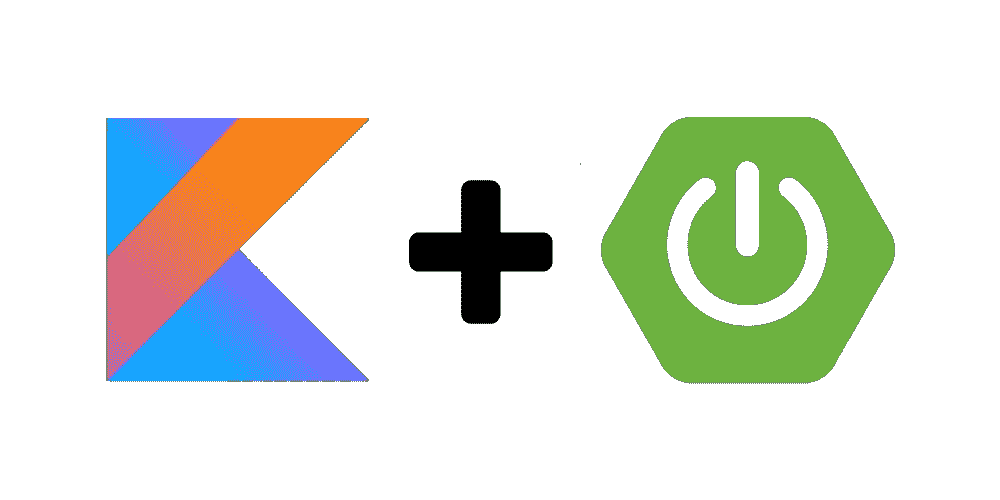
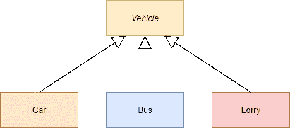

# Spring 中的通用服务继承

> 原文：<https://itnext.io/generic-service-inheritance-in-spring-7e8028c597dc?source=collection_archive---------3----------------------->

几天前，我们讨论了与 [Spring 框架](https://spring.io/)相关的 [OOP](https://www.wikiwand.com/en/Object-oriented_programming) 。这并不是一个简单的话题，因为 Spring 使用的托管 beans 很难在非托管对象中使用。许多程序员将[服务](https://docs.spring.io/spring-framework/docs/current/javadoc-api/org/springframework/stereotype/Service.html)与[贫血的领域模型](https://www.wikiwand.com/en/Anemic_domain_model)一起使用。许多开发人员——像纯粹的 OOP 爱好者——认为它是反模式的，其他人则喜欢腰带上的另一个工具。许多语言——像 Kotlin、Java——甚至用数据/记录类这样的语言元素来支持它

但是我们可能同意，当我们试图在兄弟类上实现丰富的服务工作时，有时服务会变得混乱。

有很多概念让 Spring 更适合 OOP 范例，比如 [AOP](https://docs.spring.io/spring-framework/docs/4.2.x/spring-framework-reference/html/aop.html) 、 [scoped beans](https://docs.spring.io/spring-framework/docs/current/reference/html/core.html#beans-factory-scopes) 等等……我们也可以考虑混合函数式编程方法(这是我个人最喜欢的)。
也有机会将对服务的引用放到域对象中，但是当代理类不能很好地工作时，我们很容易遇到问题(比如@Transactional 注释函数……)。我们可以尝试使用托管原型域对象，这样我们可以注入必要的依赖关系，并且域对象可以——例如——自我保存。

但是在这篇文章中，我们将看到另一个概念。我们将把业务逻辑放到领域模型中，并将管理的功能分离到通用服务中。域模型将被持久化到不同的 MongoDb 集合中，但是它们将从同一个超类中继承。通用服务将使用不同的存储库接口对此实体进行操作。当然，我们可以使用 switch-case 语句来决定必须使用哪个存储库，但是这使得代码更难阅读、测试和维护。

为了简单起见，我们也将在服务和 REST 接口中使用域对象，并省略任何不必要的内容来理解示例。

该应用程序将传播一些端点，在那里我们可以使用 CRUD 操作并将车轮安装到车辆上。在收到安装请求时，我们将保留车轮库存中的车轮。之后，它将被安装到给定的车辆上，并从库存中删除。

让我们首先创建我们的领域模型。

领域模型

领域模型的超类

这里的 *putWheels* 是一个普通的函数，它将轮子放在给定的车辆上。 *getType* 抽象方法*将每个孩子视为“不同的行为”。*

汽车领域模型。公共汽车和卡车相似

现在，我们将创建父存储库接口，并为每个模型创建子接口。

我们到现在也没看出什么特别。下一步，我们将创建一个通用的超级服务。

车辆服务

这里我们使用泛型来组成一个超级服务。该服务包含 crud 操作和 *installWheels* 方法，该方法从数据库加载必要的数据，然后调用给定车辆的 *putWheels 方法。它将安装精确数量的车轮。域对象知道轮子必须如何安装。托管功能从业务逻辑中提取出来，并放入这个服务中(比如加载和保存数据)，因此域模型可以保持不受管理。*

域对象和存储库的类型将被最终的实现通用参数所取代。我们限制了域类型，因此它必须从 Vehicle 类继承，并且必须使用与域占位符相同的通用类型参数从 VehicleRepostitory 扩展存储库。

现在我们可以创建我们的定制服务实现了。

在这些服务中，我们既可以使用公共的存储库函数，也可以使用单独的函数——正如你在*car service . findbyenginecapacitygte-*中看到的，因为推断出了正确的类型，Spring 将注入它来代替 *RT* 占位符。

当然，我们可能希望创建一个 REST 接口，在那里我们可以获取、发布…所有这些类型，我们不想创建 switch/if…语句来选择正确的服务类型。

这就是[服务定位器](https://docs.spring.io/spring-framework/docs/current/javadoc-api/org/springframework/beans/factory/config/ServiceLocatorFactoryBean.html)发挥作用的地方。

现在，我们可以将定位器注入到控制器中，控制器将根据实体类型选择正确的服务。在这个例子中，我们将使用一个查询参数来分隔域类型。

*getService* 方法将返回正确的服务。
我们可以像 */api/v1/vehicle 这样调用接口？* ***型号=汽车***

当然，我们可以为每种类型创建单独的控制器。

很多情况下，当这些类型混合在一起时(在超类上),我们需要对它们进行操作，并调用由给定子类动态调度的方法。这在纯面向对象中很容易做到，但在这种情况下，我们需要做一些技巧。

我们再次使用服务定位器来决定我们需要调用哪个服务。

当我们使用 Spring 时，这个模式只是皮带中的另一个工具。我们可以用它来实现常见的功能——比如 crud 操作——并在我们所有的服务中使用它。总是选择最符合要求的。

GitHub 上的源代码。