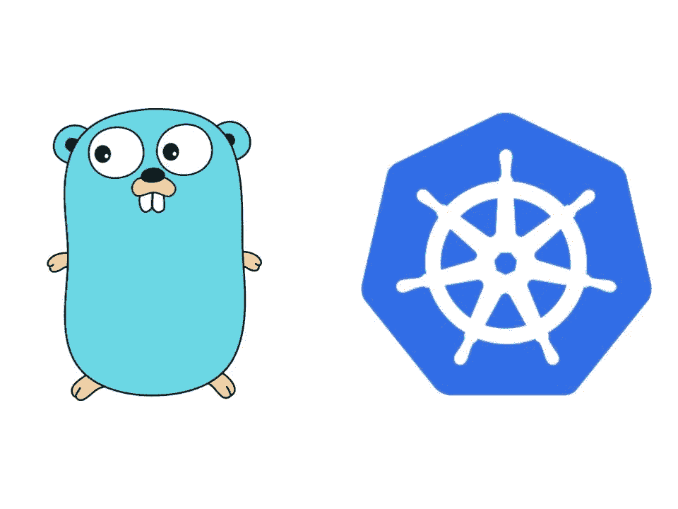

# 通常在 Go 中使用 Kubernetes 对象

> 原文：<https://itnext.io/generically-working-with-kubernetes-resources-in-go-53bce678f887?source=collection_archive---------0----------------------->

## 使用来自 k8s API machinery 的非结构化包



有时候，最好是使用 Kubernetes 资源对象，而不是编写代码来处理特定的类型。一些示例用例如下:

1.  使用没有相关 Golang 结构的插件中的 k8s API 对象。
2.  使用 [JsonPath](https://github.com/json-path/JsonPath) 、 [JMESPath](https://jmespath.org/) 、 [jq](https://stedolan.github.io/jq/) 等对 k8s 对象执行通用 [CRUD](https://en.wikipedia.org/wiki/Create,_read,_update_and_delete) (创建/读取/更新/删除)操作。需要一种通用方法来避免编写显式代码来处理每种可能的资源类型。

# API 机械信号

Kubernetes 社区的许多项目都是由特殊利益集团管理的。 [API Machinery SIG](https://github.com/kubernetes/community/tree/master/sig-api-machinery) 维护[客户端库](https://github.com/kubernetes/apimachinery)用于与 k8s API 服务器接口，包括通用 API CRUD 语义的包。API Machinery 的一个众所周知的子项目是 [client-go](https://github.com/kubernetes/client-go) ，用于与 k8s API 服务器交互的官方 Go API。

client-go 最常见的入口点是`kubernetes.Clientset`，它是一组类型化的客户端，为每种核心资源类型(pod、部署、服务等)提供预生成的本地 API 对象。).由于它的易用性，我建议尽可能使用这个入口点。然而，使用类型化客户端可能会有很大的局限性，因为代码被迫与所使用的特定类型和版本紧密耦合。

# 客户端运行/动态和非结构化对象

API Machinery 的 universal-machinery 子项目维护了一个[共享依赖库](https://github.com/kubernetes/apimachinery)，供服务器和客户端在没有直接类型依赖的情况下使用 Kubernetes API 基础设施。[非结构化](https://pkg.go.dev/k8s.io/apimachinery/pkg/apis/meta/v1/unstructured)包是这个共享依赖库的一部分，它允许对 k8s 资源对象进行通用操作。struct `unstructured.Unstructured`是一个简单的类型，它使用一组嵌套的`map[string]interface{}`值来创建一个内部结构，该结构非常类似于来自 k8s API 服务器的 REST 有效负载。

`client-go/dynamic`包提供了一个动态客户端，可以在任意 API 资源上执行 RESTful 操作。struct `dynamic.Interface`使用`unstructured.Unstructured`来表示来自 API 服务器的所有对象值。动态包将所有数据绑定推迟到运行时。

# 基本示例

以下代码示例需要依赖关系`k8s.io/client-go/kubernetes`和`sigs.k8s.io/controller-runtime`。控制器运行时项目是一组用于构建 Kubernetes 操作符的库。可以在没有控制器运行时的情况下使用 client-go，但是简化了配置用于 k8s API 服务器访问的 client-go 客户端。

为 API 访问配置 client-go 时，有两种常见的配置方法。在 pod 内运行时使用集群内配置，并使用装载到 pod 的服务帐户令牌。在群集外运行时使用群集外配置，它使用提供的 kubeconfig 文件或当前用户的默认 kubeconfig 文件。控制器运行时库提供了一个方便的一体化函数`GetConfig()`，它首先尝试集群外配置，如果失败，则尝试集群内配置。

要将所需的依赖项添加到 Go 项目中，请执行以下命令:

```
go get k8s.io/client-go/kubernetes
go get sigs.k8s.io/controller-runtime
```

以下示例在功能上是等效的，但展示了使用类型化客户端和动态客户端时的语义差异。

## 使用 kubernetes 获取 k8s 对象。客户端集

下面的代码片段定义了一个函数，使用来自`kubernetes.Clientset`的类型化部署客户端来检索 k8s 部署对象。

使用类型化客户端获取部署列表

## 使用动态获取 k8s 对象。连接

下面的代码片段定义了一个使用动态客户端检索 k8s 对象的函数。调用该函数来检索默认名称空间*中的部署列表。*

使用动态客户端获取部署列表

在这两个例子中很明显，使用类型化客户端处理 k8s 对象更简单，需要的代码也更少。但是，动态方法更加强大和灵活，特别是当资源类型事先不知道，或者需要使用缺少相关 Golang 结构的自定义资源定义时。

# 高级示例

真正受益于动态客户端提供的灵活性的一个用例是使用 **jq** 评估或变更 k8s 对象。Jq 对于 JSON 数据来说就像 **sed** 、 **awk** 和 **grep** 。它是 **kubectl** 的有用伴侣，简化了 k8s 对象的读取、解析和变异。

在这种情况下，为遇到的每个资源类型编写显式类型处理可能会很乏味。此外，可能遇到的所有可能的资源类型可能事先都不知道。

这个代码示例使用了 jq 的纯 Go 实现`github.com/itchyny/gojq`。要将所需的依赖项添加到 Go 项目中，请执行以下命令:

```
go get github.com/itchyny/gojq
```

## 检查特定标签的 Kubernetes 对象

下面的代码片段重用了上一个示例中的函数`GetResourcesDynamically` 来获取*默认*名称空间中的部署列表。然后检查每个部署是否使用 jq 将标签`app.kubernetes.io/managed-by`设置为值`Helm`。

为了使 jq 评估成为可能，从 API 服务器返回的对象必须转换成 JSON。`k8s.io/apimachinery/pkg/runtime`包通过在`runtime.DefaultUnstructuredConverter`提供一个非结构化到 JSON 的转换器来简化这个过程。一旦转换成 JSON，就执行 jq 评估，如果它返回一个布尔结果，并且结果为“true”，那么 k8s 对象就被添加到由函数返回的片上。

动态获取部署列表并检查特定标签

同样，使用类型化客户端，上面的示例可以用更少的代码更简单地完成。不过，这是因为我们知道我们正在处理部署并查看 Kubernetes 元数据，这在所有对象类型中都很常见。然而，想象一下，如果我们编写一个函数，可以计算任何对象类型中的任何字段，我们将需要多少代码。如果没有动态客户机的强大功能、对底层 JSON 内容的访问以及 jq，这将是一项难以完成的任务。

# 摘要

在这篇文章中，我们使用 API machinery 子项目 client-go 中的类型化和动态客户端评估了在 Go 中使用实时 Kubernetes 对象的情况。对于基本用例，类型化客户端提供了对 k8s 对象的简单、优雅的访问。但是，如果有许多对象类型，或者特定的对象类型不是事先知道的，或者对象类型来自缺乏相关 Golang 结构的第三方，那么动态客户端就提供了所需的灵活性。

# 参考

*   [转到 Kubernetes 客户端](https://github.com/kubernetes/client-go)
*   [API 机械库](https://github.com/kubernetes/apimachinery)
*   [jq](https://stedolan.github.io/jq/) / [jq 游乐场](https://jqplay.org)