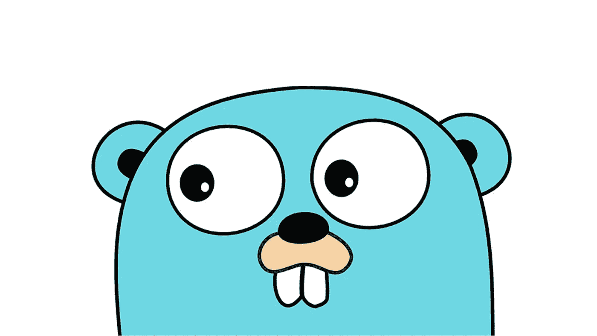

# Golang 1.18 中的泛型，不用再写 max / min 了(可能)

> 原文：<https://itnext.io/generics-in-golang-1-18-no-need-to-write-max-min-anymore-maybe-d79f3392ca38?source=collection_archive---------0----------------------->

我不喜欢 golang 的一点是，有时一个简单的任务可能会非常乏味。其中一个是**获取两个整数**的最大/最小值。

# 背景

这个任务之所以乏味的根本原因是 golang 中缺少**泛型**，这意味着你不能实现一个既接受整数又接受浮点数的 max/min 函数。由于内置的 max 函数是 math package 接受 float64，所以人们使用的常见修复方法有:

*   为数学写一个包装函数。麦克斯或者数学。最小待办事项类型转换

*   自己写 max 函数

你可能认为实现上面的任何解决方案都不太难，但这完全是浪费时间，尤其是当你参加在线竞赛或只是练习算法和数据结构时。

# 仿制药拯救世界

因此，随着 golang 1.18 中[新接受的提议](https://go.googlesource.com/proposal/+/refs/heads/master/design/43651-type-parameters.md)，我们终于可以一劳永逸地解决这个问题(如果内置数学。Max &数学。最小值被更新)。一个快速和肮脏的方法可以这样做:

> 一个工作版本[在这里](https://go2goplay.golang.org/p/XF6wM3JF2QM)

如果像上面这样的类似代码可以添加到内置的数学库中，我们就不再需要自己动手了。我相信将来会有更多这样的应用程序使 golang 成为一种更优雅、更简洁的语言。期待明年这个版本的发布。😃