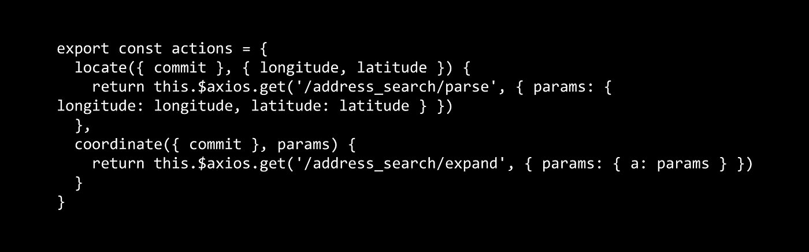

# 使用 Mapbox、Rails 5 和 NuxtJS/VueJS 进行地理编码

> 原文：<https://itnext.io/geocoding-using-mapbox-rails-5-and-nuxtjs-vuejs-68d2c74f75f9?source=collection_archive---------5----------------------->

地理编码是取经纬度确定地址，或者取地址产生经纬度坐标的过程。



应用程序需要使用地理编码器有很多原因。对于现在为服务的[，我们在注册过程中使用它，并且只需点击“查找我”就可以轻松找到附近的餐馆。](http://nowserving.us)

让我们开始编码吧！

## Rails API

我们需要获取`mapbox-sdk`并将其添加到 gem 文件中。

```
*gem* **'mapbox-sdk'**, **'~>2'**
```

创建一个简单的初始化器来设置应用程序中的访问令牌(例如`config/initializers/mapbox.rb`

```
***Mapbox***.access_token = MAPBOX_ACCESS_TOKEN
```

接下来，让我们添加几条路线:

```
*namespace* **:address_search do** *get* **'expand'**, **to**: **'expand'** *get* **'parse'**, **to**: **'parse'
end**
```

还有一个`address_search_controller.rb`:

```
**class *AddressSearchController*** < ***ApplicationController*** *# Take an addresss and return lat/lng* **def** *expand* **begin
      @addresses** = ***Mapbox***::***Geocoder***.geocode_forward(address_params[**:a**]) **unless** address_params[**:a**].nil?
      *render* **template**: **'address_search/result'
    rescue *StandardError*** *render* **json**: { **errors**: [**'Unable to perform forward geocoding'**] }
    **end
  end** *# Take lat/lng array and return a postal address* **def** *parse* **begin
      @location** = { **latitude**: *address_params*[**:latitude**].to_f, **longitude**: *address_params*[**:longitude**].to_f }
      **@addresses** = ***Mapbox***::***Geocoder***.geocode_reverse(**@location**)
      *render* **template**: **'address_search/result'
    rescue *StandardError*** *render* **json**: { **errors**: [**'Unable to perform reverse geocoding'**] }
    **end
  end** *private* **def** *address_params* params.permit(**:a**, **:latitude, :longitude**)
  **end
end**
```

expand 方法使用`a`查询参数，并要求地理编码器服务返回一个纬度/经度数组。对于从 lat/lng 获取地址，我们期待类似`{ latitude: 0, longitude: 0 }`的散列。

您可能不希望在这里呈现模板，但在我的例子中，我希望总是返回一个数组，因此确保这一点的最佳方式是使用 jbuilder 一行程序来呈现它:

```
json.array! **@addresses**
```

和一个请求规范:

```
***RSpec***.*describe* **'Address Search' do**

  *it* **'parses an address and returns latitude and longitude' do** *get* **'/api/v1/address_search/expand'**, **params**: { **a**: **'401 B St, San Diego CA'** }
    expect(response).to be_successful
  **end** *it* **'parses latitude and longitude and returns an address' do** *get* **'/api/v1/address_search/parse'**, **params**: { **longitude**: 127.0, **latitude**: -43.64}
    expect(response).to be_successful
  **end
end**
```

## 前端

我们正在为我们的 UI 使用令人敬畏的 NuxtJS 框架。如果你以前没用过，一定要看看。如果不会用，也不用担心；这段代码没有 Nuxt 也能很好地工作。

我们使用 Vuex 动作来调用我们的后端，所以我们有一个存储我们的 Mapbox 配置。

```
**export const** actions = {
  locate({ commit }, { longitude, latitude }) {
    **return this**.**$axios**.get(**'/address_search/parse'**, { **params**: { **longitude**: longitude, **latitude**: latitude } })
  },
  coordinate({ commit }, params) {
    **return this**.**$axios**.get(**'/address_search/expand'**, { **params**: { **a**: params } })
  }
}
```

为了演示，我们使用`vue-i18n, vue-notify, bootstrap-vue`和`vue-fontawesome`。

```
<**template**>
  <**b-btn
    v-b-tooltip.hover="**true**"
    :data-state="state"
    :variant="**btnVariant**"
    :title="locationLabel"
    type="button"
    @click="**findMe**"**>
    <**font-awesome-icon v-if="state** === 1**" :icon="**['far', 'spinner']**" spin** />
    <**font-awesome-icon v-else :icon="**['far', 'location-arrow']**"** />
  </**b-btn**>
</**template**>
<**script**>
**import** { FontAwesomeIcon } **from '@fortawesome/vue-fontawesome'

export default** {
  **components**: {
    FontAwesomeIcon
  },
  **props**: {
    **locationLabel**: {
      **default**: **'Find my current location'**,
      **type**: ***String*** }
  },
  data() {
    **return** {
      **state**: 0}
  },
  **computed**: {
    btnVariant() {
      **switch** (**this**.**state**) {
        **case** 0:
          **return 'outline-primary'
        case** 1:
          **return 'info'
        case** 2:
          **return 'success'
        default**:
          **return 'outline-primary'** }
    }
  },
  **methods**: {
    findMe() {
      **const** vm = **this
      this**.**state** = 1
      **if** (!***navigator***.**geolocation**) {
        vm.**$notify**({ **text**: vm.**$t**(**'geolocation.not_supported'**), **group**: **'alerts'** })
        **return** }

      **function** *success*(position) {
        **const** accuracy = position.**coords**.**accuracy** vm.**$store**.**dispatch**(**'mapbox/locate'**, {
          **latitude**: position.**coords**.**latitude**,
          **longitude**: position.**coords**.**longitude**,
          **accuracy**: accuracy
        })
          .then((resp) => {vm.**state** = 2
            vm.$emit(**'result'**, { **name**: resp.**data**[0].**features**[0].place_name, **center**: resp.**data**[0].**features**[0].**center** })
          })
          .catch(() => {
            vm.**state** = 0
            vm.**$notify**({ **text**: vm.**$t**(**'geolocation.not_found'**), **type**: **'warning'**, **group**: **'alerts'** })
          })
      }

      **function** *error*() {
        vm.**$notify**({ **text**: vm.**$t**(**'geolocation.not_found'**), **group**: **'alerts'**, **type**: **'warning'** })
      }

      ***navigator***.**geolocation**.getCurrentPosition(*success*, *error*)
    }
  }
}
</**script**>
```

这里发生了很多事情，所以让我们把它们都分解一下。

位置按钮有三种状态；默认状态、活动状态和成功状态。computed 属性处理每个状态的 css 类的更改。

悬停时还会显示一个工具提示，说明浏览器将请求允许向后端发送位置信息。

点击时调用`findMe`方法。其中我们有两个成功和错误的回调，浏览器内置的`[getCurrentPosition](https://developer.mozilla.org/en-US/docs/Web/API/Geolocation/getCurrentPosition)`需要正确工作。当浏览器向`success`回调函数提供纬度和经度时，我们可以使用 Vuex 动作将其发送到后端。一旦后端响应到来，组件就会发出一个包含地址名称和坐标的结果事件。如果权限被拒绝，我们会显示一个错误通知。如果浏览器不支持定位服务，我们也会通知用户。

## 结论

恭喜你有了一个完全实现的正向和反向地理编码解决方案的 API！