# 使用 MapBox 和 QGIS 进行地理配准

> 原文：<https://itnext.io/georeferencing-with-mapbox-and-qgis-f7e9eee41da8?source=collection_archive---------4----------------------->

# ***本教程是*** 系列文章的一部分

> *📝*[Flutter 中的 Mapbox](https://dariadobszai.medium.com/mapbox-in-flutter-part-1-fe560b45937f)*—集成 Flutter 中的 map box 地图，并使用它执行基本操作*
> 
> *📝* ***本文:*** 使用 MapBox 和 QGIS 进行地理配准 *—教授如何获取旧地图图像并将其转换为实际地图中使用的格式*
> 
> *📝*

[不溅源](https://unsplash.com/photos/o0l-M8W_7wA)

# 你会从这篇文章中学到什么？

*   配置 [QGIS](https://www.qgis.org/en/site/) 软件
*   在 QGIS 中导入地图框
*   导入和地理配准历史地图
*   将准备好的地图转换成可以在 [*MapBox Studio*](https://studio.mapbox.com/) 中使用的格式

# 介绍

对于这个教程，我选择了旧的布达佩斯 的 [*地图，但是由于这个文件太大，我调整了它的大小，所以你可以从*](https://hu.wikipedia.org/wiki/F%C3%A1jl:Budapest_map_1884.jpg) *[*这里*](https://github.com/dariadobsai/QGSI-budapest-map/blob/master/Budapest_map_1884-small.jpg) *下载。**

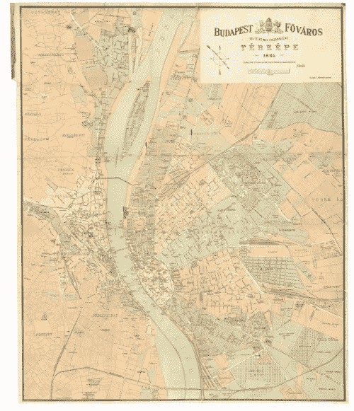

布达佩斯地图 1884 年

一般情况下，我们会通过 MapBox 跟随 [*地理参考影像*](https://docs.mapbox.com/help/tutorials/georeferencing-imagery/) 教程。在这里，您可以找到 [*逐步说明*](https://docs.mapbox.com/help/tutorials/georeferencing-imagery/#getting-started) 如何获取 QGIS 程序以及地理配准所需的设置。

安装 QGIS 后，请按照以下步骤操作。

# 第一步。配置 QGIS

这一步是为了方便。为了将地图图像转换成可用的地图，我们将把它的坐标与真实地图上的对应点进行匹配。

有两种方法可以从地图图像中获取坐标:

*   在某些情况下，它可以在地图本身的边界上找到，就像在 QGIS 的 [*这个教程中的*](https://www.qgistutorials.com/en/docs/3/georeferencing_basics.html)
*   一些地图(如历史地图，航空影像)不包含坐标，所以你必须依靠特定的地标作为你的向导来猜测它们。

由于我选择的旧地图没有坐标，通过在 QGIS 中配置地图视图，我们可以使用一个选项来自动获取点，这将在下一步中演示。这样的例子也可以在 [*地理配准航空影像教程*](https://www.qgistutorials.com/en/docs/3/advanced_georeferencing.html) *中找到。*

要配置地图，请遵循这些步骤*或查看下面的截图。我选择了 MapBox 服务，但它也可以是 OpenStreets 地图或任何其他提供商。*

*在 MapBox studio 中点击**“共享”**，复制以下网址:*

*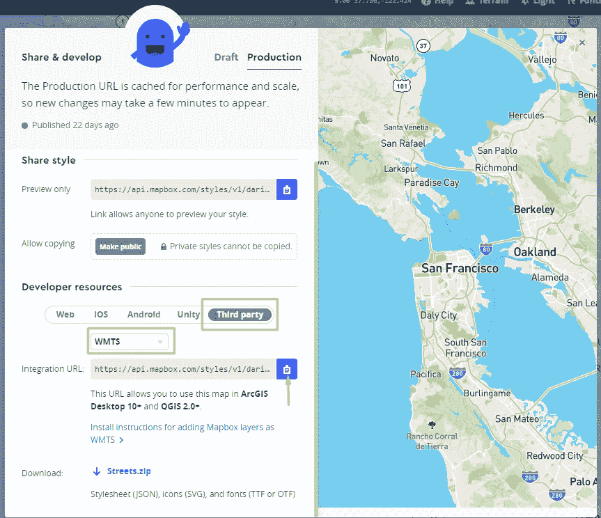*

*[构建一个 WMTS 端点](https://docs.mapbox.com/help/tutorials/mapbox-arcgis-qgis/#build-a-wmts-endpoint-1)*

> **💡* ***注:*** *如果不知道如何到达上面的窗口，请参考* [*MapBox 中的*](https://dariadobszai.medium.com/mapbox-in-flutter-part-1-fe560b45937f) *条**

*在 QGIS 中添加新图层:*

*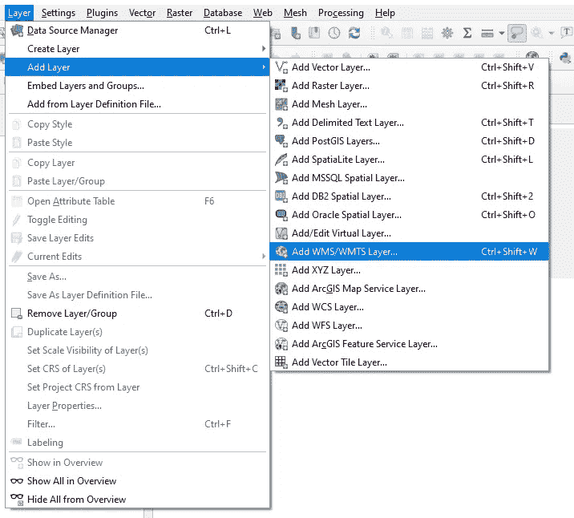*

*点击**“新建”**创建图层:*

*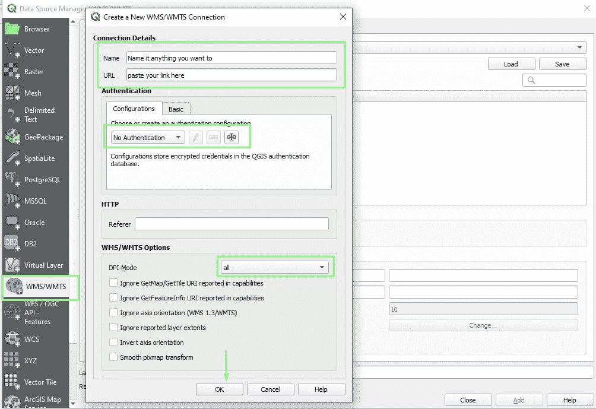*

*在下拉列表中选择您的连接并按下**“连接”**，然后点击加载的层并按下**“添加”**:*

****

## *结果*

*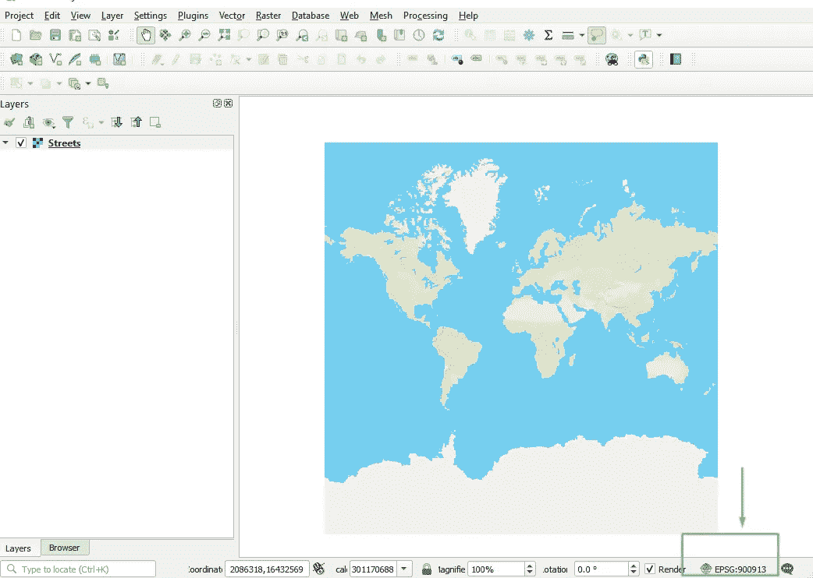*

*设置坐标参考系统(CRS)很重要，所以像上面的截图一样点击窗口底部。现在，选择 ***谷歌地图全球墨卡托*** 并点击**“确定”**。*

**

# *第二步。导入和地理配准历史地图*

*时间导入我们的 [*布达佩斯地图*](https://upload.wikimedia.org/wikipedia/commons/8/84/Budapest_map_1884.jpg) 并设置坐标。*

*在顶部菜单中选择**“光栅”**->-**“地理参照器”***

*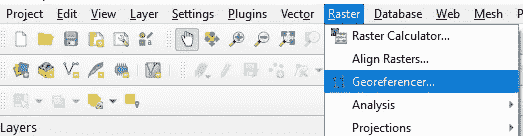*

*一个新窗口将会打开，从那里点击**“文件”**->-**“打开光栅”**，选择你的地图图像。*

*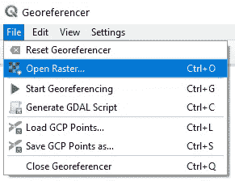*

*地图打开后，我们进行地理参考。下面的一个*半分钟*视频展示了如何做到这一点的一般过程。*

*我打开了两个窗口，从旧地图中我选择了一个应该与真实地图上的点相匹配的点。*

> **💡* ***注意:*** *保持地理参照窗口打开*取消勾选*复选框* ***【自动隐藏地理参照窗口】****

*您将使用这三个工具来处理坐标点:设置、删除或重新定位:*

*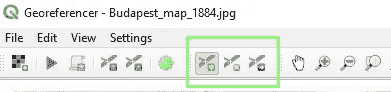*

*正如你在视频中注意到的，通过点击**“从地图画布”**并在地图框地图上选择相应的点，我自动获得了坐标。*

*总的来说，少点就够了，但是如果你想得到一个更准确的结果，那么你可以选择更多。*

## *第 2.1 步。转换设置*

*在保存结果之前，我们应该确保所有设置都配置正确。*

*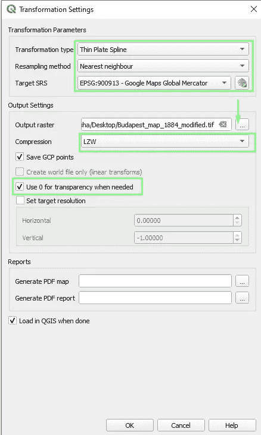*

> **💡* ***注意 1:*** *图像保存后会有黑色背景，所以最好的避免方法是勾选* ***【需要时使用 0 透明】****
> 
> **💡* ***注 2:*** *我将***设置为**薄平面样条，但在* [地理配准地形图和扫描地图](https://www.qgistutorials.com/en/docs/3/georeferencing_basics.html) *教程中它设置为*多项式 2。在这种情况下，你至少需要 6 分。**

**之后，点击绿色的**“播放”**按钮，瞧:**

****

## **步骤 2.2。不透明度:**

**为了设置地图的不透明度，在顶部菜单中选择**“图层”**->-**“图层属性”**->-**“透明度”**，拖动滑块到所需的值**

**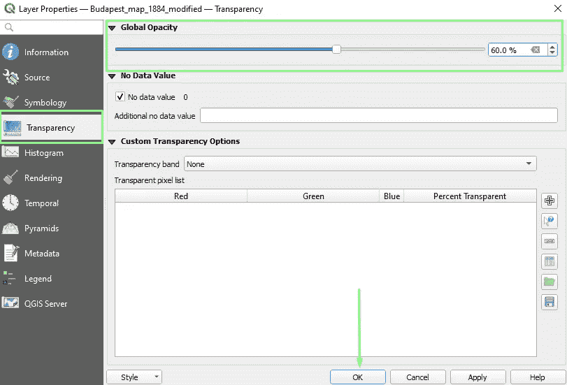**

## **决赛成绩**

**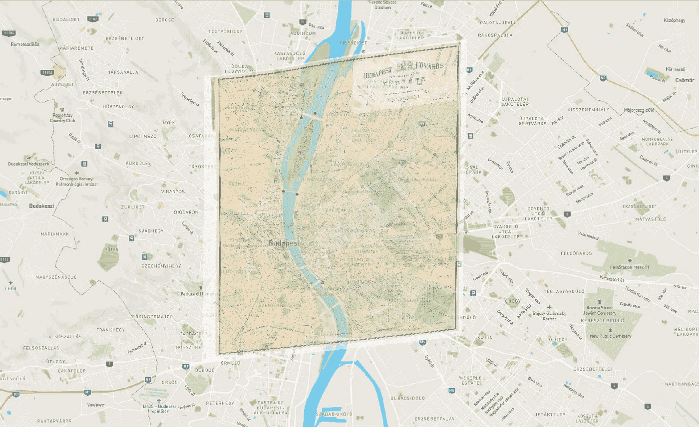**

# **第三步。正在转换为。tif 格式**

## **第 3.2 步。导出文件**

**右键点击文件-> **【导出】**->-**【另存为】**。然后选择**“渲染图”**，定义文件位置，名称，设置 CRS 为谷歌地图，点击**“确定”**。**

**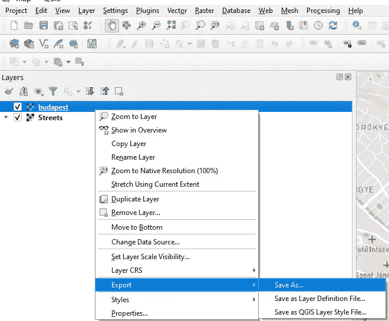****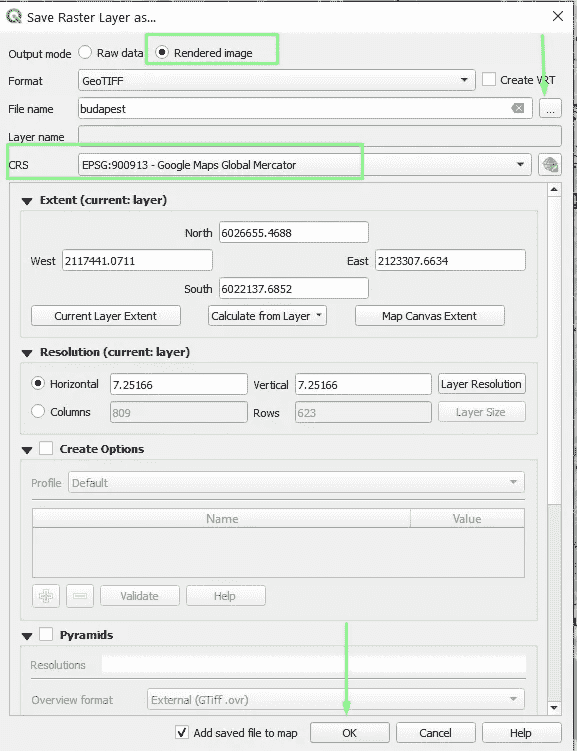**

> ***💡* ***注意:*** *选择* ***【渲染图像】*** *很重要，否则透明度&不透明度设置将被忽略***

## **第 3.1 步。压缩文件**

**如果你的文件不太大，这一步可以跳过。因为稍后，我们将在 MapBox 中导入它的最大接受尺寸 a *。tif* 文件是 *300 MB* 。我们当前的文件大小是 *38 MB* ，但是我仍然想展示如何执行转换。**

**点击**【光栅】**->-**-**->-**“翻译(转换格式)”****

**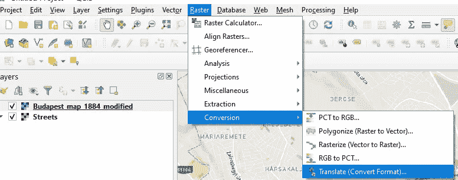****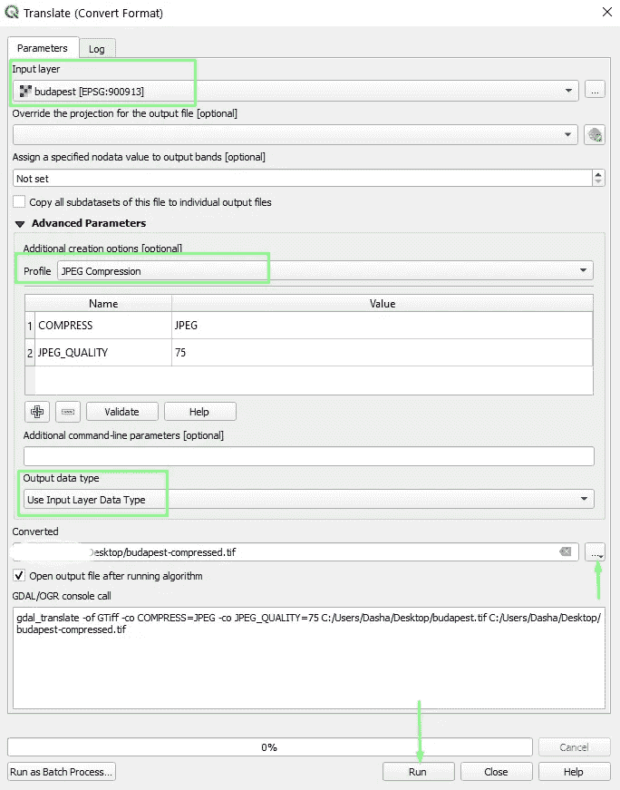**

**选择你的地图，设置**【Profile】**为 ***高*** 或 ***JPEG 压缩*** (最高的一个)，然后定义保存转换文件的位置，按**【运行】**。**

**输出文件大小变成了 *4.73 MB* 。**

**当然，压缩的质量会下降，所以只有在必要的时候才使用它。**

# **TADA，我们结束了🎉**

**QGIS 项目和就绪*。tif 文件你可以从我的 [Github repo](https://github.com/dariadobsai/QGSI-budapest-map/tree/master) 下载。***

**在下一个教程中，我将展示如何在 MapBox Studio 中导入此地图，然后在 Flutter 应用程序中显示它。**

## **感谢您的阅读！**

**我很想听听你的反馈🙂**