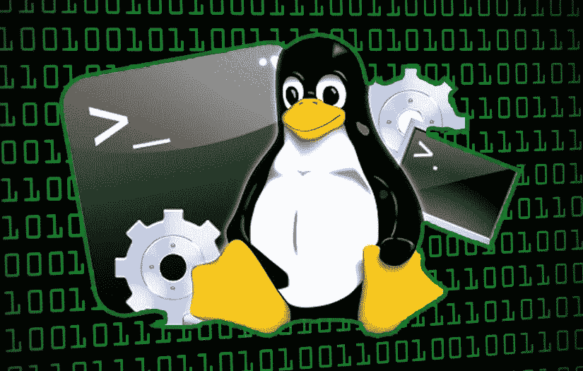

# 获取 Kubernetes 节点的外壳

> 原文：<https://itnext.io/get-a-shell-to-a-kubernetes-node-9b720a15a4fe?source=collection_archive---------1----------------------->



在 Kubernetes 集群的整个生命周期中，您可能需要访问一个集群工作节点。这种访问可以用于维护、配置检查、日志收集或其他故障排除操作。更重要的是，如果您可以在需要时启用这种访问，并在完成任务后禁用它，那就更好了。

# SSH 方法

虽然可以用 SSH 访问配置 Kubernetes 节点，但这也使 worker 节点更容易受到攻击。使用 SSH 需要在工程师的机器和 EC2 实例之间建立网络连接，这是您可能希望避免的。一些用户设置跳转服务器(也称为堡垒主机)作为典型模式，以最小化来自互联网的攻击面。但是这种方法仍然需要您管理对 bastion 服务器的访问并保护 SSH 密钥。IMHO，管理支持 SSH 基础设施是一个很高的代价，特别是如果您只是想获得对工作节点的 shell 访问或运行一些命令。

# Kubernetes 方法

Kubernetes 命令行工具`kubectl`允许您对 Kubernetes 集群运行不同的命令。您可以操纵 Kubernetes API 对象、管理 worker 节点、检查集群、在运行的容器中执行命令，以及[获得一个运行的容器的交互式 shell](https://kubernetes.io/docs/tasks/debug-application-cluster/get-shell-running-container/)。

假设你有一只`pod`，名叫`shell-demo`。要在这个`pod`上获得运行容器的 shell，只需运行:

```
kubectl exec -it shell-demo -- /bin/bash # see shell prompt ... 
root@shell-demo:/#
```

# `exec`是如何工作的？

`kubectl exec`调用 Kubernetes API 服务器，它“要求”一个`Kubelet`“节点代理”针对 CRI(容器运行时接口)运行一个`exec`命令，最常见的是 Docker 运行时。

`docker exec`API/命令创建一个新进程，将其名称空间设置为目标容器的名称空间，然后执行所请求的命令，还处理所创建进程的输入和输出流。

# 这个想法

> *Linux 系统从每种类型(挂载、进程、ipc、网络、UTS 和用户)都有一个名称空间开始，供所有进程使用。*

所以，我们需要做的是运行一个新的`pod`，并把它连接到一个工作者节点的主机名称空间。

# 助手程序

可以使用任何带有 shell 的 Docker 映像作为“主机 shell”容器。有一个限制，您应该知道——不可能连接目标容器(或主机)的`mount namespace`。

是`util-linux`包中的一个小程序，可以用其他进程的`namespaces`(和`cgroups`)运行程序。正是我们需要的！

大多数 Linux 发行版都附带了一个过时的版本`util-linux`。所以，我准备了带有`nsenter`程序的[alexeiled/nsenter](https://hub.docker.com/r/alexeiled/nsenterr)Docker 图像。这是一个超级小的 Docker 映像，大小为`900K`，由`scratch`映像和一个静态链接的`nsenter`二进制文件(`v2.34`)创建。

使用下面的助手脚本，也可以在[Alexei-led/nsenter](https://github.com/alexei-led/nsenter)GitHub 存储库中找到，在指定的 Kubernetes worker 节点上运行一个新的`nsenter pod`。这个助手脚本在主机的进程和网络名称空间中创建一个*特权* `nsenter pod`，运行带有`--all`标志的`nsenter`，加入所有的`namespaces`和`cgroups`，并作为*超级用户*(使用`su -`命令)运行一个默认 shell。

`nodeSelector`可以指定运行`nsenter pod`的目标 Kubernetes 节点。如果指定，`"tolerations": [{"operator": "Exists"}]`参数有助于匹配任何节点`taint`。

## 助手脚本

```
# get cluster nodes
kubectl get nodes# output
NAME                                            STATUS  AGE
ip-192-168-151-104.us-west-2.compute.internal   Ready   8d      
ip-192-168-171-140.us-west-2.compute.internal   Ready   7d11h# open superuser shell on specified node
./nsenter-node.sh ip-192-168-151-104.us-west-2.compute.internal# prompt
[root@ip-192-168-151-104 ~]## pod will be destroyed on exit
...
```

`nsenter-node.sh`

```
#!/bin/sh
set -xnode=${1}
nodeName=$(kubectl get node ${node} -o template --template='{{index .metadata.labels "kubernetes.io/hostname"}}') 
nodeSelector='"nodeSelector": { "kubernetes.io/hostname": "'${nodeName:?}'" },'
podName=${USER}-nsenter-${node}kubectl run ${podName:?} --restart=Never -it --rm --image overriden --overrides '
{
  "spec": {
    "hostPID": true,
    "hostNetwork": true,
    '"${nodeSelector?}"'
    "tolerations": [{
        "operator": "Exists"
    }],
    "containers": [
      {
        "name": "nsenter",
        "image": "alexeiled/nsenter:2.34",
        "command": [
          "/nsenter", "--all", "--target=1", "--", "su", "-"
        ],
        "stdin": true,
        "tty": true,
        "securityContext": {
          "privileged": true
        }
      }
    ]
  }
}' --attach "$@"
```

# AWS 上 Kubernetes 工作节点的管理

在 AWS、亚马逊 EKS 或自我管理的 Kubernetes 集群上运行 Kubernetes 集群时，可以使用【AWS 系统管理器】[【https://aws.amazon.com/systems-manager/】](https://aws.amazon.com/systems-manager/))管理 Kubernetes 节点。使用 AWS Systems Manager (AWS SSM ),您可以自动化多项管理任务、应用补丁和更新、运行命令以及在任何受管节点上访问 shell，而无需维护 SSH 基础架构。

为了管理一个 Kubernetes 节点(AWS EC2 主机)，你需要安装并启动一个 SSM 代理守护进程，更多细节见 [AWS 文档](https://docs.aws.amazon.com/systems-manager/latest/userguide/sysman-install-ssm-agent.html)。

但是我们正在采用 Kubernetes 方法，这意味着我们将在集群中的每个 Kubernetes 节点上运行一个 SSM 代理作为`daemonset`。这种方法允许您运行更新版本的 SSM 代理，而无需将其安装到主机上，并且仅在需要时才运行。

## 预先请求

**选项 1(更安全)**

可以将 AWS IAM 角色与 Kubernetes 服务帐户相关联，并使用该服务帐户运行 SSM 代理 *DaemonSet。*

这是最安全的选择。您只将`AmazonEC2RoleforSSM` IAM 角色分配给 SSM 代理，并在需要访问集群节点时创建 SSM *DaemonSet* 。你也可以用`nodeSelector`锁定特定的节点。

创建一个新的 Kubernetes 服务帐户(例如`ssm-sa`，并将其连接到 IAM 角色，附带`AmazonEC2RoleforSSM`策略。

```
$ export CLUSTER_NAME=gaia-kube
$ export SA_NAME=ssm-sa# setup IAM OIDC provider for EKS cluster
$ **eksctl utils associate-iam-oidc-provider — region=us-west-2 — name=$CLUSTER_NAME — approve**# create K8s service account linked to IAM role in kube-system namespace
$ **eksctl create iamserviceaccount — name $SA_NAME — cluster $CLUSTER_NAME — namespace kube-system \
 — attach-policy-arn arn:aws:iam::aws:policy/service-role/AmazonEC2RoleforSSM \
 — override-existing-serviceaccounts \
 — approve**[ℹ] using region us-west-2
[ℹ] 1 iamserviceaccount (kube-system/ssm-sa) was included (based on the include/exclude rules)
[!] serviceaccounts that exists in Kubernetes will be excluded, use — override-existing-serviceaccounts to override
[ℹ] 1 task: { 2 sequential sub-tasks: { create IAM role for serviceaccount “kube-system/ssm-sa”, create serviceaccount “kube-system/ssm-sa” } }
[ℹ] building iamserviceaccount stack “eksctl-gaia-kube-addon-iamserviceaccount-kube-system-ssm-sa”
[ℹ] deploying stack “eksctl-gaia-kube-addon-iamserviceaccount-kube-system-ssm-sa”
[ℹ] created serviceaccount “kube-system/ssm-sa”
```

配置 SSM *守护进程*以使用此服务帐户。

```
apiVersion: apps/v1
kind: DaemonSet
metadata:
 name: ssm-agent
 labels:
 k8s-app: ssm-agent
 namespace: kube-syste
spec:
 …
 template:
 …
 spec:
 **serviceAccountName: ssm-sa**
 containers:
 — image: alexeiled/aws-ssm-agent
 name: ssm-agent
 …
```

现在，部署 SSM *守护进程*并访问您的集群节点。

```
kubectl create -f daemonset.xml
```

**备选方案 2(不太安全)**

首先，您需要将`AmazonEC2RoleforSSM`策略附加到 Kubernetes worker nodes 实例角色。如果没有这个策略，您将无法使用 AWS SSM 管理 Kubernetes 工作节点。

# 设置

然后，克隆[Alexei-led/kube-SSM-agent](https://github.com/alexei-led/kube-ssm-agent)GitHub 库。它包含一个正确配置的 SSM 代理`daemonset`文件。

`daemonset`使用包含以下内容的`[alexeiled/aws-ssm-agent:<ver>](https://hub.docker.com/r/alexeiled/aws-ssm-agent)` Docker 图像:

1.  AWS SSM 代理，与 Docker 图像标签版本相同
2.  Docker CLI 客户端
3.  AWS CLI 客户端
4.  Vim 和其他有用的程序

运行以部署新的 SSM 代理 daemonset:

```
kubectl create -f daemonset.yaml
```

一旦 SSM 代理 daemonset 运行，您就可以运行任何`aws ssm`命令。

运行以启动新的 SSM 终端会话:

```
AWS_DEFAULT_REGION=us-west-2 aws ssm start-session --target <instance-id>starting session with SessionId: ...sh-4.2$ ls
sh-4.2$ pwd
/opt/amazon/ssm
sh-4.2$ bash -i
[ssm-user@ip-192-168-84-111 ssm]$[ssm-user@ip-192-168-84-111 ssm]$ exit
sh-4.2$ exitExiting session with sessionId: ...
```

## `daemonset.yaml`文件

```
apiVersion: apps/v1
kind: DaemonSet
metadata:
  name: ssm-agent
  labels:
    k8s-app: ssm-agent
  namespace: kube-system
spec:
  selector:
    matchLabels:
      name: ssm-agent
  template:
    metadata:
      labels:
        name: ssm-agent
    spec:
      # use IAM role associated with K8s service
      serviceAccountName: ssm-sa
      # join host network namespace
      hostNetwork: true
      # join host process namespace
      hostPID: true
      # join host IPC namespace
      hostIPC: true 
      # tolerations
      tolerations:
      - effect: NoExecute
        operator: Exists
      - effect: NoSchedule
        operator: Exists
      containers:
      - image: alexeiled/aws-ssm-agent:2.3.680
        imagePullPolicy: Always
        name: ssm-agent
        securityContext:
          runAsUser: 0
          privileged: true
        volumeMounts:
        # Allows systemctl to communicate with the systemd running on the host
        - name: dbus
          mountPath: /var/run/dbus
        - name: run-systemd
          mountPath: /run/systemd
        # Allows to peek into systemd units that are baked into the official EKS AMI
        - name: etc-systemd
          mountPath: /etc/systemd
        # This is needed in order to fetch logs NOT managed by journald
        # journallog is stored only in memory by default, so we need
        #
        # If all you need is access to persistent journals, /var/log/journal/* would be enough
        # FYI, the volatile log store /var/run/journal was empty on my nodes. Perhaps it isn't used in Amazon Linux 2 / EKS AMI?
        # See [https://askubuntu.com/a/1082910](https://askubuntu.com/a/1082910) for more background
        - name: var-log
          mountPath: /var/log
        - name: var-run
          mountPath: /var/run
        - name: run
          mountPath: /run
        - name: usr-lib-systemd
          mountPath: /usr/lib/systemd
        - name: etc-machine-id
          mountPath: /etc/machine-id
        - name: etc-sudoers
          mountPath: /etc/sudoers.d
      volumes:
      # for systemctl to systemd access
      - name: dbus
        hostPath:
          path: /var/run/dbus
          type: Directory
      - name: run-systemd
        hostPath:
          path: /run/systemd
          type: Directory
      - name: etc-systemd
        hostPath:
          path: /etc/systemd
          type: Directory
      - name: var-log
        hostPath:
          path: /var/log
          type: Directory
      # mainly for dockerd access via /var/run/docker.sock
      - name: var-run
        hostPath:
          path: /var/run
          type: Directory
      # var-run implies you also need this, because
      # /var/run is a synmlink to /run
      # sh-4.2$ ls -lah /var/run
      # lrwxrwxrwx 1 root root 6 Nov 14 07:22 /var/run -> ../run
      - name: run
        hostPath:
          path: /run
          type: Directory
      - name: usr-lib-systemd
        hostPath:
          path: /usr/lib/systemd
          type: Directory
      # Required by journalctl to locate the current boot.
      # If omitted, journalctl is unable to locate host's current boot journal
      - name: etc-machine-id
        hostPath:
          path: /etc/machine-id
          type: File
      # Avoid this error > ERROR [MessageGatewayService] Failed to add ssm-user to sudoers file: open /etc/sudoers.d/ssm-agent-users: no such file or directory
      - name: etc-sudoers
        hostPath:
          path: /etc/sudoers.d
          type: Directory
```

# 摘要

如您所见，以纯 Kubernetes 的方式管理 Kubernetes 节点相对容易，无需冒不必要的风险和管理复杂的 SSH 基础设施。

# 参考

- [alexei-led/nsenter](https://hub.docker.com/r/alexeiled/nsenter) Docker image
- [alexei-led/nsenter](https://github.com/alexei-led/nsenter) GitHub repository
- [nsenter](http://man7.org/linux/man-pages/man1/nsenter.1.html) man page
- [alexei-led/kube-ssm-agent](https://github.com/alexei-led/kube-ssm-agent) SSM Agent for Amazon EKS

*草稿发表于* [*https://alexei-led.github.io*](https://alexei-led.github.io/post/k8s_node_shell/) *(T18)*