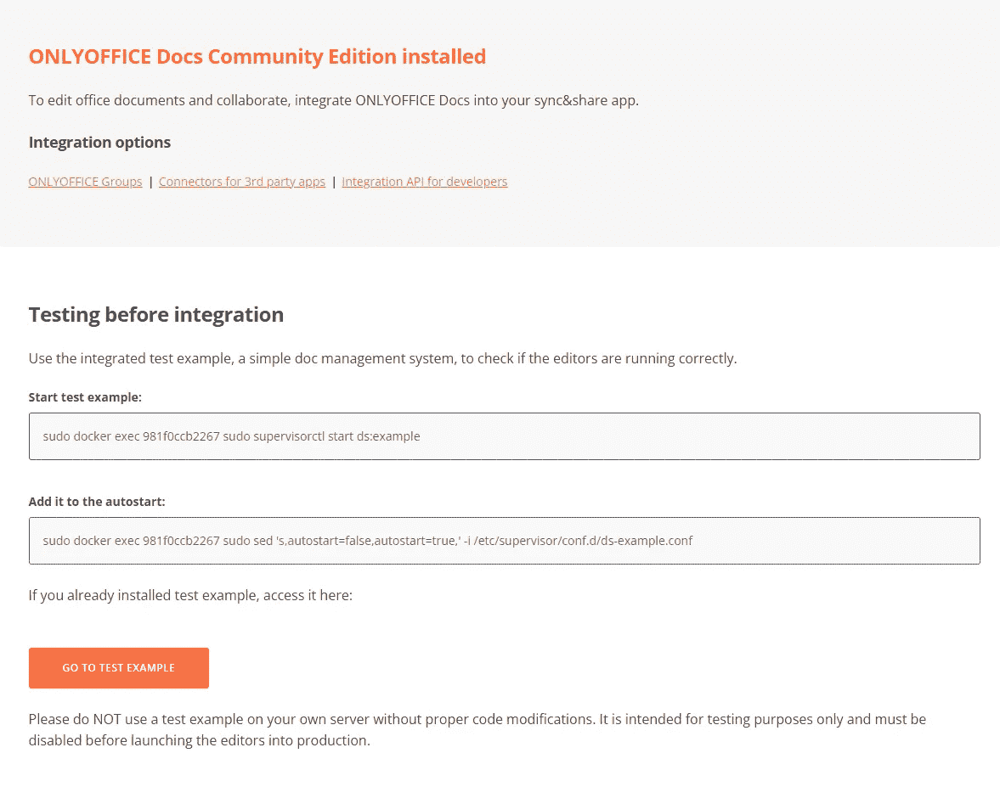
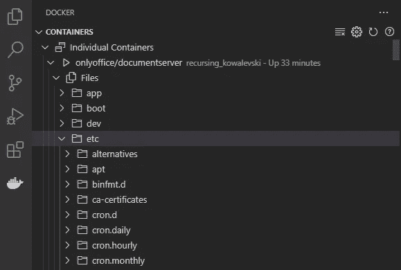
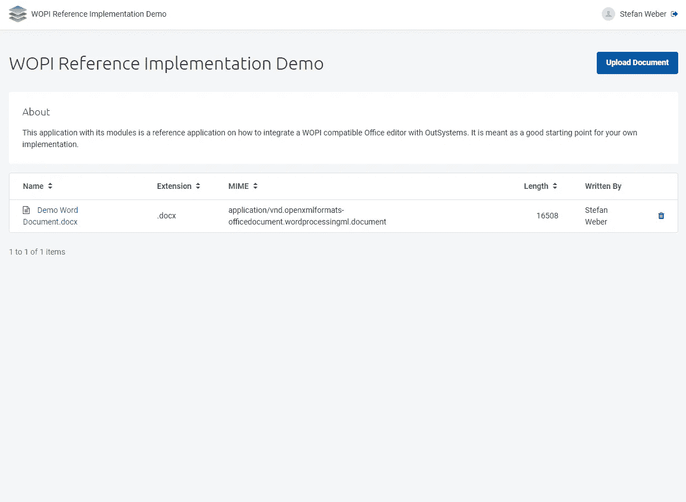
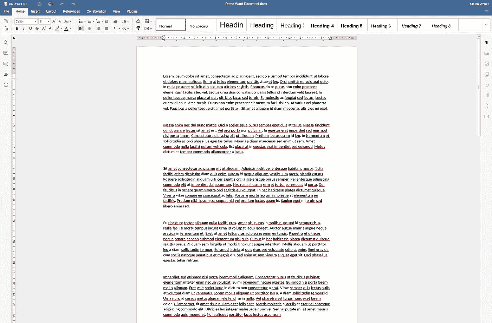

# 使用 WOPI 让 Office 编辑器进入您的外部系统应用程序

> 原文：<https://itnext.io/get-an-office-editor-into-your-outsystems-apps-with-wopi-2f8657612260?source=collection_archive---------3----------------------->

如果您正在构建以文档为中心的应用程序，在某个时候，您可能会遇到这样的情况:您不仅想查看文档，还想创建或编辑文档。直接在浏览器中，没有媒体中断。微软 WOPI 协议和兼容 WOPI 的办公套件使这成为可能。

例如，一个用例是合同的自动生成(例如，通过 Adobe 文档生成)作为具有最终调整的草稿。

本文附有我在 OutSystems Forge 上发表的 OutSystems 中 WOPI 协议的参考实现。(见下文)。


# 外部系统

OutSystems 是一个低代码应用程序平台。支持整个应用程序开发生命周期的可视化开发环境。低代码意味着您仍然可以使用自定义代码，无论是前端的 JavaScript 还是服务器端的 C#。

[](https://www.outsystems.com) [## 低代码高性能软件开发|外部系统

### OutSystems 为有远见的组织创建高性能、低代码和云本地开发平台

www.outsystems.com](https://www.outsystems.com) 

# WOPI — Web 应用开放平台接口

Web 应用开放平台接口是微软的协议规范。它定义了一组将 Office for Web 与您的应用程序集成的操作。换句话说，WOPI 允许 Office for Web 读取和编辑由您的服务提供的文档。

Office for Web 是指基于浏览器的 Microsoft Office 套件版本(Word、Excel、PowerPoint、OneNote)。Office for Web 可以作为 Microsoft 365 或 Office 365 订阅的一部分在(Microsoft)云中提供，也可以使用[Microsoft Office Online Server](https://docs.microsoft.com/en-us/officeonlineserver/office-online-server-overview)自行托管。

也就是说——WOPI 不仅限于 Office for the Web，也已经被其他 Office 供应商采用，如

*   [图书馆](https://www.libreoffice.org/)在线由文献基金会提供。完整的开源办公套件。
*   [Collabora](https://www.collaboraoffice.com/)Online——一款基于 LibreOffice 的企业级办公套件。
*   [ONLYOFFICE](https://www.onlyoffice.com/) —完全支持微软 OFFICE 文档格式(OOXML)的完整办公套件。

通过 WOPI 协议读取和编辑文件的办公套件被称为 **WOPI 客户端**，而服务于这些文档的应用服务被称为 **WOPI 主机**。

> 如果您需要一个查看器来在浏览器中显示文档，那么集成 WOPI 客户机也很有用。所有 WOPI 客户端都支持文档的简化阅读模式——不仅支持 Office 文档，还支持常见的 PDF 格式。

[](https://docs.microsoft.com/en-us/microsoft-365/cloud-storage-partner-program/online/) [## 使用 WOPI 协议与 Office for web 集成

### 您可以使用 Web 应用程序开放平台接口(WOPI)协议将 Office for Web 与您的…

docs.microsoft.com](https://docs.microsoft.com/en-us/microsoft-365/cloud-storage-partner-program/online/) 

对于这个参考实现，我使用 ONLYOFFICE 作为 WOPI 客户端。ONLYOFFICE 符合 WOPI 规范，尽管它没有提供与 Office for Web 相同的功能集。我使用它仅仅是因为它比微软的替代品更容易安装:

*   Office for Web Cloud service 要求您成为 [Office 365 云存储合作伙伴计划](https://developer.microsoft.com/en-us/office/cloud-storage-partner-program)的成员。只有当您作为 ISV 构建 SaaS 产品时，与 Office for Web Cloud service 集成才适用。
*   [Office Online Server](https://docs.microsoft.com/en-us/officeonlineserver/plan-office-online-server) (自托管)要求您有权下载该软件，并且在使用之前需要一些准备工作。

> 总之。如果你知道如何与 ONLYOFFICE 集成，那么你可以选择其他选项。

# ONLYOFFICE

ONLYOFFICE by Ascensio System SIA 公司提供了一个功能强大的办公套件，它包括文本文档、电子表格和演示文稿的在线编辑器，与 Microsoft Office 和 OpenDocument 文件格式高度兼容。ONLYOFFICE 为用户提供了多种编辑工具和协作功能，确保更好的团队工作流程，并在您的 web 解决方案中无缝处理复杂的格式和对象。

[](https://www.onlyoffice.com/) [## 商务在线办公应用程序

### ONLYOFFICE 提供与 MS Office 格式高度兼容的安全在线办公套件。将它连接到您的网络…

www.onlyoffice.com](https://www.onlyoffice.com/) 

# 整体情况

为了让 ONLYOFFICE 从我们的应用程序中呈现文档，我们需要以下构建块:

*   **WOPI 主机** —主机是一个公开的 REST API，具有服务和保存文件的操作。在外部系统中，这是一组暴露的 REST 端点。
*   **WOPI 客户端**—only office 的运行实例。为此，我们将使用官方的 ONLYOFFICE docker 图像。
*   **WOPI 主机页面** —连接主机和客户端的网页。

# 设置开发环境

在我们逐步完成 OutSystems 参考实现之前，我们必须确保您有一个正在运行的开发/试用环境。这是你需要的。

*   [外部系统](https://www.outsystems.com)——一个[个人环境](https://www.outsystems.com/PartnerSignup/GetStarted.aspx?PartnerId=bdbab3cf-076f-49e2-91ac-a9157081eace&utm_source=ISD%20FENIQS%20GmbH&utm_medium=partner&utm_campaign=partner-personal-environment&utm_content=personal-environment)就足够了。
*   [Docker 桌面](https://www.docker.com/) —用于运行 ONLYOFFICE 的实例。
*   [Visual Studio 代码](https://code.visualstudio.com/)带有 [Docker 扩展](https://marketplace.visualstudio.com/items?itemName=ms-azuretools.vscode-docker)——我们将更改 ONLYOFFICE 的一些配置设置。

# 仅运行 OFFICE Docker 桌面

要运行 ONLYOFFICE docker 容器，首先创建一些本地目录，例如

*   C:\dev\onlyoffice\logs
*   C:\dev\onlyoffice\data
*   C:\dev\onlyoffice\lib
*   C:\dev\onlyoffice\db

这些目录将在我们的容器中用作挂载卷来持久存储数据。然后运行以下命令。

```
docker run -it -d -p 80:80 --restart=always \
  -v C:\dev\onlyoffice\logs:/var/log/onlyoffice \
  -v C:\dev\onlyoffice\data:/var/www/onlyoffice\data \
  -v C:\dev\onlyoffice\lib:/var/lib/onlyoffice \
  -v C:\dev\onlyoffice\db:/var/lib/postgresql onlyoffice/documentserver
```

这将启动在端口 80 上运行的容器。在我的机器上，onlyoffice 完全启动大约需要 1 分钟。尝试浏览到 [http://localhost 上的起始页。您应该会看到以下屏幕。](http://localhost.)

> 在撰写本文时，ONLYOFFICE 的最新版本是 7.1。



ONLYOFFICE 欢迎页面

关于在 Docker 中运行 ONLYOFFICE 的更多信息可以在 ONLYOFFICE 帮助中心找到。

 [## 仅在本地服务器上安装 Docker 的 OFFICE 文档-仅 OFFICE

### sudo docker run-I-t-d-p 443:443-restart = always \-v/app/only office/DocumentServer/Data:/var/www/only office/Data…

helpcenter.onlyoffice.com](https://helpcenter.onlyoffice.com/installation/docs-developer-install-docker.aspx) 

# 仅启用 OFFICE WOPI 支持

默认情况下，WOPI 支持是禁用的，所以我们需要首先激活它并设置一些附加配置。启动安装了 Docker 扩展的 Visual Studio 代码，并在

```
/etc/onlyoffice/documentserver/local.json
```



> local.json 文件是同一目录中 default.json 配置文件的替代文件。default.json 包含 ONLYOFFICE 的所有可用配置选项。

在**服务**中添加一个新对象 **ipfilter**

该设置告诉 OPENOFFICE 接受来自任何地址的请求。根据您使用的版本，这可能已经设置好了。

```
{
  "services": {
    "ipfilter": {
      "rules": [
        {
          "address": "*",
          "allowed": true
        }
      ],
      "useforrequest": true,
      "errorcode": 403
    }
    ...
```

在**服务**->-**共同创作**内添加新对象**自动组装**

配置 OPENOFFICE 将文档中的更改立即发送回 WOPI 主机。

```
{
  "services": {
    "CoAuthoring": {
      "autoAssembly": {
        "enable": true,
        "interval": "0m",
        "step": "0m"
      }
    ...
```

> 如果没有此设置，您可能会在本地编辑的文件和 WOPI 主机存储的文件之间产生版本不匹配的风险。

并直接在根 **local.json** 文件中添加一个新的 **wopi** 对象

这使得 WOPI 集成成为可能😒

```
{
  "wopi": {
    "enable": true
  }
  ...
```

关于启用 WOPI 支持的更多信息可以在 ONLYOFFICE 文档中找到

 [## 概观

### 从 6.4 版开始，只有 OFFICE Docs 提供对 Web 应用程序开放平台接口协议的支持…

api.onlyoffice.com](https://api.onlyoffice.com/editors/wopi/) 

通过打开终端会话并执行以下命令来重新启动 ONLYOFFICE


连接到集装箱码头

```
sudo supervisorctl restart all
```

# 外部系统参考实施

您可以从 Forge 下载参考实现应用程序。此处提供

[](https://www.outsystems.com/forge/component-overview/13569/wopi-reference-implementation) [## WOPI 参考实现

### 这是一个 WOPI 主机和 WOPI 主机页面的参考实现。WOPI 协议允许集成办公室…

www.outsystems.com](https://www.outsystems.com/forge/component-overview/13569/wopi-reference-implementation) 

# 应用模块

参考实现由几个模块组成，应该为您自己的解决方案提供一个适应和扩展的起点。

*   **DocumentStore_CS** —使用外部系统实体存储文档的文档存储提供者的简单实现。

> 在实际实现中，您可能希望将文档存储转移到 AWS S3 这样的替代方案中。

*   **DocumentStoreUtil_EXT** —解析文件名的扩展模块。只有一个操作可以提取文档的扩展名并根据扩展名确定 MIME 类型。
*   **WOPI_API** —是 WOPI 主机的实现。包含几个 REST 端点来获取、更新、锁定和解锁文档。
*   **WOPIUtil_EXT** —一个扩展，带有一个验证 Office 随每个请求发送的“证明”的动作。

> 证据允许 WOPI 主机(我们的 OutSystems REST API)验证请求是否是由 WOPI 客户机发送的。

*   **WOPI_LIB** —这个库包含一个在 WOPI 主机页面上使用的 UI 小部件。
*   **WOPIDemo**——一个小的演示应用程序，将所有的部分整合在一起。

# 配置应用程序

在运行应用程序之前，需要设置一些配置设置。WOPI_API 模块为此公开了一些站点属性。

*   **WOPI_ClientBaseUrl** —是指向您唯一的 OFFICE Wopi 端点的完整 Url。当在 Docker 桌面本地运行时，这必须设置为**http://localhost/hosting/wopi**。
*   **WOPI_HostBaseUrl** —是您的环境的 WOPI REST 端点的完整 Url。应该是你的外部系统环境的**https://<DNS>/WOPI _ API/rest**

接下来打开浏览器，进入[http://localhost/hosting/discovery](http://localhost/hosting/discovery)

discovery xml 文档向您展示了 ONLYOFFICE 的功能。它告诉您可以对各种文件类型进行什么样的查看或编辑。

滚动到文档的校对键元素并复制

*   **值**至 **WOPI_Key**
*   **模数**至**WOPI _ 模数**
*   **指数**至**WOPI _ 指数**
*   **旧值**至 **WOPI_KeyOld**
*   **旧模数**至 **WOPI_ModulusOld**
*   **旧指数**到**旧指数**

这些值用于验证从 ONLYOFFICE 到 REST 端点的每个请求。关于验证密钥验证的更多信息，请点击此处

[](https://docs.microsoft.com/en-us/microsoft-365/cloud-storage-partner-program/online/scenarios/proofkeys) [## 使用验证密钥验证请求来自 Office for web

### 当处理来自 Office for web 的 WOPI 请求时，您可能希望验证这些请求来自…

docs.microsoft.com](https://docs.microsoft.com/en-us/microsoft-365/cloud-storage-partner-program/online/scenarios/proofkeys) 

> 在这里，我们静态地将验证的关键元素复制到我们的环境中。当使用 Office for Web 和/或如果您希望经常更改您的密钥(您应该做什么)，那么您应该按计划查询发现文档，提取 proof-key 元素并将其缓存在实体中。

# 试验

启动演示应用程序，并使用**上传文档**按钮上传 office 文档。然后单击文档的名称，在 ONLYOFFICE 中打开它。



演示应用程序



编辑模式下的 Word 文档

编辑您上传的文档。注意顶部菜单中的**保存**图标。每当您停止只写时，OFFICE 执行一次保存并将文件发送到 WOPI **PutFile** 端点。

当您单击文档名称时，您会被重定向到另一个屏幕，即 WOPI 主页面。主页包含一个全屏 IFRAME hosting ONLYOFFICE。主页面使用 WOPI 源 URL 和访问代码对此 IFRAME 进行表单 POST 操作。

WOPI 源 URL 告诉 ONLYOFFICE 从该 URL 获取文档——这是我们在 WOPI_API 模块中的 REST 端点。访问代码识别用户，并直接转发给我们的 API。

> 因此，只有 OFFICE 连接到我们的外部系统环境，用户的浏览器是 ONLYOFFICE 和外部系统之间的连接。OutSystems 本身从不直接与 ONLYOFFICE 连接，这也解释了为什么您可以在本地运行和使用 ONLYOFFICE。

让我们看看一些重要的实现。

# WOPI REST 端点

打开 **WOPI_API** 模块，进入逻辑页签，展开暴露的 WOPI REST 服务。

*   **CheckFileInfo** —每当 ONLYOFFICE 需要加载文档时，首先查询该端点。端点返回关于文档本身的基本配置数据和信息。

[](https://docs.microsoft.com/en-us/microsoft-365/cloud-storage-partner-program/rest/files/checkfileinfo) [## CheckFileInfo

### CheckFileInfo 操作返回有关文件、用户对该文件的权限以及常规…

docs.microsoft.com](https://docs.microsoft.com/en-us/microsoft-365/cloud-storage-partner-program/rest/files/checkfileinfo) 

*   **GetFile** —该端点返回文档的实际二进制数据。

[](https://docs.microsoft.com/en-us/microsoft-365/cloud-storage-partner-program/rest/files/getfile) [## 获取文件

### 了解 GetFile 操作如何从主机检索文件。

docs.microsoft.com](https://docs.microsoft.com/en-us/microsoft-365/cloud-storage-partner-program/rest/files/getfile) 

*   **PutFile** —每当保存文档时，该操作接收二进制数据。

[](https://docs.microsoft.com/en-us/microsoft-365/cloud-storage-partner-program/rest/files/putfile) [## PutFile

### PutFile 操作更新文件的二进制内容。PutFile 操作更新文件的二进制内容。WOPI…

docs.microsoft.com](https://docs.microsoft.com/en-us/microsoft-365/cloud-storage-partner-program/rest/files/putfile) 

*   **文件操作** —主要用于锁定和解锁一张单据。

[](https://docs.microsoft.com/en-us/microsoft-365/cloud-storage-partner-program/rest/files/lock) [## 锁

### 锁定操作锁定一个文件，以便由请求锁定的 WOPI 客户端应用程序实例进行编辑。锁…

docs.microsoft.com](https://docs.microsoft.com/en-us/microsoft-365/cloud-storage-partner-program/rest/files/lock) [](https://docs.microsoft.com/en-us/microsoft-365/cloud-storage-partner-program/rest/files/getlock) [## GetLock

### GetLock 操作检索文件上的锁。GetLock 操作检索文件上的锁。这次行动…

docs.microsoft.com](https://docs.microsoft.com/en-us/microsoft-365/cloud-storage-partner-program/rest/files/getlock) [](https://docs.microsoft.com/en-us/microsoft-365/cloud-storage-partner-program/rest/files/refreshlock) [## 刷新锁

### RefreshLock 操作刷新文件上的锁。RefreshLock 操作通过…刷新文件上的锁

docs.microsoft.com](https://docs.microsoft.com/en-us/microsoft-365/cloud-storage-partner-program/rest/files/refreshlock) [](https://docs.microsoft.com/en-us/microsoft-365/cloud-storage-partner-program/rest/files/unlock) [## 开启

### 解锁操作解除对文件的锁定。解锁操作解除对文件的锁定。WOPI 客户端…

docs.microsoft.com](https://docs.microsoft.com/en-us/microsoft-365/cloud-storage-partner-program/rest/files/unlock) 

> 参考实现以最小实现为特色。如果您查看 WOPI 参考，您会注意到 Office for Web 有许多由 WOPI 协议提供的附加功能。

**on 认证**流程执行以下操作

*   从请求中检索证明标头
*   验证证据—由 **WOPIUtil_EXT** 模块提供
*   解析并验证请求的访问令牌
*   执行访问令牌中给定用户的登录。(来自**系统**)。

# 文档存储

参考实现包含一个使用实体的简单文档存储— **DocumentStore_CS** 。就个人而言，我建议将文档存储在一个**对象存储**中。例子有

*   [AWS 简易存储](https://aws.amazon.com/s3/) (S3)
*   [MinIO](https://min.io/) —完全兼容 S3 的对象存储

一些存储供应商有自己的(或多或少)兼容 S3 选项。

除了二进制数据，文档存储还保存文件的附加信息，如文档的扩展名和锁定状态。

# WOPI 主页

现在是最有趣的部分。WOPI 主机页面。在 Service Studio 中打开 **WOPIDemo** Reactive Web、 **WOPI_LIB** 和 **WOPI_API** 模块。

在 **WOPIDemo 演示**屏幕中，当您点击名称链接时，您会被重定向到另一个屏幕**主机页面**。那个 **HostPage** 屏幕以 **DocumentId** 作为输入参数。我们暂时跳过动作参数。

主机页面有一个数据动作 **GetResourceAccess** ，它执行来自 **WOPI_API** 模块**WOPI _ GetDefaultHostPageConfig**的服务器动作。

**WOPI _ GetDefaultHostPageConfig**将另外两个服务器动作合并成一个调用

*   WOPI _ GetDocumentAccessCode—这一个创建了一个访问代码，REST 端点需要这个代码来识别用户。接入码交给 ONLYOFFICE。但是！ONLYOFFICE 对访问代码不做任何处理，而是将它包含在对我们的 API 的每个请求中。

> **这里还有一个提醒**:这个实现包含一个非常基本的访问令牌创建和验证。在实际场景中，您应该创建一个签名的 JSON Web 令牌，并验证每个请求的签名。

*   **WOPI _ GetDocumentActionUrl**—它构造了一个 Url，用于让 ONLYOFFICE 知道要打开什么应用程序(Word、Excel、Powerpoint)以及以什么模式打开(查看或编辑)。

为了构造操作 URL，服务器操作首先从文档存储中检索文档细节。然后，它查询静态实体 **DocType** 中的 **WOPI_API** 来确定给定文档扩展的默认应用程序和模式。

> 我只在静态实体中包含了一些支持的文件类型扩展。检查发现模板以了解更多支持的文件类型，并添加它们。

除了访问代码和动作 URL 之外，还有一个生存时间返回给**主机页面**。按照 WOPI 规范的建议，这被设置为 10 小时(毫秒)。

转到**主机页面**的 widget 树。请注意，它包含了来自 **WOPI_LIB** 的 ONLYOFFICE 小部件。有必要将其包装在 IF 中，并将条件设置为 **GetResourceAccess。IsDataFetched** 。这可以防止在检索必要的数据之前呈现小部件。

小部件本身呈现一个表单和一个 IFRAME，并在 **OnReady** 事件处理程序中向表单提交访问代码、ttl 和动作 URL。

感谢您的阅读。我希望你喜欢它，并且我已经很好地解释了重要的部分。如果没有，请告诉我😊

仅使用 OFFICE 时，我遇到了一些问题。在保存操作和 ONLYOFFICE 识别更新版本之间有相当大的延迟。这有时会导致版本不匹配的消息。此外，还有一个低闲置过期设置。“过期信息”很烦人，但我找不到增加它的设置。它在他们的开发者论坛上问了一个问题。

但无论如何，如果您无法访问 Office Online 服务器，这是一个可行的替代方案。

如果您在启动和运行时遇到困难，请使用 OutSystems 论坛获得帮助。非常欢迎对如何改进这篇文章提出建议。通过我的 [OutSystems Profile](https://www.outsystems.com/profile/0qginuc0j5/overview) 给我发消息，或者直接在 medium 上回复。低编码快乐！