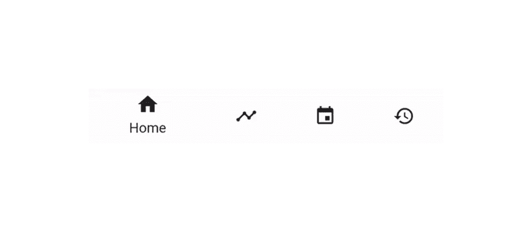
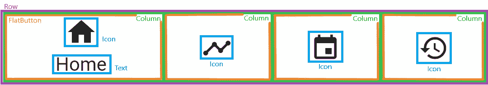
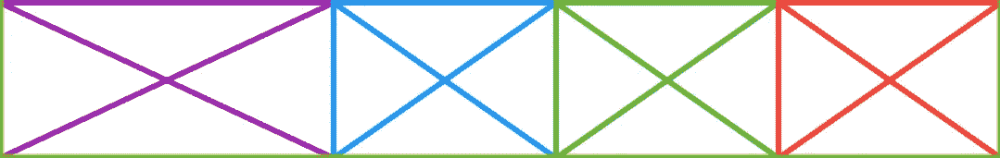
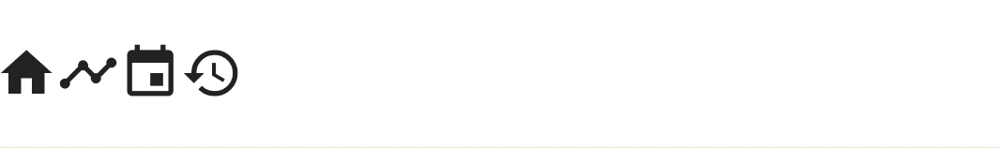
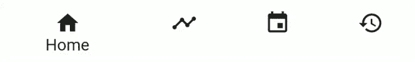

# 飘动:一个看似简单的底部应用程序栏第 1 部分

> 原文：<https://itnext.io/get-fluttered-a-simple-bottom-app-bar-part-1-354b3858e2a8?source=collection_archive---------1----------------------->

这个小部件就是我们今天要学习构建的！

几个月前，我开始了学习 Flutter 的旅程。来自 Android 背景的颤动感觉更容易处理。但是在这个学习扑朔迷离的阶段，我总是发现很难找到学习它的好资源。因此，我决定为 Flutter 社区贡献我的一份力量，写一些关于不同事物的文章，希望你和我能一起学习。这是我的第一篇文章！

**什么是扑腾？** Get flated 是一个系列文章，在这个系列中，我将尝试重新创作一些我在互联网上找到的美丽设计，并与你分享我的学习。

你在顶部看到的 gif 是我们今天要构建的。首先，这个设计灵感来自于 Dribbble 上维塔利·鲁布索夫的 [标签栏动画](https://dribbble.com/shots/5050708-Tab-Bar-Animation)。

**有什么先决条件吗？1)关于动画如何在 Flutter 中工作的一些知识。当你不理解某事时，不要放弃。谷歌一下这个话题，看看视频，然后回来再试一次。**

在编写任何代码之前，让我们看一下我们的小部件，看看构建它需要哪些组件。我看到以下组件-

考虑到所有的动画，还有一些事情(让我们把它们命名为 KEYNOTES，因为我会在文章中反复提到它们)我们需要记住:-
1)在动画的整个持续时间内，新选择的选项比所有其他选项占用更多的空间。
2)文本仅在当前选择的选项中可见。
3)当选择一个新选项时，文本从当前选择的选项开始滑动和淡出，然后再次出现，滑入新选择的选项。
4)新选择的选项图标以 3 种不同的方式显示动画——向上滑动、向左或向右滑动以及倾斜。对于先前选择的选项，此动画完全反向运行。

好的，这就是我们需要实现的很多目标。但是不要担心，我们会一砖一瓦，一步一步来。

首先，让我们试着实现 KEYNOTE 号
,我们需要的是能够在需要的时候沿着选项的宽度调整选项的大小。为此，我们使用了`[Flex](https://docs.flutter.io/flutter/widgets/Flex-class.html)`的概念。`Flex`窗口小部件(ex- Flexible、Spacer 等)允许我们根据同一层级的其他`Flex`窗口小部件来调整元素的大小。例如，如果我考虑两个`[Flexible](https://docs.flutter.io/flutter/widgets/Flexible-class.html)`小部件，并分别为它们提供 1 和 2 的`flex`，那么它们将沿着特定的轴以 1:2 的比例占用可用空间。该轴由其父轴定义。如果父级是列，那么小部件在垂直方向弯曲以填充列，如果父级是行，那么小部件在水平方向弯曲以填充行。
让我们看看如何利用这一点来实现我们的第一个主题演讲。

我们将一列`flex`值定义为`flexValues`，并将这些 flex 值分配给各自的`Flexible` 小部件。你可能会想，如果是关于按比例调整窗口小部件的大小，那么我们为什么要给它们这么大的 flex 值，比如 100 和 150。相反，我们应该只提供 2 和 3，因为这些值给出了相同的比率。我来解释一下，`flex`只能是整数。我们将使用这些`flex`值来制作点击事件的动画。因此，如果我们将我们的`flex`值从 2 变为 3，结果将是一个突然的变化，从 2 直接变为 3。相反，如果我们将`flex`的值从 100 动画到 150，我们会将这种突然性降低 1/50。
我们得到以下输出-

现在让我们包括一个小的测试动画。该动画向我们展示了`flex`值的变化如何影响每个选项的宽度。我们只是在`SimpleBottomAppBarState`类中添加了以下内容-

我们看到以下输出-

我们现在可以有把握地说，我们现在知道如何实施 1 号基调了吗？嗯……嗯，不尽然。那么，我们错过了什么？Flutter 中的许多小部件如果没有子部件，就会采用它们父部件的尺寸，但是当它们有了子部件时，就会采用它们子部件的尺寸。那么这对我们有什么影响呢？正如文件中提到的-

> 默认情况下，占位符的大小适合其容器。

这基本上意味着`Placeholder`小部件正在迫使灵活的小部件在不溢出的情况下尽可能地扩展(沿着行指定的方向)。如果我们用一个不强迫`Flexible`展开的小部件替换`Placeholder`小部件，那么`Flexible`将收缩到其子部件的大小。
为了理解这一点，用我们需要的图标(主页、时间线、事件、历史)替换所有占位符部件。这是代码-

这是输出-

**如何解决这个问题？我们需要想办法让`Icons`迫使`Flexible`尽可能多地占用空间。这个问题的解决方案是`Flexible`小部件的`[fit](https://docs.flutter.io/flutter/rendering/FlexFit-class.html)`属性。属性可以有两个值，松散或紧密。文件上写着-**

> loose → const [FlexFit](https://docs.flutter.io/flutter/rendering/FlexFit-class.html)
> 
> 孩子被迫填满可用的空间。

因此，我们需要的是`Flexible`小部件的`fit`属性的‘紧密’值。所以让我们在代码中做些改变-

这是输出-

我们看到我们的`Flexible`小部件在不溢出的情况下占用了尽可能多的空间。现在我们可以有把握地说，我们已经理解了如何实施第一条基调。

让我们继续前进，努力实现第二个主题。
2 号主题演讲要求文本必须仅在新选择的选项下方可见。
**那么如何做到这一点呢？**
首先，我们需要一些东西来注册用户的点击。为此，我借助了`FlatButton`小部件。正如文件中提到的-

> 扁平按钮的最小尺寸为 88.0×36.0，可以用[按钮主题](https://docs.flutter.io/flutter/material/ButtonTheme-class.html)覆盖。

所以你可能会想，这个尺寸可能会成为一个问题，但是让我们回顾一下我们在执行 1 号主题演讲时学到的东西。我们看到，如果我们将`Flexible`的`fit`属性设置为‘紧’,那么子元素会将自身调整到最大允许宽度和高度。因此，如果这个`FlatButton`是我们的`Flexible`小部件的子部件，它将调整自己的大小到最大可能的可用空间。让我们通过实现下面的代码来看看这一点(我在`initState()`方法中注释掉了`_controller.repeat()`)

这是输出-

现在让我们实现这些`FlatButton`部件的子部件。每个`FlatButton`小部件的子部件是一个`Column`，它有两个子部件，一个`Icon`和一个`Text`。我们利用`Column`小部件的`mainAxisAlignment`属性来垂直居中子控件，并利用`crossAxisAlignment`属性来水平居中子控件。这是我的代码-

你们有些人可能会想，为什么我们要把`Text`的`fontWeight`设置为 400。原因是默认情况下`FlatButton`有自己的`Material`，因此文本会以粗体显示。这是输出-

让我们通过动画制作`Flexible`小部件的`flex`值来完成 1 号主题演讲。同时，让我们在`Text`小部件上使用`Opacity`小部件来实现 KEYNOTE NO. 2。这是我如何实现这两件事的

所以我在这里做了很多改变。首先，我创建了两个新变量`currentIndex`和`previousIndex`。它们帮助我跟踪用户选择了哪些选项。我引入了一个名为`_onOptionClicked`的新方法，当用户点击任何选项时，它都会更新`currentIndex`和`previousIndex`的值。在`setState()`方法中，我相应地改变不透明度值。我还将 AnimationController 的持续时间从 3 秒改为 250 毫秒。

这是输出-

现在我们剩下的是剩余 2 个主题的实现，我计划在下一篇文章中介绍。我知道我知道，当你想看下一篇文章时，这种感觉很糟糕，但是作者还没有发表它。相信我，我会尽最大努力在几天内把它送出去。在那之前，我会鼓励你继续努力，试着自己建造它。

> 编辑:
> 链接到第二部分-

 [## 飘动:一个看似简单的底部应用程序栏第二部分

### 边建设边学习是我们的座右铭

medium.com](https://medium.com/@guptamanas1998/get-fluttered-a-deceptively-simple-bottom-app-bar-part-2-879ddb7b063c) 

我也想感谢你们所有人一直读到最后，因为我知道有很多东西要经历，但最后，如果你学到了新的东西，那么这一切都是值得的。

> P.S. -
> 1)您对构建这个小部件所需的组件的理解可能与我的完全不同。我鼓励你发扬你的思维方式，并坚持到底。请不要忘记与我分享它！
> 2)我希望收到你的反馈，告诉我如何改进我未来的文章。也请不要回避任何形式的批评。如果你想在[推特](https://twitter.com/Devs_aint_Geeks)上关注我，我们非常欢迎。
> 
> 尽情飘飘！